---
metaLinks:
  alternates:
    - >-
      https://app.gitbook.com/s/0yXyIrnroN3zIG3qa4W3/monitor-the-weka-cluster/the-wekaio-support-cloud/explore-cluster-insights-and-statistics
---

# Explore cluster insights

## Clusters

### View clusters list

The Local WEKA Home interface provides comprehensive multi-cluster monitoring across your WEKA environment. The initial dashboard displays all registered WEKA clusters that report telemetry data to your Local WEKA Home instance.

To view the cluster overview, select it from the list, or select the 3-dot icon on the right and select **Open in new tab**.

<figure>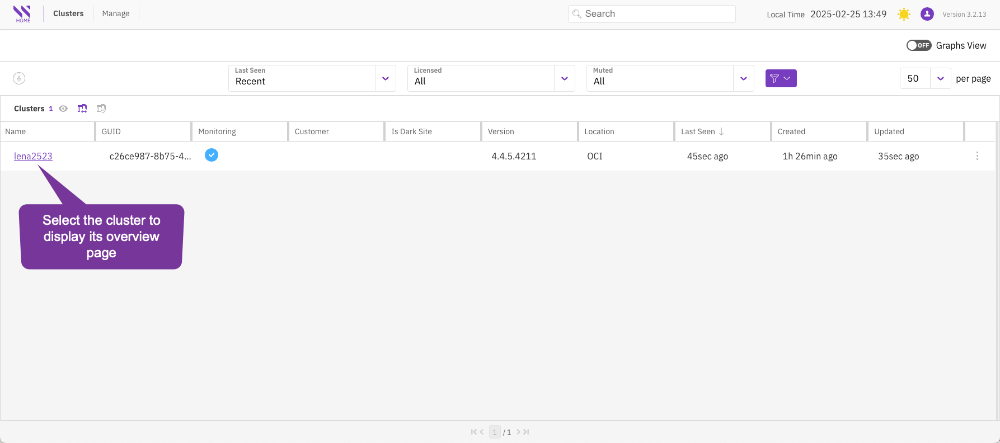<figcaption>
Clusters page
</figcaption></figure>

**Clusters graphs view**

Toggle between List and Graph views using the Graphs View selector. The Graph view presents analytical visualizations of cluster distribution by version, protocol usage, installation location, network link layer (IPv4/IPv6), OBS bucket type, and reporting status (WEKA Home-connected vs. dark site installations).

<figure>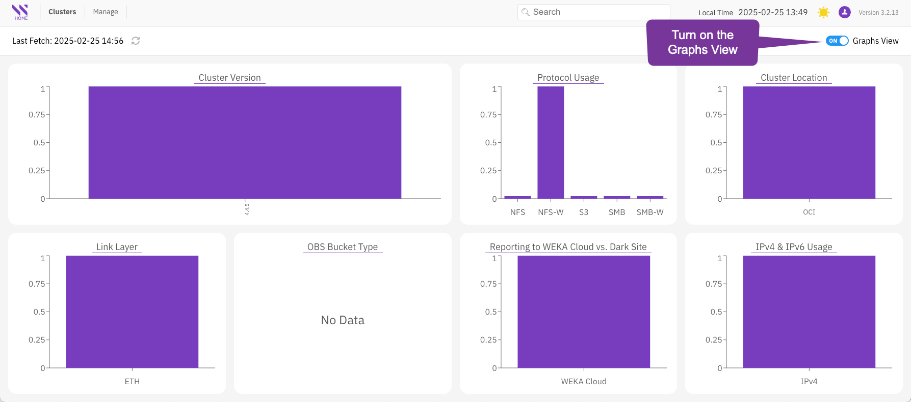<figcaption>
<strong>Clusters graphs view</strong>
</figcaption></figure>

### Filter clusters list

You can filter and sort the clusters based on a range of criteria, including their last seen status, licensed or unlicensed status, and whether the clusters have silenced alerts.

For more advanced filtering options, select the **Advanced filters** icon.

<figure>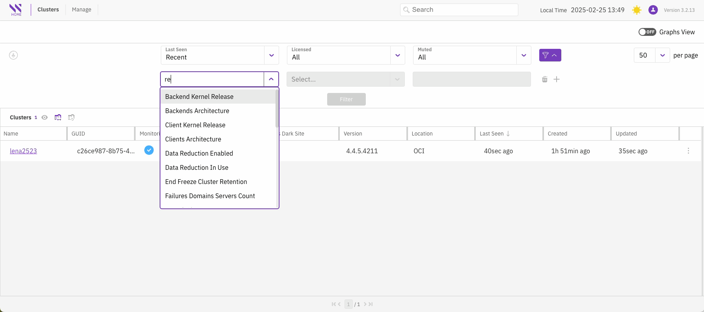<figcaption>
Clusters page: Advance filters
</figcaption></figure>

### Download clusters report

To download a report of all your clusters, select the **Download** icon.

<figure>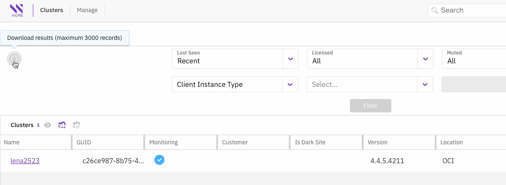<figcaption>
Download clusters report
</figcaption></figure>

## Overview

The Overview page provides a consolidated dashboard of critical cluster-wide metrics and operational status. This interface displays multiple monitoring panels that facilitate rapid assessment of cluster health, configuration parameters, active alerts, system events, and performance metrics.

<figure>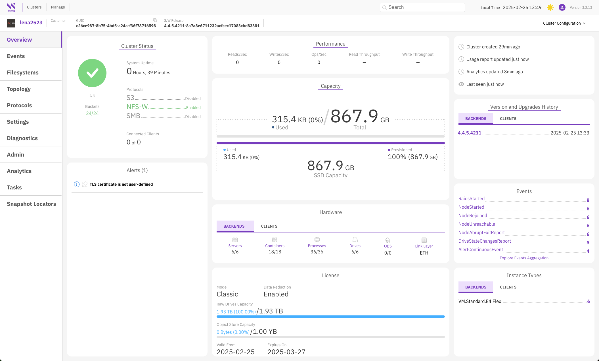<figcaption>
Cluster overview
</figcaption></figure>

#### Navigation

Access specialized view pages by either:

* Selecting the corresponding option in the left navigation menu.
* Clicking directly on panel titles within the Overview dashboard.

#### Panel functionality

Each panel in the Overview dashboard serves as both a summary display and an entry point to more detailed information:

**Alerts panel**

The Alerts panel displays severity-categorized cluster alerts with interactive drill-down capabilities. Click any alert to access complete diagnostic details including severity classification, timestamp, condition description, and prescribed remediation steps.

**Hardware Panel** (example of drill-down functionality)

The Hardware panel provides visibility into physical and logical cluster components through the Backends and Clients tabs, displaying servers, containers, processes, drives, OBS, and link layer with relevant operational metrics. Each component supports drill-down functionality for detailed diagnostics.

<figure>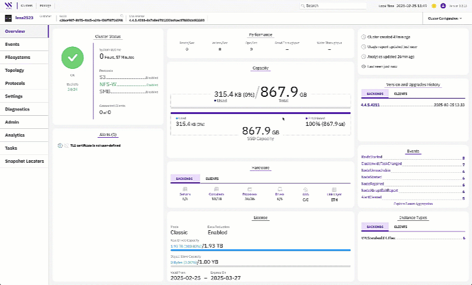<figcaption>
Panel functionality
</figcaption></figure>

Additional panels provide similar drill-down functionality for their respective domains, following the same interaction pattern demonstrated in the Alerts and Hardware panels.

## Events

The Events page displays the offline event data for the cluster and associated detail with each event. You can use filters to refine your search according the event severity, category, process ID, and more.

<figure>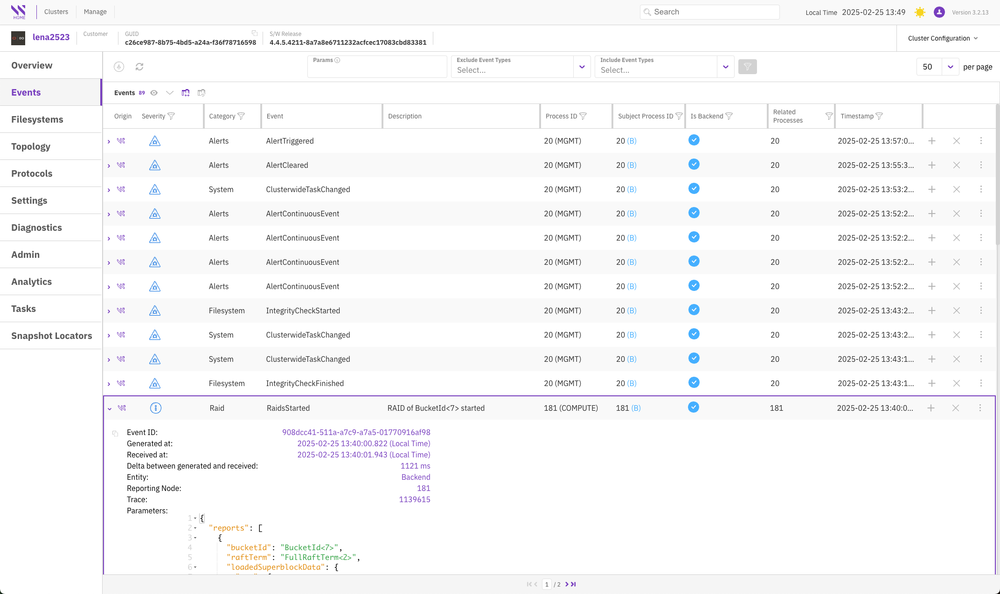<figcaption>
Events page
</figcaption></figure>

## Filesystems

The Filesystems page provides comprehensive information about the configured filesystems in the cluster.

You have the flexibility to reorganize the display by selecting any column in the tables, and you can use filters to refine your search. For more in-depth information in JSON format, select a specific row.

<figure>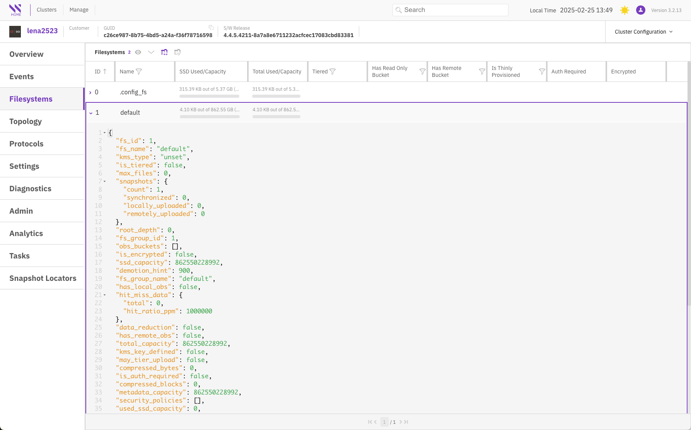<figcaption>
Filesystems view with in-depth information in JSON format
</figcaption></figure>

## Topology

The Topology page presents an array of cluster configurations categorized into sections: Servers, Containers, Processes, Drives, and Network Devices.

You have the flexibility to reorganize the display by selecting on any column in the tables, and you can use filters to refine your search. For more in-depth information in JSON format, select a specific row.

Select each tab to explore the topology screens.




<figure><figcaption></figcaption></figure>





<figure><figcaption></figcaption></figure>





<figure>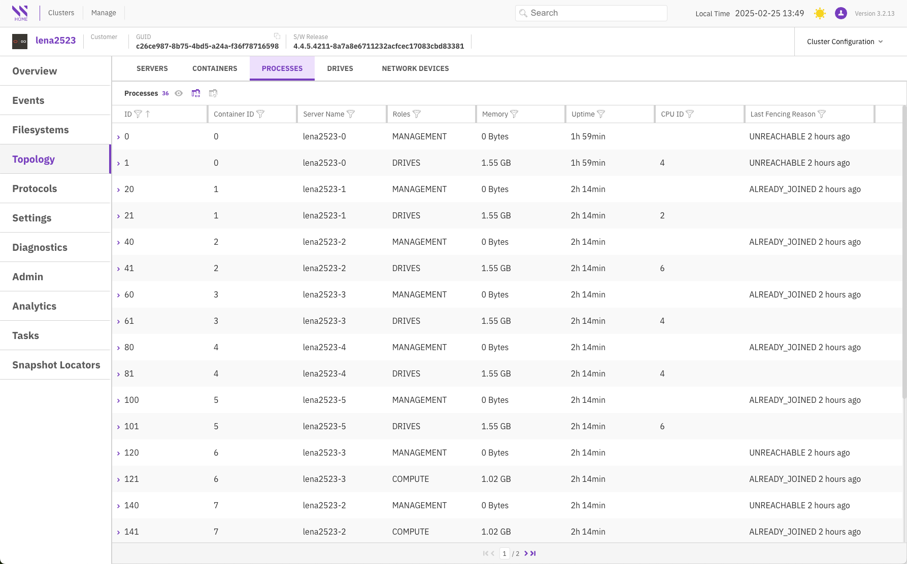<figcaption></figcaption></figure>





<figure>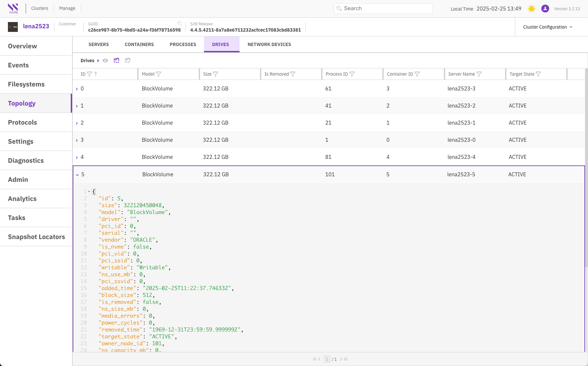<figcaption></figcaption></figure>





<figure>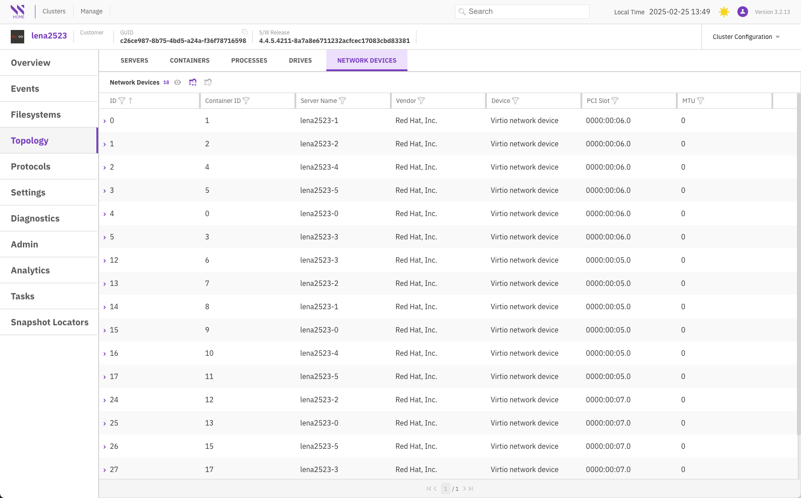<figcaption></figcaption></figure>




## Protocols

The Protocols page provides comprehensive information about the configured protocols in the cluster. Each tab corresponds to a specific protocol, including NFS, S3, and SMB.

You can customize the display order of information in the tables by selecting the column title.

Select each tab to explore the protocol screens.




<figure>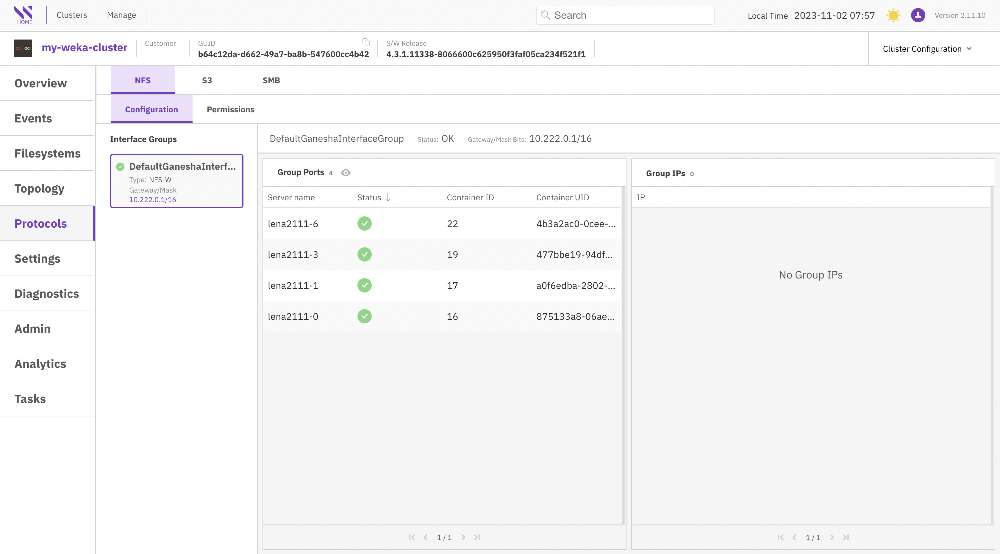<figcaption></figcaption></figure>





<figure>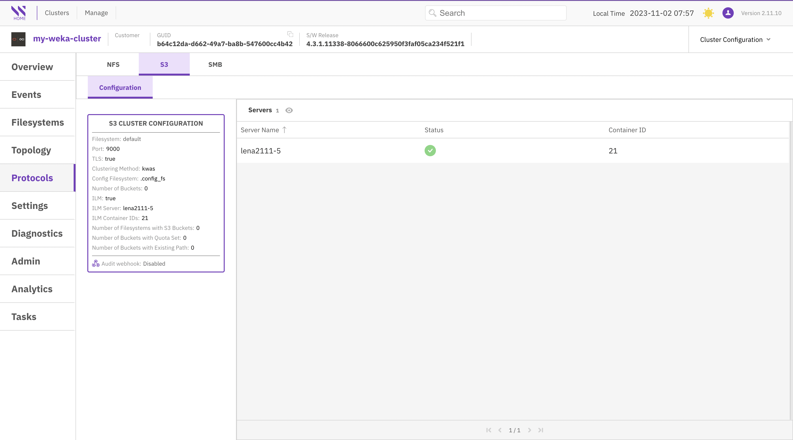<figcaption></figcaption></figure>





<figure>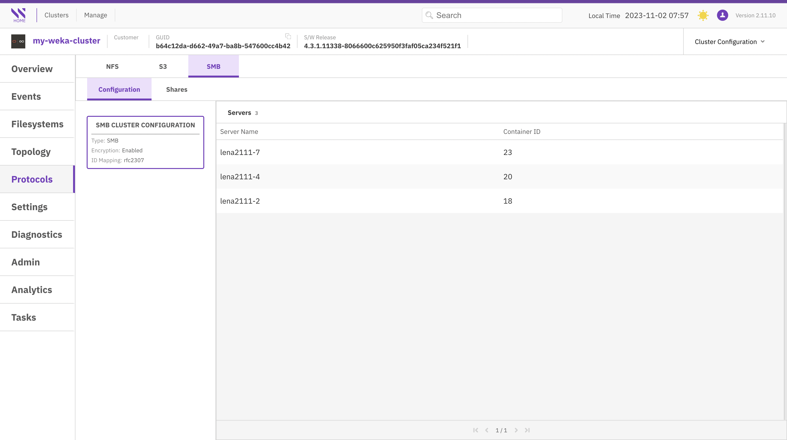<figcaption></figcaption></figure>




## Settings

The Settings page displays a variety of panels containing information such as traces, container uptimes, process uptimes, overrides, and more.

<figure>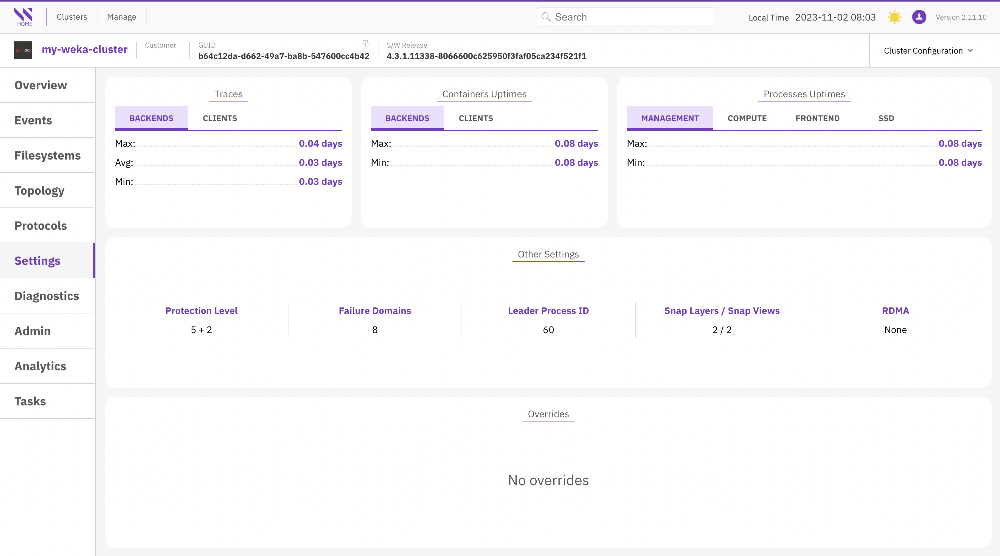<figcaption>
Setting page
</figcaption></figure>

## Diagnostics

The Diagnostics page displays the content of all diagnostic files uploaded from the cluster. Diagnostics are neatly organized in a file system tree structure for convenient navigation.

To access the file content, select the respective file.

Additionally, you have the option to directly upload a diagnostics tar file. You can effortlessly locate specific information by using the search feature and its additional options.

<figure>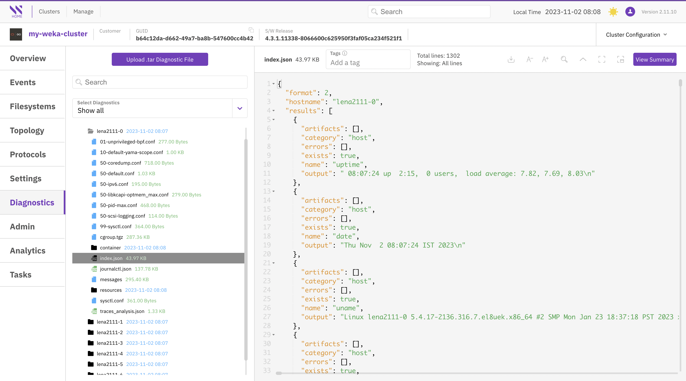<figcaption>
Diagnostics view
</figcaption></figure>

## Admin

See [enforce-security-and-compliance.md](enforce-security-and-compliance.md "mention").

## Analytics

The Analytics page displays the cluster configuration (similar to the Topology view) in JSON format. To locate specific information, use the search feature and its options. If you need to copy the content, click the copy icon located next to the first row.

<figure>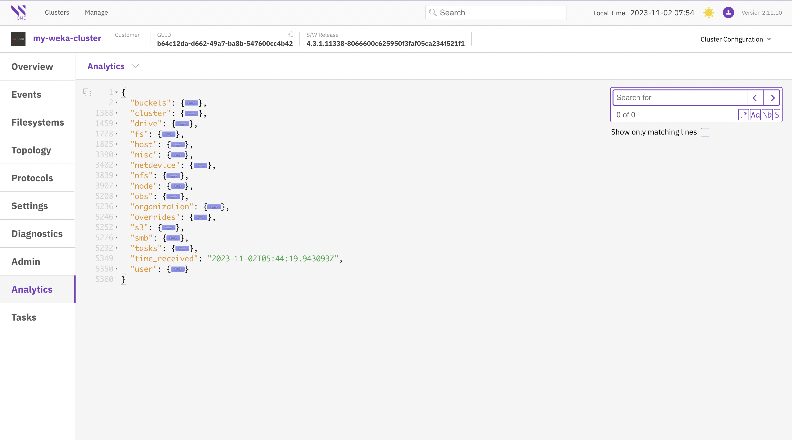<figcaption>
Analytics view
</figcaption></figure>

## Tasks

The Tasks page presents a list of background tasks with various statuses that are currently active in your cluster.

You can further refine your task list and customize the display order of information in the tables by selecting the column title.

To access detailed information about a specific task, select its row to view it in JSON format.

<figure>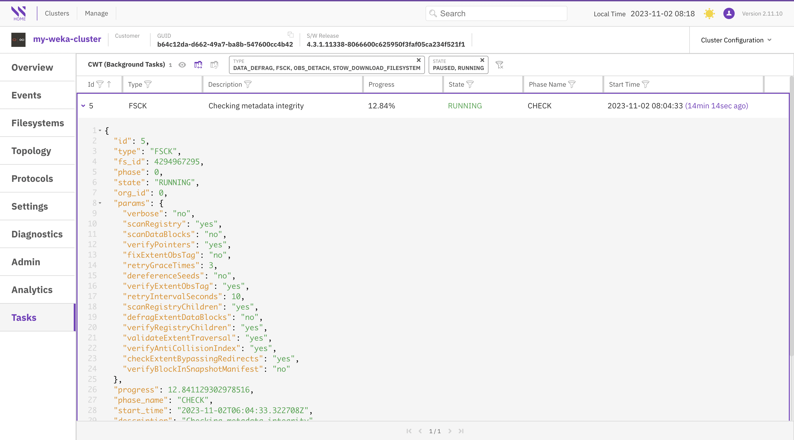<figcaption>
Tasks view
</figcaption></figure>

## Snapshot Locators

The Snapshot Locators page displays a list of snapshot locators, which serve as unique references to snapshots stored in an object store. These locators are essential for restoring filesystems, managing snapshots, and recovering data. Each locator enables the system to access and manipulate the corresponding snapshot data.

The page presents the following details in a table format for each locator:

* Locator: The unique identifier of the snapshot in the object store.
* Snapshot: The name or ID of the associated snapshot.
* Filesystem: The filesystem from which the snapshot was created.
* OBS Site: The object store site where the snapshot is stored.
* Event Time: The timestamp of when the snapshot was created or modified.

<figure>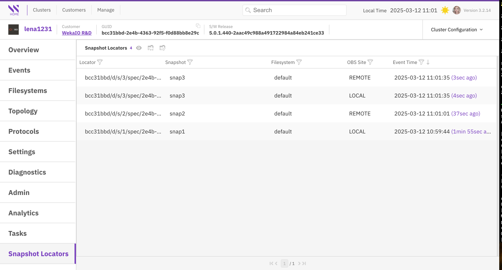<figcaption>
Snapshot Locators
</figcaption></figure>

## Download Usage Report and Analytics

Local Weka Home allows you to download JSON-formatted reports to your local workstation for viewing and forwarding to the Customer Success Team for case resolution. You can also add these reports to Cloud Weka Home for offline monitoring.

If your data includes sensitive values that you want to protect, you can choose to download anonymized reports. In anonymized reports, sensitive values are handled as follows: The cluster name is replaced with `weka-[first part of cluster GUID]` and other sensitive values are removed.

Usage Report default anonymized data

The following properties are affected by anonymization:

* name
* alerts
* status/name
* status/cloud

Analytics default anonymized data

The following properties are affected by anonymization:

* cluster/name
* For all hosts:
  * host/hosts/ips
  * host/hosts/host\_ip
  * host/hosts/hostname
  * host/hosts/instance\_region
  * host/hosts/aws\_instance\_region
* misc/kms/type
* misc/cloud/url
* nfs/interface\_groups/name
* nfs/interface\_groups/gateway
* nfs/interface\_groups/subnet\_mask
* s3/domain
* s3/filesystem
* smb/smb\_trusted\_domains


The anonymization option is supported with WEKA clusters of version 3.14.2 and above.


<figure><figcaption>
Download Usage Report and Analytics
</figcaption></figure>

