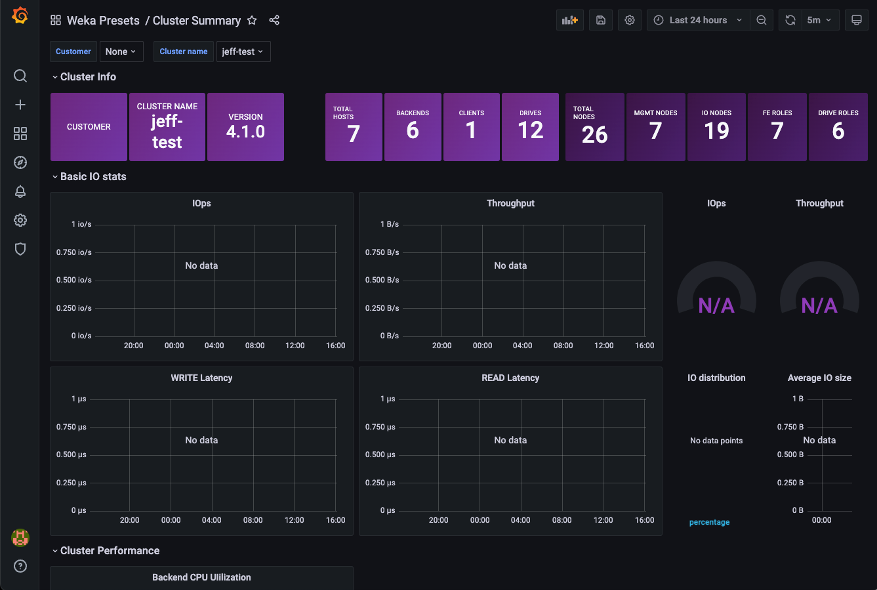
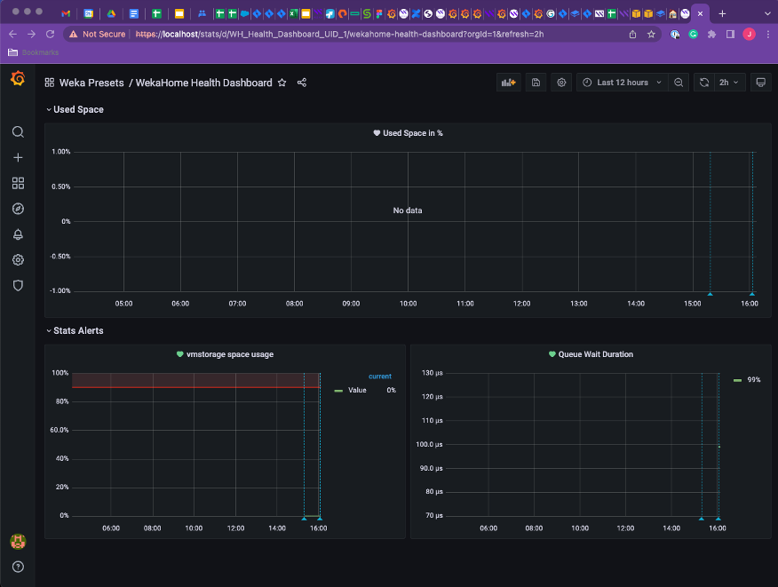

---
metaLinks:
  alternates:
    - >-
      https://app.gitbook.com/s/0yXyIrnroN3zIG3qa4W3/monitor-the-weka-cluster/the-wekaio-support-cloud/explore-performance-statistics-in-grafana
---

# Explore performance statistics in Grafana

## Performance Statistics

You can open the Grafana application to view some of the various performance visualizations directly from the Local WEKA Home.

From the **Cluster Configuration** menu, select **Performance Statistics**.

<figure><figcaption></figcaption></figure>

<figure><figcaption></figcaption></figure>

