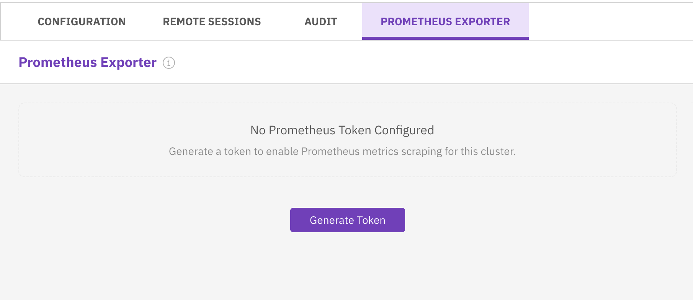
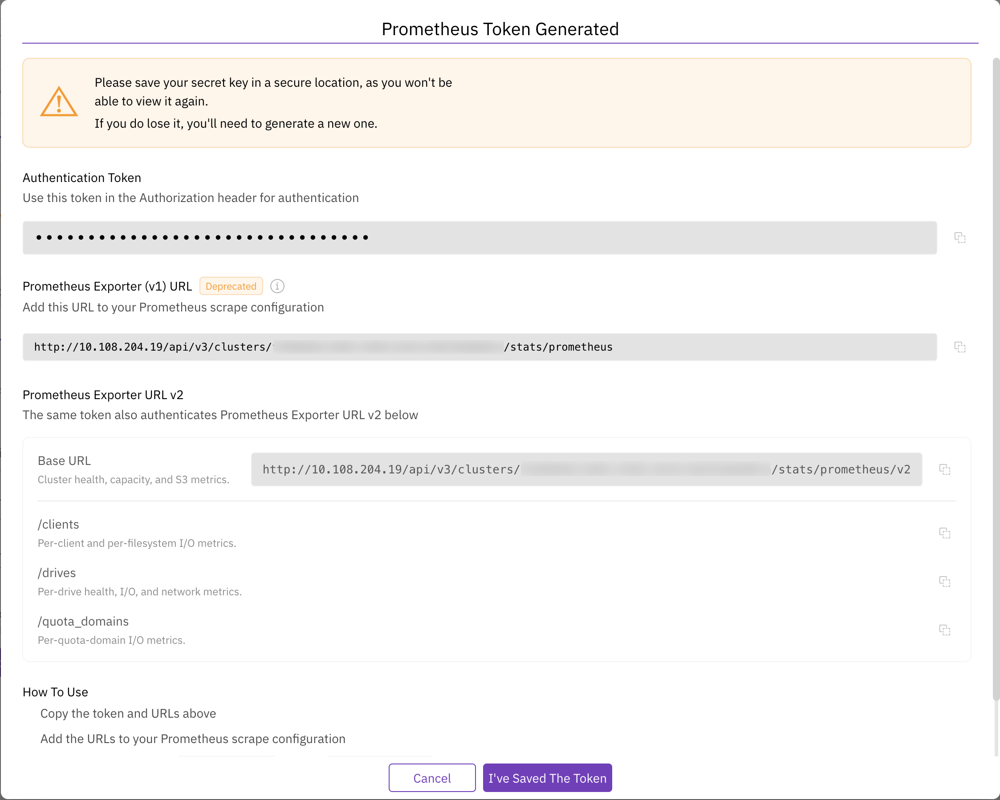

# Export cluster metrics from LWH to Prometheus

## Export cluster metrics from LWH to Prometheus

Local WEKA Home (LWH) exposes WEKA cluster metrics as Prometheus scrape endpoints. Configure your Prometheus server to scrape these endpoints and receive metrics in Prometheus format. For LWH access details, see [Local WEKA Home overview](https://app.gitbook.com/s/ZW262oqYA8pNNfGvXjHa/monitor-the-weka-cluster/the-wekaio-support-cloud/local-weka-home-overview).

Use the exporter to build alerts on cluster health, track I/O performance and latency, monitor drive health, or visualize metrics in Grafana through Prometheus.

### Prometheus Exporter V2


Starting with LWH 5.0, Prometheus Exporter V2 is the supported version. V1 is deprecated: it remains functional for existing configurations, but new V1 tokens cannot be generated. V1 is removed in a future release.


If you use the V1 exporter, move to V2. Settings do not transfer automatically.

Moving to V2 requires the following updates:

1. Generate a V2 token and update the Prometheus scrape configuration.
2. Review queries and alerts. Metric names, types, and label structures differ in V2.
3. Update Grafana dashboards and other visualization tools that use V1 metric names.

### Enable the Prometheus Exporter for a cluster

Access to the scrape endpoints is protected by token-based authentication. Each request to an endpoint must include a valid token in the Authorization header. Unauthenticated requests are rejected.

Each cluster has one active token. The token authenticates all four scrape endpoints.

**Before you begin**

* Ensure you have access to LWH and the cluster you want to monitor.
* Have a secure password manager or secrets vault ready to store the token. The token is shown only once. If you lose it, you must generate a new one.

**Procedure**

1. In LWH, open the cluster and select the **Prometheus Exporter** tab.

<div data-with-frame="true"><figure><figcaption></figcaption></figure></div>

2. Select **Generate Token**.\
   The page displays the exporter URLs for the cluster.

<div data-with-frame="true"><figure><figcaption></figcaption></figure></div>

3. In the **Prometheus Exporter URL v2** section, copy the endpoint URLs you intend to scrape using the copy icon next to each. Each endpoint covers a distinct area of cluster telemetry:
   * **Base URL**: cluster health, capacity, and S3 metrics.
   * **/clients**: per-client and per-filesystem I/O metrics.
   * **/drives**: per-drive health, I/O, and network metrics.
   * **/quota\_domains**: per-quota-domain I/O metrics.
4. To get the full list of available metrics, categories, and collections, select **Download YAML** under **Metric Reference**.


Each cluster supports one active token. Generating a new token immediately invalidates the previous one. Update your Prometheus configuration with the new token as soon as possible to avoid a gap in metric collection.


### Configure Prometheus

Configure Prometheus to scrape metrics from LWH by adding one scrape job per endpoint. Each job authenticates using a Bearer token and targets the LWH hostname.

**Before you begin**

Obtain the following from the LWH token dialog:

* The authentication token
* The full URL for each endpoint you want to scrape (hostname and path)

**Procedure**

1. Open your Prometheus configuration file.
2. Under `scrape_configs`, add one job block for each endpoint you want to collect.
3. In each job, set the following values:
   * `metrics_path`: the path portion of the endpoint URL copied from the token dialog
   * `targets`: the hostname portion of the URL from the cluster settings
   * `credentials`: your authentication token
4. Save the configuration file and reload Prometheus.

**Example: scrape all four endpoints**


```yaml
...
scrape_configs:

  - job_name: weka_cluster
    metrics_path: <base-url>
    scheme: https
    authorization:
      credentials: <your-token>
    static_configs:
      - targets: ['<lwh-host>']

  - job_name: weka_clients
    metrics_path: <base-url>/clients
    scheme: https
    authorization:
      credentials: <your-token>
    static_configs:
      - targets: ['<lwh-host>']

  - job_name: weka_drives
    metrics_path: <base-url>/drives
    scheme: https
    authorization:
      credentials: <your-token>
    static_configs:
      - targets: ['<lwh-host>']

  - job_name: weka_quota_domains
    metrics_path: <base-url>/quota_domains
    scheme: https
    authorization:
      credentials: <your-token>
    static_configs:
      - targets: ['<lwh-host>']
```


Replace the placeholders with your values:

<table><thead><tr><th width="183">Placeholder</th><th>Value</th></tr></thead><tbody><tr><td><code>&#x3C;lwh-host></code></td><td>LWH hostname from the cluster settings URL</td></tr><tr><td><code>&#x3C;base-url></code></td><td>Path portion of the endpoint URL from the token dialog</td></tr><tr><td><code>&#x3C;your-token></code></td><td>Authentication token from the token dialog</td></tr></tbody></table>

### Selective metric collection

Limit the exported metrics for this job. See [Configure selective Prometheus metric collection](https://app.gitbook.com/s/ZW262oqYA8pNNfGvXjHa/monitor-the-weka-cluster/the-wekaio-support-cloud/configure-selective-prometheus-metric-collection).

### Grafana dashboards

Grafana dashboards are available from **Grafana Dashboards** in LWH **Settings**. Each dashboard provides default panels and imports directly into your Grafana instance.
