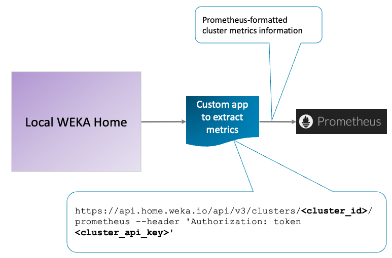

# Export cluster metrics to Prometheus

## Overview

Local WEKA Home (LWH) allows exporting key cluster metrics directly to Prometheus using a custom application that follows the [Prometheus Data Model](https://prometheus.io/docs/concepts/data_model/#data-model).

This feature is designed for customers who do not use the [WEKAmon](../external-monitoring.md) monitoring utility but still need to integrate essential cluster statistics into their Prometheus environments.

Key exported metrics include:

* Throughput metrics
* IO performance metrics
* Cluster resource metrics
* Cluster health and alerts
* Cluster capacity metrics

<details>

<summary>Cluster metrics in Prometheus format</summary>


```
Name: weka_throughput_bytes_per_second
Help: Weka throughput in bytes per second
Labels with Values:
type: read, write

Name: weka_iops
Help: Weka cluster IOPS
Labels with Values:
type: read, write, metadata

Name: weka_cluster_drives_count
Help: Number of drives in the cluster
Labels with Values:
status: active, created

Name: weka_cluster_processes_count
Help: Number of processes in the cluster
Labels with Values:
status: active, created
type: compute, drive

Name: weka_cluster_containers_count
Help: Number of containers in the cluster
Labels with Values:
status: active, created
type: compute, drive

Name: weka_cluster_alerts_count
Help: Number of alerts in the cluster
Labels with Values:
status: active

Name: weka_cluster_status
Help: Weka cluster status
Labels with Values:
status: (Dynamic values based on cluster status, e.g., OK, Rebuilding, etc.)

Name: weka_cluster_protection_level
Help: Weka cluster protection level
Labels with Values:
num_failures: (Dynamic values based on the number of failures, e.g., 0, 1, 2, etc.)

Name: weka_cluster_capacity_bytes
Help: Weka cluster capacity in bytes
Labels with Values:
type: total, unprovisioned, unavailable, hotSpare
```


</details>

<figure><figcaption><p>Cluster metrics sync with Prometheus</p></figcaption></figure>

## Export Prometheus metrics from LWH

To export Prometheus metrics from LWH, implement the Prometheus API call within a custom application to retrieve metrics at the required intervals. This procedure demonstrates the operation using the `curl` command to extract the metrics.

**Procedure**

1. **Generate the Cluster API Key**
   1. Log in to Local WEKA Home.
   2. Select the **Admin** page, select the **API KEYS** tab.
   3. Select **Generate New Key**.
   4. Copy the generated API key for later use.
2.  **Export metrics in Prometheus format**

    1.  Use the following API call, replacing `<cluster_id>` with your cluster ID and `<cluster_api_key>` with the API key from Step 1:

        
        ```
        curl --location 
        'https://api.home.weka.io/api/v3/clusters/<cluster_id>/prometheus' --header 'Authorization: token <cluster_api_key>'
        ```
        

    The command returns Prometheus-formatted metrics cluster information.
3. **Import the metrics into Prometheus**
   1. Configure Prometheus to import the exported metrics.&#x20;
   2. Use the Prometheus UI to visualize and monitor the metrics.


If accessing the backend, prepend `api.` to the URL for legacy ingress support.


**Related information**

[Prometheus documentation](https://prometheus.io/docs/introduction/overview/)
