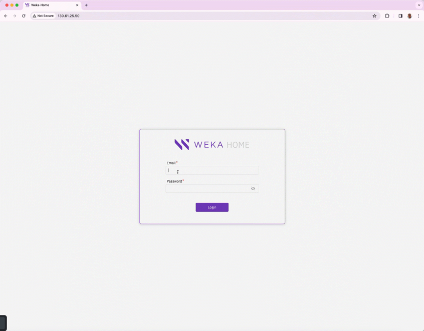

# Local WEKA Home overview

In scenarios where a customer lacks connectivity to the public instance of WEKA Home, such as when the WEKA cluster is deployed in a dark site or VPC, WEKA offers the option to deploy a Local WEKA Home. This is a private instance of WEKA Home, hosted on a management server or VM, designed to meet your specific needs.

### **Key functions of Local WEKA Home**

The Local WEKA Home serves the following key functions:

* **Event management:** It receives events from the WEKA cluster, stores them locally, and allows for event querying and filtering.
* **Multi-cluster monitoring:** It provides the ability to monitor multiple clusters within your organization.
* **Cluster overview:** The Local WEKA Home displays a comprehensive overview of your clusters and allows you to drill down into cluster telemetry data.
* **Alerting:** It triggers specific alerts based on predefined rules and supports integrated delivery methods, including Email (SMTP), SNMP, and PagerDuty.
* **Diagnostics support:** The Local WEKA Home receives support files (diagnostics) from the WEKA cluster, stores them, and makes them accessible for remote viewing by the Customer Success Team.
* **Usage and performance insights:** It receives usage, analytics, and performance statistics from the WEKA cluster, stores, displays, and enables querying and filtering of this data.

### **Key features and capabilities**

Local WEKA Home offers the following features and capabilities, categorized as follows:

#### **Monitoring and insight features**

* **Cluster Insights:** Monitor and report on multiple clusters within your organization.
* **Statistics:** Display various cluster-wide statistics and health status information.
* **Event Data:** Access offline event data and associated details.
* **Diagnostics:** Access diagnostics, including event logs, syslog files, trace files, and container information.
* **Usage reports:** Download JSON-formatted Usage Reports and Analytics for analysis and support, including anonymized versions for data security.

#### **Alerting and integrations**

* **Custom rules:** Create custom rules for specific events and alerts, and route them to predefined integrations.
* **Custom integrations:** Create destinations where you want alerts and events defined in the Rules page to be sent. These can be Email, PagerDuty, and SNMP Traps.

**Security and compliance controls**

* **Audit information:** View a list of audited activities.
* **Admin privileges:** Apply admin privileges for cluster management and maintenance.
* **User management:** Manage users, groups, and access permissions.

#### **Supportability and and data management**

* **Data forwarding:** Forward data from Local WEKA Home to the cloud WEKA Home for enhanced support and monitoring by the Customer Success Team.
* **REST API:** Use the RESTful API for automation and integration with your workflows and monitoring systems.

<figure><figcaption>
Local WEKA Home application overview
</figcaption></figure>

**Related topics**

[explore-cluster-insights-and-statistics.md](explore-cluster-insights-and-statistics.md "mention")

[manage-alerts-and-integrations.md](manage-alerts-and-integrations.md "mention")

[enforce-security-and-compliance.md](enforce-security-and-compliance.md "mention")

[optimize-support-and-data-management.md](optimize-support-and-data-management.md "mention")
