# Local WEKA Home overview

Suppose a customer does not have connectivity to the public instance of the WEKA Home, such as when the WEKA cluster is deployed on a dark site or VPC. In that case, WEKA provides an option to deploy a Local WEKA Home, a private instance of WEKA Home, on a management server (or VM).

The Local WEKA Home performs the following:

* Receives events from the WEKA cluster and stores them locally. It enables querying and filtering events.
* Monitors multiple clusters within the organization.
* Displays the cluster overview and enables drilling down to the cluster telemetry data.
* Triggers specific alerts according to predefined rules through an integrated delivery method: Email (SMTP), SNMP, or PagerDuty.
* Receives diagnostics (support files) from the WEKA cluster, stores them, and makes them available for remote viewing by the Customer Success Team.
* Receives usage, analytics, and performance statistics from the WEKA cluster. It stores them, displays them, and enables querying and filtering them.

## Key features and capabilities

Each set of features and capabilities is categorized into one of the following categories:

* Observability
* Alerting and integrations
* Security and compliance
* Supportability and miscellaneous

Select each tab to learn more about each category's key features and capabilities.



### Clusters page

Local WEKA Home monitors and reports on multiple clusters within your organization. The first screen upon entering LWH displays all the WEKA clusters in your environment that are enabled to send telemetry data to your local WEKA Home instance.

<figure>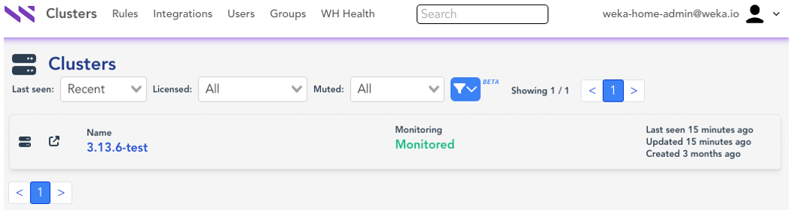<figcaption>
Clusters view
</figcaption></figure>

You can filter and sort based on various criteria such as _last seen_, _licensed_ vs. _unlicensed_, and clusters that are _muted_ (silenced alerts). Clicking the cluster name redirects you to the cluster main page.

### Status page

The Status page displays numerous panels highlighting various cluster-wide statistics including health status information relative to an individual cluster.

<figure>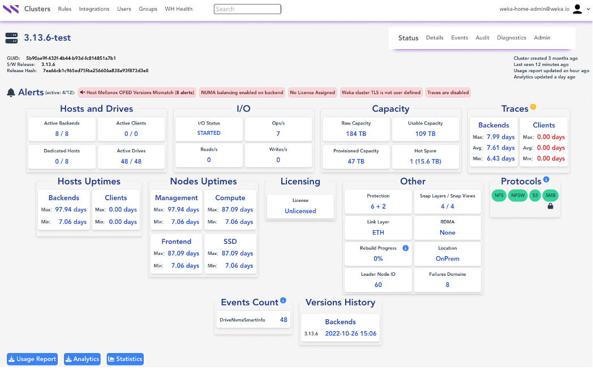<figcaption>
Cluster main page: Status
</figcaption></figure>

### Details page

The Details page displays the Hosts (containers), Drives, Nodes (processes), Filesystems, Net Devices, SmbShares, Overrides, and the cluster configuration in a JSON format.

<figure>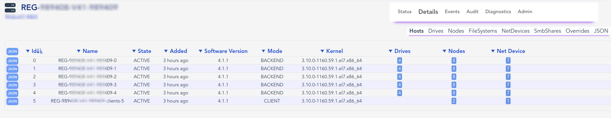<figcaption>
Details page: Hosts (containers)
</figcaption></figure>

### Events page

The Events page displays the offline event data for the cluster and associated detail with each event. You can filter the events based on severity, narrow them down to specific node IDs in the cluster, and more.

<figure>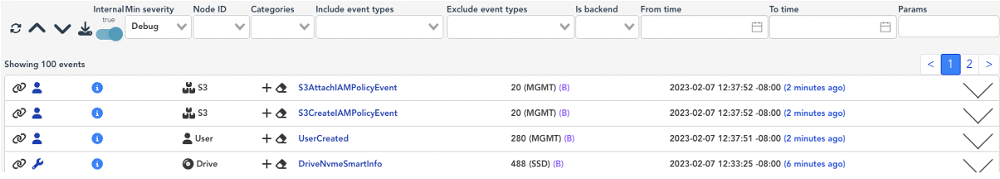<figcaption>
Events page
</figcaption></figure>

### Diagnostics page&#x20;

The Diagnostics page displays all the collected event logs, syslog files, trace files, container information, and more. The Customer Support Team uses this information for deeper case analysis.

<figure>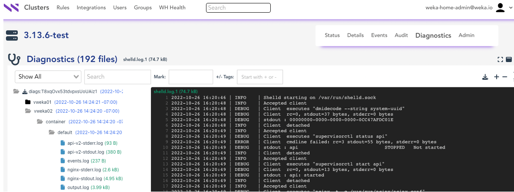<figcaption>
Diagnostics page
</figcaption></figure>

### Usage Report and Analytics

You can download the JSON-formatted Usage Report and Analytics onto your local workstation and view them as needed. You can also forwarded the reports to the Customer Success Team for case resolution and to be added to the cloud Weka Home for offline monitoring purposes.

For more details, see [download-the-usage-report-or-analytics.md](download-the-usage-report-or-analytics.md "mention").

### Statistics:  performance visualizations

The **Statistics** button redirects to the Grafana login screen from which you can view some of the various performance visualizations.

<figure>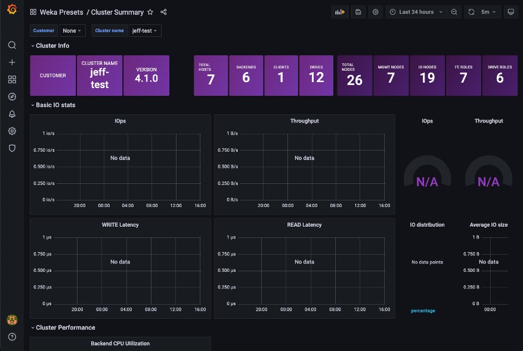<figcaption>
Cluster Summary
</figcaption></figure>

<figure>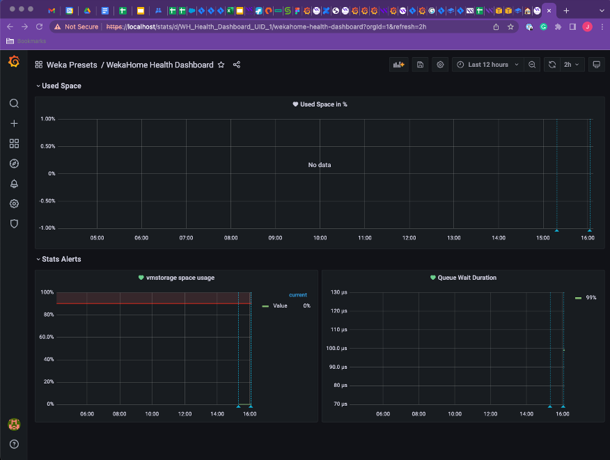<figcaption>
WEKA Home Health Dashboard
</figcaption></figure>



### Create Rule

The Create Rule page allows you to create custom rules for specific alerts or events that trigger predefined integrations. Multiple event types and alert types are supported. For example, you might want to create an alert that is raised when the cluster is not responding, and you want it emailed to a specific address.

<figure>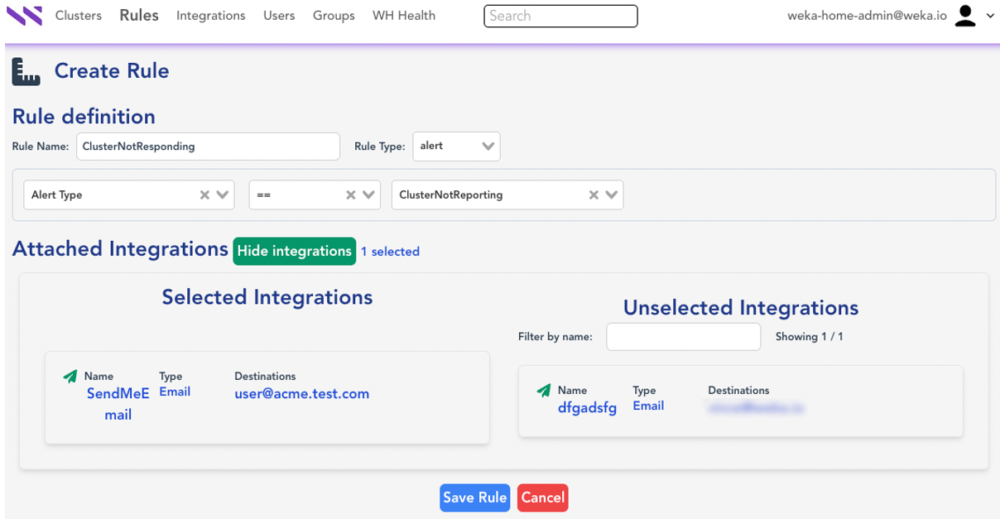<figcaption>
Create Rule
</figcaption></figure>

### Create Integration

The Create Integration page allows you to create the destinations where you want alerts and events defined in the Rules page to be sent. The available destination types include Email (SMTP), PagerDuty, and SNMP Traps (v1/v2c/v3).

<figure>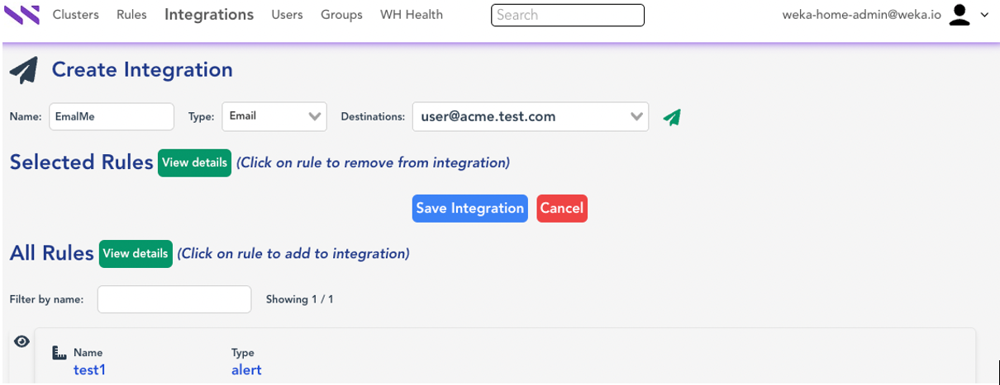<figcaption>
Create Integration
</figcaption></figure>

For more details, see [set-the-local-weka-home-to-send-alerts-or-events.md](set-the-local-weka-home-to-send-alerts-or-events.md "mention").



### Audit page

The **Cluster Audit** page lists all audited activities such as _mute/unmute clusters_ and _set maintenance window_.

The following is an example showing when the cluster was muted and when it was placed into a maintenance window.

<figure>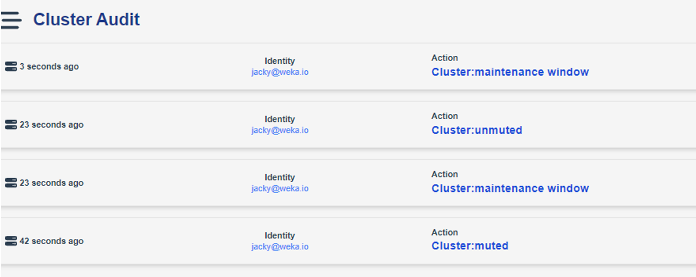<figcaption>
Cluster Audit
</figcaption></figure>

### Admin page

The Admin page displays all the admin privileged settings that can be applied to the Local WEKA Home for this cluster. You can apply the following settings:

* **Mute Cluster**: Instructs the cluster to not send any alerts or events to Local WEKA Home. This is useful for temporary situations where some maintenance activities will cause an unnecessary number of alerts to be sent to Local WEKA Home.
* **Delete Cluster**: Removes a legacy, already destroyed WEKA cluster from Local WEKA Home. It does not delete the cluster itself.
* **Maintenance Window**: Defines a window of time during which alert and event notifications will not be sent (by email, SNMP, and PagerDuty).

<figure>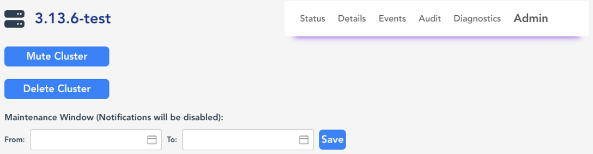<figcaption>
Admin page
</figcaption></figure>

### Users and Group pages

The Users page displays the current list of users with login access to Local WEKA Home and allows adding new users. The authentication is with a local username and password.

<figure>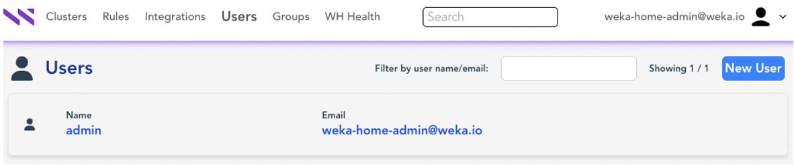<figcaption>
Users page
</figcaption></figure>

The Groups page displays all the groups, their respective members, and scopes (roles) each group is allowed to access or view in Local WEKA Home.

<figure>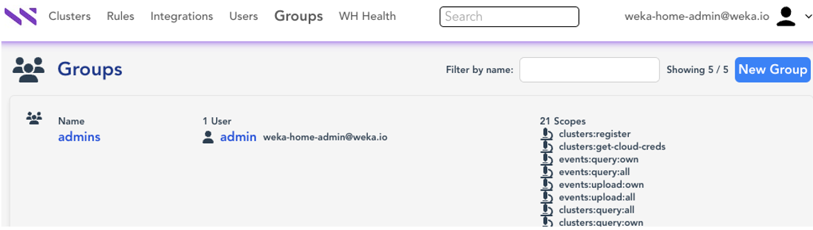<figcaption>
Groups page
</figcaption></figure>

You can create new groups as necessary with custom role-based access control (RBAC scoping).

<figure>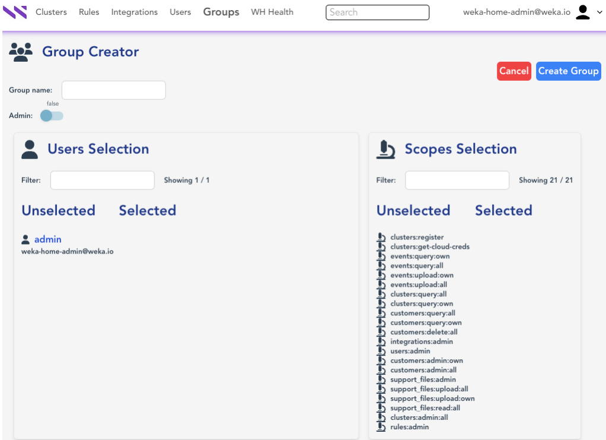<figcaption>
Group Creator
</figcaption></figure>

### Anonymization

This capability is designed to allow customers to send data to the cloud WEKA Home for enhanced supportability and monitoring by the Customer Success Team without worrying about sensitive data being uploaded.

A toggle button is provided to enable downloading the Usage Report or Analytics data without sensitive data.

<figure>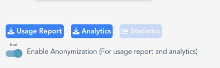<figcaption>
Enable Anonymization
</figcaption></figure>

For more details, see [download-the-usage-report-or-analytics.md](download-the-usage-report-or-analytics.md "mention").



### Cloud forwarding

This feature is aimed at customers that want to send events, usage, and analytics data from the Local WEKA Home to the cloud WEKA Home for supportability and monitoring by the Customer Success Team. The data is not anonymized.

This feature is supported for cluster configurations with less than 500 containers. This feature is not relevant for dark sites.

This feature is globally defined during the Local WEKA Home deployment. It is disabled by default. It can be enabled in the Local WEKA Home _config.yaml_ file.

### REST API

The WEKA system supports a RESTful API. This is useful when automating the interaction with the WEKA system and when integrating it into your workflows or monitoring systems.

The REST API is accessible at port 14000 through the URL: /api/v2.

You can explore the REST API through /api/v2/docs when accessing from the cluster, for example, https://weka01:14000/api/v2/docs.

The static API documentation can be accessed from [api.docs.weka.io](https://api.docs.weka.io/) (you can select the version from the drop-down list). The .json file can also be used to create your client code, using an OpenAPI client generator.


