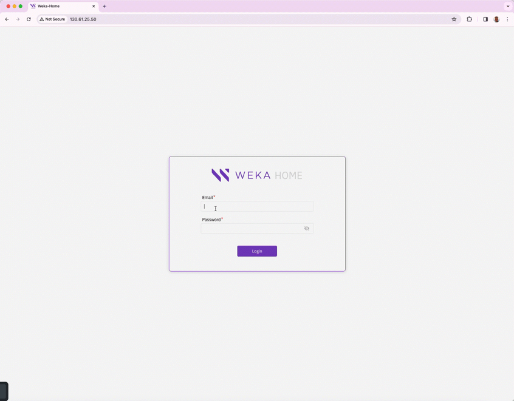
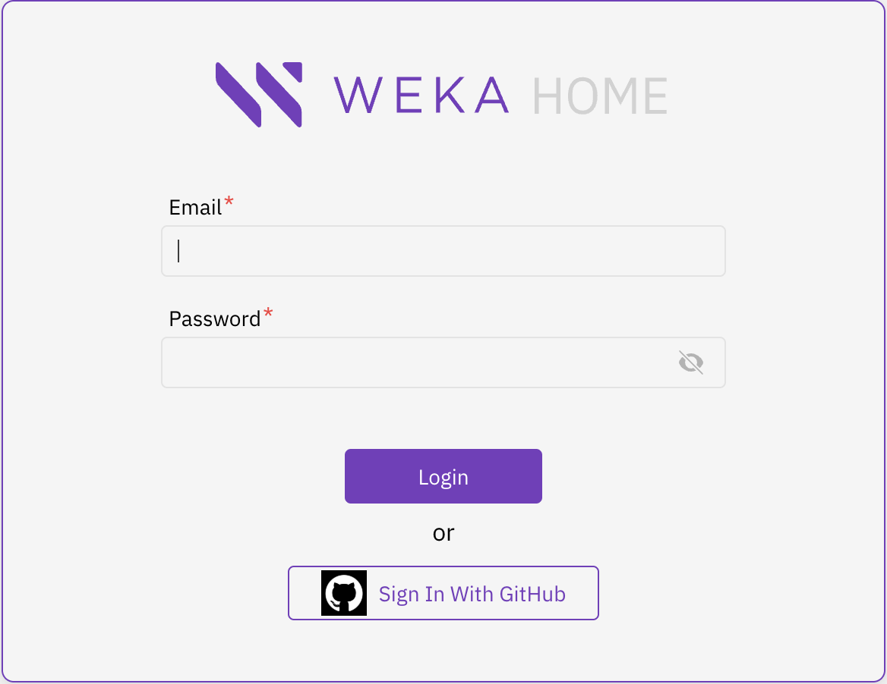

# Local WEKA Home overview

In scenarios where a customer lacks connectivity to the public instance of WEKA Home, such as when the WEKA cluster is deployed in a dark site or VPC, WEKA offers the option to deploy a Local WEKA Home. This is a private instance of WEKA Home, hosted on a management server or VM, designed to meet your specific needs.

## **Key functions of Local WEKA Home**

The Local WEKA Home serves the following key functions:

* **Event management:** It receives events from the WEKA cluster, stores them locally, and allows event querying and filtering.
* **Multi-cluster monitoring:** It allows you to monitor multiple clusters within your organization.
* **Cluster overview:** The Local WEKA Home displays a comprehensive overview of your clusters and allows you to drill down into cluster telemetry data.
* **Alerting:** It triggers specific alerts based on predefined rules and supports integrated delivery methods, including Email (SMTP), SNMP, PagerDuty, and Syslog.
* **Diagnostics support:** The Local WEKA Home receives support files (diagnostics) from the WEKA cluster, stores them, and makes them accessible for remote viewing by the Customer Success Team.
* **Usage and performance insights:** It receives usage, analytics, and performance statistics from the WEKA cluster, stores, displays, and enables querying and filtering this data.

## **Key features and capabilities**

Local WEKA Home offers the following features and capabilities, categorized as follows:

#### **Monitoring and insight features**

* **Cluster Insights:** Monitor and report on multiple clusters within your organization.
* **Statistics:** Display various cluster-wide statistics and health status information.
* **Event Data:** Access offline event data and associated details.
* **Diagnostics:** Access diagnostics, including event logs, syslog files, trace files, and container information.
* **Usage reports:** Download JSON-formatted Usage Reports and Analytics for analysis and support, including anonymized versions for data security.

#### **Alerting and integrations**

* **Custom rules:** Create custom rules for specific events and alerts and route them to predefined integrations.
* **Custom integrations:** Create destinations where you want alerts and events defined in the Rules page to be sent. These can be Email, SNMP, PagerDuty, and Syslog.

**Security and compliance controls**

* **Audit information:** View a list of audited activities.
* **Admin privileges:** Apply admin privileges for cluster management and maintenance.
* **User management:** Manage users, groups, and access permissions.

#### **Supportability and data management**

* **Data forwarding:** Forward data from the Local WEKA Home to the cloud WEKA Home for enhanced support and monitoring by the Customer Success Team.
* **REST API:** Use the RESTful API for automation and integration with your workflows and monitoring systems.

<figure><figcaption>
Local WEKA Home application overview
</figcaption></figure>

## Local WEKA Home deployment options

Explore the supported environment options for deploying Local WEKA Home (LWH). Choose the deployment method based on the LWH version and the specific scale requirements of your environment.

#### Deployment environment compatibility

The following table lists the supported LWH versions for each deployment environment:

| Deployment environment | Supported LWH Versions | Configuration file |
| ---------------------- | ---------------------- | ------------------ |
| Kubernetes (K8s)       | 4.x and above          | `values.yaml`      |
| K3s                    | 3.x, 4.x and above     | `config.json`      |
| Minikube               | 2.x                    | `config.yaml`      |

#### Deploy Local WEKA Home on K8s

Deploy LWH on K8s to support scale-out environments and large cluster configurations. This architecture uses Kubernetes orchestration capabilities for high availability, automated recovery, and simplified lifecycle management of the LWH components. This deployment method supports LWH version 4.x and above. You can customize the deployment by specifying configuration parameters in the `values.yaml` file.

#### Deploy Local WEKA Home on K3s

Deploy LWH on K3s for a lightweight Kubernetes implementation installed on a single-node cluster. This deployment method supports LWH versions 3.x, 4.x and above. You can customize the deployment by specifying configuration parameters in the `config.json` file.

#### Deploy Local WEKA Home on Minikube

Deploy LWH on Minikube for a lightweight Kubernetes implementation installed on a single Docker container. This deployment method supports LWH version 2.x. You can customize the deployment by specifying configuration parameters in the  `config.yaml` file.

**Related topics**

[#deploy-local-weka-home-on-k8s](local-weka-home-overview.md#deploy-local-weka-home-on-k8s "mention")

[local-weka-home-deployment](local-weka-home-deployment/ "mention")

[deploy-local-weka-home-v2.x.md](deploy-local-weka-home-v2.x.md "mention")

## Local WEKA Home application overview

### Sign in to Local WEKA Home

Authentication methods:

* Local users
* GitHub SSO

<figure><figcaption>
Sign-in to Local WEKA Home
</figcaption></figure>

### Local user sign-in flow

1. Initiate sign-in
   * Enter email and password
   * Click **Login**
2. User validation
   * Check email and password in internal LWH database
   * Existing user: Direct sign-in
   * Non-existent user: Return `401` error
3. Access granted
   * Successful authentication
   * Enter application

### GitHub SSO sign-in flow

GitHub SSO provides secure, streamlined authentication by:

* Centralizing user access management
* Simplifying login process
* Enforcing organizational access controls
* Reducing manual user provisioning

Sign-in steps:

1. Initiate sign-in
   * Click **Sign in with GitHub**
   * Redirect to GitHub authentication
2. GitHub authentication
   * Grant access
   * Retrieve public email
   * No public email: Return `400` error
3. User validation
   * Check email in internal LWH database
   * Existing user: Direct sign-in
   * New user:
     * Validate email domain matches `emailDomain`
     * Matching domain: Auto-create account
     * Non-matching domain: Return `401` error
4. Access granted
   * Successful authentication
   * Enter application

**Related topics**

[explore-cluster-insights-and-statistics.md](explore-cluster-insights-and-statistics.md "mention")

[manage-alerts-and-integrations.md](manage-alerts-and-integrations.md "mention")

[enforce-security-and-compliance.md](enforce-security-and-compliance.md "mention")

[optimize-support-and-data-management.md](optimize-support-and-data-management.md "mention")
