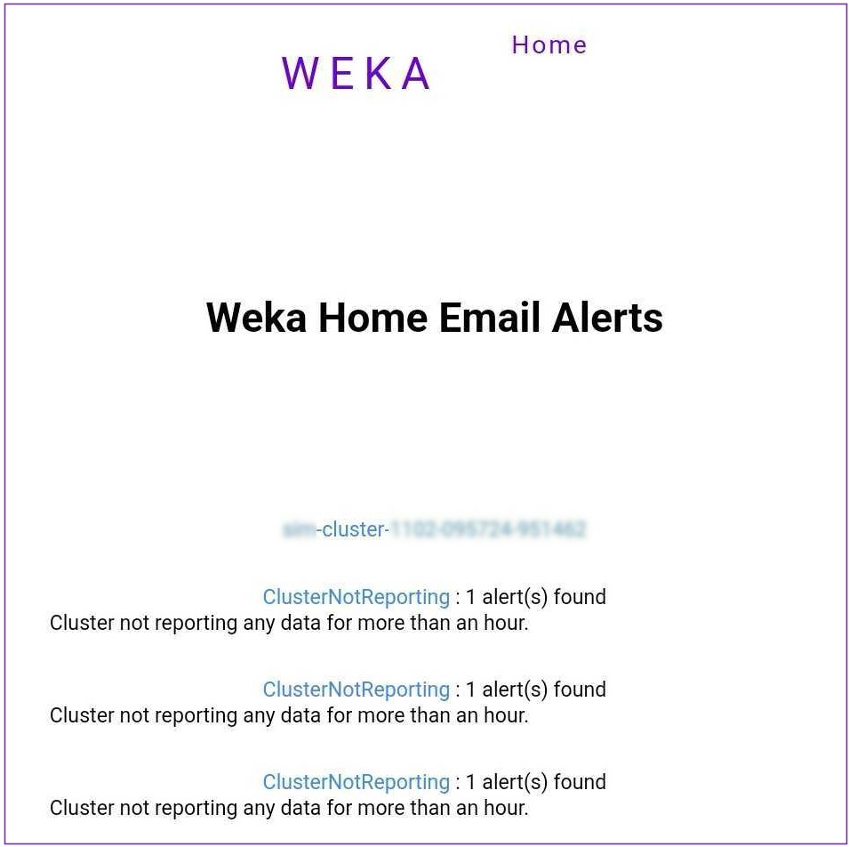
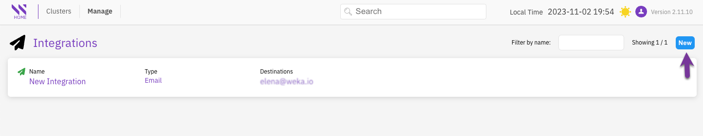
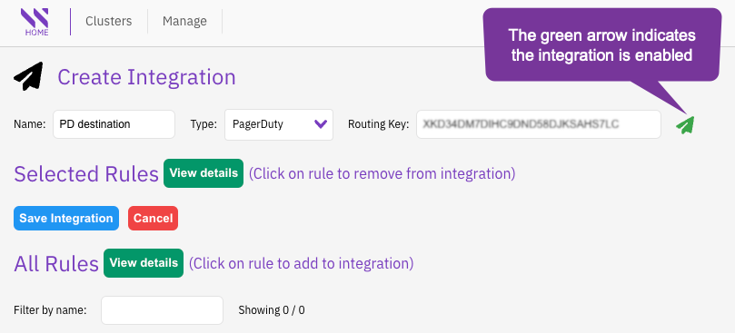
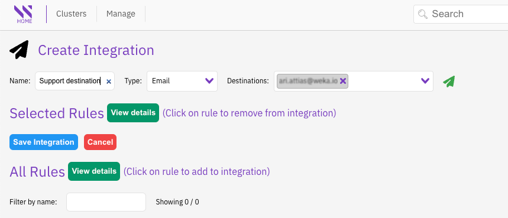
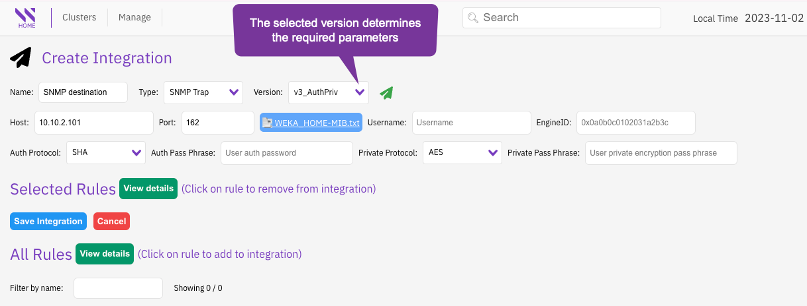
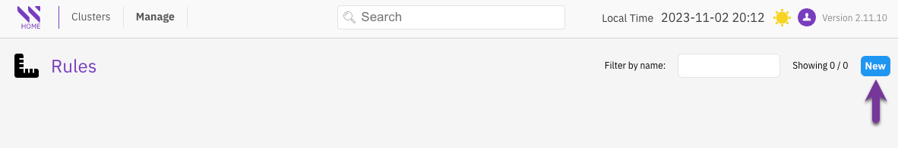

# Manage alerts and integrations

After deploying the Local WEKA Home, you can configure it to send specific alerts or events through Email (SMTP), PagerDuty, or SNMP Traps (v1/v2c/v3). For example, you can set it to email alerts to a specific address when the cluster's data protection level falls below the configured threshold.

<figure><figcaption>
WEKA Home email alert example
</figcaption></figure>

## Set the Local WEKA Home to send events and alerts

Setting the Local WEKA Home to send events and alerts includes the following procedures:

1. **Create an integration:** Set the destination on the **Integration** page.
2. **Create rules:** On the **Rules** page, select the rule conditions to trigger specific alerts or events and assign the rule to the integration.

### Create an integration

1. Access the Local WEKA Home portal with an admin account and the password (obtained. during the LWH deployment. See [#id-5.-access-the-local-weka-home-portal-and-grafana](local-weka-home-deployment.md#id-5.-access-the-local-weka-home-portal-and-grafana "mention")).
2. From the menu, select **Manage** > **Integrations**.
3. On the **Integration** page, select **New**.

<figure><figcaption>
Integrations page
</figcaption></figure>

3. On the **Create Integration** page, select one of the destinations and set the relevant values as follows:



1. In **Name**, enter a meaningful destination name for the integration.
2. In **Type**, select **PageDuty**.
3. In **Routing Key**, set the routing key of your pager duty.
4. Verify that the integration is enabled (the arrow is green).
5. Select **Save Integration**.

<figure><figcaption>
PagerDuty integration
</figcaption></figure>



1. In **Name**, enter a meaningful destination name for the integration.
2. In **Type**, select **Email**.
3. In **Destination**, set the destination email address.
4. Verify that the integration is enabled (the arrow is green).
5. Select **Save Integration**.

<figure><figcaption>
Email integration
</figcaption></figure>



1. In **Name**, enter a meaningful destination name for the integration.
2. In **Type**, select **SNMP Trap**.
3. In the **Version**, select the required SNMP version to use with your SNMP-based tool.&#x20;
4. Set the values of the properties required according to the selected version:
   * **v1:** SNMP version 1, which only requires the SNMP server hostname or IP address and a plaintext community.
   * **v2c:** SNMP version 2c, similar to SNMP v1, but adds support for 64-bit counters.
   * **v3\_NoAuthNoPriv:** SNMP version 3 with security of a user name and EngineID, but without authentication and privileges.
   * **v3AuthNoPriv:** SNMP version 3 with security of a user name, EngineID, and authentication but without privileges.
   * **v3AuthPriv:** SNMP version 3 with security of a user name, EngineID, authentication, and privileges.
5. Verify that the integration is enabled (the arrow is green).
6. Download the WEKA\_HOME-MIB.txt file and apply it in your SNMP system.
7. Select **Save Integration**.

<figure><figcaption>
SNMP integration: <strong>v3_AuthPriv</strong> (v3 with authentication and privileges settings)
</figcaption></figure>



### Create a rule

1. From the menu, select **Manage** > **Rules**.
2. On the **Rules** page, select **New**.

<figure><figcaption>
Rules page
</figcaption></figure>

5.  On the **Create Rule** page, do the following:

    1. Enter a meaningful name for the rule.
    2. Select the event or alert type from **Rule Type** and set the entity, operator, and condition, for the selected rule type.
    3. Select **View integrations** and select the required integration (destination) from the list.
    4. Select **Save Rule**.

    A green confirmation message appears for a successful setting.

### Examples

#### Create an event rule that sends all critical events to a predefined email

<figure><figcaption>
Create an event rule example
</figcaption></figure>

#### Create an alert rule that sends all tiering connectivity alerts to a predefined email

<figure><figcaption>
Create an alert rule example
</figcaption></figure>
