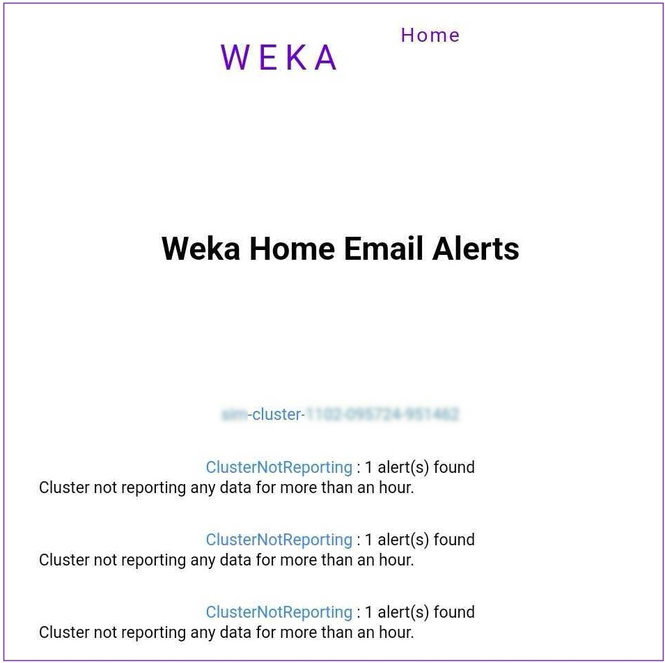
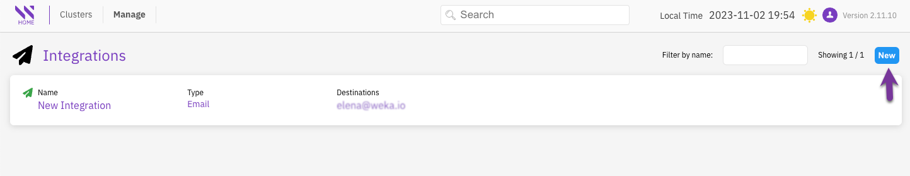
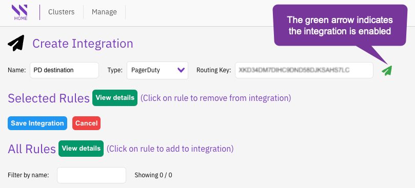
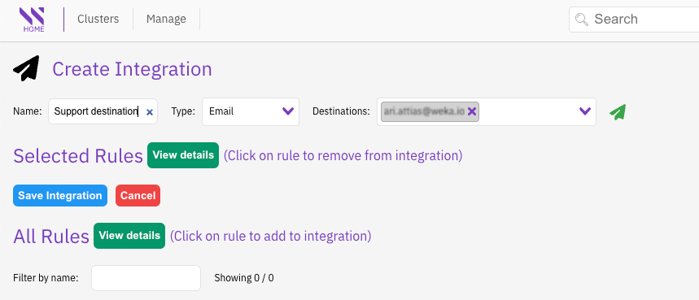
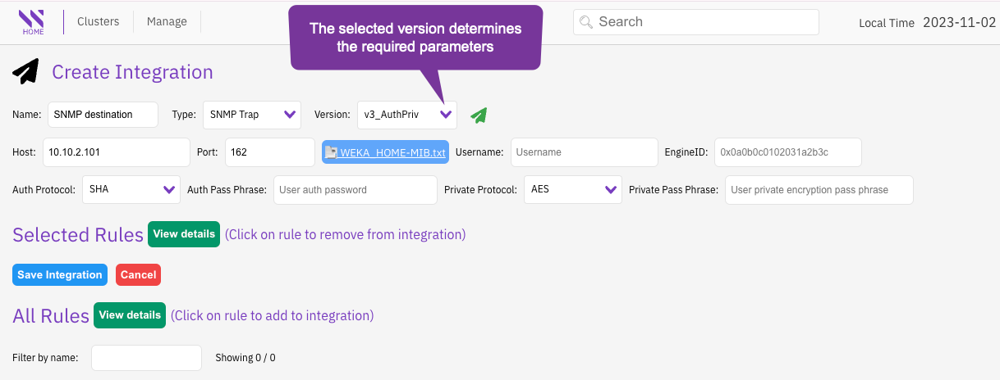
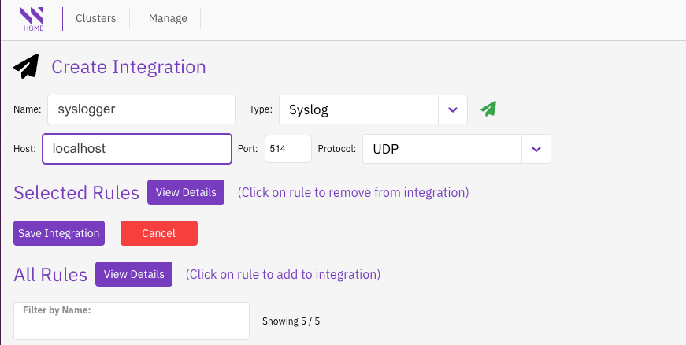
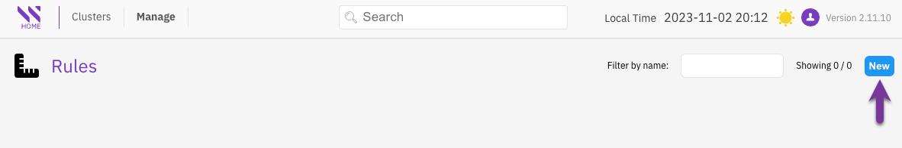

---
metaLinks:
  alternates:
    - >-
      https://app.gitbook.com/s/0yXyIrnroN3zIG3qa4W3/monitor-the-weka-cluster/the-wekaio-support-cloud/manage-alerts-and-integrations
---

# Manage alerts and integrations

The Local WEKA Home can be configured to send alerts through Email (SMTP), PagerDuty, SNMP Traps (v1/v2c/v3), and Syslog (RFC 5424). For instance, you can set it to send email notifications to a specific address if the cluster's data protection level drops below a set threshold.

<div data-with-frame="true"><figure><figcaption><p>WEKA Home email alert example</p></figcaption></figure></div>

## Set the Local WEKA Home to send events and alerts

Setting the Local WEKA Home to send events and alerts includes the following procedures:

1. **Create an integration:** Set the destination on the **Integration** page.
2. **Create rules:** On the **Rules** page, select the rule conditions to trigger specific alerts or events and assign the rule to the integration.

### Create an integration

1. Access the Local WEKA Home portal with an admin account and the password (obtained during the LWH deployment. For example, see [#id-5.-access-the-local-weka-home-portal-and-grafana](local-weka-home-deployment/#id-5.-access-the-local-weka-home-portal-and-grafana "mention")).
2. From the menu, select **Manage** > **Integrations**.
3. On the **Integration** page, select **New**.

<div data-with-frame="true"><figure><figcaption><p>Integrations page</p></figcaption></figure></div>

3. On the **Create Integration** page, select one of the destinations and set the relevant values as follows:



1) In **Name**, enter a meaningful destination name for the integration.
2) In **Type**, select **PageDuty**.
3) In **Routing Key**, set the routing key of your pager duty.
4) Ensure the integration is enabled (indicated by a green arrow).
5) Select **Save Integration**.

<div data-with-frame="true"><figure><figcaption><p>PagerDuty integration</p></figcaption></figure></div>



1. In **Name**, enter a meaningful destination name for the integration.
2. In **Type**, select **Email**.
3. In **Destination**, set the destination email address.
4. Ensure the integration is enabled (indicated by a green arrow).
5. Select **Save Integration**.

<div data-with-frame="true"><figure><figcaption><p>Email integration</p></figcaption></figure></div>



1. In **Name**, enter a meaningful destination name for the integration.
2. In **Type**, select **SNMP Trap**.
3. In the **Version**, select the required SNMP version to use with your SNMP-based tool.
4. Set the values of the properties required according to the selected version:
   * **v1:** SNMP version 1, which only requires the SNMP server hostname or IP address and a plaintext community.
   * **v2c:** SNMP version 2c, similar to SNMP v1, but adds support for 64-bit counters.
   * **v3\_NoAuthNoPriv:** SNMP version 3 with security of a user name and EngineID, but without authentication and privileges.
   * **v3AuthNoPriv:** SNMP version 3 with security of a user name, EngineID, and authentication but without privileges.
   * **v3AuthPriv:** SNMP version 3 with security of a user name, EngineID, authentication, and privileges.
5. Ensure the integration is enabled (indicated by a green arrow).
6. Download the WEKA\_HOME-MIB.txt file and apply it in your SNMP system.
7. Select **Save Integration**.

<div data-with-frame="true"><figure><figcaption><p>SNMP integration: <strong>v3_AuthPriv</strong> (v3 with authentication and privileges settings)</p></figcaption></figure></div>



1. In **Name**, provide a clear and descriptive name for the integration.
2. In **Type**, select **Syslog**.
3. In **Syslog Host**, enter the Hostname or IP address of the syslog server
4. In **Syslog Port**, specify the Port number (1–65535). Default is 514.
5. In **Protocol**, choose a transport protocol:
   * **UDP:** Sends plain messages with a newline terminator. Delivers on a best-effort basis. This is the default.
   * **TCP:** Uses RFC 5425 octet-counted framing (`{length} {message}`). Ensures reliable delivery.
   * **TLS:** Functions like TCP but with TLS 1.2+ encryption. Validates the server certificate against the system CA store.
6. Ensure the integration is enabled (indicated by a green arrow).
7. Select **Save Integration**.

<div data-with-frame="true"><figure><figcaption><p>Syslog integration</p></figcaption></figure></div>



#### Syslog technical reference

After configuring the Syslog integration, use the following technical details to ensure your Syslog server or SIEM (such as, Splunk, LogRhythm) can correctly parse the incoming data.

**Message format**

Local WEKA Home messages follow the RFC 5424 standard:

```
<PRI>1 TIMESTAMP HOSTNAME weka-home - MSGID [STRUCTURED-DATA] MESSAGE
```

* PRI: Calculated from facility (User = 1) and WEKA severity.
* TIMESTAMP: ISO 8601 / RFC 3339 format (example, `2026-03-05T12:39:51Z`).
* HOSTNAME: Node ID (if available), cluster name, or `weka-home`.
* APP-NAME: Always `weka-home`.
* MSGID: The event or alert type (spaces are replaced with underscores).
* STRUCTURED-DATA: Key-value pairs in RFC 5424 format: `[params key="value" ...]`.
* MESSAGE: The human-readable description of the notification.

**Payload contents**

The structured data/JSON payload varies by notification type:

* Events: `customer_name`, `event_type`, `cluster_id`, `event_fields`, `severity`, `weka_home_url`
* Alerts: `customer_name`, `alert_type`, `cluster_id`, `title`, `content`, `action`, `severity`, `weka_home_url`

**Severity mapping**

WEKA severity levels are mapped to standard Syslog severity codes:

| WEKA severity   | Syslog severity | Code |
| --------------- | --------------- | ---- |
| Critical        | CRIT            | 2    |
| Major           | ERR             | 3    |
| Minor / Warning | WARNING         | 4    |
| Info            | INFO            | 6    |
| Debug           | DEBUG           | 7    |
| None (default)  | NOTICE          | 5    |

**Connection settings**

Connection timeout: 10 seconds for all protocols (UDP, TCP, and TLS).

### Create a rule

1. From the menu, select **Manage** > **Rules**.
2. On the **Rules** page, select **New**.

<div data-with-frame="true"><figure><figcaption><p>Rules page</p></figcaption></figure></div>

5.  On the **Create Rule** page, do the following:

    1. Enter a meaningful name for the rule.
    2. Select the event or alert type from **Rule Type** and set the entity, operator, and condition, for the selected rule type.
    3. Select **View integrations** and select the required integration (destination) from the list.
    4. Select **Save Rule**.

    A green confirmation message appears for a successful setting.

### Examples

#### Create an event rule that sends all critical events to a predefined email

<div data-with-frame="true"><figure><figcaption><p>Create an event rule example</p></figcaption></figure></div>

#### Create an alert rule that sends all tiering connectivity alerts to a predefined email

<div data-with-frame="true"><figure><figcaption><p>Create an alert rule example</p></figcaption></figure></div>
