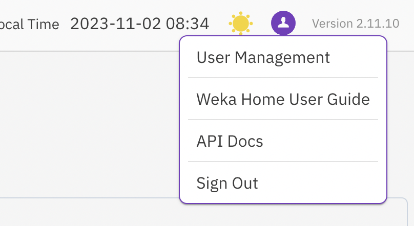

# Optimize support and data management

## Cloud forwarding

This feature is aimed at customers that want to send events, usage, and analytics data from the Local WEKA Home to the cloud WEKA Home for supportability and monitoring by the Customer Success Team. The data is not anonymized.

This feature is supported for cluster configurations with less than 500 containers. This feature is not relevant for dark sites.

This feature is globally defined during the Local WEKA Home deployment. It is disabled by default. It can be enabled in the Local WEKA Home _config.yaml_ file.

**Related topic**

[#5.-install-and-configure-local-weka-home](local-weka-home-deployment.md#5.-install-and-configure-local-weka-home "mention") (See _Forward data from the Local WEKA Home to the Cloud WEKA Home)_

## API Documentation

The Local WEKA Home supports a RESTful API. This is useful when automating the interaction with the Local WEKA Home and when integrating it into your workflows or monitoring systems.

To access the API documentation:

1. Select the profile icon, and from the menu that appears, select User Management and create an API token.

<figure><figcaption>
Access the API Docs
</figcaption></figure>

2. Select **API Docs** and apply the API token.

A static API documentation is also found in: [https://home.weka.io/help/api](https://home.weka.io/help/api).
