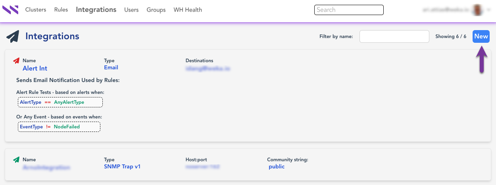
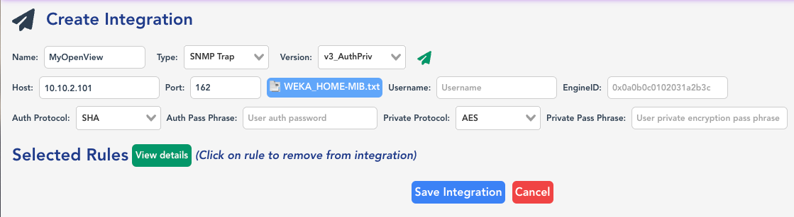

# Set the Local WEKA Home to send alerts or events

Once the Local WEKA Home is deployed, you can set it to send specific alerts or events by Email (SMTP), PagerDuty, and SNMP Traps (v1/v2c/v3).

For example, you can set the Local WEKA Home to send alerts by email to a specific address when the cluster is at a lower level of data protection than configured.

<figure><figcaption>
WEKA Home email alert example
</figcaption></figure>

Setting the Local WEKA Home to send events and alerts at a glance:

1. Set the destination on the **Integration** page.
2. On the **Rules** page, select the rule conditions to trigger specific alerts or events.
3. Assign the rule to the integration.

**Procedure:**

1. Access the Local WEKA Home portal with an admin account and the password obtained.
2. On the **Integration** page, select **New**.

<figure><figcaption>
Integrations page
</figcaption></figure>

3. On the **Create Integration** page, select one of the destinations and set the relevant values as follows:



1. In **Name**, enter a meaningful name for the integration.
2. In **Type**, select the PageDuty type.
3. In **Routing Key**, set the routing key of your pager duty.
4. Verify that the integration is enabled (the arrow is green).
5. Select **Save Integration**.

<figure><figcaption>
PagerDuty integration
</figcaption></figure>



1. In **Name**, enter a meaningful name for the integration.
2. In **Type**, select the Email type.
3. In **Destination**, set the destination email address.
4. Verify that the integration is enabled (the arrow is green).
5. Select **Save Integration**.

<figure><figcaption>
Email integration
</figcaption></figure>



1. In **Name**, enter a meaningful name for the integration.
2. In **Type**, select SNMP Trap.
3. In the **Version**, select the required SNMP version to use with your SNMP-based tool.&#x20;
4. Set the values of the properties required according to the selected version:
   * **v1:** SNMP version 1, which only requires the SNMP server hostname or IP address and a plaintext community.
   * **v2c:** SNMP version 2c, similar to SNMP v1, but adds support for 64-bit counters.
   * **v3\_NoAuthNoPriv:** SNMP version 3 with security of a user name and EngineID, but without authentication and privileges.
   * **v3AuthNoPriv:** SNMP version 3 with security of a user name, EngineID, and authentication but without privileges.
   * **v3AuthPriv:** SNMP version 3 with security of a user name, EngineID, authentication, and privileges.
5. Verify that the integration is enabled (the arrow is green).
6. Download the WEKA\_HOME-MIB.txt file and apply it in your SNMP system.
7. Select **Save Integration**.

<figure><figcaption>
SNMP integration: <strong>v1</strong>
</figcaption></figure>

<figure><figcaption>
SNMP integration: <strong>v3_AuthPriv</strong> (v3 with authentication and privileges settings)
</figcaption></figure>



4. On the **Rules** page, select **New**.

<figure><figcaption>
Rules page
</figcaption></figure>

5. On the **Create Rule** page, do the following:

* Enter a meaningful name for the rule.
* Select the event or alert type from **Rule Type** and set the entity, operator, and condition, for the selected rule type.
* Select **View integrations** and then select the required integration (delivery method) from the list.
* Select **Save Rule**.

A green confirmation message appears for a successful setting.



<figure><figcaption></figcaption></figure>



<figure><figcaption></figcaption></figure>


