# WEKA Management Station (WMS) as a monitoring tool

The WEKA Management Station (WMS) is an install kit similar to an OS install disk that simplifies the installation and configuration of the Local WEKA Home (LWH), WEKAmon, and SnapTool, in an on-premises environment. The WMS installs the WEKA OS, drivers, and WEKA software automatically and unattended.

The WMS is also used for installing a WEKA cluster by deploying the WEKA Software Appliance (WSA) package on bare metal servers.

<figure>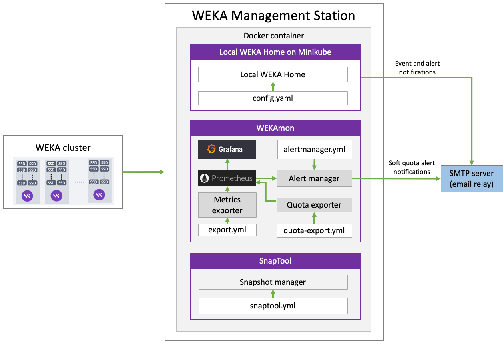<figcaption>
WEKA Management Station deployment
</figcaption></figure>

See the related topics to learn about the tools installed with the WMS.

**Related topics**

[the-wekaio-support-cloud](the-wekaio-support-cloud/ "mention")

[external-monitoring.md](external-monitoring.md "mention")

[snapshot-management.md](snapshot-management.md "mention")

[bare-metal](../install/bare-metal/ "mention")

## WMS deployment prerequisites

The server or VM must meet the following requirements:

* **Boot drives:** One or two identical boot drives as an installation target.
  * A system with two identical boot drives has the OS installed on mirrored partitions (LVM).
  * A system with one drive has a simple partition.
* **Minimum boot drive capacity:**
  * If not configuring LWH: 125 GB.
  * If configuring LWH: 500 GB.
* **Boot type:** UEFI boot (BIOS boot is also supported but deprecated).
* **Cores and RAM:**
  * If not configuring LWH: minimum 4 cores and 16 GB.
  * If configuring LWH: Minimum 8 cores and 48 GB for a cluster with up to 500 containers. More cores and memory are required for larger clusters.
* **Network interface:** 1 Gbps.&#x20;

## Before you begin

Before deploying the WMS, adhere to the following:

* The root password is `WekaService`
* The WEKA user password is `weka.io123`
* If errors occur during installation and the installation halts (no error messages appear), use the system console to review the logs in `/tmp`. The primary log is `/tmp/ks-pre.log`.
* To get a command prompt from the Installation GUI, do one of the following:
  * On macOS, type **ctrl+option+f2**&#x20;
  * On Windows, type **ctrl+alt+f2**.

## &#x20;WMS deployment workflow

1. [Install the WMS](weka-management-station-wms-as-a-monitoring-tool.md#install-the-wms).
2. [Configure the WMS](weka-management-station-wms-as-a-monitoring-tool.md#configure-the-wms).
3. [Set the email notifications](weka-management-station-wms-as-a-monitoring-tool.md#set-the-email-notifications).
4. [Install and configure the LWH](weka-management-station-wms-as-a-monitoring-tool.md#install-and-configure-the-lwh).
5. [Configure the WEKAmon](weka-management-station-wms-as-a-monitoring-tool.md#configure-the-wekamon).
6. [Edit the hosts file](weka-management-station-wms-as-a-monitoring-tool.md#edit-the-hosts-file).
7. [Configure the Snaptool](weka-management-station-wms-as-a-monitoring-tool.md#configure-the-snaptool).
8. [Download logs](weka-management-station-wms-as-a-monitoring-tool.md#download-logs).

### Install the WMS

1. Download the latest WMS image from [get.weka.io](https://get.weka.io/) (requires sign-in).
2. Boot the server from the WMS image. The following are some options to do that:



Copy the WEKA Management Station ISO image to an appropriate location so the server’s BMC (Baseboard Management Controller) can mount it or be served through a PXE (Preboot Execution Environment).



Depending on the server manufacturer, consult the documentation for the server’s BMC (for example, iLO, iDRAC, and IPMI) for detailed instructions on mounting and booting from a bootable ISO image, such as:

* A workstation or laptop sent to the BMC through the web browser.
* Ann SMB share in a Windows server or a Samba server.
* An NFS share.&#x20;



To use PXE boot, use the WEKA Management Station as any other Operating System ISO image and configure accordingly.



Burn the WMS image to a DVD and boot it from the physical DVD. However, most modern servers do not have DVD readers anymore.



A bootable USB drive should work (follow online directions for creating a bootable USB drive) but has not been tested yet.



Once you boot the server, the WEKA Management Station installs the WEKA OS (Rocky Linux), drivers, and WEKA software automatically and unattended (no human interaction required).

Depending on network speed, this can take about 10-60 mins (or more) per server.

<figure><figcaption>
WMS installation progress
</figcaption></figure>

### Configure the WMS

Once the WMS installation is complete and rebooted, configure the WMS.

1. Run the OS using one of the following options:



Run the OS through the BMC’s Console. See the specific manufacturer’s BMC documentation.



Run the OS through the Cockpit Web Interface on port 9090 of the OS management network.

If you don’t know the WMS hostname or IP address, go to the console and press the **Return** key a couple of times until it prompts the URL of the WMS OS Web Console (Cockpit) on port 9090.

Change the port from 9090 to 8051, which is the WMS Admin port.

<figure><figcaption>
Cockpit URL (IP address of this WMS is 172.29.7.152)
</figcaption></figure>



2. Browse to the WMS Admin UI using the following URL:\
   `http://<WMS-hostname-or-ip>:8501`

<figure><figcaption>
WMS Admin UI: Login Page
</figcaption></figure>

3. Enter username and password (default: _admin_/_admin_), and select **Login**.\
   The Landing Page appears.

<figure><figcaption>
WMS Landing Page
</figcaption></figure>

### Set the email notifications

You can set the sender and target SMTP server details for email notifications about the following:

* The WEKAmon has an Alert Manager that sends alerts by email when the user has reached the soft quota limit.
* The LWH sends alerts or events through the email integration.

1. From the left pane, select **Email Notification Settings**.
2. Set the required details:
   * **Sender details:** Name and email address of the sender.
   * **Target SMTP server details:** Host, port, username, and password of the SMTP server used as the Email relay.
3. Select **Save**.

<figure>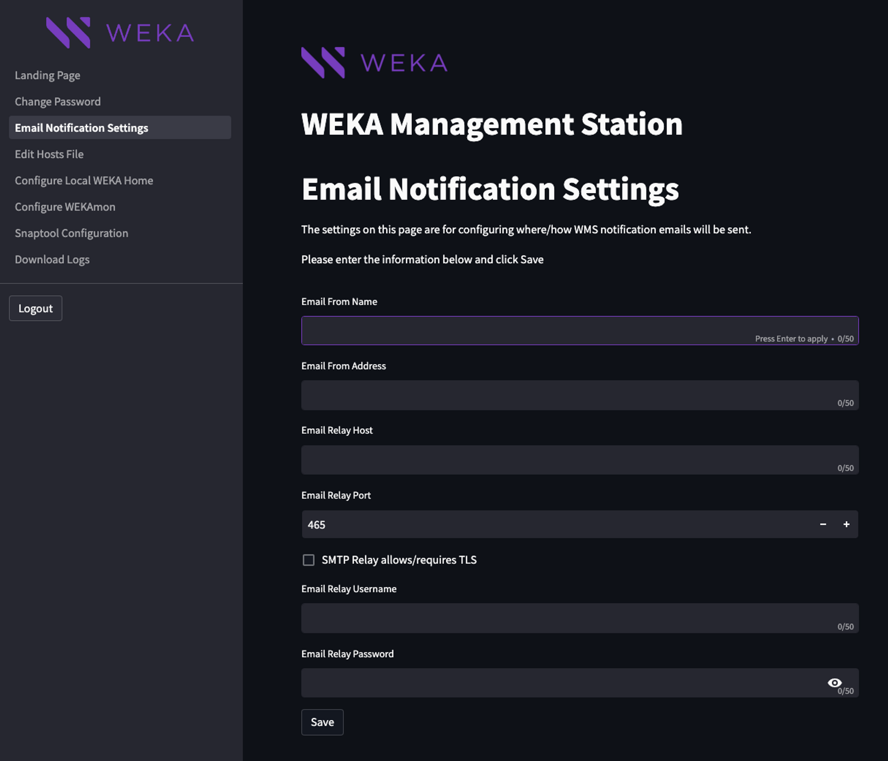<figcaption>
WMS Email Notification settings
</figcaption></figure>

### Install and configure the LWH

1. From the left pane, select **Configure Local WEKA Home**.
2. If required, customize the LWH settings.
3. Select **Save**.\
   The WMS saves the configuration and installs the Minikube and LWH. This process can take several minutes. When the process completes, the following appears:

<figure>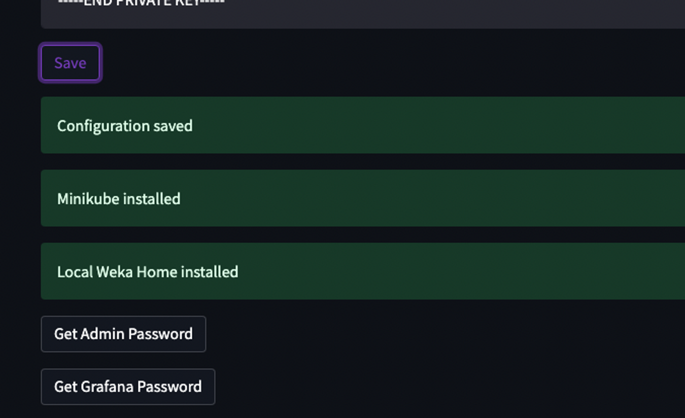<figcaption>
LWH installation is complete
</figcaption></figure>

4. Retrieve the LWH Admin and Grafana passwords as follows:
   * Select **Get Admin Password**. The password appears below the button.
   * Select **Get Grafana Password**. The password appears below the button. This password only applies to the Grafana instance within LWH (not related to the Grafana instance of the WEKAmon).

<figure>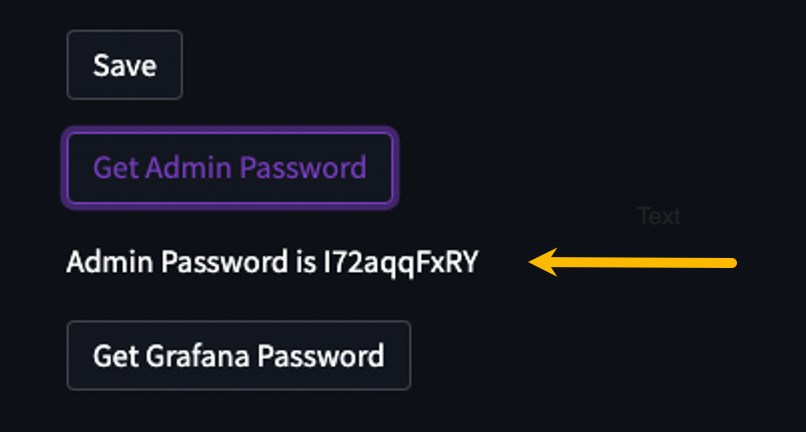<figcaption></figcaption></figure>

4. Register the cluster with the LWH. On one of the backend servers in your cluster, run the following command line: \
   `weka cloud enable --cloud-url https://<WMS server IP or hostname>`\
   \
   Where:\
   The WMS server IP or hostname is generally the same as the WMS instance.\
   If you do not use TLS, then replace `https` with `http`.


The WMS could have more than one IP interface. For example, it can be installed as a jumphost with two interfaces, one for the corporate network and one for the cluster network. The cluster may not reach the corporate network. Therefore, you must provide the IP of the WMS that is on the cluster network.


5. Log in to the LWH.\
   On the Landing Page, select **Open Local WEKA Home in new tab**.\
   When prompted for a password, enter the Admin password retrieved in the previous steps.\
   The LWH **Cluster Overview** page appears.

<figure><figcaption>
Open Local WEKA Home in a new tab
</figcaption></figure>


**Reconfiguring LWH:** If required, return to the LWH configuration page, update the configuration, and select **Save** again. The LWH configuration will be updated and restarted. &#x20;


### Configure the WEKAmon

1. From the left pane, select **Configure WEKAmon**.

<figure><figcaption>
WEKAmon Services Configuration
</figcaption></figure>

2. Select the services you want to enable and set the hostname or public IP address, username, and password of the cluster to monitor (it can be a backend server of the cluster). Then, select **Save**.


If DNS does not have the hostnames of the cluster, do one of the following:

* Edit the /etc/hosts file before trying again. See [Edit the hosts file](weka-management-station-wms-as-a-monitoring-tool.md#edit-the-hosts-file).
* Use the Cockpit Web Interface on port 9090 to change the DNS settings. See Cockpit Web Interface in [Configure the WMS](weka-management-station-wms-as-a-monitoring-tool.md#configure-the-wms).


Once the WMS successfully logs in to the cluster, the WEKAmon installation begins.

<figure>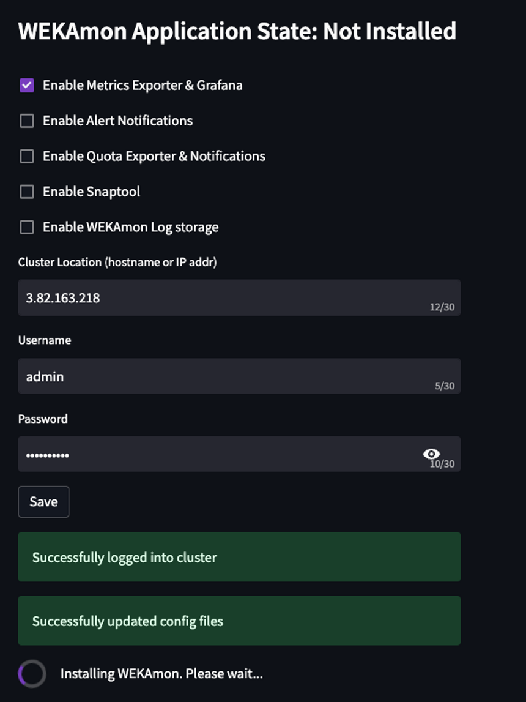<figcaption>
Select WEKAmon services
</figcaption></figure>

Once the WEKAmon installation completes, you can open it from the WMS Landing Page.

<figure>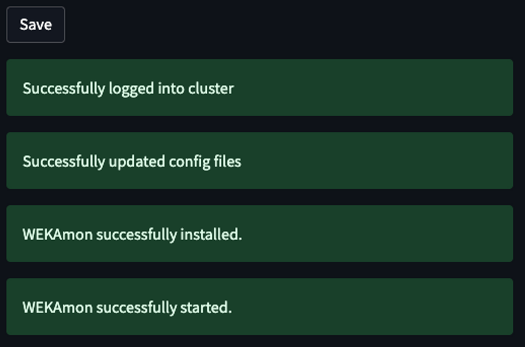<figcaption>
WEKAmon installation completes
</figcaption></figure>

<figure>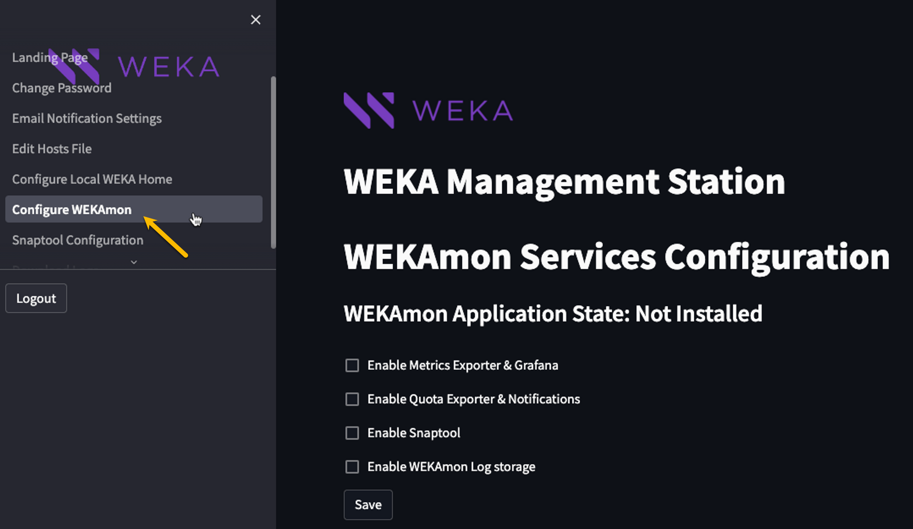<figcaption>
Open WEKAmon in new tab
</figcaption></figure>

#### Open Grafana

1. From the Landing Page, select **Grafana**.
2. For username and password, use `admin/admin` (not the username/password that was retrieved for LWH.)


If your cluster is in a different AWS region, edit the `/etc/hosts` file on the WMS to resolve the private IP addresses of the cluster, and associate the public IP addresses with the internal private IP addresses.


<figure>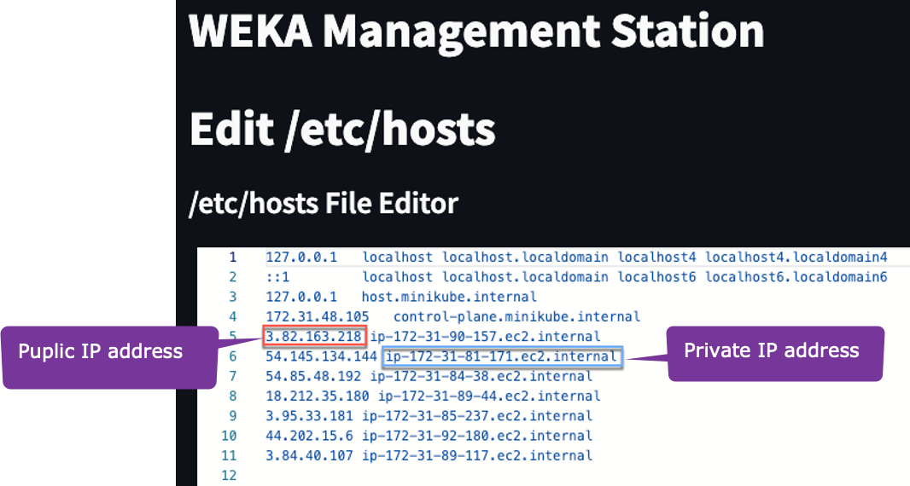<figcaption>
Private and public IP addresses in the hosts file
</figcaption></figure>

### Edit the hosts file

The WMS provides a simple text editor to facilitate editing the `/etc/hosts` file.

1. From the left pane, select **Edit Hosts File**.
2. Add the IP addresses of the cluster servers. Type, copy, and paste as in any other simple text editor.&#x20;
3. Select **Save**.

<figure>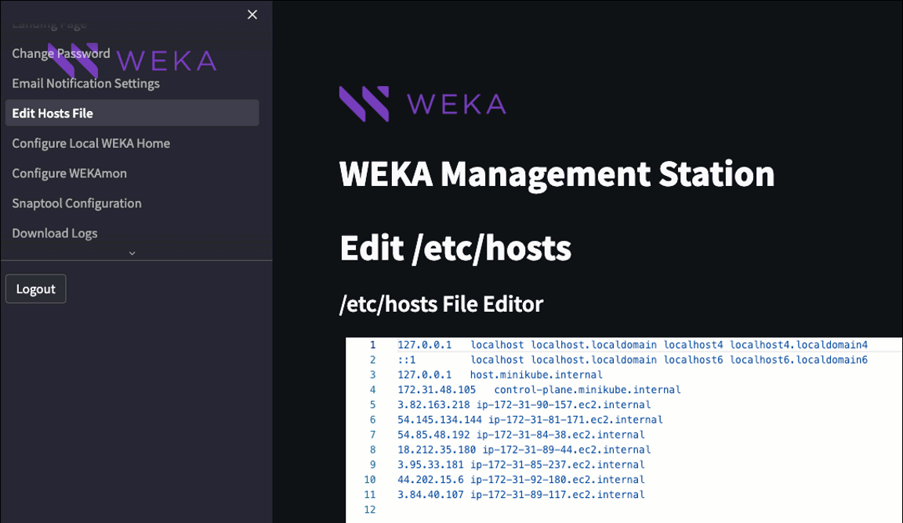<figcaption>
Edit the hosts file
</figcaption></figure>

### Configure the Snaptool

Snaptool is pre-installed in the `/opt/snaptool` directory and includes all the containers, so there is no need to download anything. Only configuration is required.

1. From the left pane, select **Snaptool Configuration**.
2. In the Snaptool Configuration Editor, if required, you can update the configuration. For details, see [Edit the configuration in the snaptool.yml file](broken-reference).\
   Snaptool shares the same cluster login information as WEKAmon and automatically detects and re-loads its configuration when any changes are made.
3. Select **Save**.&#x20;

<figure>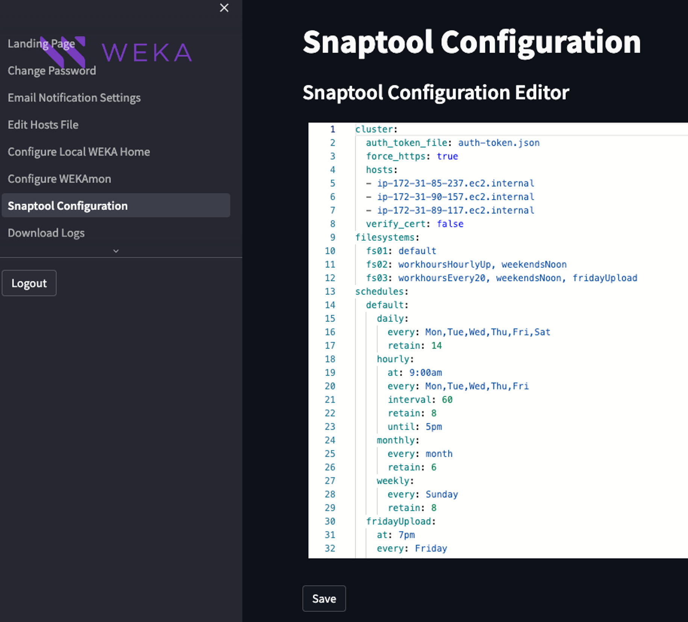<figcaption>
Snaptool Configuration
</figcaption></figure>

### Download diagnostics logs

If errors occur during the WMS installation, download the diagnostics logs and send them to the Customer Success Team.

1. From the left pane, select **Download Logs**.
2. Select **Gather Logs** to collect the logs.
3. Once finished, select Download Logs to save a local copy of the diagnostics tarball on your workstation.
4. Share the downloaded files with the Customer Success Team.

<figure>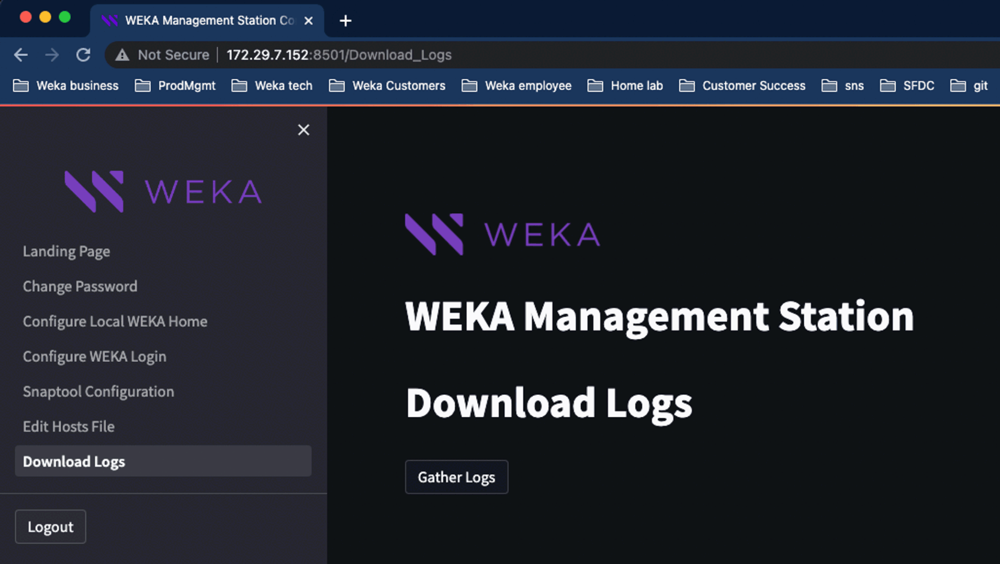<figcaption>
Download logs
</figcaption></figure>
