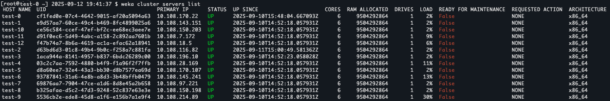
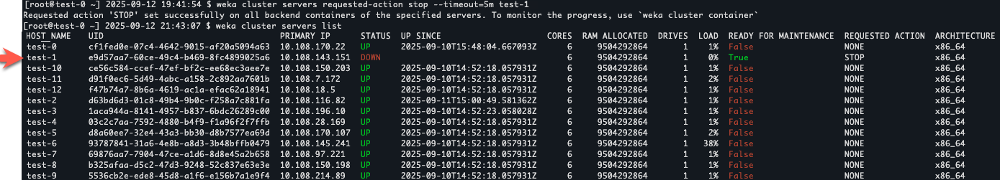

# NeuralMesh Axon maintenance

## Drive replacement

Replace a failed drive in a NeuralMesh Axon cluster to restore full redundancy and capacity. This procedure applies to the storage drives managed by the cluster and does not apply to operating system drives.

**Prerequisites**

* A replacement drive is available.
* Identify the specific server and drive requiring replacement.

### Verify cluster health

Before replacing a drive, verify the overall health of the cluster and the rebuild status.

For Kubernetes-based systems, run the following commands:

1.  **View the cluster status:**

    ```bash
    kubectl get pods –n <namespace>
    kubectl exec –it –n <namespace> <pod-name> -- bash –c “weka status”
    ```
2.  **View the rebuild status:**

    ```bash
    kubectl exec –it –n <namespace> <pod-name> -- bash –c “weka status rebuild”
    ```
3.  **View active alerts:**

    ```bash
    kubectl exec –it –n <namespace> <pod-name> -- bash –c “weka alerts”
    ```

### Replace the drive

1. **Deactivate and remove the drive:**
   1. Do one of the following:
      * **Kubernetes:** Use `kubectl` to access the shell of any pod in the cluster.
      * **Non-Kubernetes:** Access the shell of one of the servers running the Axon software.
   2. Run the commands to deactivate and remove the drive from the cluster management. See [#remove-only-some-drives-from-the-cluster](../operation-guide/expanding-and-shrinking-cluster-resources/shrinking-a-cluster.md#remove-only-some-drives-from-the-cluster "mention").
2. **Physically replace the drive:** Remove the failed drive from the server chassis and insert the replacement drive.
3. **Verify drive detection:**
   1. Establish an SSH connection to the storage server.
   2. Run the `lsblk` command.
   3. Confirm the operating system recognizes the new drive.\
      The output displays only the new device and drives not used for the dataplane. The system unloads storage devices from the kernel to control them by SPDK.
4. **Integrate the new drive:**
   1. Access the shell of the server or pod running NeuralMesh Axon.
   2. Add the new drive device path to the Drives container on the specific storage server. See [#id-4.-configure-the-ssd-drives](../planning-and-installation/bare-metal/manually-configure-the-weka-cluster-using-the-resource-generator/#id-4.-configure-the-ssd-drives "mention").

## Server maintenance

Perform server maintenance, such as rebooting or restarting networking services, by gracefully stopping  services to prevent data unavailability.

### Manage server state in Kubernetes environments

For Kubernetes worker nodes running NeuralMesh Axon, cordon and drain the node before maintenance.

1.  **Cordon the node:** Prevent new workloads from scheduling on the node.

    ```bash
    kubectl cordon <node-name>
    ```
2.  **Drain the node:** Stop application pods running on the node.

    ```
    kubectl drain <node-name> --delete-emptydir-data --ignore-daemonsets
    ```
3. **Perform maintenance:** Complete the necessary hardware or software updates.
4.  **Uncordon the node:** Return the node to service.

    ```bash
    kubectl uncordon <node-name>
    ```

### Manage server state in non-Kubernetes environments

For Slurm or bare-metal configurations, manage the server state using the CLI to ensure safe maintenance operations.

1.  **Verify server status:** Ensure the server is not already in maintenance mode.

    ```bash
    weka cluster servers list
    ```

    Verify the `READY FOR MAINTENANCE` column shows `False`.\
    Example output:

    <div data-with-frame="true"><figure><figcaption></figcaption></figure></div>
2.  **Request maintenance mode:** Request the server to stop gracefully.

    ```bash
    weka cluster servers requested-action stop --timeout=5m <server-name>
    ```

    The `--timeout=x` option aborts the command if the stop flow does not start within the specified duration. (The stop flow may start before the timeout expires but complete after it.)
3.  **Monitor status:** Wait for the server to be ready for maintenance.

    ```bash
    weka cluster servers list
    ```

    Proceed when the `READY FOR MAINTENANCE` column shows `True`.\
    Example output:

    <div data-with-frame="true"><figure><figcaption></figcaption></figure></div>
4. **Perform maintenance:** Complete the necessary hardware or software updates.
5.  **Verify return to service:** The processes typically restart automatically after a reboot. If the processes do not start, or the status remains `READY FOR MAINTENANCE`, access the server shell and run:

    ```bash
    weka local start
    ```

    Confirm the server is active:

    ```bash
    weka cluster servers list
    ```
