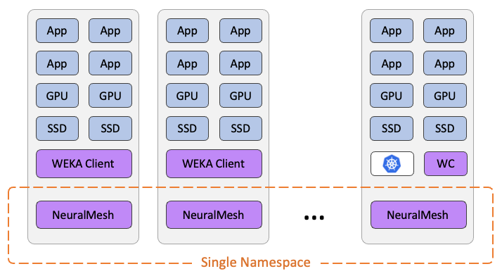

# NeuralMesh Axon overview

## Introduction

NeuralMesh Axon is a high-performance, Linux-native storage platform engineered for large-scale AI and agentic workloads requiring microsecond-level latency and exceptional IOPS throughput. The system exposes a POSIX-compliant parallel filesystem designed to support massive datasets while maintaining consistent, low-latency access across distributed GPU-accelerated environments.

A defining characteristic of NeuralMesh Axon is its co-located deployment model, in which storage and compute services run on the same physical infrastructure. Rather than relying on external storage appliances, NeuralMesh services operate directly on the CPUs and NVMe SSDs inside the GPU servers. This integrated design reduces hardware footprint and power consumption while improving availability, performance predictability, and data locality.

All NeuralMesh Axon components execute within isolated Linux containers. These containers operate with predefined CPU, memory, network, and NVMe resource assignments, ensuring clear separation between storage services and application workloads while enabling consistent performance across the fleet.

NeuralMesh Axon is optimized for extremely large-scale GPU server deployments, leveraging unused CPU cores and locally attached NVMe SSDs to deliver a cost-efficient, high-performance distributed storage layer.

Minimum deployment requirements include:

* **Server count:** 32 servers (minimum)
* **Data protection scheme:** 16 data + 4 parity failure domains (fixed configuration)

## Deployment model

NeuralMesh Axon uses a distributed, co-located architecture in which each server contributes both compute resources and local NVMe capacity to the storage cluster.

The following model is reflected in the architecture illustration:

* Application workloads run on the same servers that host NeuralMesh storage containers.
* CPU and SSD resources are shared between application and storage functions but remain isolated at the software level through containerization.
* Each server hosts a NeuralMesh backend service and NeuralMesh POSIX client.
* All servers participate in a single, globally shared namespace, enabling uniform access to data regardless of node boundary.
* Local SSDs on each server form the aggregate flash pool for the entire cluster.

This co-located model delivers high efficiency by ensuring data resides physically close to the GPU workloads that consume it, minimizing latency and eliminating the need for external storage fabrics.

<figure><figcaption>
NeuralMesh Axon deployments with compute and storage on the same infrastructure
</figcaption></figure>

## Solution component architecture

NeuralMesh Axon is structured as five integrated components. Each component contributes specific capabilities to the distributed storage system while maintaining a consistent operational model across both Linux-native and Kubernetes-orchestrated environments.

### 1. NeuralMesh Axon Core (required)

NeuralMesh Axon Core provides the foundational infrastructure required for all deployments. It includes three primary containerized functions deployed on each participating server:

* **Drives containers:** Manage and aggregate locally attached NVMe SSDs into the global distributed storage pool.
* **Compute containers:** Execute storage operations such as data placement, metadata handling, replication, rebuilds, and backend processing tasks.
* **Client / Frontend containers:** Provide the access interfaces used by applications.

Together, these containers implement the distributed filesystem that spans all servers into a single namespace, consistent with the architecture illustration.

### 2. NeuralMesh Axon Accelerate

NeuralMesh Axon Accelerate is an optional performance enhancement layer that creates a high-speed, low-latency data tier optimized for GPU-driven workloads. It combines local memory and flash storage to maximize efficiency.

Designed for co-located deployment, Accelerate leverages direct paths between GPU resources and the NeuralMesh backend containers on the same server.

Capabilities include:

* **RDMA-based data paths:** Establishes direct GPU-to-storage communication.
* **Low latency:** Delivers microsecond-level access latency.
* **Improved TTFT:** Enhances time-to-first-token (TTFT) performance.
* **Reduced variance:** Stabilizes high-throughput, small-block AI access patterns.

### 3. NeuralMesh Axon Deploy

NeuralMesh Axon Deploy provides automation and lifecycle management for Kubernetes environments. It ensures consistent orchestration across clusters.

NeuralMesh Axon Deploy includes the following capabilities:

* **WEKA Operator:** Deploys and manages NeuralMesh Custom Resource Definitions (CRDs).
* **Slurm environment support:** Manages installation and lifecycle within Slurm-based environments.
* **Automated provisioning:** Provisions Core containers across server fleets.
* **Standardized workflows:** Facilitates scaling, upgrading, and resource allocation.

### 4. NeuralMesh Axon Observe

NeuralMesh Axon Observe ensures comprehensive observability for the entire storage cluster. It supports operational oversight in large-scale, co-located deployments where application and storage roles coexist on each server.

Features include:

* **System-wide telemetry collection:** Aggregates data across the entire system.
* **Real-time performance dashboards:** Visualizes critical performance metrics instantly.
* **Health and event monitoring:** Tracks status across backends and access interfaces.
* **Operational insights:** Provides visibility into resource usage, and rebuild operations.

### 5. NeuralMesh Axon Enterprise Services

NeuralMesh Axon Enterprise Services provide the advanced functionality required for production environments. These capabilities apply uniformly across the single namespace.

Capabilities include:

* **Filesystem encryption:** Encrypts data at the filesystem level.
* **Enhanced data protection:** Provides advanced features to safeguard data.
* **Enterprise integration:** Includes compliance and audit capabilities.

## Architectural summary

NeuralMesh Axon unifies storage and compute resources into a single, scalable, high-performance system deployed directly on the same infrastructure as GPU applications. The combination of containerized isolation, local NVMe integration, and a single global namespace delivers a flexible and efficient architecture for modern AI workloads.

The component model: Core, Accelerate, Deploy, Observe, and Enterprise Services, provides the modular structure required for performance optimization, automation, observability, and enterprise readiness at scale.
