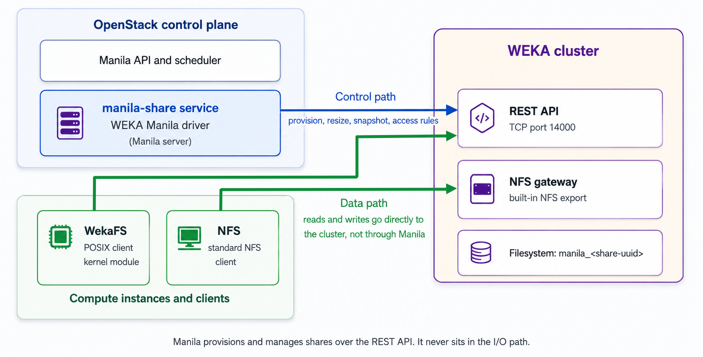

# WekaFS plug-in for OpenStack Manila

OpenStack Manila is the OpenStack Shared Filesystems service. It provisions and manages shared filesystems that compute instances and external clients mount over a network. Manila delegates storage operations to a backend share driver. The WekaFS plug-in makes a cluster available as a Manila backend.


The WekaFS plug-in is part of the upstream Manila tree starting with OpenStack Hibiscus (2026.2). It installs with Manila and requires no manual driver installation.


### How the plug-in works

The plug-in runs inside the Manila share service on the Manila server and communicates with the cluster through the REST API on TCP port 14000. Three design principles affect capacity, security, and operations planning:

* **One filesystem per share:** Every Manila share maps to one dedicated WEKA filesystem, named `<prefix><share-uuid>` (default prefix: `manila_`). This provides capacity isolation, independent snapshots, encryption, and tiering. A cluster supports up to 1,000 filesystems, and therefore up to 1,000 shares.
* **Serverless operation:** The plug-in sets `driver_handles_share_servers = false`. The cluster manages networking, and Manila creates no share-server virtual machines or Neutron ports. One backend definition serves the entire cluster.
* **Safe to retry:** Plug-in operations are idempotent. Repeating an interrupted operation does not create duplicate resources, which supports recovery after a Manila share-service restart.

<figure><figcaption>
Control path and data path
</figcaption></figure>

### Access protocols

The plug-in supports two access protocols. Choose based on performance needs and client constraints.

* **WekaFS (recommended):** Clients mount the filesystem directly using the WekaFS POSIX client and kernel module. This protocol provides the lowest latency, full POSIX semantics, native file locking, and native quota enforcement. It requires the WekaFS client on every server that mounts the share. The client version must match the cluster version.
* **NFS:** Standard NFS exports served by the cluster NFS gateway. NFS requires no additional client software and works on all Linux kernel versions. It has higher latency and partial POSIX semantics. Use NFS when you cannot install the WekaFS client, such as on servers running Linux kernel 6.17 or later.

### Access control model

Access control differs by protocol because each protocol authenticates clients differently.

#### NFS shares: IP-based rules

NFS clients are identified by their network address. Each `openstack share access create` call with `access_type=ip` creates a dedicated client group and NFS permission on the cluster, scoped to that filesystem, with the requested access level (`rw` or `ro`). Deleting the access rule removes the permission and the client group.

NFS shares support only `access_type=ip`. Rules of any other type enter the `error` state.

#### WekaFS shares: two layers of protection

* **Project isolation:** Each OpenStack project maps to a dedicated WEKA organization, and the plug-in creates the share filesystem inside that organization. Mount tokens are scoped to the organization, so a client authenticated against one project cannot mount a filesystem that belongs to another project. The cluster enforces this isolation independently of Manila.
* **Share-level access rules:** Two mechanisms control which clients mount a specific share:
  * **IP-based rules:** Each `openstack share access create` call with `access_type=ip` creates a client group entry scoped to the filesystem. Clients outside the allowed IP ranges cannot mount the share.
  * **Policy groups:** A storage administrator defines a policy group on the cluster and assigns it to a share through a Manila access rule. The policy group controls mount permissions at the cluster level.

#### User-based access rules

Manila supports `access_type=user` for backends where the backend issues a unique credential per access rule. WEKA users govern filesystem ownership and cluster administration, not per-share mount credentials, so a per-user access key has no WEKA equivalent. Rules with `access_type=user` enter the `error` state on both protocols. Use IP-based rules or policy groups instead.

#### Mount credential for WekaFS shares

The plug-in returns the project WekaFS mount credential in the `access_key` field of each WekaFS access rule, the same field the CephFS driver uses for cephx keys. List the share access rules to retrieve it. The credential does not appear in the export-location metadata.

| Access type  | WekaFS                   | NFS                      |
| ------------ | ------------------------ | ------------------------ |
| `ip`         | Supported                | Supported                |
| Policy group | Supported                | Not applicable           |
| `user`       | Rejected (`error` state) | Rejected (`error` state) |
| `cert`       | Not supported            | Not supported            |

### Considerations

* **Maximum 1,000 shares per cluster:** Each share uses one filesystem, and a cluster supports up to 1,000 filesystems.
* **Thick provisioning only:** The plug-in reserves the full capacity at creation time. The total capacity of all shares cannot exceed the available SSD capacity of the cluster. Over-subscription is not supported.
* **No QoS controls:** The cluster does not expose per-filesystem IOPS or bandwidth limits. Manila share types that set QoS extra-specs are not enforced.
* **Create share from snapshot copies data:** The WEKA API does not expose a direct clone-from-snapshot operation. The plug-in creates an empty destination filesystem and copies the snapshot contents over NFS. Copy time scales with the amount of data, and the operation requires `weka_nfs_server` to be set.
* **WekaFS client version must match the cluster:** Install the client from the cluster so the versions always match.
* **WekaFS kernel module on Linux kernel 6.17 or later:** The module does not compile. Pin the kernel to an earlier version or use NFS.

### Supported operations

| Operation                  | Notes                                                                       |
| -------------------------- | --------------------------------------------------------------------------- |
| Create share               | Creates a dedicated WEKA filesystem.                                        |
| Delete share               | Deletes the filesystem and all data. Safe to retry.                         |
| Extend share               | Increases share capacity.                                                   |
| Shrink share               | Fails safely if the share holds more data than the target size.             |
| Create snapshot            | Uses native WEKA snapshots.                                                 |
| Delete snapshot            | Safe to retry.                                                              |
| Revert to snapshot         | Restores the share in place.                                                |
| Create share from snapshot | Copies data over NFS. Requires `weka_nfs_server`.                           |
| Manage and unmanage        | Brings an existing WEKA filesystem under Manila management, or releases it. |
| Update access              | IP-based rules on both protocols. Policy groups on WekaFS.                  |

### What to do next

[configure-the-wekafs-plug-in-for-manila.md](configure-the-wekafs-plug-in-for-manila.md "mention")

### Related topics

[manage-manila-shares-on-a-weka-cluster.md](manage-manila-shares-on-a-weka-cluster.md "mention")

[wekafs-plug-in-configuration-options.md](wekafs-plug-in-configuration-options.md "mention")

[troubleshoot-the-wekafs-plug-in.md](troubleshoot-the-wekafs-plug-in.md "mention")
