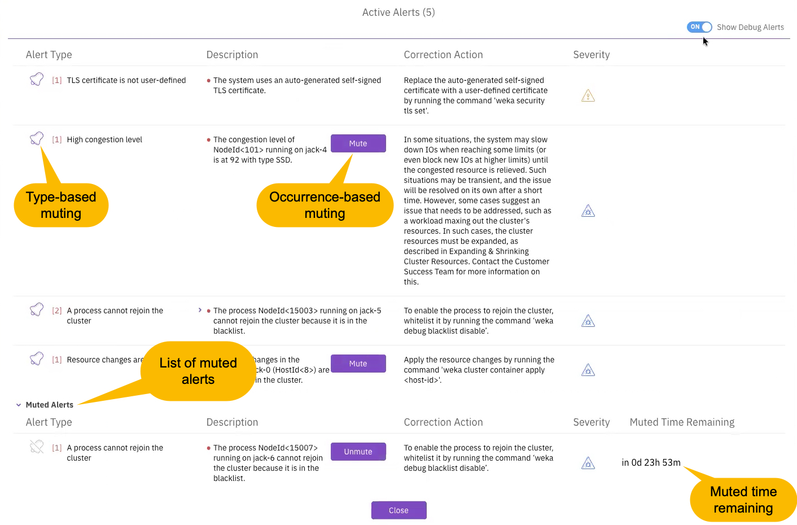

# Alerts

#### Alert components

Each alert contains specific details to assist in troubleshooting:

* **Alert Type:** A short identifier for the specific issue.
* **Description:** Detailed information about the detected problem.
* **Corrective Action:** Recommended steps to resolve the situation.
* **Severity:** The importance level of the alert. Options include DEBUG (lowest), INFO, WARNING, MINOR, MAJOR, and CRITICAL (highest).

To dismiss an alert, resolve its root cause. The system clears the alert automatically once the underlying problem no longer exists.

#### Related event information

Alerts often appear with a corresponding event. While the alert represents the ongoing state, the event records the exact time the issue began and provides additional context regarding the root cause. This relationship helps trace problems back to their origin for faster resolution.

#### Alert muting

Reduce background noise and focus on critical issues by moving alerts from the Active Alerts list to the Muted Alerts list. The system supports two primary levels of muting:

* **Type-based muting:** Suppresses every occurrence of a specific alert type across the entire cluster.
* **Occurrence-based muting:** Suppresses specific instances of an alert filtered by a particular process, container, or server.

#### Muting rules and behaviors

&#x20;The occurrence-based muting introduces specific constraints and capabilities:

* **Level exclusivity:** The system prevents mixing different muting levels for the same alert type. If an alert type is muted by process, you cannot add a container or server mute to that same type until you clear the existing mute.
* **Occurrence management:** You can add or remove specific processes, containers, or servers to an existing muted alert type using the `--add` or `--remove` flags in the CLI.
* **Duration stability:** Adding new alert occurrences to an existing mute does not change the remaining mute duration of the original entry.
* **Wildcard support:** When muting by server, you can use wildcards (such as `server-name*`) to mute all servers matching the pattern.
* **Mute list visibility:** The system maintains a list of all active mutes, including those for alert types that are not currently triggered.

