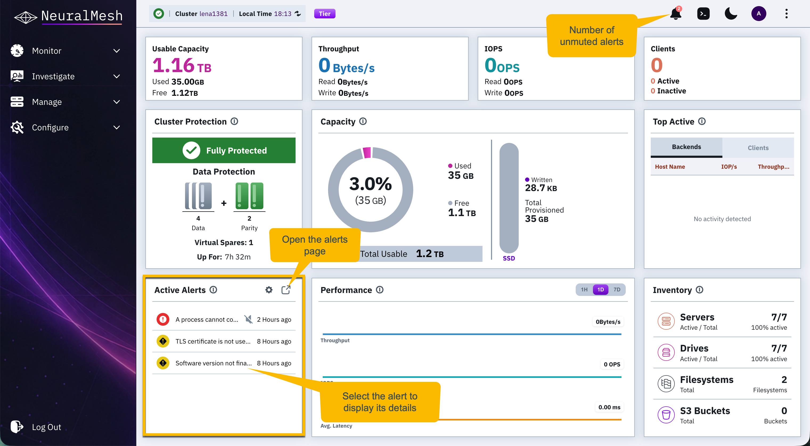
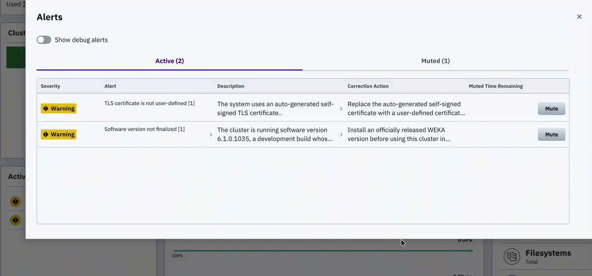
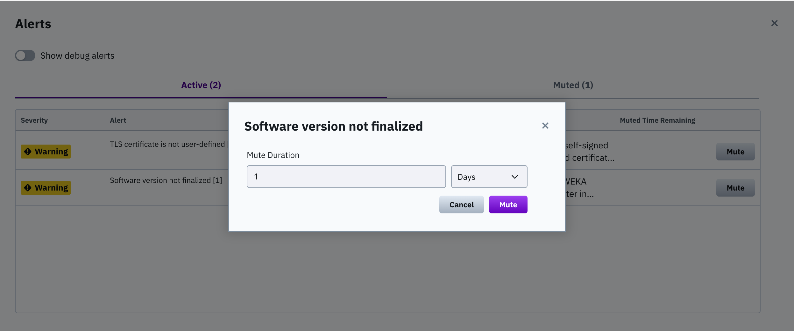

# Manage alerts using the GUI

## View alerts

The bell icon in the top bar displays the number of currently active alerts in the system. Selecting the icon opens the alerts pane on the system dashboard, which lists the names of all active alerts.

When there are no active alerts, the alerts pane is empty and the bell icon does not display a count. Muted alerts are excluded from both the alert count and the alerts pane.

**Procedure**

1. Select the bell icon at the top bar or select any alert in the Alerts pane.
2. In the Active Alerts table, review the alerts. Each alert provides description, corrective action, and severity. Muted alerts show also the muted time remaining.
3. To display alerts with the DEBUG severity level, turn on **Show Debug Alerts**.

## Mute an alert

Muting an alert removes it from the active alerts list for a specified duration.

**Procedure**

1. Select the bell icon at the top bar or select any alert in the Alerts pane.
2. Locate the alert in the Active Alerts table.
3. Select the **Mute** in the row of the general alert type.
4. Set the **Mute Duration** and then select **Mute**.

<figure><figcaption>
Mute alerts by type
</figcaption></figure>

## Unmute an alert

Manual unmuting reactivates an alert before its duration expires.

**Procedure**

1. Locate the alert in the Muted Alerts list.
2. Select **Unmute**.
