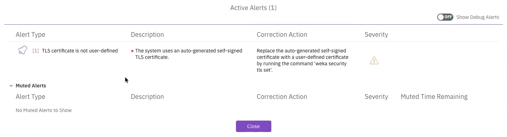
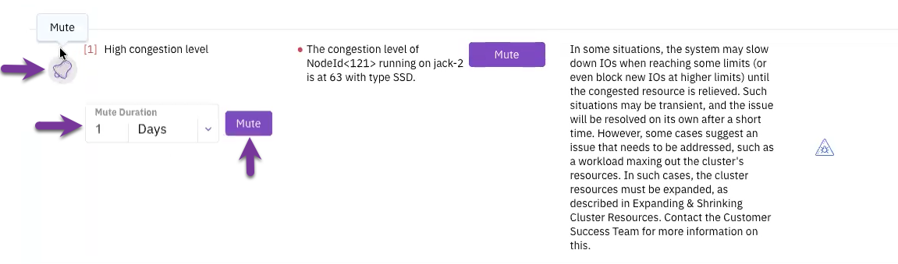
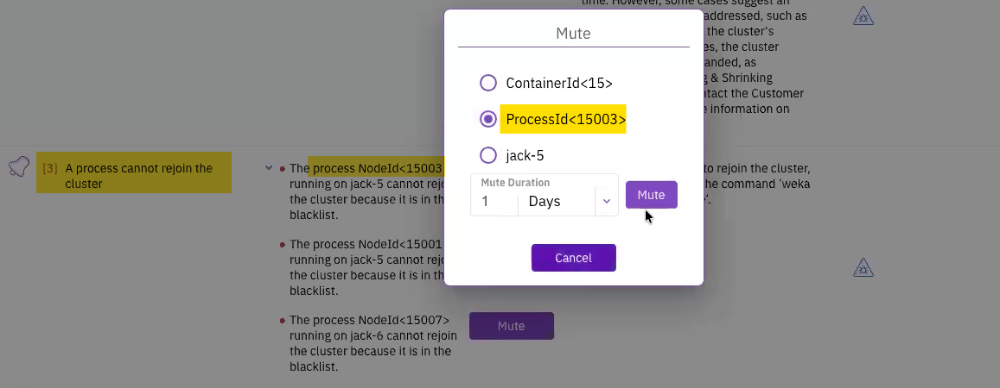
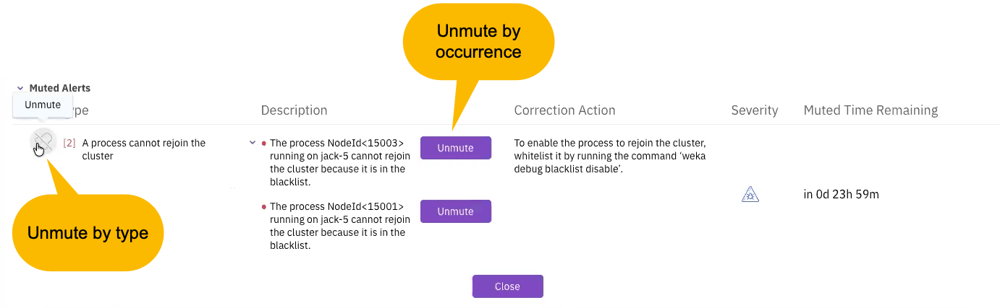

# Manage alerts using the GUI

Using the GUI, you can:

* [View alerts](alerts.md#view-alerts)
* [Mute an alert by type](alerts.md#mute-an-alert-by-type)
* [Mute an alert by occurrence](alerts.md#mute-an-alert-by-occurrence)
* [Unmute an alert](alerts.md#unmute-an-alert)

## View alerts

The bell icon in the top bar displays the number of currently active alerts in the system. Selecting the icon opens the alerts pane on the system dashboard, which lists the names of all active alerts.

When there are no active alerts, the alerts pane is empty and the bell icon does not display a count. Muted alerts are excluded from both the alert count and the alerts pane.

**Procedure**

1. Select the bell icon at the top bar or select any alert in the Alerts pane.
2. In the Active Alerts table, review the alerts. Each alert provides description, corrective action, and severity. Muted alerts show also the muted time remaining.
3. To display alerts with the DEBUG severity level, turn on **Show Debug Alerts**.

## Mute an alert by type

Muting an alert type removes it from the active alerts list for a specified duration.

**Procedure**

1. Select the bell icon at the top bar or select any alert in the Alerts pane.
2. Locate the alert in the Active Alerts table.
3. Select the **Mute** (bell) icon in the row of the general alert type.
4. Select the **Mute Duration** and select **Mute**.

<figure><figcaption>
Mute alerts by type
</figcaption></figure>

## Mute an alert by occurrence

Mute specific processes, containers, or servers to silence localized issues.

**Procedure**

1. Select the bell icon at the top bar or select any alert in the Alerts pane.
2. Locate the specific alert instance in the Active Alerts table.
3. Select **Mute** in the row of the specific occurrence.
4. In the Mute dialog, select the muting level: **Process**, **Container**, or **Server**.
5. Select the **Mute Duration** and select **Mute**.

<figure><figcaption>
Mute alerts by occurrence
</figcaption></figure>

## Unmute an alert

Manual unmuting reactivates an alert before its duration expires.

**Procedure**

1. Locate the alert in the Muted Alerts list.
2. To unmute by type: Select the **bell** icon next to the alert type.
3. To unmute by occurrence: Select **Unmute** next to the specific occurrence description.

