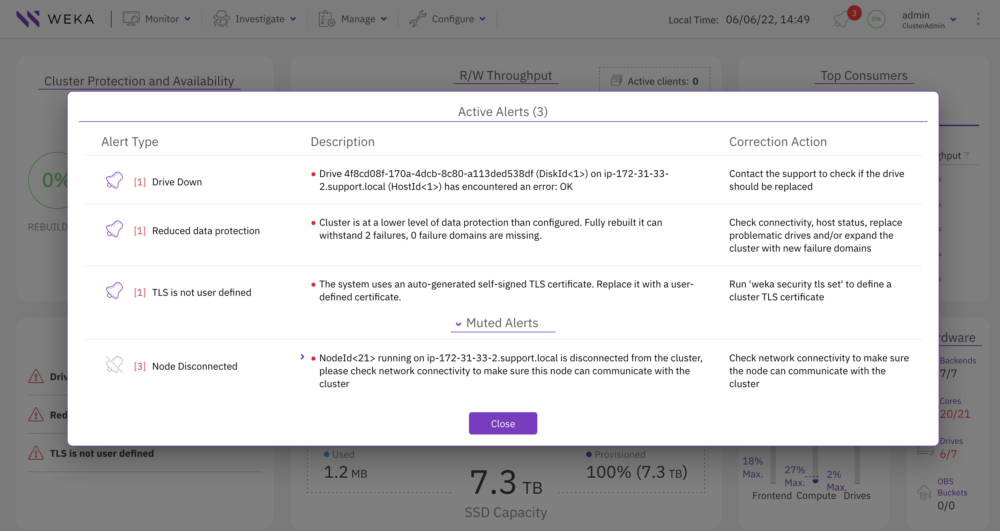
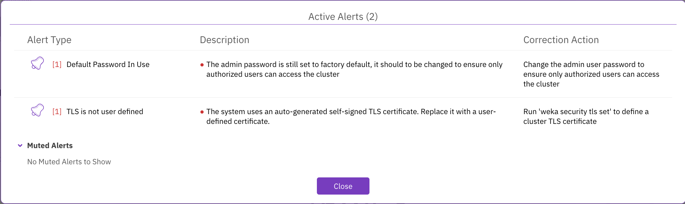
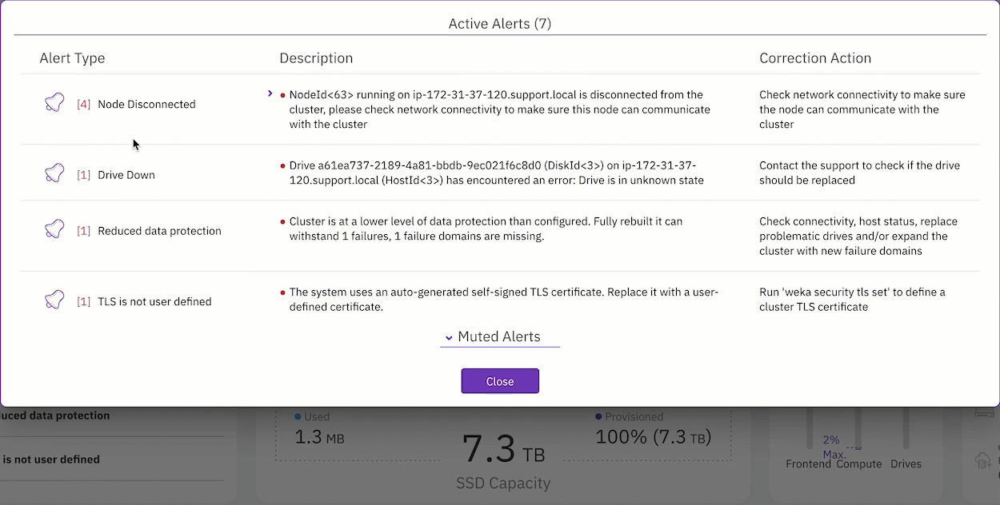
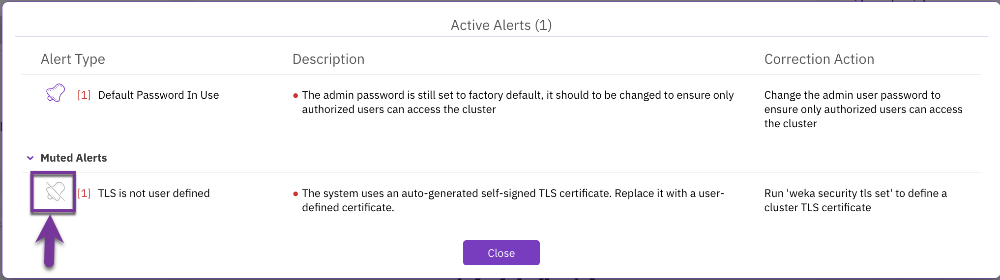

# Manage alerts using the GUI

Using the GUI, you can:

* [View alerts](alerts.md#view-alerts)
* [Mute alerts](alerts.md#mute-alerts)
* [Unmute alerts](alerts.md#unmute-alerts)

## View alerts

The bell icon on the top bar indicates the number of existing active alerts in the system. The alerts pane in the system dashboard also provides the name of the alerts.

If there are no alerts (active or muted), the alerts pane is empty, and the bell does not specify any number.

**Procedure**

1. To display the alert details, select the bell icon or select any alert.

## Mute alerts

If for any reason, it is not possible to resolve the root cause of an alert in a reasonable time and you want to hide it temporarily, you can mute the alert for a specified period. Then later, you can unmute the alert and resolve it.

The system automatically unmutes the muted alerts after the expiry period.

**Procedure**

1. On the Active Alerts page, select the bell next to the alert.
2. Set the mute duration (number and units) and select **Mute**.

The muted alert is moved to the Muted Alerts area. The total number of active alerts is deducted by the number of muted alerts.

## Unmute alerts

Muted alerts appear under the Muted Alerts area. You can unmute an alert manually before the expiry duration.

**Procedure**

1. Under the Muted Alerts area, select the bell of the alert you want to unmute.

