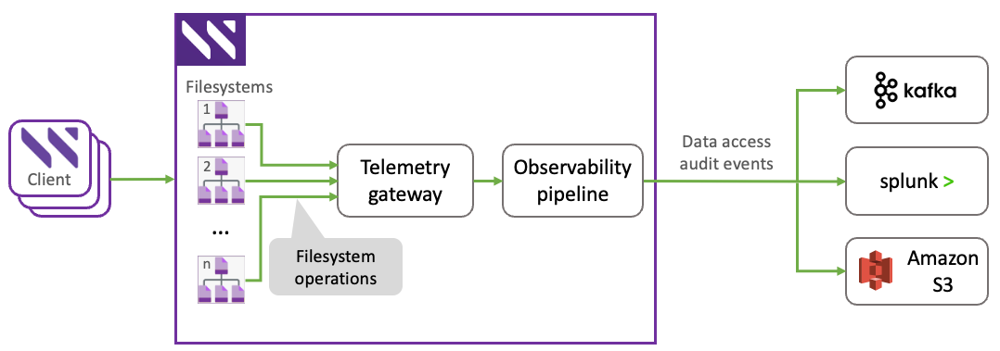

# Audit and forwarding management

## Overview

Effective data management requires a robust auditing and forwarding functionality to ensure data security, compliance with regulatory standards, and integration with advanced workflows. The auditing and forwarding functionality provides continuous event streams that record data access, modifications, and deletions, enabling organizations to monitor and respond to activity across their storage environment.

This auditing and forwarding functionality supports compliance with regulations such as HIPAA and GINA, aids in investigating security incidents, and ensures the integrity of stored data. Additionally, it facilitates operational insights by enabling analysis of user behavior, such as identifying which datasets are accessed, by whom, and at what times.

The audit event stream can also be used to trigger automated workflows. For example, an external system can monitor for specific operations in defined paths and initiate corresponding actions when conditions are met.

The auditing and forwarding functionality is designed to minimize any impact on client performance. To enable this, it is built upon a lightweight and scalable tracing system that monitors core filesystem events. To further reduce any impact on workloads, captured events are enriched asynchronously with contextual metadata, such as full file paths, to provide meaningful and actionable information.

By default, the auditing and forwarding functionality is disabled. It must first be enabled at the system level, a process that sets up the necessary infrastructure and system components required for auditing. Once active, the auditing and forwarding functionality is configurable on a per-filesystem basis, allowing fine-grained control over which datasets are monitored and which operations are of interest.

Audit events are forwarded using a modular, pluggable framework. This design enables flexible integration with a variety of external platforms, addressing diverse customer environments. The forwarding process is managed by the telemetry gateway (telemetry container) and an internal observability pipeline, which processes and routes audit events.

The auditing and forwarding functionality supports exporting audit events to the following platforms:

* Kafka
* Splunk
* Amazon S3

<figure><figcaption><p>Audit and forwarding architecture</p></figcaption></figure>

## Audit operation types

The auditing and forwarding functionality records various filesystem activities. The following operations apply to actions originating from POSIX and other protocols like NFS, SMB, and S3, as they all translate into standard filesystem events. For example, deleting a file over S3 generates the same `UNLINK` event as a POSIX `rm` command.

Operations specific to filesystem management, such as `MOUNT` and `UMOUNT`, are generally considered POSIX-only events.

The following table describes each audited operation type.

<table><thead><tr><th width="195.84765625">Operation</th><th width="568.82421875">Description</th></tr></thead><tbody><tr><td><code>FILEOPEN</code></td><td>Logs the initial opening of a file for read or write access. For performance reasons, subsequent opens are logged only when the access type changes or moves between system nodes.</td></tr><tr><td><code>ATOMIC_FILEOPEN</code></td><td>Logs the creation and opening of a file as a single, atomic action. Unlike <code>FILEOPEN</code>, this operation is always recorded.</td></tr><tr><td><code>LOOKUP</code></td><td>Logs the action of searching for a file or directory by its name.</td></tr><tr><td><code>READDIR</code></td><td>Logs the reading of a directory's contents, such as when a user lists its files.</td></tr><tr><td><code>MKNOD</code></td><td>Logs the creation of a file, special file, or directory.</td></tr><tr><td><code>RENAME</code></td><td>Logs the renaming of a file or directory.</td></tr><tr><td><code>RMDIR</code></td><td>Logs the removal of a directory.</td></tr><tr><td><code>GETATTR</code></td><td>Logs the retrieval of file attributes (metadata), such as access time or permissions.</td></tr><tr><td><code>SETATTR</code></td><td>Logs the modification of file attributes (metadata), such as changing permissions or file size.</td></tr><tr><td><code>READLINK</code></td><td>Logs the reading of a symbolic link's destination path.</td></tr><tr><td><code>UNLINK</code></td><td>Logs the deletion of a file, symbolic link, or hard link.</td></tr><tr><td><code>SYMLINK</code></td><td>Logs the creation of a symbolic link (a shortcut to another file or directory).</td></tr><tr><td><code>LINK</code></td><td>Logs the creation of a hard link (an additional name for an existing file).</td></tr><tr><td><code>SETXATTR</code></td><td>Logs the addition of a custom attribute (extended metadata) to a file.</td></tr><tr><td><code>LISTXATTR</code></td><td>Logs the listing of all custom attributes for a file.</td></tr><tr><td><code>GETXATTR</code></td><td>Logs the reading of a specific custom attribute from a file.</td></tr><tr><td><code>RMXATTR</code></td><td>Logs the removal of a custom attribute from a file.</td></tr><tr><td><code>MOUNT</code></td><td>Logs the mounting of a filesystem, making it accessible.</td></tr><tr><td><code>UMOUNT</code></td><td>Logs the unmounting of a filesystem, making it inaccessible.</td></tr><tr><td><code>HEARTBEAT</code></td><td>Sends a periodic message from each node to confirm that the audit system is operational.</td></tr><tr><td><code>LOST_AUDIT</code></td><td>Sends a special message to indicate that one or more audit events may have been lost, signaling a potential gap in the audit trail.</td></tr></tbody></table>

### Operation categories for configuration

When configuring audit logging, the system allows enabling auditing based on high-level operation categories. These categories serve as groupings of multiple specific audit operations. This simplifies the configuration process by allowing users to select broader classes of operations to monitor.

These categories are specified in the command-line and configuration interfaces to control the scope of audit logging efficiently.

<table><thead><tr><th width="299.78125">Category (configurable operation type)</th><th>Included audit operations</th></tr></thead><tbody><tr><td><code>open</code></td><td><code>FILEOPEN</code>, <code>ATOMIC_FILEOPEN</code></td></tr><tr><td><code>create</code></td><td><code>MKNOD</code>, <code>SYMLINK</code>, <code>LINK</code>, <code>SETATTR</code>, <code>ATOMIC_FILEOPEN</code></td></tr><tr><td><code>read</code></td><td><code>READDIR</code></td></tr><tr><td><code>modify</code></td><td><code>SETATTR</code>, <code>SETXATTR</code>, <code>RMXATTR</code></td></tr><tr><td><code>delete</code></td><td><code>UNLINK</code>, <code>RMDIR</code></td></tr><tr><td><code>rename</code></td><td><code>RENAME</code></td></tr><tr><td><code>session_management</code></td><td><code>MOUNT</code>, <code>UMOUNT</code>, <code>HEARTBEAT</code>, <code>LOST_AUDIT</code></td></tr></tbody></table>

## Audit message format

Each audit event sent to an external system is structured in a consistent message format containing fields that provide detailed information about the audited operation. The audit message can contain the following fields:

<table><thead><tr><th width="176.890625">Field</th><th>Description</th></tr></thead><tbody><tr><td><code>category</code></td><td>The management category of the audited operation.</td></tr><tr><td><code>recordType</code></td><td>The type of record. For audit events, this is always <code>AUDIT</code>.</td></tr><tr><td><code>recordId</code></td><td>A unique identifier for the specific audit record.</td></tr><tr><td><code>recordVersion</code></td><td>The version number of the audit message format.</td></tr><tr><td><code>operation</code></td><td>The type of filesystem operation that was performed (for example, <code>FILEOPEN</code>, <code>SETATTR</code>).</td></tr><tr><td><code>timestamp</code></td><td>The date and time when the operation occurred.</td></tr><tr><td><code>clusterGuid</code></td><td>The unique identifier of the cluster.</td></tr><tr><td><code>clusterName</code></td><td>The name of the cluster where the event occurred.</td></tr><tr><td><code>clientIp</code></td><td>The IP address of the client machine that initiated the operation.</td></tr><tr><td><code>clientHostname</code></td><td>The hostname of the client machine that initiated the operation.</td></tr><tr><td><code>uid</code></td><td>The user ID (UID) of the user who performed the operation.</td></tr><tr><td><code>gid</code></td><td>The group ID (GID) of the user who performed the operation.</td></tr><tr><td><code>fsId</code></td><td>The unique identifier for the filesystem where the operation occurred.</td></tr><tr><td><code>fsName</code></td><td>The name of the filesystem where the operation occurred.</td></tr><tr><td><code>snapshotId</code></td><td>The ID of the snapshot related to the transaction. An ID of <code>0</code> indicates the live filesystem.</td></tr><tr><td><code>snapshotName</code></td><td>The name of the snapshot related to the transaction.</td></tr><tr><td><code>inodeId</code></td><td>The unique inode identifier for the file or directory involved in the operation.</td></tr><tr><td><code>parentinodeID</code></td><td>The unique inode identifier of the parent directory.</td></tr><tr><td><code>fullPath</code></td><td>The complete path used to identify the object in the filesystem.</td></tr><tr><td><code>errorCode</code></td><td>The status code of the operation. A value of <code>0</code> indicates success.</td></tr><tr><td><code>targetFullPath</code></td><td>For operations such as <code>RENAME</code> or <code>SYMLINK</code>, this is the destination path of the object.</td></tr><tr><td><code>feOpId</code></td><td>The operation ID from the front-end container.</td></tr><tr><td><code>requestedAccess</code></td><td>The type of access requested during an open operation, such as <code>read</code> or <code>write</code>.</td></tr><tr><td><code>timeSent</code></td><td>The timestamp of when the audit message was sent from the telemetry gateway.</td></tr><tr><td><code>wekaServer</code></td><td>The hostname of the server that serviced the audit event.</td></tr><tr><td><code>key</code></td><td>The key of the extended attribute involved in an <code>xattr</code> operation.</td></tr><tr><td><code>modeBits</code></td><td>The new POSIX mode bits of a file or directory after a permission change operation.</td></tr><tr><td><code>outageStart</code></td><td>For <code>LOST_AUDIT</code> events, an estimate of when the audit message outage started.</td></tr><tr><td><code>outageEnd</code></td><td>For <code>LOST_AUDIT</code> events, an estimate of when the audit message outage ended.</td></tr></tbody></table>

<details>

<summary>Audit message example</summary>

```
{
  "header": {
    "clusterId": "0",
    "recordType": "AUDIT",
    "recordVersion": "1",
    "recordId": 8,
    "timestamp": "2024-02-08T14:06:46.413235500Z"
  },
  "auditInfo": {
    "operation": "FILEOPEN",
    "clientHostname": "0",
    "clientIp": "0",
    "uid": "4294967295",
    "ouid": "0",
    "ogid": "0",
    "gid": "4294967295",
    "fsId": "0",
    "fsName": "0",
    "snapshotId": "1",
    "snapshotName": "1",
    "inodeId": "5478414575613706240",
    "fullPath": "0",
    "targetInodeId": "0",
    "targetFullPath": "0",
    "errorCode": "SUCCESS",
    "feOpId": "5919",
    "nodeId": "1",
    "parentInodeId": "63447005790208",
    "parentInodeSnapViewId": "1"
  },
  "wekaServerInfo": {
      "wekaServerOrigin": "lf-0",
      "source_type": "file",
      "timeSent": "2024-02-08T14:06:46.4132355Z"
  }
}
```

</details>
