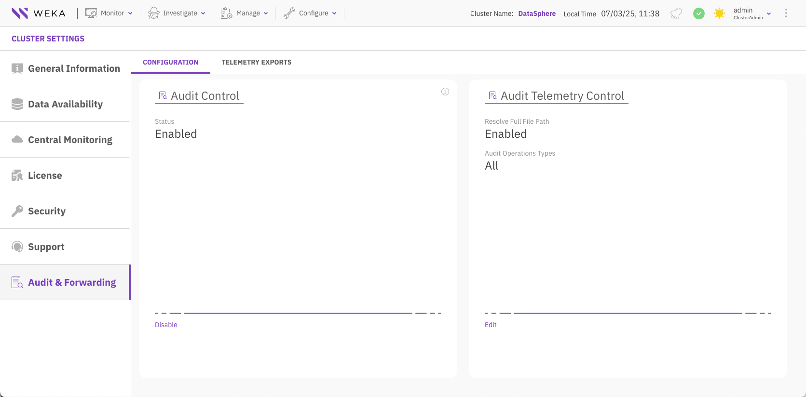
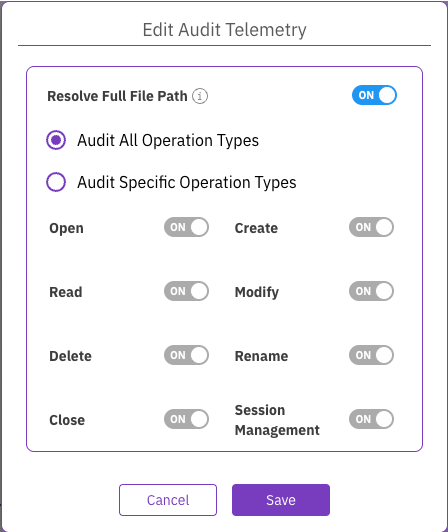
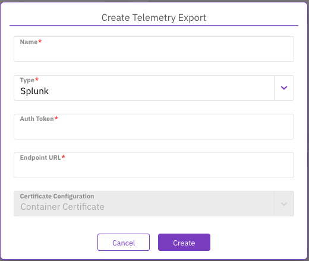
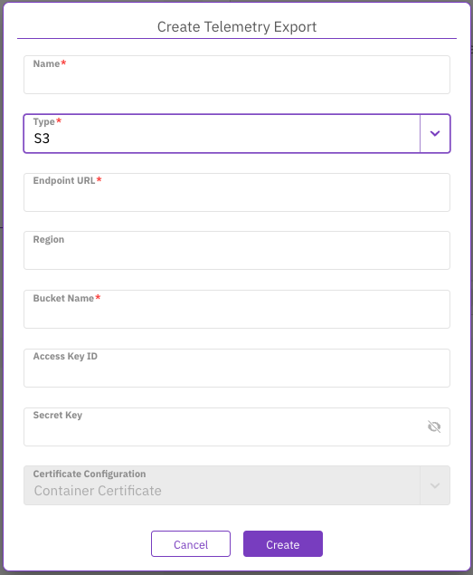
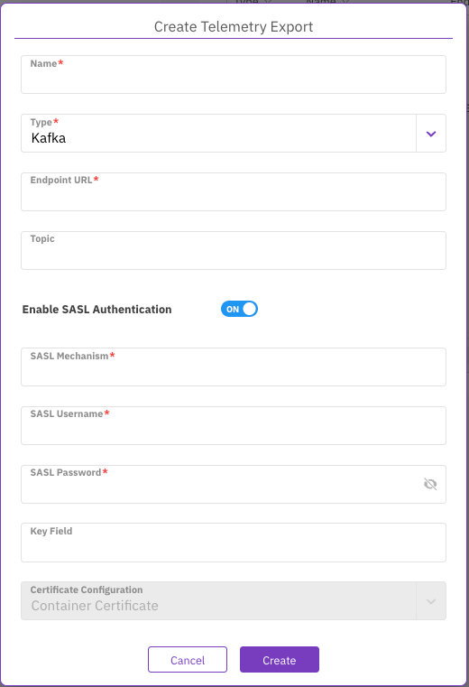

# Manage audit and forwarding using the GUI

The audit and forwarding functionality allows administrators to monitor and export system-level file operations for security, compliance, and operational insight. Using the GUI, you can enable or disable auditing, configure which types of operations to monitor, and manage the export of telemetry data to supported external systems like Splunk, Amazon S3, and Kafka.

## Configure global audit and forwarding settings

You can configure the global audit policy for the cluster. These settings define the default behavior for auditing across all filesystems.

**Before you begin**

The auditing functionality is disabled by default. Enabling it at the cluster level is the first step in the configuration process. This action activates the necessary telemetry containers (gateways) on the backend servers, preparing the system to forward audit events. Once auditing is enabled cluster-wide, you can configure it for individual filesystems.

To enable:

```
weka audit cluster enable
```

**Procedure**

1. From the top menu, select **Configure > Cluster Settings**.
2. From the left-hand menu, select **Audit & Forwarding**.\
   The **Configuration** tab is displayed.

<figure><figcaption><p>Audit and Forwarding: Configuration tab</p></figcaption></figure>

### Disable audit control

If the audit and forwarding functionality is not required, you can disable it at the cluster level to stop all audit logging.


**Important:**

Disabling this functionality from the GUI removes the Audit & Forwarding page. After it is disabled, you can only re-enable it by running the `weka audit cluster enable` CLI command.


**Before you begin**

* Navigate to the audit configuration page by selecting **Configure > Cluster Settings** from the top menu, and then selecting **Audit & Forwarding**.

**Procedure**

1. From the Configuration tab, locate the Audit Control widget.
2. Select **Disable** to deactivate the auditing functionality.
3. Confirm the action when prompted.

The audit functionality is disabled across the cluster, and the Audit & Forwarding page is no longer visible in the GUI.

### Edit audit telemetry operation types

Define the global default for which categories of filesystem operations are audited. This policy applies to all filesystems by default, but you can override it with a more specific policy at the individual filesystem level.

**Before you begin**

* Navigate to the audit configuration page by selecting **Configure > Cluster Settings** from the top menu, and then selecting **Audit & Forwarding**.

**Procedure**

1. In the Audit Telemetry Control widget, select **Edit**.
2. In the **Edit Audit Telemetry** dialog, configure the settings:
   * **Resolve Full File Path**: Controls the asynchronous process that adds full file paths to audit events. Including full paths provides valuable context but may introduce a performance impact, while disabling it can increase event throughput.
   * **Audit All Operation Types**: Select this to audit every category of operation.
   * **Audit Specific Operation Types**: Select this to choose which categories of operations to audit. Turn on the toggles for the specific categories you want to monitor.
3. Select **Save**.

<figure><figcaption></figcaption></figure>

**Related topic**

[#audit-operation-types](./#audit-operation-types "mention")

## View and create telemetry exports

To forward audit data, you must configure one or more telemetry export destinations. The **Telemetry Exports** tab displays a list of all configured destinations and allows you to create new ones.

The list of telemetry exports provides the following information:

* **Type**: The type of the external system (for example, Kafka, S3, or Splunk).
* **Name**: The user-defined name for the export configuration.
* **Endpoint URL**: The destination URL for the external system.
* **Enabled**: The status of the export (enabled or disabled).

To add a new destination, select **+ Create**.

<figure><figcaption><p>Audit and Forwarding: Telemetry Exports tab</p></figcaption></figure>

### Create telemetry export to Splunk

Use this procedure to configure the export of audit events to a Splunk HTTP Event Collector (HEC) endpoint. This enables centralized log analysis, real-time monitoring, and alerting using Splunk’s advanced search and visualization capabilities.

**Procedure**

1. From the **Telemetry Exports** tab, select **+ Create**.
2. In the **Create Telemetry Export** dialog, from the Type list, select **S3.**
3. Provide the required information:
   * **Name:** A unique name for the Splunk export configuration.
   * **Auth Token:** The authentication token for the Splunk HTTP Event Collector (HEC).
   * **Endpoint URL:** The URL of the Splunk HEC endpoint.
   * **Certificate Configuration:** The certificate to use for the connection. Select **Container Certificate** to use the default system certificate.
4. Select **Create**.

<figure><figcaption></figcaption></figure>

### Create telemetry export to Amazon S3

Use this procedure to configure the export of audit events to an Amazon S3 bucket. This allows secure, persistent storage of audit logs for long-term retention, compliance auditing, or offline analysis using AWS tools and services.

**Procedure**

1. From the **Telemetry Exports** tab, select **+ Create**.
2. In the **Create Telemetry Export** dialog, from the Type list, select **S3.**
3. Provide the required information:
   * **Name:** A unique name for the S3 export configuration.
   * **Endpoint URL:** The S3 endpoint URL. This can be an AWS S3 endpoint or an AWS-compliant object store endpoint.
   * **Region:** The AWS region of the S3 bucket.
   * **Bucket Name:** The name of the S3 bucket where audit events will be stored.
   * **Access Key ID:** The access key ID for authenticating with the S3 bucket.
   * **Secret Key:** The secret key for authenticating with the S3 bucket.
   * **Certificate Configuration:** The certificate to use for the connection. Select **Container Certificate** to use the default system certificate.
4. Select **Create**.

<figure><figcaption></figcaption></figure>

### Create telemetry export to Kafka

Use this procedure to configure the export of audit events to an Apache Kafka endpoint. This enables real-time streaming of file system audit data for integration with monitoring, analytics, or compliance systems that consume data from Kafka topics.

**Procedure**

1. From the **Telemetry Exports** tab, select **+ Create**.
2. In the **Create Telemetry Export** dialog, from the Type list, select **Kafka.**
3. Provide the required information:
   * **Name:** A unique name for the Kafka export configuration.
   * **Endpoint URL:** The URL of the Kafka endpoint.
   * **Topic:** The specific Kafka topic to which audit events will be sent.
   * **Enable SASL Authentication:** Turn on to use SASL for secure authentication with the Kafka cluster.
   * **SASL Mechanism:** The SASL mechanism to use for authentication.
   * **SASL Username:** The username for SASL authentication.
   * **SASL Password:** The password for SASL authentication.
   * **Key Field:** The field to use as the key for Kafka messages.
   * **Certificate Configuration:** The certificate to use for the connection. Select **Container Certificate** to use the default system certificate.
4. Select **Create**.

<figure><figcaption></figcaption></figure>
