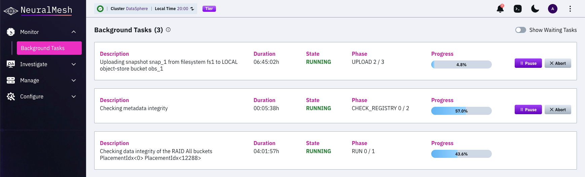

# Background tasks

Background tasks handle work that must not interfere with serving IO. Examples include checking metadata integrity, uploading and downloading snapshots, detaching an object store, reducing data, and applying a directory quota to existing data.

## Resource consumption

The WEKA system limits background tasks to 5% of the overall CPU. When the CPU is idle, background tasks can use more than the configured resources, and release them immediately when needed to serve IO.

## Concurrency limits

Two separate limits apply to background tasks:

**Queued tasks:** the number of tasks that can exist at the same time. A paused or aborted task still occupies a slot. When the queue is full, a new operation fails rather than waits.

**Running tasks:** the number of queued tasks that perform work at the same time. Additional tasks remain queued until a slot frees.

Both limits apply cluster-wide.

<table><thead><tr><th width="209.015625">Task group</th><th width="166.53125">Maximum queued</th><th>Maximum running</th></tr></thead><tbody><tr><td>Filesystem tasks</td><td>16</td><td>Set by the task-specific rules below</td></tr><tr><td>Data Services tasks</td><td>96</td><td>4 per task type</td></tr></tbody></table>

Directory quota tasks have a tighter queue limit of 32.

If an operation cannot start because the queue is full, it fails with the following message:

```
Operation cannot start because there are already 32 tasks running
```

Wait for a running task to finish, then retry.

### Task-specific rules

**Snapshot upload and download:**

* Only a single local upload can exist concurrently inside a filesystem.
* Only a single remote upload inside a filesystem can be done concurrently. Local and remote uploads can co-exist.
* Only a single upload from any filesystem can exist in the same object store bucket, to prevent uploads from slowing each other down.
* An object store snapshot download operation cannot run at the same time as another snapshot download or upload operation.

**Data reduction:**

* Only one data reduction or data defragmentation task runs in the cluster at a time. If either task exists, no new task of either type starts.
* The cluster starts these tasks automatically. You do not create them.

**Snapshot metadata prefetch:**

* When a snapshot is downloaded from the object store, the system automatically prefetches its metadata as the initial step.


Further restrictions exist between different tasks and between multiple tasks of the same type. When a background task does not run because of a restriction, the system provides a relevant message.


## Filesystem tasks

| Task name                   | Description                                                                                                                                   | Possible actions                                                       |
| --------------------------- | --------------------------------------------------------------------------------------------------------------------------------------------- | ---------------------------------------------------------------------- |
| OBS\_DETACH2                | Detaches an object store from a filesystem.                                                                                                   | Pause, Resume, Abort until the task reaches the CLEAR\_MANIFEST phase  |
| STOW\_UPLOAD                | Uploads a snapshot from a filesystem to an object store bucket.                                                                               | Pause, Resume, Abort                                                   |
| STOW\_DOWNLOAD\_FILESYSTEM  | Downloads a filesystem from a locator in an object store.                                                                                     | Pause, Resume                                                          |
| STOW\_DOWNLOAD\_SNAPSHOT    | Downloads a snapshot to a filesystem from a locator in an object store. Includes fetching the snapshot metadata and squashing the filesystem. | Pause, Resume                                                          |
| SNAPSHOT\_DELETE            | Deletes a snapshot of a filesystem.                                                                                                           | Pause, Resume, Abort only during the WAIT\_FOR\_ASYNC\_DELETIONS phase |
| SNAPSHOT\_REPLICATE         | Replicates a snapshot from a filesystem to a remote cluster.                                                                                  | Pause, Resume, Abort                                                   |
| SNAPSHOT\_REPLICA\_PREFETCH | Prefetches the data of a snapshot from a remote cluster.                                                                                      | Pause, Resume                                                          |
| FSCK                        | Checks metadata integrity.                                                                                                                    | Pause, Resume, Abort                                                   |
| DATA\_REDUCTION             | Reduces data.                                                                                                                                 | Pause, Resume, Abort                                                   |
| DATA\_DEFRAG                | Defragments data.                                                                                                                             | Pause, Resume, Abort                                                   |
| FILESYSTEM\_RECOMPRESS      | Rewrites the data of a filesystem to compress or decompress it.                                                                               | Pause, Resume, Abort                                                   |
| RAID\_SCANNER               | Checks the data integrity of the RAID.                                                                                                        | Pause, Resume, Abort                                                   |

## Data Services tasks

Data Services tasks require an active Data Services container in the cluster.

| Task name             | Description                                                                    | Possible actions     |
| --------------------- | ------------------------------------------------------------------------------ | -------------------- |
| QUOTA\_COLORING       | Applies or clears a directory quota on a directory that already contains data. | Pause, Resume, Abort |
| USER\_QUOTA\_COLORING | Applies a user or group quota to existing data in a filesystem.                | Pause, Resume, Abort |
| DELETE                | Deletes a directory in the background.                                         | Pause, Resume, Abort |
| S3\_LIFECYCLE         | Applies S3 lifecycle rules to a bucket.                                        | Pause, Resume, Abort |
| S3\_XATTR\_CONVERSION | Converts S3 metadata stored in extended attributes.                            | Pause, Resume, Abort |
| REPLICATION\_COPY     | Hydrates a snapshot of a filesystem from a remote cluster.                     | Pause, Resume, Abort |
| HYDRATE\_PATH         | Hydrates a file in a filesystem from a source cluster.                         | Pause, Resume, Abort |

## Monitor background tasks

List the running background tasks and their status:

```bash
weka cluster task
```

```bash
Task ID  Type            State    Phase         Progress  Description
57       QUOTA_COLORING  RUNNING  STAMPING 1/2  34%       Setting Directory Quota for fs1:/data/proj
58       FSCK            PAUSED   CHECK_REGISTRY 0/2  12%  Checking metadata integrity
```

<table><thead><tr><th width="161.3984375">Column</th><th>Description</th></tr></thead><tbody><tr><td>Task ID</td><td>Identifier of the task. Use it with the pause, resume, and abort commands.</td></tr><tr><td>Type</td><td>Task type, as listed in the tables above.</td></tr><tr><td>State</td><td>Current state of the task, such as RUNNING, PAUSED, PAUSING, ABORTING, or WAITING.</td></tr><tr><td>Phase</td><td>Current phase and the total number of phases. A task in the first phase has not started its main work.</td></tr><tr><td>Progress</td><td>Completion percentage of the current phase.</td></tr><tr><td>User Paused</td><td>Whether a user paused the task, as opposed to the system.</td></tr><tr><td>Description</td><td>The operation the task performs, including the filesystem and path where relevant.</td></tr><tr><td>Time</td><td>How long ago the task started.</td></tr></tbody></table>

Add `-v` to include the task UID and the throttle percentage.

A task that stays in its first phase with no progress is queued and waiting for a slot. It is not stuck.

## Control background tasks

Pause, resume, or abort a task by its ID:

```bash
weka cluster task pause <task-id>
weka cluster task resume <task-id>
weka cluster task abort <task-id>
```

You can pause and resume any background task. Abort is not available for every task type, and for some types it is available only during specific phases. See the Possible actions column in the tables above.


Aborting a task stops the operation before it completes. Work already performed is not rolled back, and the operation must be started again from the beginning.


## Directory quota tasks

Setting or clearing a directory quota on a directory that already contains data starts a QUOTA\_COLORING task. The task applies the quota to the existing contents of the directory.

A QUOTA\_COLORING task reports two phases:

<table><thead><tr><th width="170.9296875">Phase</th><th>Description</th></tr></thead><tbody><tr><td>PREPARE 0/2</td><td>The task is queued and waiting for a slot.</td></tr><tr><td>STAMPING 1/2</td><td>The task is applying the quota to the existing contents of the directory. Progress advances during this phase.</td></tr></tbody></table>

While the task runs, `weka fs quota list` reports the quota status as `ADDING`. The status changes to `ACTIVE` when the task completes.


The quota is not enforced while its status is `ADDING`. Reported usage rises as the task progresses and is accurate only once the status changes to `ACTIVE`. Creating hardlinks in the directory fails until the task completes.


The directory remains readable and writable throughout.

Setting a quota on an empty directory does not start a task. The quota applies immediately, because the system accounts for new data as it is written.


To increase the number of concurrent directory quota tasks, contact the Customer Success Team. The setting requires WEKA supervision.


## Manage background tasks using the GUI

Monitor active and pending background tasks from the GUI. Review each task's duration, state, phase, and progress.

<div data-with-frame="true"><figure><figcaption><p>Background Tasks</p></figcaption></figure></div>

**Procedure**

1. Select **Monitor** > **Background Tasks**.
2. Review active tasks and their status details.
3. Select **Pause** to pause a task. The button changes to **Resume**.
4. Select **Resume** to continue a paused task.
5. Select **Abort** to stop a supported task.
6. Enable **Show Waiting Tasks** to view pending tasks.


**Abort** supports selected tasks, including metadata integrity checks. It does not stop filesystem or snapshot downloads, filesystem squashing, or object-storage detachment. Delete the associated entity to stop those tasks.

