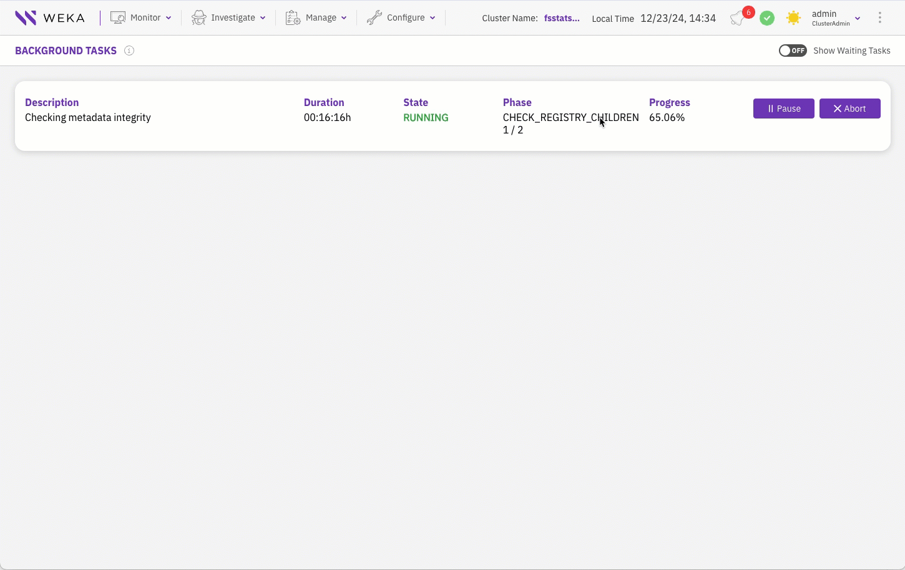

# Manage background tasks using the GUI

The GUI includes a **Background Tasks** page that displays both active and pending tasks, along with details such as their duration since initiation, state, phase, and progress percentage.

If other tasks have higher priority, you can pause and resume tasks as needed.

The **Abort** action is available for specific tasks, such as checking metadata integrity. However, it is not applicable to tasks like downloading a filesystem or snapshot, squashing a filesystem, or detaching object storage. To terminate these tasks, delete the associated entity.

<figure><figcaption>
Background Tasks
</figcaption></figure>

**Procedure:**

1. From the **Monitor** tab, select **Background Tasks**.
2. To pause a task, select **Pause** (the button will toggle to **Resume**).
3. To resume a paused task, select **Resume**.
4. To abort a task, select **Abort**.
5. To view waiting tasks (pending), toggle the **Show Waiting Tasks** switch.
