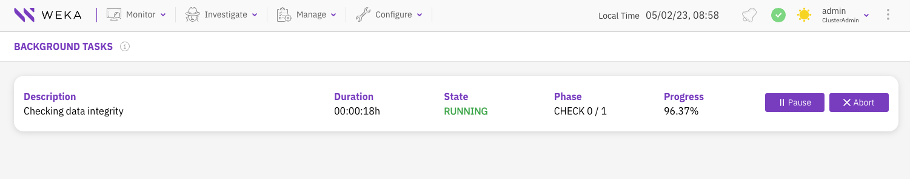

# Manage background tasks using the GUI

The GUI provides a background tasks page displaying the active background tasks and their details, including the duration since they last started, state, phase, and progress percentage.&#x20;

If other background tasks or activities are of higher priority, you can pause and resume the background task later.

The abort action is applicable for some of the tasks, such as checking metadata integrity. For other tasks, such as downloading a filesystem or a snapshot, squashing a filesystem, and detaching object storage from a filesystem, the abort action is not applicable. To abort such a task, delete its entity.

<figure><figcaption>
Background Tasks
</figcaption></figure>

**Procedure:**

1. From Monitor, select **Background Tasks**.
2. To pause a task, select **Pause**. (The button toggles to **Resume**.)
3. To resume a paused task, select **Resume**.
4. To abort a task, select **Abort**.
