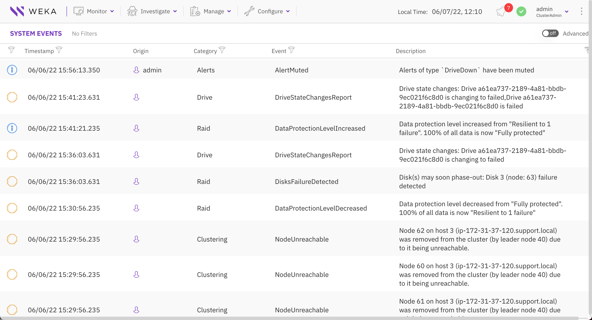

# Events

WEKA events provide essential information about the WEKA cluster and customer environment. Cluster and customer operations and changes in the background can trigger these timestamped events. They may convey information, signal a system issue, or report a previously resolved problem. The system stores a maximum of 300,000 notifications in the events folder.

The WEKA cluster sends all events to a predefined central monitoring system, WEKA Home or Local WEKA Home. The GUI displays the events retrieved from the central monitoring system.

### Events triggered by alerts

In the monitoring and alerting system, alerts are closely tied to specific events, providing valuable insights into problematic states' occurrence and underlying causes. The events associated with alerts encompass a comprehensive log, including triggered, cleared, and continuous alerts.

The following processes ensure systematic and efficient handling of events triggered by alerts:

* Alerts that are active for at least 1 minute generate an `AlertTriggered` event. Once they are inactive for at least 1 minute, an `AlertCleared` event is generated with details, including the alert type, title, and description.
* Every 30 minutes, all active alerts are logged as part of an `AlertContinuousEvent` with details, including the alert type and the entry count.
* These events are internal with severity level DEBUG and category ALERTS.

**Related topic**

[the-wekaio-support-cloud](../../monitor-the-weka-cluster/the-wekaio-support-cloud/ "mention")
