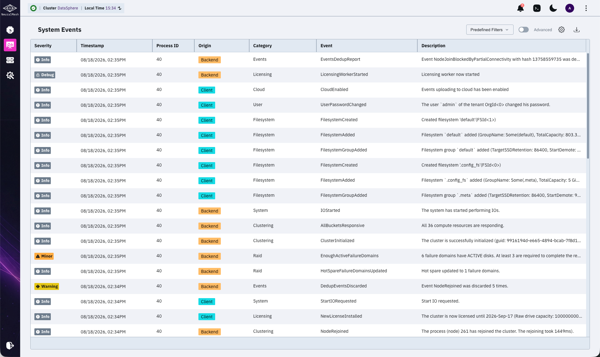
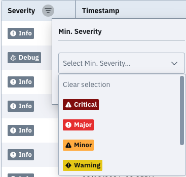
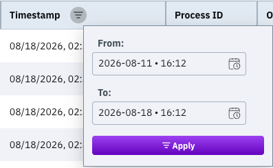
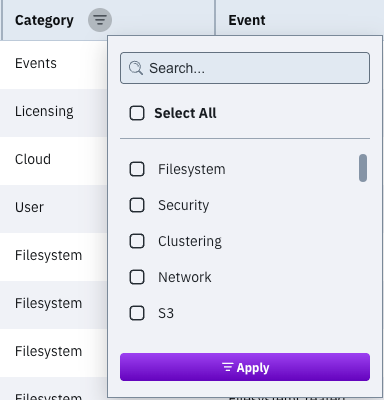
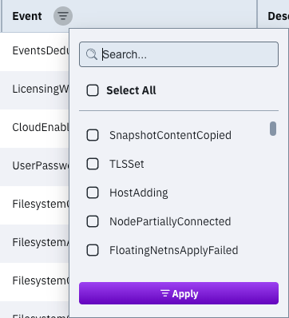
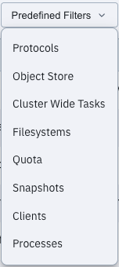

# Manage events using the GUI

## View events

View system events to investigate issues.

The **System Events** page shows:

* **Severity**: The event severity. Values range from Info to Critical.
* **Timestamp**: The event date and time. Use the top bar to switch between local and system time.
* **Process ID:** The identifier of the process that created the event.
* **Origin**: The event source, such as a user, backend, or cluster. Filesystem events show the creating username.
* **Category**: The event category. Options include Alerts, Cloud, Clustering, Config, Custom, Drive, Events, Filesystem, InterfaceGroup, Kms, Licensing, NFS, Network, Node, ObjectStorage, Org, Raid, Resources, S3, Security, Smb, System, Traces, Upgrade, and User.
* **Name**: The event name.
* **Description**: Event details.

You can select the **Advanced** switch to display internal events. This option is helpful for experts investigating internal issues.

**Procedure**

1. From the menu, select **Investigate > Events**.

## Filter events

Filter events by severity, timestamp, category, or event name. Combine categories and event names to narrow results.

### Filter by minimum severity

1. Hover the **Severity** heading and select the filter icon.
2. Select the minimum severity. Selecting **Major** displays Major and Critical events.
3. Select **Apply**.

### Filter by time period

1. Hover the **Timestamp** heading and select the filter icon.
2. In **From**, select the period start timestamp.
3. In **To**, select the period end timestamp or select **Now**.
4. Select **OK**.
5. Select **Apply**.

### Filter by category

1. Hover the **Category** heading and select the filter icon.
2. In **Filter Categories**, select one or more categories.
3. Select **Apply**.

### Filter by event name

1. Hover the **Event** heading and select the filter icon.
2. In **Events Filter**, select one or more event names.
3. Select **Filter**.

## Display events by a predefined template

Use predefined templates to filter related event names. For example, the **Processes** template displays events related to processes.

Available templates cover protocols, object storage, cluster tasks, filesystems, quota, snapshots, clients, and processes.

**Procedure**

1. On **Events**, select **Predefined Templates**.
2. Select a template. The event list updates with matching events.

<figure><figcaption>
Predefined filters
</figcaption></figure>

**Related topic**

[#switch-the-display-time](../../getting-started-with-weka/manage-the-system-using-weka-gui.md#switch-the-display-time "mention")
