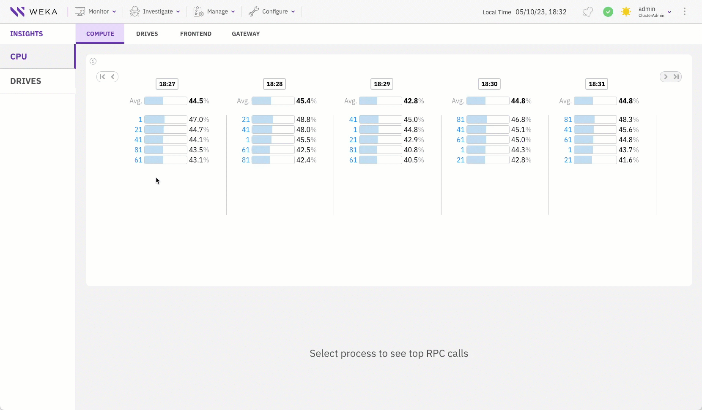
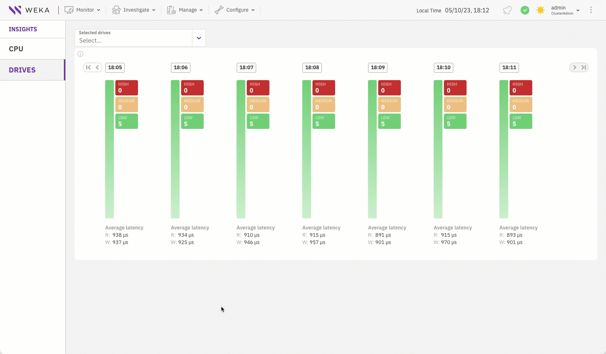

# Insights

Insights provide the top processes usage, remote procedure calls (RPCs), and drives load and latency. The insights help you make informed decisions about future actions to resolve bottlenecks and improve performance. The WEKA system collects insights data from the CPUs and drives.

To display insights, select **Investigate > Insights**.

## CPU insight

CPU insight provides a quick usage overview of the Compute, Drives, and Frontend processes, which run on stateless clients or backends as a gateway.

CPU insight shows the average load in the last 15 minutes and the top 10 processes with the highest CPU usage every minute.

You can select up to three processes to show the top three RPCs that kept the process busy. You can compare the RPCs between the selected processes.

<figure><figcaption>
Top RPC calls of the compute cores
</figcaption></figure>

### Display the top RPC calls of the compute cores

1. From the left pane, select **CPU**.
2. Select the **COMPUTE** tab.
3. Select the compute cores you want to compare (maximum three).&#x20;

### Display the top RPC calls of the drive cores

1. From the left pane, select **CPU**.
2. Select the **DRIVES** tab.
3. Select the drive cores you want to compare (maximum three).

### Display the top RPC calls of the frontend cores

1. From the left pane, select **CPU**.
2. Select the **FRONTEND** tab
3. Select the frontend cores you want to compare (maximum three).

### Display the top RPC calls of the protocol gateways

1. From the left pane, select **CPU**.
2. Select the **GATEWAY** tab
3. Select the gateway cores you want to compare (maximum three).

## Drive insight

Drives insight provides a load overview of the drives in the cluster. The view of the drives is divided into three groups based on the load level. It shows the drives information when reaching a medium (load level between 128 and 254) and high load (load level 255).

You can compare each drive's latency with the average and other drives.

<figure><figcaption>
Top drives' latency
</figcaption></figure>

### Display the top drives' latency

1. From the left pane, select **DRIVES**.
2. Select the backend drives you want to compare (maximum three).
