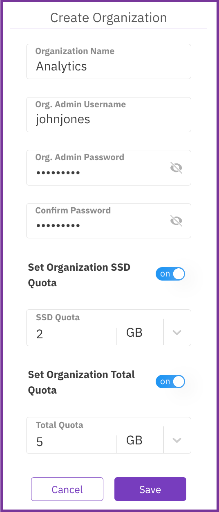
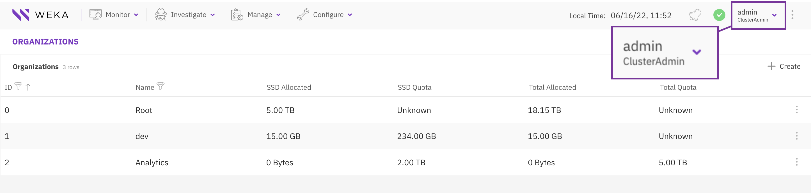
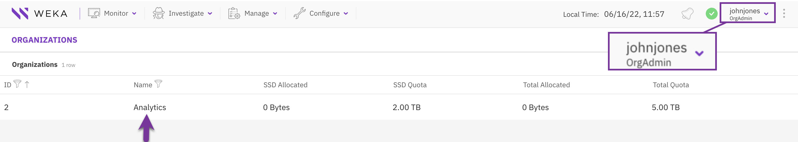
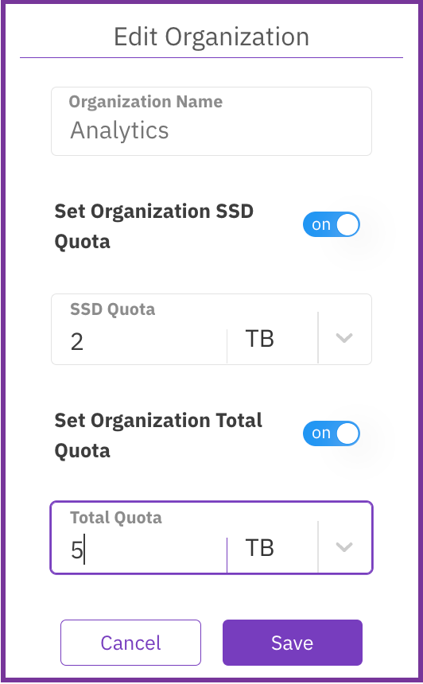

# Manage organizations using the GUI

Using the GUI, you can:

* [Create an organization](organizations.md#create-an-organization)
* [View organizations](organizations.md#view-organizations)
* [Edit an organization](organizations.md#edit-an-organization)
* [Delete an organization](organizations.md#delete-an-organization)

## Create an organization

Only a Cluster Admin can create an organization.

**Procedure**

1. From the menu, select **Configure > Organizations**.
2. On the Organizations page, select **+Create**.
3. In the Create Organization dialog, set the following properties:
   * **Organization Name:** A name for the organization.
   * **Org. Admin Username**: The user with an Organization Admin role created for the organization.
   * **Org. Admin Password**: The password of the user with an Organization Admin role created for the organization.
   * **Confirm Password**: The same password as set in the Org. Admin Password.
   * **Set Organization SSD Quota**: Turn on the switch and set the SSD capacity limitation for the organization.
   * **Set Organization Total Quota**: Turn on the switch and set the total capacity limitation for the organization (SSD and object store bucket).
4. Select **Save**.

## View organizations

As a Cluster Admin, you can view all organizations in the cluster.

As an Organization Admin, you can view only the organization you are assigned to.

**Procedure**

1. From the menu, select **Configure > Organizations**.

## Edit an organization

You can modify an organization's SSD and total quota to meet the capacity demand changes.

**Procedure**

1. From the menu, select **Configure > Organizations**.
2. On the Organizations tab, select the three dots of the organization to edit and select **Edit**.

3\. In the Edit Organization dialog, set the following properties:

* **Set Organization SSD Quota**: Turn on the switch and set the SSD capacity limitation for the organization.
* **Set Organization Total Quota**: Turn on the switch and set the total capacity limitation for the organization (SSD and object store bucket).

4\. Select **Save**.

## Delete an organization

If an organization is no longer required, you can remove it. You cannot remove the root organization.


Deleting an organization is irreversibl&#x65;**.** It removes all entities related to the organization, such as filesystems, object stores, and users.


**Procedure**

1. From the menu, select **Configure > Organizations**.
2. On the Organizations tab, select the three dots of the organization to edit and select **Remove**.

3\. In the confirmation message, select **Yes**.
