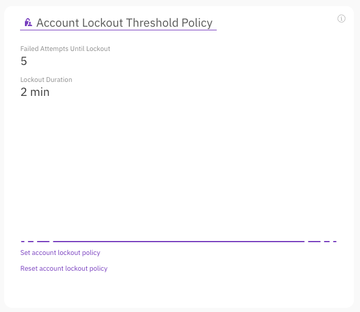
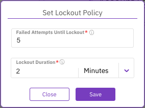

# Manage the account lockout threshold policy using GUI

Using the GUI, you can set the number of failed attempts until the account is locked and the lockout duration. You can also reset the account lockout threshold policy properties to the default values.

<figure><figcaption>
Account Lockout Threshold policy
</figcaption></figure>

**Procedure**

1. From the menu, select **Configure > Cluster Settings**.
2. From the left pane, select **Security**.
3. In the Account Lockout Threshold Policy section, select **Set Account Lockout Policy**.
4. In the Set Lockout Policy dialog, do the following:
   * **Failed Attempts Until Lockout:** Set the number of sign-in attempts to lockout between 2 (minimum) to 50 (maximum).
   * **Lockout Duration:** Set the lockout duration between 30 secs (minimum) to 60 minutes (maximum).
5. Select **Save**.

<figure><figcaption>
Set Lockout Policy
</figcaption></figure>

6. To reset the account lockout threshold policy properties to the default values, select **Reset account lockout policy**. In the confirmation message, select **Yes**.
