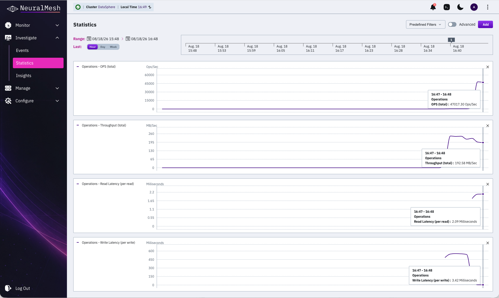

# Statistics

The system collects hundreds of statistics from the backend servers and the clients in the cluster. Statistics are grouped into categories, and each category holds the statistics measured for one part of the system. Select a category to see its statistics, and then select a statistic to display it as a chart on the **Statistics** page.

### Statistics categories

Basic charts cover the following categories:

* api statistics
* CPU
* Object Storage
* Operations
* Operations (Directory Quota Domain)
* Operations (driver)
* Operations (Filesystem)
* Operations (NFS)
* Operations (NFSw)
* Operations (S3)
* Operations (SLB of S3)
* Operations (Tenant)
* SSD

Beyond the basic charts, the **Advanced** view exposes a larger set of low-level charts intended for the Customer Success team. Use it when working with WEKA Support on a specific investigation.

### Chart resolution and time range

Each chart point represents the statistics averaged over one minute. This one-minute aggregation applies to every time range, including **Day** and **Week**, so a wider range shows more points rather than coarser ones.

By default, the page displays the last hour of operation. You can switch to the last day or the last week, or set a custom start and end time.

Real-time statistics are the exception. They are sampled at a one-second interval and are available from the CLI only.

### Statistics availability

The page shows the statistics of the backend servers and the clients that are currently part of the cluster. Statistics are not shown in the following cases:

* A backend server is removed from the cluster.
* A client is not connected to the cluster for longer than the retention period.

Statistics are retained for a configurable number of days, which is limited by the free disk space on each server. Set the retention period from the CLI.


The cluster does not retain long-term historical statistics. To monitor historical cluster data, use [Observe](../../monitor-the-weka-cluster/neuralmesh-observe-overview/).

