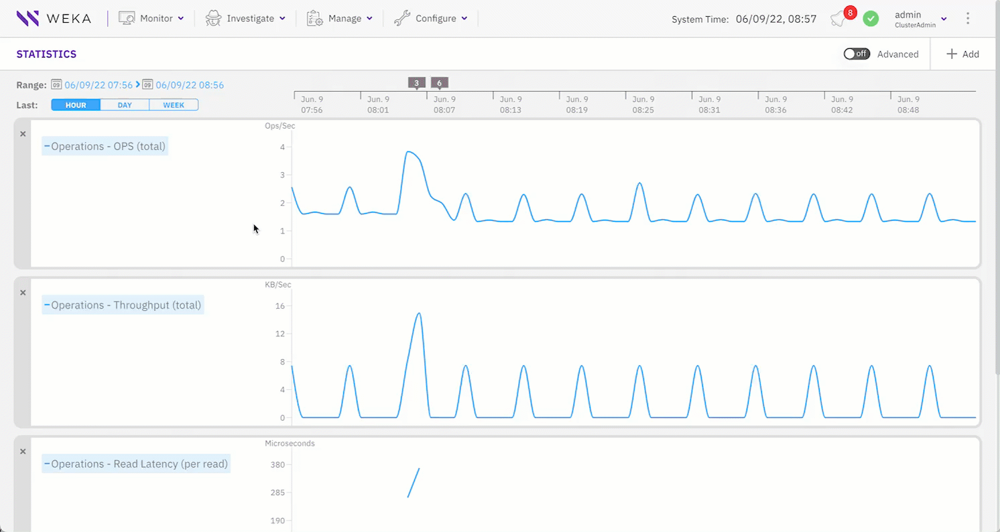

# Statistics

Explore hundreds of performance statistics collected as the WEKA system runs. Use these statistics to analyze system performance and troubleshoot issues.

The statistics categories of the basic charts include:

* CPU
* Object Store
* Operations
* Operations (Driver)
* Operations (NFS)
* Operations (NFSw)
* SSD

When you select each category, a list of the possible statistics related to the category is displayed, from which you can select a specific chart.

The system also provides advanced statistic charts aimed to be used by the Customer Success Team.

By default, the Statistics page displays the last hour of operation. Each chart point represents statistics averaged over one minute. This aggregation also applies when you select **Day** or **Week**.

## **Drill-down options**

Use the following options to investigate and customize charts.

### View chart values and events

1. Move the pointer over the scrollable chart area to view metric values.
2. Select a purple event indicator on the time axis.
3. Select **Show All** to correlate events with chart data.

### Change the time range

1. In the **Last** row, select **Hour**, **Day**, or **Week**.
2. To select a custom range, select the calendar in the **Range** row.
3. Set the start and end time. Zoom in on the selected period as needed.

### Add or remove charts

The Statistics page displays up to five charts. By default, it shows total OPS, total throughput, and read and write latency.

1. Select **+Add** to add a chart.
2. Select a category and then a statistic.
3. Select **X** in the upper-left corner of a chart to remove it.

### Share a bookmarked view

Copy the page URL after selecting the required charts and time range. Use the URL to reopen or share the same view.


The page shows only the statistics of the backend servers and clients in the cluster. The page does not show statistics in the following cases:

* A backend server is removed.
* A client is not connected to the cluster for more than the [retention period](statistics-1.md#set-statistics-retention).

The WEKA cluster does not retain historical statistics. Use [Observe](../../monitor-the-weka-cluster/neuralmesh-observe-overview/) to monitor historical cluster data.

