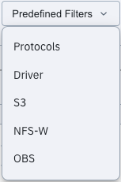
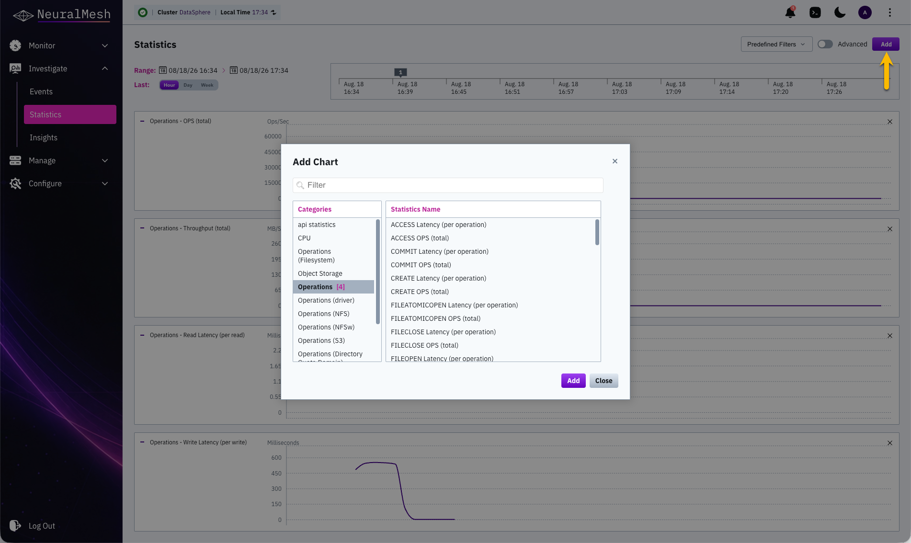
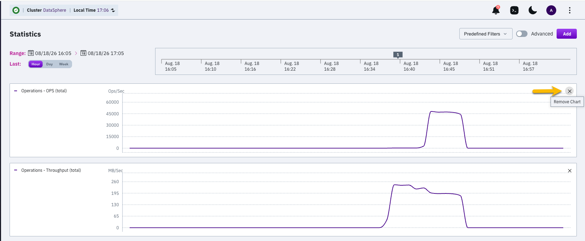
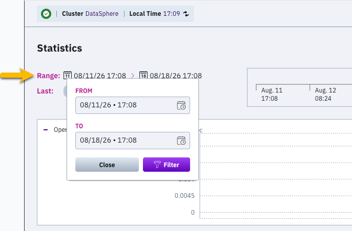
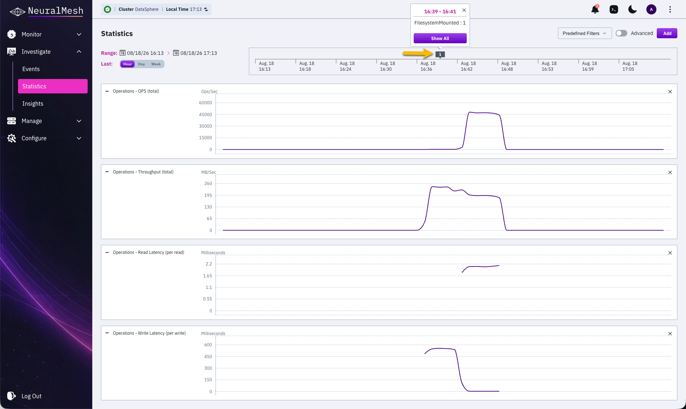

# Manage statistics using the GUI

The page displays up to five charts at a time, sharing one time axis. By default it shows total OPS, total throughput, read latency, and write latency.

## View the statistics page

**Procedure**

1. Select **Investigate > Statistics** from the navigation menu.
2. Select **Predefined Filters** and select a template to load a set of charts for a commonly used category.

The following templates are available:

<table><thead><tr><th width="118.4765625">Template</th><th>Charts</th></tr></thead><tbody><tr><td>Protocols</td><td>Throughput broken down by protocol access.</td></tr><tr><td>Driver</td><td>Throughput, latency, and OPS generated by native clients.</td></tr><tr><td>S3</td><td>Throughput, latency, and OPS generated by S3 clients.</td></tr><tr><td>NFS-W</td><td>Throughput, latency, and OPS generated by NFS clients.</td></tr><tr><td>OBS</td><td>Throughput and latency generated while interacting with object store buckets.</td></tr></tbody></table>

<figure><figcaption>
Predefined Filters
</figcaption></figure>

## Add a chart 

Add up to five charts to the page. When the page already holds five charts, remove one before adding another.

**Procedure**

1. Select **Investigate > Statistics** from the navigation menu.
2. Select **Add**.
3. Select the charts to add in the **Add Chart** dialog, using one of the following methods:
   * Select a category in the **Categories** pane, and then select one or more charts in the **Statistics Name** pane. The number next to a category name indicates how many of its charts are already selected.
   * Type one or two keywords in **Filter**, and then select the required chart in the **Statistics Name** pane.
4. Select **Add**.

To display the low-level charts intended for the Customer Success team, enable **Advanced** before selecting a category.

## Remove a chart 

You can remove a chart that is no longer required to free space for adding another chart to the statistics page. For example, if the Statistics page already has the maximum number of five charts.

**Procedure**

1. Select **X** in the upper-right corner of the chart.

## Set the timeframe 

All displayed charts share one time axis. Set the axis to the last hour, day, or week, or to a specific period.

**Procedure**

1. Select **Hour**, **Day**, or **Week** in the **Last** line to display the charts for the last period.
2. Select the calendar in the **Range** line to display the charts for a specific period, and set the start time and end time.

## View chart values

**Procedure**

1. Move the pointer over the chart area to display the metric value at that point in time.

## Display events from a chart 

When events occur during the displayed period, a purple box on the time axis indicates how many. Show the events to correlate them with the statistics data.

**Procedure**

1. Select the purple box on the time axis. The box appears only when events occurred during the displayed period.
2. Select **Show All** in the popup box.

## Share a chart view

Share a specific set of charts and timeframe with someone else, or bookmark it for yourself.

**Procedure**

1. Select the required charts and set the timeframe.
2. Copy the page URL from the browser address bar.

Opening the URL restores the same charts and timeframe.
