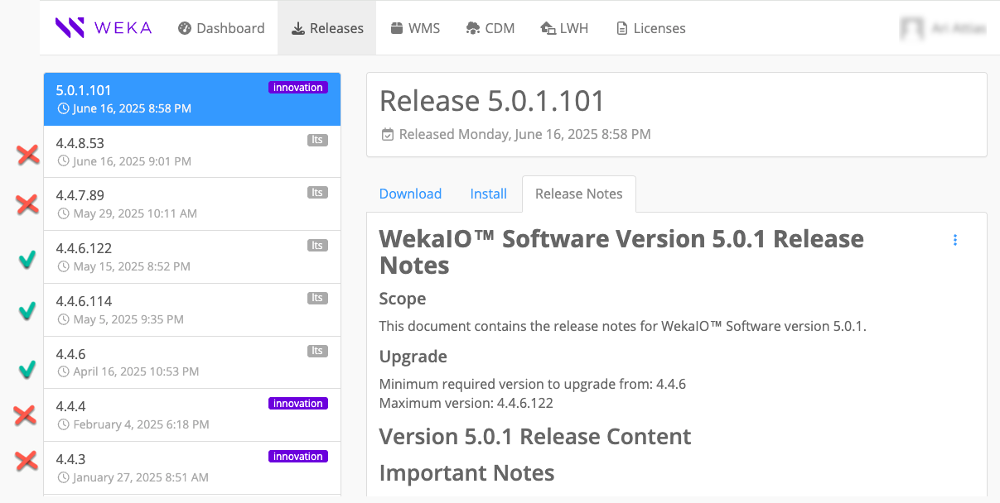
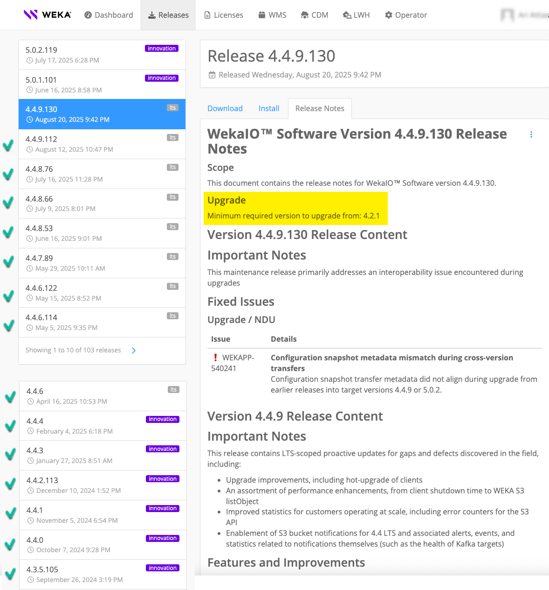
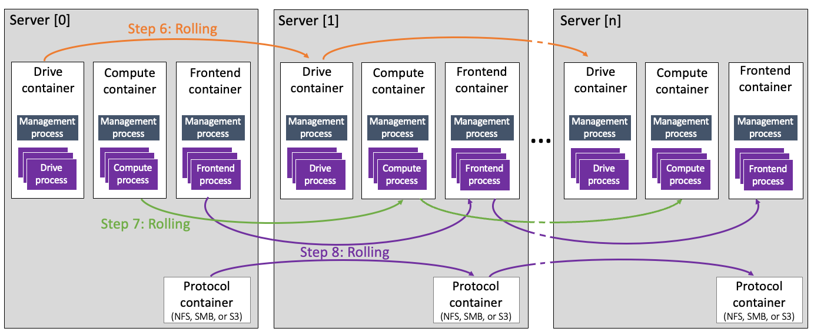
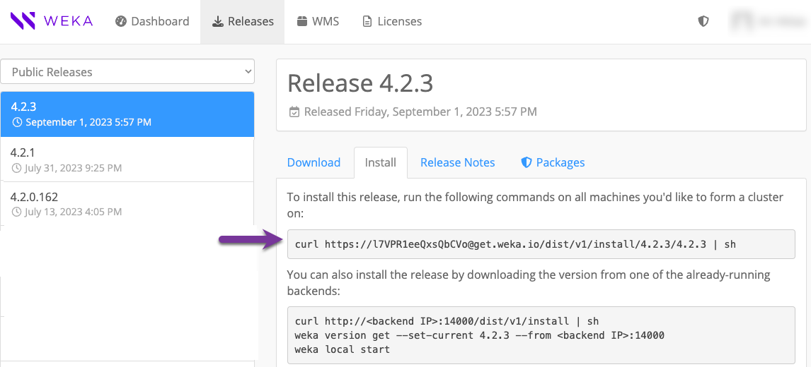
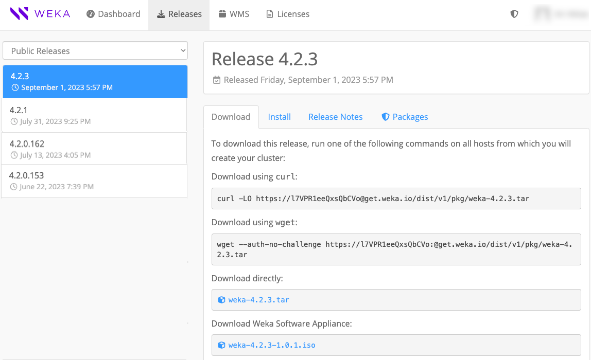
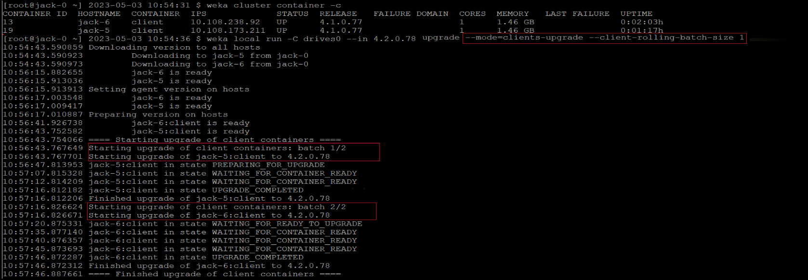

# Upgrade WEKA versions

## WEKA release model

WEKA operates a dual-track release model with two types of versions: Innovation releases and Long-Term Support (LTS) releases.

* Innovation releases deliver new features and enhancements frequently, providing early access to cutting-edge functionality.
* LTS releases focus on stability and reliability.

Each release in [get.weka.io](https://get.weka.io) is tagged as either **Innovation** or **LTS**.

**Related topic**

[release-support-and-commitments.md](../support/release-support-and-commitments.md "mention")

### Software versions

WEKA uses a structured versioning scheme to indicate the scope and type of changes introduced in each release. This helps users quickly identify whether a release includes major new features, minor improvements, or incremental fixes.

* **Major version:** The major version represents substantial changes, such as new features, architectural updates, or significant enhancements.
  * Defined by the first two numbers in the version string.
  * Example: In 4.4.9, the major version is 4.4.
* **Minor version:** The minor version reflects smaller updates, such as bug fixes, performance improvements, or minor feature additions.
  * Defined by the third number in the version string.
  * Example: In 4.4.9, the minor version is 9.
* **Build number:** The build number (fourth component, if present) identifies incremental builds.
  * Used for hotfixes or release candidates that address specific issues without altering core functionality.
  * Example: In 4.4.9.130, the build number is 130.

## Version compatibility guidelines

* **Upgrade direction:** Upgrades must always progress from older to newer versions.
* **Compatibility basis:** Compatibility is determined by the release date of the target version relative to the source version.
* **Major version upgrades:** Upgrades must follow consecutive order (for example, 4.2 → 4.3). LTS releases upgrade to Innovation, and Innovation releases upgrade to the next LTS.
* **LTS upgrades:** Clusters and clients can be upgraded between consecutive LTS releases (for example, 4.2.6 and above may be upgraded to the latest minor release of 4.4).
* **Client upgrades:** Clients are supported if they are at most one major version behind the backend. In multi-hop upgrades, such as from 4.2 to 4.4 to 5.0, clients must be upgraded before the cluster to maintain compatibility.
* **SCMC deployments:** The client-target-version parameter must be identical across all clusters and compatible with the target backend upgrade. See [mount-fs-from-scmc.md](../weka-filesystems-and-object-stores/mounting-filesystems/mount-fs-from-scmc.md "mention").
* **Reference information:** For detailed source-to-target support per release, refer to the upgrade section at [get.weka.io](https://get.weka.io).

### **Upgrade examples**

<details>

<summary>Target version: 5.0.1.101</summary>

**Supported upgrades**

```
4.4.6.122 → 5.0.1.101    Maximum supported version
                         (released: May 15, 2025 → June 16, 2025)
4.4.6.114 → 5.0.1.101    Supported intermediate version
4.4.6     → 5.0.1.101    Minimum supported version
```

**Unsupported upgrades**

```
4.4.8.53  → 5.0.1.101     Version not in supported range
4.4.7.89  → 5.0.1.101     Version not in supported range 
                          (released after 5.0.1 code freeze)
4.4.4     → 5.0.1.101     Version not in supported range
4.4.3     → 5.0.1.101     Version not in supported range
```

<figure><figcaption><p>Releases example on get.weka.io</p></figcaption></figure>

</details>

<details>

<summary>Target version: 4.4.9.130</summary>

4.4.9.130 was release on August 20, 2025. The minimum required version to upgrade from is 4.2.1.

<figure><figcaption></figcaption></figure>

</details>


The source system must be set up in MCB architecture. If not, contact the [Customer Success Team](../support/getting-support-for-your-weka-system.md#contact-customer-success-team) to convert the cluster architecture to MCB. See [convert-the-cluster-architecture-from-a-single-container-backend-to-a-multi-container-backend.md](../appendices/convert-the-cluster-architecture-from-a-single-container-backend-to-a-multi-container-backend.md "mention").\
This workflow is only intended for professional services.



Customers running WEKA clusters on AWS with **auto-scaling groups** must contact the [Customer Success Team](../support/getting-support-for-your-weka-system.md#contact-customer-success-team) before converting the cluster to MCB.


## What is a non-disruptive upgrade (NDU)

In MCB architecture, each container serves a single type of process, drive, frontend, or compute function. Therefore, upgrading one container at a time (rolling upgrade) is possible while the remaining containers continue serving the clients.


Some background tasks, such as snapshot uploads or downloads, must be postponed or aborted. See the [prerequisites](upgrading-weka-versions.md#1.-verify-prerequisites-for-the-upgrade) in the upgrade workflow for details.


#### **Internal upgrade process**

Once you run the upgrade command in `ndu` mode, the following occurs:

1. Downloading the version and preparing all backend servers.
2. Rolling upgrade of the **drive** containers.
3. Rolling upgrade of the **compute** containers.
4. Rolling upgrade of the **frontend** configured with backend mode and **protocol** containers (including frontend and protocol containers hosted on a dedicated protocol server).


To review the frontend containers that will be upgraded, check their configuration mode by running the following command: `$ weka cluster process --role frontend -o containerId,hostname,mode`

Example output:

`CONTAINER ID HOSTNAME MODE`\
`10 DataSphere-1 backend`\
`13 DataSphere-2 backend`\
`14 DataSphere-3 backend`\
`16 DataSphere-6 client`


<div data-with-frame="true"><figure><figcaption><p>NDU process at a glance</p></figcaption></figure></div>

**Related topics**

[weka-containers-architecture-overview.md](../weka-system-overview/weka-containers-architecture-overview.md "mention")

## Upgrade workflow

1. [Verify system upgrade prerequisites](upgrading-weka-versions.md#id-1.-verify-system-upgrade-prerequisites)
2. [Prepare the cluster for upgrade](upgrading-weka-versions.md#id-2.-prepare-the-cluster-for-upgrade)
3. [Prepare the backend servers for upgrade (optional)](upgrading-weka-versions.md#3.-optional.-prepare-the-backend-servers-for-upgrade)
4. [Upgrade the backend servers](upgrading-weka-versions.md#4.-upgrade-the-backend-servers)
5. [Enable LLQ and WC in AWS](upgrading-weka-versions.md#id-5.-enable-llq-and-wc-in-aws)
6. [Upgrade the clients](upgrading-weka-versions.md#id-6.-upgrade-the-clients)
7. [Check the status after the upgrade](upgrading-weka-versions.md#id-7.-check-the-status-after-the-upgrade)


Adhere to the following considerations:

* **Protocol separation**: Upgrading a WEKA cluster with a server used for more than one of the following protocols, NFS, SMB, or S3, is not permitted. If such a case arises, the upgrade process does not initiate and indicates the servers that require protocol separation. Contact the Customer Success Team to ensure only one additional protocol is installed on each server.
* **Legacy NFS protocol**: If a legacy NFS protocol is implemented, contact the Customer Success Team. In this case, the upgrade is blocked.
* **NFS file-locking prerequisite before upgrade:** Ensure the `rpc.statd` and `rpc-statd-notifiy` services are stopped on the WEKA servers. If not, run the following commands:\
  `systemctl disable rpc-statd.service`\
  `systemctl disable srpc-statd-notify-service`
* **S3 Cluster Creation**: If you plan to create an S3 cluster, it’s crucial to ensure the upgrade process is complete and all containers are up before initiating the creation.


### 1. Verify system upgrade prerequisites

Ensure the environment meets the necessary prerequisites before proceeding with any system upgrade. The **WEKA Upgrade Checker Tool** automates these essential checks, comprehensively assessing the system’s readiness. Whether performing a single-version upgrade or a multi-hop upgrade, following this procedure is mandatory.

#### Summary of the WEKA Upgrade Checker Tool results:

1. **Passed checks (Green)**: The system meets all prerequisites for the upgrade.
2. **Warnings (Yellow)**: Address promptly to resolve potential issues.
3. **Failures (Red)**: Do not proceed; they may lead to data loss.

<details>

<summary>Sample list of the verification steps performed by the WEKA Upgrade Checker Tool</summary>

* [x] **Backend server Prerequisites and compatibility**:
  * Confirm that all backend servers meet the [prerequisites and compatibility](../planning-and-installation/prerequisites-and-compatibility.md) requirements of the target version. Address any discrepancies promptly.
  * **Contact the Customer Success Team** if there are compatibility issues or missing prerequisites.
* [x] **Source version architecture**:
  * Verify that the source version is configured in an **MCB (Multi-Cluster Backend)** architecture.
  * If the source version still uses the legacy architecture, take the necessary steps to **convert it to MCB**.
  * **Contact the Customer Success Team** for assistance during this conversion process.
* [x] **S3 protocol configuration and target version 4.2.4**:
  * If the S3 protocol is configured and the target version is **4.2.4**, the tool performs additional checks.
  * **Contact the Customer Success Team** to confirm that the internal key-value store (**ETCD**) has been successfully upgraded to **KWAS** (Key-Value WEKA Accelerated Store).
* [x] **Backend server availability**:
  * Ensure that all backend servers are **online and operational**.
  * Address any server availability issues promptly.
* [x] **User role**:
  * Log in with a user role that has **Cluster Admin privileges**.
  * If necessary, adjust user roles to meet this requirement.
* [x] **Rebuild completion**:
  * Verify that any ongoing rebuild processes have been successfully completed.
  * Do not proceed with the upgrade until the rebuilds are finished.
* [x] **Alerts and outstanding issues**:
  * Check for any outstanding alerts or unresolved issues.
  * Resolve any pending alerts before proceeding.
* [x] **Free space in /opt/weka directory**:
  * Ensure that there is **at least 4 GB of free space** in the `/opt/weka` directory.
  * If space is insufficient, address it promptly.
* [x] **Non-Disruptive Upgrade (NDU) process tasks**:
  * Before initiating the NDU process, **stop the following tasks** (if applicable):
    * **Upload a snapshot**:
      * If applicable, wait for the snapshot upload to complete.
      * Alternatively, abort the upload process if needed.
      * Task Name: **STOW\_UPLOAD**
    * **Create a filesystem from an uploaded snapshot**:
      * Wait for the download to complete.
      * If necessary, abort the process by deleting the downloaded filesystem or snapshot.
      * If the task is in the snapshot prefetch stage of the metadata phase, wait for the prefetch to complete or abort it. Resuming snapshot prefetch after the upgrade is not possible.
      * Task Names: STOW\_DOWNLOAD\_SNAPSHOT, STOW\_DOWNLOAD\_FILESYSTEM, FILESYSTEM\_SQUASH, and SNAPSHOT\_PREFETCH
    * **Sync a Filesystem from a Snapshot**:
      * **Wait for the download to complete**.
      * If needed, abort the process by deleting the downloaded filesystem or snapshot.
      * Task Name: STOW\_DOWNLOAD\_SNAPSHOT
    * **Detach Object Store Bucket from a Filesystem**:
      * During the upgrade, detaching an object store is blocked.
      * If the task is currently running, **ignore it**.
      * Task Name: OBS\_DETACH
  * **Postpone planned tasks or address running tasks**:
    * If any planned tasks are scheduled during the upgrade, postpone them until after the NDU process.
    * If tasks are currently running, take necessary actions based on their status.
    * Consult the [**Background tasks**](background-tasks/) topic for comprehensive guidance.

</details>


**Multi-hop version upgrades:**

After completing an upgrade, a background process initiates the conversion of metadata to a new format (in specific versions). This conversion may take several minutes before another upgrade can commence. To monitor the progress, use the `weka status` CLI command and check if a data upgrade task is RUNNING.


By diligently following this system readiness validation procedure, you can confidently proceed with system upgrades, minimizing risks and ensuring a smooth upgrade.


Demo: WEKA Upgrade Checker



* Prioritize running the WEKA Upgrade Checker **24 hours** before any scheduled upgrades. This step is critical to identify and address any potential issues proactively.
* Ensure **passwordless SSH access** is set up on all backend servers. This is crucial for the seamless execution of the Python script while running the WEKA Upgrade Checker.


**Procedure**

1. **Log in to one of the backend servers as a root user:**
   * Access the server using the appropriate credentials.
2. **Obtain the WEKA Upgrade Checker:**\
   Choose one of the following methods:
   * **Method A:** Direct download
     * Clone the WEKA Upgrade Checker GIT repository with the command:\
       `git clone https://github.com/weka/tools.git`
   * **Method B:** Update from existing tools repository
     * If you have previously downloaded the tools repository, navigate to the **tools** directory.
     * Run `git pull` to update the tools repository with the latest enhancements. (The WEKA tools, including the WEKA Upgrade Checker, continuously evolve.)
3.  **Run the WEKA Upgrade Checker:** Navigate to the `weka_upgrade_checker` directory. It includes a binary version and a Python script of the tool. A minimum of Python 3.8 is required if you run the Python script.

    *   Run the Python script:

        `python3.8 ./weka_upgrade_checker.py --target-version <version>`

    Or

    * Run the Python precompiled script:\
      `./weka_upgrade_checker --target-version <version>`

    Replace `<version>` with your target version. For example `4.4.4`.\
    The tool scans the backend servers and verifies the upgrade prerequisites.
4. **Review the results:**
   * Pay attention to the following indicators:
     * **Green:** Passed checks. Ensure the tool's version is the latest.
     * **Yellow**: Warnings that require attention and remedy.
     * **Red**: Failed checks. If any exist, **do not proceed**. Contact the Customer Success Team.
5. **Send the log file to the Customer Success Team:**
   * The `weka_upgrade_checker.log` is located in the same directory where you ran the tool. Share the latest log file with the Customer Success Team for further analysis.

### 2. Prepare the cluster for upgrade

Download the new WEKA version to one of the backend servers using one of the following methods depending on the cluster deployment:

* Method A: Using a distribution server
* Method B: Direct download and install from get.weka.io
* Method C: If the connectivity to get.weka.io is limited

For details, select the relevant tab.



Use this method if the cluster environment includes a distribution server from which the target WEKA version can be downloaded.

If the distribution server contains the target WEKA version, run the following commands from the cluster backend server:

```
weka version get <version>
weka version prepare <version>
```

Where: \<version> is the target WEKA version, for example: `5.0.3`.

If the distribution server does not contain the target WEKA version, add the option `--from` to the command, and specify the [get.weka.io](https://get.weka.io/ui/releases/) distribution site, along with the token.

Example:

```
weka version get <version> --from https://[GET.WEKA.IO-TOKEN]@get.weka.io
weka version prepare <version>
```



Use this method if the cluster environment has connectivity to [get.weka.io](https://get.weka.io).

1. From the Public Releases on the [get.weka.io](https://get.weka.io/ui/releases/), select the required release.
2. Select the **Install** tab.
3. From the backend server, run the `curl` command line as shown in the following example.

<figure><figcaption><p>Example: Install tab</p></figcaption></figure>



Use this method if the cluster environment does not have connectivity to [get.weka.io](https://get.weka.io), such as with private networks or dark sites.

1. Download the new version tar file to a location from which you copy it to a dedicated directory in the cluster backend server, and untar the file.
2. From the dedicated directory in the cluster backend server, run the `install.sh` command.

<figure><figcaption><p>Example: Download tab</p></figcaption></figure>



### 3. Prepare the backend servers for upgrade (optional)

When working with many backend servers, preparing them separately from the upgrade process in advance is possible to minimize the total upgrade time. For a small number of backend servers, this step is not required.

The preparation phase prepares all the connected backend servers for the upgrade, which includes downloading the new version and getting it ready to be applied.

Once the new version is downloaded to one of the backend servers, run the following CLI command:

```bash
weka local run --container drives0 --in <new-version> upgrade --distribute-version
```

Where:

`<new-version>`: Specify the new version. For example, `5.0.3`.

### 4. Upgrade the backend servers

Once a new software version is installed on one of the backend servers, upgrade the entire cluster backend servers to the new version by running the following command on the backend server.

If you already ran the preparation step, the upgrade command skips the download and preparation operations.

```bash
weka local run --container drives0 --in <new-version> upgrade
```

**Consider the following guidelines:**

* Before switching the cluster to the new software release, the upgrade command distributes the new release to all cluster servers. It makes the necessary preparations, such as compiling the new `wekafs` driver.
* If a failure occurs during the preparation, such as a disconnection of a server or failure to build a driver, the upgrade process stops, and a summary message indicates the problematic server.
*   If cleanup issues occur during a specific upgrade phase, rerun it with the relevant option:

    ```bash
    --ndu-drives-phase
    --ndu-frontends-phase
    --ndu-computes-phase
    ```
* If the container running the upgrade process uses a port other than the default (14000), include the option `--mgmt-port <existing-port>` to the command.

### 5. Verify LLQ and WC are enabled in AWS

Enabling the Low Latency Queue (LLQ) improves data processing efficiency in AWS by reducing I/O operation delays. LLQ is enabled by default after an upgrade, but if Write Combining (WC) is not activated in the `igb_uio` driver, the LLQ driver option does not function. After upgrading the backends, verify that WC is enabled.

**Procedure**

1. **Check for upgrade events:**
   * Review the upgrade events on the backends.
   *   If `NetDevDriverReloadFailed` appears, restart the WEKA service by running the following commands on each backend server:

       ```
       weka local stop
       weka local start
       ```
2. **Verify WC activation:**
   *   Check if WC is activated by running:

       ```
       cat /sys/module/igb_uio/parameters/wc_activate
       ```
   * If the output is `#1`, WC is activated, which enables the LLQ driver option.

### 6. Upgrade the clients

After upgrading all backend components, you can upgrade the clients. Clients can continue operating with their existing version while interacting with the upgraded backends. For specific version compatibility information, see the [#version-compatibility-guidelines](upgrading-weka-versions.md#version-compatibility-guidelines "mention").

The upgrade process supports hot upgrade, which allows clients to remain mounted. However, performing the upgrade during a scheduled maintenance window with low traffic is recommended.

#### Stateless client upgrade options

You can upgrade stateless clients automatically or manually.

* **Automatic upgrade:** A stateless client mounted on a single cluster automatically upgrades to the backend version after a reboot or a complete unmount and remount.
* **Multi-cluster clients:** For a stateless client mounted on multiple clusters, the client container version aligns with the `client-target-version` set in the cluster. For details. see [mount-fs-from-scmc.md](../weka-filesystems-and-object-stores/mounting-filesystems/mount-fs-from-scmc.md "mention")
* **Manual client upgrade:** You can also upgrade stateless clients manually.
  * Use the `--client-only` flag with the `weka version get` command to download only the essential components for the stateless client operation. This excludes any non-relevant packages.
  * Use the `--full` flag with the `weka version` command to display versions only when the complete set of components is present. This provides finer control over version information visibility.

#### Persistent client upgrade options

A persistent client that operates as a dedicated protocol server (gateway) manages containers configured with `allow-protocols true`. During the upgrade process, the client coordinates with backend servers to ensure uninterrupted protocol service availability.

#### Manual client upgrade

You can upgrade clients manually, either by connecting to each client individually or by upgrading them remotely in batches.



To upgrade a stateless or persistent client locally, connect to the client and perform the following steps.

**Procedure**

1.  Download the target version package from the backend.

    <pre data-overflow="wrap"><code>weka version get &#x3C;target-version> --client-only --from &#x3C;backend-name-or-IP>:&#x3C;port>
    </code></pre>

    * Use the `--from <backend-name-or-IP>` option to download the package directly from a backend server instead of from `get.weka.io`. The default port is `14000`.
2.  Upgrade the agent software.

    ```
    weka version set --agent-only 5.0.x
    ```

    Replace `x` with the target minor version.
3. Upgrade the client containers. Select the command that matches your environment:
   *   For a client connected to a single cluster, run the following command:

       ```
       weka local upgrade
       ```
   *   For a client connected to multiple clusters, run the following command to upgrade all containers simultaneously:

       ```
       weka local upgrade --all
       ```

An alert is raised if a version mismatch between the clients and the cluster is detected.



To upgrade multiple stateless or persistent clients remotely, use the `weka local run` command with the options described below.

* `--mode=clients-upgrade`: Activates the remote upgrade process.
* `--client-rolling-batch-size`: Defines the number of clients to upgrade in each batch. For example, if you have 100 clients and set this option to `10`, the upgrade runs in 10 batches of 10 clients each.
* `--clients-to-upgrade`: Specifies the exact clients to upgrade using a comma-separated list of client IDs. Example: `--clients-to-upgrade 33,34,35`.
* `--drop-host`: Skips the upgrade for specific clients using a comma-separated list of client IDs. Example: `--drop-host 22,23`.

If a client upgrade fails, the current batch continues, but subsequent batches are stopped.

**Command syntax**


```
weka local run -C <container-name> --in <target-release> upgrade --mode=clients-upgrade --client-rolling-batch-size <batch-size> [--clients-to-upgrade <client-ids>] [--drop-host <client-ids>] --from backends
```


**Example**

The following command upgrades two clients in two sequential batches, with each batch containing one client:


```
weka local run -C drives0 --in 4.2.0.78 upgrade --mode=clients-upgrade --client-rolling-batch-size 1
```


<figure><figcaption><p>Upgrade one client per batch</p></figcaption></figure>



### 7. Check the status after the upgrade

Once the upgrade is complete, verify that the cluster is in the new version by running the `weka status` command.

**Example:** The following is returned when the system is upgraded to version 5.0.1:

```
# weka status
Weka v5.0.1
...
```
