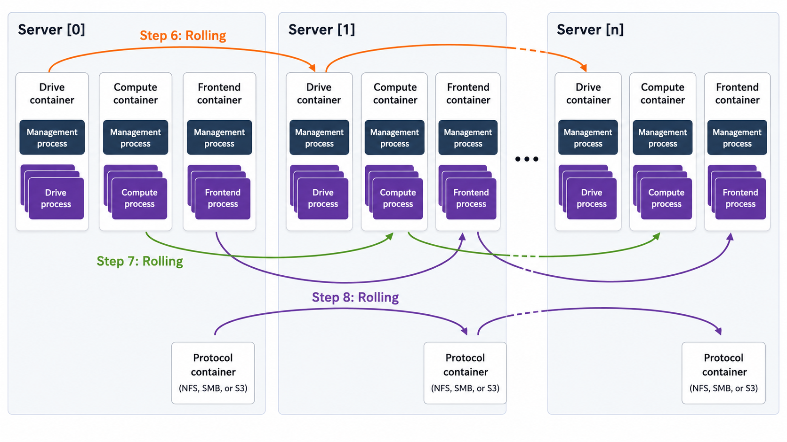

# Upgrade WEKA versions

## WEKA Release Lines

Plan upgrades by Release Line.

WEKA versions use the format **Major.Minor.Revision**. A Release Line is defined by the **Major** number, such as `4.x` or `5.x`. Revisions are cumulative within the same Release Line.


For upgrade planning, note the following mappings:

* Versions `4.3` and `4.4` are treated as one Release Line.
* Versions `5.0` and `5.1` are treated as one Release Line.


Support tiers define the lifecycle of a Release Line:

* **Current (N):** Receives new features and service packs.
* **Maintenance (N-1):** Receives service packs with bug fixes and currency updates.
* **Limited support (N-2):** Receives selective fixes based on need.

For lifecycle details, see [Release support and commitments](/broken/pages/1c0a53bf4014f5596291918832d230f2295d360f).

## Version compatibility guidelines

* **Upgrade direction:** Always upgrade from older to newer versions.
* **Release Line progression:** Upgrade across consecutive supported Release Lines. If a multi-hop path is required, complete one Release Line at a time.
* **Compatibility basis:** Compatibility is determined by the release date of the target version relative to the source version and by the supported source range for that target version.
* **Client upgrades:** Clients are supported if they are at most one Release Line behind the backend. In multi-hop upgrades, upgrade the clients before the cluster at each hop.
* **SCMC deployments:** The `client-target-version` parameter must be identical across all clusters and compatible with the target backend version. See [Mount filesystems from Single Client to Multiple Clusters (SCMC)](https://app.gitbook.com/s/ZW262oqYA8pNNfGvXjHa/weka-filesystems-and-object-stores/mounting-filesystems/mount-fs-from-scmc).
* **Reference information:** For exact supported source and target combinations, see the upgrade section at [get.weka.io](https://get.weka.io).

#### Check the upgrade path

Verify that the upgrade path from your source version to the target version is supported. The **Upgrade Path** checker on [get.weka.io](https://get.weka.io) validates the path and indicates additional requirements, such as upgrading clients before the backends.

**Procedure**

1. On [get.weka.io](https://get.weka.io), open the **Upgrade Path** checker.
2. In the **From** box, select the source version.
3. In the **To** box, select the target version.
4. Select **Check Path**.
5. Review the upgrade summary:
   * **Direct Upgrade** indicates the path is supported.
   * A warning indicates an additional requirement to complete before the upgrade, such as a client upgrade.
   * The path list indicates the recommended target version.

## Non-disruptive upgrade (NDU) overview

In MCB architecture, each container serves a single process type: drive, compute, or frontend. This allows a rolling upgrade, upgrading one container at a time, while the remaining containers continue serving clients.


Some background tasks, such as snapshot uploads or downloads, must be postponed or aborted. See the [prerequisites](./#1.-verify-prerequisites-for-the-upgrade) in the upgrade workflow for details.


#### **Internal upgrade process**

When you run the upgrade command, the following rolling sequence runs across all backend servers:

1. Download the target version and prepare all backend servers.
2. Rolling upgrade of the drive containers.
3. Rolling upgrade of the compute containers.
4. Rolling upgrade of the frontend and protocol containers (NFS, SMB, or S3), including those hosted on dedicated protocol servers.

<div data-with-frame="true"><figure><figcaption><p>NDU process at a glance</p></figcaption></figure></div>


To review which frontend containers will be upgraded, run:

`weka cluster process --role frontend -o containerId,hostname,mode`


**Related topics**

[weka-containers-architecture-overview.md](../../weka-system-overview/weka-containers-architecture-overview.md "mention")

## Before you begin

Complete these checks before running the starting the upgrade workflow.

1. **Verify protocol separation.** Assign only one of NFS, SMB, or S3 to each server. The upgrade does not start when a server runs multiple protocols. Contact the Customer Success Team to separate the protocols.
2. **Verify the NFS protocol version.** Contact the Customer Success Team if legacy NFS is configured. The upgrade is blocked until it is resolved.
3.  **Stop NFS file-locking services.** On each WEKA server, stop the `rpc.statd` and `rpc-statd-notifiy` services.

    ```bash
    systemctl stop rpc-statd.service
    systemctl stop srpc-statd-notify-service
    systemctl disable rpc-statd.service
    systemctl disable srpc-statd-notify-service
    ```
4. **Schedule S3 cluster creation.** Create an S3 cluster only after the upgrade completes and all containers are running.
5.  **For clusters deployed with Data Catalog, clean up the data catalog index.**

    <div data-gb-custom-block data-tag="hint" data-style="warning" class="hint hint-warning"><p>The target version includes a performance-optimized data catalog index. The existing index is incompatible and must be removed to free the space.</p></div>

    1.  Disable the catalog indexing.

        ```bash
        weka catalog config update --index-enabled false
        ```
    2.  Remove the catalog cluster.

        ```bash
        weka catalog cluster remove --force
        ```
    3.  Delete the index filesystem.

        ```bash
        weka fs remove .indexfs
        ```

## Upgrade workflow

1. [Verify system upgrade prerequisites](./#id-1.-verify-system-upgrade-prerequisites)
2. [Prepare the cluster for upgrade](./#id-2.-prepare-the-cluster-for-upgrade)
3. [Prepare the backend servers for upgrade (optional)](./#3.-optional.-prepare-the-backend-servers-for-upgrade)
4. [Upgrade the backend servers](./#4.-upgrade-the-backend-servers)
5. [Enable LLQ and WC in AWS](./#id-5.-enable-llq-and-wc-in-aws)
6. [Upgrade the clients](./#id-6.-upgrade-the-clients)
7. [Complete the cluster upgrade](./#id-7.-complete-the-cluster-upgrade)

### 1. Verify system upgrade prerequisites

Use the WEKA Upgrade Checker Tool to validate system readiness before every upgrade, whether single-version or multi-hop. Running this procedure is mandatory.

**Upgrade Checker results**

<table><thead><tr><th width="134.421875">Indicator</th><th width="264.61328125">Meaning</th><th>Action</th></tr></thead><tbody><tr><td>Green</td><td>All prerequisites met</td><td>Verify the tool is the latest version</td></tr><tr><td>Yellow</td><td>Potential issues detected</td><td>Resolve before proceeding</td></tr><tr><td>Red</td><td>Critical failures found</td><td>Do not proceed. Contact the <a href="../../support/getting-support-for-your-weka-system.md">Customer Success Team</a></td></tr></tbody></table>

<details>

<summary>Sample list of the verification steps performed by the WEKA Upgrade Checker Tool</summary>

* [x] **Backend server Prerequisites and compatibility**:
  * Confirm that all backend servers meet the [prerequisites and compatibility](../../planning-and-installation/prerequisites-and-compatibility.md) requirements of the target version. Address any discrepancies promptly.
  * **Contact the Customer Success Team** if there are compatibility issues or missing prerequisites.
* [x] **Source version architecture**:
  * Verify that the source version is configured in an **MCB (Multi-Cluster Backend)** architecture.
  * If the source version still uses the legacy architecture, take the necessary steps to **convert it to MCB**.
  * **Contact the Customer Success Team** for assistance during this conversion process.
* [x] **S3 protocol configuration and target version 4.2.4**:
  * If the S3 protocol is configured and the target version is **4.2.4**, the tool performs additional checks.
  * **Contact the Customer Success Team** to confirm that the internal key-value store (**ETCD**) has been successfully upgraded to **KWAS** (Key-Value WEKA Accelerated Store).
* [x] **Backend server availability**:
  * Ensure that all backend servers are **online and operational**.
  * Address any server availability issues promptly.
* [x] **User role**:
  * Log in with a user role that has **Cluster Admin privileges**.
  * If necessary, adjust user roles to meet this requirement.
* [x] **Rebuild completion**:
  * Verify that any ongoing rebuild processes have been successfully completed.
  * Do not proceed with the upgrade until the rebuilds are finished.
* [x] **Alerts and outstanding issues**:
  * Check for any outstanding alerts or unresolved issues.
  * Resolve any pending alerts before proceeding.
* [x] **Free space in /opt/weka directory**:
  * Ensure that there is **at least 4 GB of free space** in the `/opt/weka` directory.
  * If space is insufficient, address it promptly.
* [x] **Non-Disruptive Upgrade (NDU) process tasks**:
  * Before initiating the NDU process, **stop the following tasks** (if applicable):
    * **Upload a snapshot**:
      * If applicable, wait for the snapshot upload to complete.
      * Alternatively, abort the upload process if needed.
      * Task Name: **STOW\_UPLOAD**
    * **Create a filesystem from an uploaded snapshot**:
      * Wait for the download to complete.
      * If necessary, abort the process by deleting the downloaded filesystem or snapshot.
      * If the task is in the snapshot prefetch stage of the metadata phase, wait for the prefetch to complete or abort it. Resuming snapshot prefetch after the upgrade is not possible.
      * Task Names: STOW\_DOWNLOAD\_SNAPSHOT, STOW\_DOWNLOAD\_FILESYSTEM, FILESYSTEM\_SQUASH, and SNAPSHOT\_PREFETCH
    * **Sync a Filesystem from a Snapshot**:
      * **Wait for the download to complete**.
      * If needed, abort the process by deleting the downloaded filesystem or snapshot.
      * Task Name: STOW\_DOWNLOAD\_SNAPSHOT
    * **Detach Object Store Bucket from a Filesystem**:
      * During the upgrade, detaching an object store is blocked.
      * If the task is currently running, **ignore it**.
      * Task Name: OBS\_DETACH
  * **Postpone planned tasks or address running tasks**:
    * If any planned tasks are scheduled during the upgrade, postpone them until after the NDU process.
    * If tasks are currently running, take necessary actions based on their status.
    * Consult the [**Background tasks**](../background-tasks/) topic for comprehensive guidance.
  * **Data catalog:**
    * Check the catalog indexing status to ensure it is disabled.

</details>


**Multi-hop version upgrades:**

After each upgrade hop, a background process may convert metadata to a new format. Wait until this conversion completes before starting the next hop. Monitor progress with `weka status` and check if a data upgrade task is RUNNING.



Demo: WEKA Upgrade Checker


**Before you begin**

1. Run the WEKA Upgrade Checker at least **24 hours** before the scheduled upgrade.
2. Ensure **passwordless SSH access** is configured on all backend servers.

**Procedure**

1. **Log in to one of the backend servers as a root user:**
   * Access the server using the appropriate credentials.
2. **Obtain the WEKA Upgrade Checker:**\
   Choose one of the following methods:
   * **Method A:** Direct download
     * Clone the WEKA Upgrade Checker GIT repository with the command:\
       `git clone https://github.com/weka/tools.git`
   * **Method B:** Update from existing tools repository
     * If you have previously downloaded the tools repository, navigate to the **tools** directory.
     * Run `git pull` to update the tools repository with the latest enhancements. (The WEKA tools, including the WEKA Upgrade Checker, continuously evolve.)
3.  **Run the WEKA Upgrade Checker:** Navigate to the `weka_upgrade_checker` directory. It includes a binary version and a Python script of the tool. A minimum of Python 3.8 is required if you run the Python script.

    *   Run the Python script:

        `python3.8 ./weka_upgrade_checker.py --target-version <version>`

    Or

    * Run the Python precompiled script:\
      `./weka_upgrade_checker --target-version <version>`

    Replace `<version>` with your target version. For example `5.1.21`.\
    The tool scans the backend servers and verifies the upgrade prerequisites.
4. **Review the results:**
   * Pay attention to the following indicators:
     * **Green:** Passed checks. Ensure the tool's version is the latest.
     * **Yellow**: Warnings that require attention and remedy.
     * **Red**: Failed checks. If any exist, **do not proceed**. Contact the Customer Success Team.
5. **Send the log file to the Customer Success Team:**
   * The `weka_upgrade_checker.log` is located in the same directory where you ran the tool. Share the latest log file with the Customer Success Team for further analysis.

### 2. Prepare the cluster for upgrade

Download the target version to one of the backend servers using the method that matches your cluster's network environment.

**Method A: Distribution server**

Use this method if your environment includes a distribution server.

* If the distribution server contains the target version:

```bash
weka version get <target-version>
weka version prepare <target-version>
```

* If the distribution server does not contain the target version, pull it directly from get.weka.io using a token:

```bash
weka version get <target-version> --from https://[GET.WEKA.IO-TOKEN]@get.weka.io
weka version prepare <target-version>
```

**Method B: Direct download and install from get.weka.io**

Use this method if the backend servers have direct connectivity to [get.weka.io](https://get.weka.io).

1. On [get.weka.io](https://get.weka.io), select the required release from Public Releases.
2. Select the **Install** tab.
3. From the backend server, run the `curl` command displayed on the Install tab.

**Method C: If the connectivity to get.weka.io is limited**

Use this method if the backend servers have no connectivity to [get.weka.io](https://get.weka.io), such as in private networks or air-gapped environments.

1. Download the target version tar file and copy it to a dedicated directory on a backend server.
2. Extract the tar file and run: `./install.sh`

### 3. Prepare the backend servers for upgrade (optional)

For large clusters, prepare the backend servers separately before running the upgrade to reduce total upgrade time. This step downloads the target version to all connected backend servers and readies it for installation.

Once the target version is downloaded to one of the backend servers, run:

```bash
weka local run --container drives0 --in <new-version> upgrade --distribute-version
```

Where:

`<new-version>`: Specify the new version. For example, `5.1.21`.

### 4. Upgrade the backend servers

Run the following command on one of the backend servers to upgrade all cluster backend servers to the target version:

```bash
weka local run --container drives0 --in <target-version> upgrade
```

If you completed step 3, the command skips the download and preparation.

Before switching to the target version, the command distributes it to all servers and runs necessary preparations, such as compiling the `wekafs` driver. If a server disconnects or a driver fails to build, the upgrade stops and identifies the problematic server.

**Additional options**

<table><thead><tr><th width="454">Scenario</th><th>Option</th></tr></thead><tbody><tr><td>Resume after a failure in the drives phase</td><td><code>--ndu-drives-phase</code></td></tr><tr><td>Resume after a failure in the frontends phase</td><td><code>--ndu-frontends-phase</code></td></tr><tr><td>Resume after a failure in the computes phase</td><td><code>--ndu-computes-phase</code></td></tr><tr><td>Upgrade process container uses a non-default port (default: 14000)</td><td><code>--mgmt-port &#x3C;port></code></td></tr></tbody></table>

### 5. Verify LLQ and WC are enabled in AWS

LLQ (Low Latency Queue) reduces I/O operation delays in AWS and is enabled by default after an upgrade. However, LLQ requires Write Combining (WC) to be active in the `igb_uio` driver. After upgrading the backend servers, verify that WC is enabled.

**Procedure**

1. Check for upgrade events on the backends. If `NetDevDriverReloadFailed` appears, restart the WEKA service on each affected backend server:

```bash
   weka local stop
   weka local start
```

2. Verify that WC is activated:

```bash
   cat /sys/module/igb_uio/parameters/wc_activate
```

An output of `1` confirms WC is active and LLQ is functional.

### 6. Upgrade the clients

Manage client upgrades to ensure software alignment with the backend clusters. The client upgrade is an online process that does not require unmounting filesystems. You can trigger the client upgrade remotely from the backends while the clients remain active.

#### Client upgrade types

Learn the available methods for upgrading clients to the target version.

* **Upgrade:** Allows clients to remain mounted and operational throughout the client software update.
  * [**Local (on-client) trigger**](./#upgrade-a-client-locally): An administrative action performed from the client itself to perform upgrade.
  * [**Remote trigger**](./#upgrade-clients-in-batches-via-remote-trigger)**:** An administrative action performed from the backend servers to trigger upgrades on specific client(s).
* **Remount-based upgrade:** An alternative method where a client automatically upgrades following a remount of all mounted wekafs on a client or reboot.
* **Persistent client coordination:** A dedicated client acting as a protocol gateway manages containers with `allow-protocols true`. During upgrades, it coordinates with backend servers to maintain continuous protocol service availability.
* **Multi-cluster clients:** Perform online upgrades locally for clients without unmounting filesystems.\
  Related topic: [mount-fs-from-scmc.md](../../weka-filesystems-and-object-stores/mounting-filesystems/mount-fs-from-scmc.md "mention").

#### Upgrade a client locally

Update the software of a single stateless or persistent client by connecting directly to the server. You can perform this as an online upgrade without unmounting filesystems.

**Before you begin**

* Upgrade all backend components to the target version.
* Verify version compatibility in the [#version-compatibility-guidelines](./#version-compatibility-guidelines "mention").

**Procedure**

1.  Download the target version package from a backend server to the client.

    ```bash
    weka version get <target-version> --client-only --from <backend-name-or-IP>:14000
    ```
2.  Update the agent software.

    ```bash
    weka version set --agent-only <target-version>
    ```
3.  Upgrade the client containers. For a client connected to a single cluster, run:

    ```bash
    weka local upgrade
    ```

    For a client connected to multiple clusters, upgrade all containers simultaneously:

    ```bash
    weka local upgrade --all
    ```

**Version management flags**

Reference these flags for the `weka version` command to manage package downloads and visibility.

| Flag            | Description                                                                                     |
| --------------- | ----------------------------------------------------------------------------------------------- |
| `--client-only` | Downloads only the essential components required for stateless client operations.               |
| `--full`        | Displays version information only when the complete set of components is present on the server. |

#### Upgrade clients in batches (via remote trigger)

Use the backend servers to remotely trigger online upgrades for multiple stateless or persistent clients. This method ensures clients stay mounted while the software updates.

**Before you begin**

* Identify the client IDs for the target group.
* Ensure the backend servers are running the target version.

**Procedure**

*   Run the remote upgrade command from a backend container.

    <pre class="language-bash" data-overflow="wrap"><code class="lang-bash">weka local run -C &#x3C;container-name> --in &#x3C;target-release> upgrade --mode=clients-upgrade --client-rolling-batch-size &#x3C;batch-size> [--clients-to-upgrade &#x3C;client-ids>] [--drop-host &#x3C;client-ids>]
    </code></pre>

**Remote upgrade parameters**

Reference the following table for parameters used with the `weka local run upgrade` command.

| Parameter                     | Description                                                                 | Default     |
| ----------------------------- | --------------------------------------------------------------------------- | ----------- |
| `--mode=clients-upgrade`      | Activates the remote upgrade process for clients.                           | N/A         |
| `--client-rolling-batch-size` | Defines the number of clients to upgrade in each sequential batch.          | 1           |
| `--clients-to-upgrade`        | Specifies a comma-separated list of client IDs to include.                  | All clients |
| `--drop-host`                 | Specifies a comma-separated list of client IDs to exclude from the upgrade. | None        |

**Example**

The following command upgrades two clients in two sequential batches, with each batch containing one client:


```bash
[root@datasphere-0 ~] 2026-04-19 10:54:31 $ weka cluster container -c
CONTAINER ID HOSTNAME     CONTAINER IPS            STATUS RELEASE FAILURE DOMAIN CORES MEMORY  LAST FAILURE UPTIME
13           datasphere-6 client    10.108.238.92  UP     5.0.2                  1     1.46 GB              0:02:03h
19           datasphere-5 client    10.108.173.211 UP     5.0.2                  1     1.46 GB              0:01:17h

[root@datasphere-0 ~] 2026-04-19 10:54:36 $ weka local run -C drives0 --in 5.1.0.605 upgrade --mode=clients-upgrade --client-rolling-batch-size 1
10:54:43.590859 Downloading version to all hosts
...
10:56:41.926738     datasphere-6:client is ready
10:56:41.752582     datasphere-5:client is ready
10:56:43.754066 ==== Starting upgrade of client containers ====

10:56:43.767649 Starting upgrade of client containers: batch 1/2
10:56:43.767701 Starting upgrade of datasphere-5:client to 5.1.0.605
...
10:57:16.812206 Finished upgrade of datasphere-5:client to 5.1.0.605

10:57:16.826624 Starting upgrade of client containers: batch 2/2
10:57:16.826671 Starting upgrade of datasphere-6:client to 5.1.0.605
...
10:57:46.872312 Finished upgrade of datasphere-6:client to 5.1.0.605

10:57:46.887661 ==== Finished upgrade of client containers ====
```


### 7. Complete the cluster upgrade

Verify the upgraded cluster and restore Data Catalog services when required.

1.  Verify that the cluster runs the target version.

    ```bash
    weka status
    ```
2. For clusters deployed with Data Catalog, create the catalog cluster and index filesystem. Follow [Deploy the catalog services](https://app.gitbook.com/s/ZW262oqYA8pNNfGvXjHa/weka-filesystems-and-object-stores/data-catalog/configure-data-catalog#deploy-the-catalog-services).
