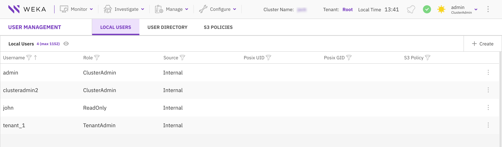
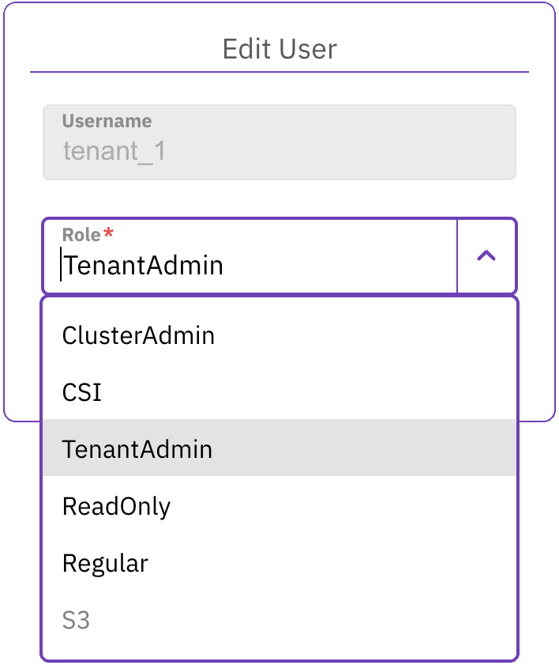
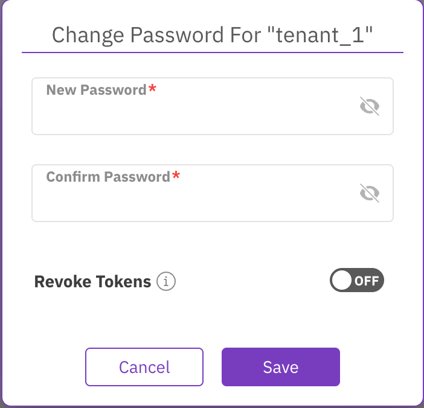
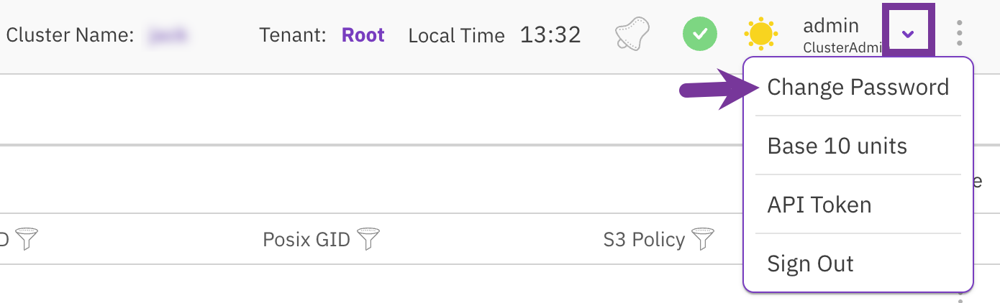
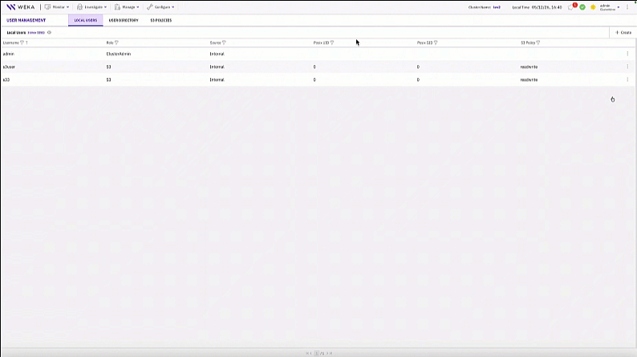
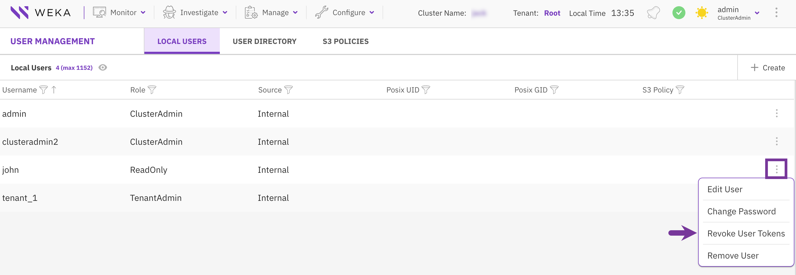
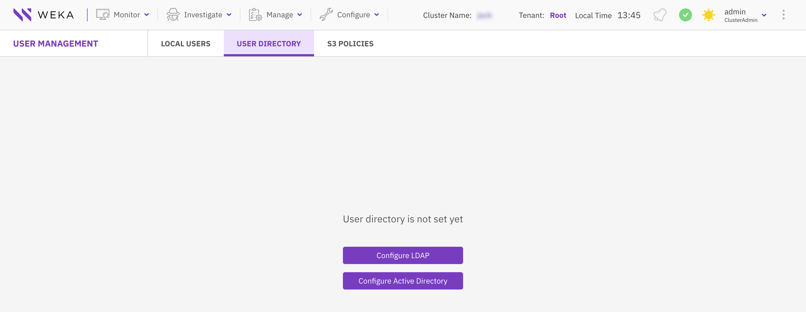
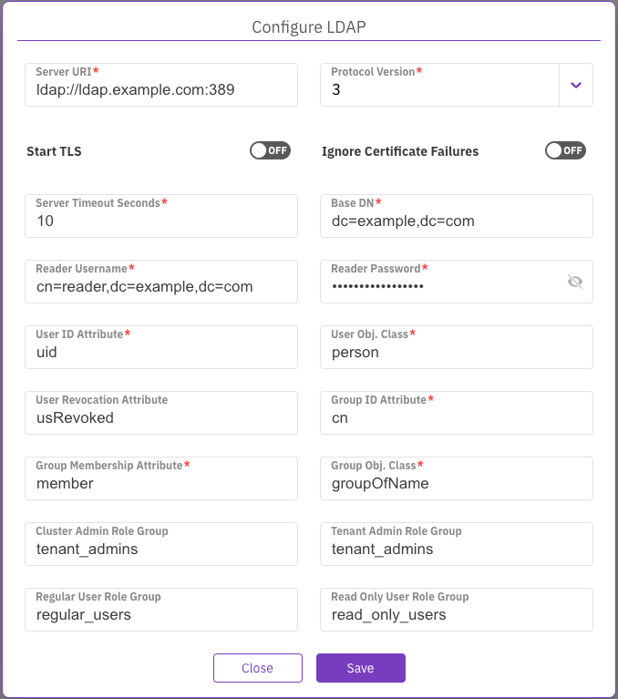
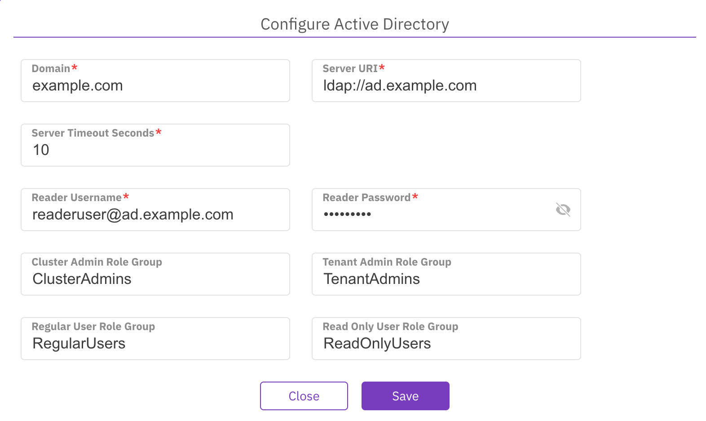

# Manage users using the GUI

Using the GUI, you can:

* [Manage local users](user-management.md#manage-local-users)
* [Manage user directory](user-management.md#manage-user-directory)

## Manage local users

Local users are accounts created directly in the WEKA system, as distinct from domain users managed by the tenant's **User Directory**. A WEKA cluster supports up to 1152 local users.

<div data-with-frame="true"></div>

### Create a local user

**Procedure**

1. From the menu, select **Configure > User Management**.
2. In the Local Users tab, select **+Create**.
3. In the Create New User dialog, set the following properties:
   * **Username:** Set the user name for the local user.
   * **Password:** Set a password according to the requirements. The password must contain at least 8 characters: an uppercase letter, a lowercase letter, and a number or a special character.
   * **Confirm Password:** Type the same password again.
   * **Role:** Select the role for the local user.\
     The S3 user role is available only when an S3 cluster is configured. If you select the S3 user role, also select the relevant S3 policy and, optionally, the [POSIX UID](#user-content-fn-1)[^1] and [POSIX GID](#user-content-fn-2)[^2]**.** If an S3 policy is attached during user creation, the system generates the S3 access key and secret key automatically. For role details, see [User roles and permissions](https://app.gitbook.com/s/ZW262oqYA8pNNfGvXjHa/operation-guide/user-management).
4. Select **Save**.



If you create an S3 user and attach an S3 policy, the system generates an S3 access key and secret key and displays them once. Copy and store them securely before closing the dialog. These credentials are used for S3 API access. They are not the WEKA account username and password. If the S3 key pair is lost, use [**Reset S3 Credentials**](user-management.md#reset-s3-credentials) to generate a new pair.

<figure><figcaption></figcaption></figure>



<div data-with-frame="true"></div>



### Edit a local user

You can modify the role of a local user but not your role (the signed-in user). For an S3 user, you can only modify the S3 policy, POSIX UID, and POSIX GID.

**Procedure**

1. In the Local Users tab, select the three dots of the local user you want to edit, then select **Edit User**.
2. From the Role property, select the required role. If you modify the role to S3, also set the S3 policy, POSIX UID, and POSIX GID.
3. Select **Save**.

<div data-with-frame="true"><figure><figcaption><p>Edit a local user</p></figcaption></figure></div>

### Change a local user password

As a Cluster Admin or Tenant Admin, you can change the password of a local user and revoke the user's tokens. After the password change, the user must sign in again with the new password.


This action changes only the WEKA account password. It does not change S3 API credentials. To rotate S3 API credentials, select **Reset S3 Credentials** from the user menu. See [#reset-s3-credentials](user-management.md#reset-s3-credentials "mention").


**Procedure**

1. In the Local Users tab, select the three dots of the local user whose password you want to change, then select **Change Password**.
2. In the Change Password for a user dialog, set the following properties:
   * **Old password:** Set the old password (required only for the singed in user).
   * **Password:** Set a new password according to the requirements.
   * **Confirm Password:** Type the same new password again.
   * **Revoke Tokens:** If the user's existing tokens are compromised, you can revoke all of the user's tokens and change their password. To regain access to the system, the user must re-authenticate with the new password or obtain new tokens through the API.
3. Select **Save**.

<div data-with-frame="true"></div>

### Change your password

You can change your password at any time.

**Procedure**

1. From the top bar, select the signed-in user, then select **Change Password**.

<div data-with-frame="true"></div>

2. In the Change Password dialog, set the properties described in the [Change a local user password](user-management.md#change-a-local-user-password) topic.
3. Select **Save**.

### Reset S3 credentials

Cluster Admin and Tenant Admin can reset the S3 access key and secret key of a local S3 user from the GUI. Resetting the credentials immediately invalidates the existing credentials. Applications or services using these credentials lose S3 access until updated with the new credentials.

**Before you begin**

* Ensure the target user has the **S3 user** role.
* Use this GUI procedure only as Cluster Admin or Tenant Admin.

If you are signed in as an S3 user, reset your own S3 credentials from the CLI:

```bash
weka s3 user keys-generate
```

**Procedure**

1. In the **Local Users** tab, select the three dots next to the S3 user, then select **Reset S3 Credentials**.
2. In the confirmation dialog, select **Yes** to proceed or **No** to close without changes.
3. Copy the new access key and secret key immediately. The system displays them only once.

<div data-with-frame="true"><figure><figcaption><p>Reset S3 credentials</p></figcaption></figure></div>

### Revoke local user tokens

If the user's existing tokens are compromised, you can revoke all the user's tokens, regardless of changing the user's password. To re-access the system, the user re-authenticates with the new password, or the user needs to obtain new tokens using the API.

**Procedure**

1. In the Local Users tab, select the three dots of the local user you want to revoke the user tokens, then select **Revoke User Tokens**.

<div data-with-frame="true"></div>

2. In the confirmation message, select **Revoke Tokens**.

### Remove a local user

You can remove a local user that is no longer required.

**Procedure**

1. In the Local Users tab, select the three dots of the local user to remove, then select **Remove User**.
2. In the confirmation message, select **Yes**.

## Configure LDAP/AD in WEKA

Integrate the WEKA system with your tenant's user directory using Lightweight Directory Access Protocol (LDAP) or Active Directory (AD) for centralized user authentication and access management.

To configure the user directory, navigate to **Configure > User Management** and select the **User Directory** tab. If no directory is configured, select **Configure LDAP** or **Configure Active Directory**.

<div data-with-frame="true"></div>

### Configure LDAP

Connect to an LDAP server to authenticate and authorize users for access to the WEKA system.

<details>

<summary>LDAP property reference</summary>

<table><thead><tr><th width="178.890625">Property</th><th>Description</th></tr></thead><tbody><tr><td>Server URI</td><td>The address of the LDAP server. For example: <code>ldap://ldap.example.com:389</code>.</td></tr><tr><td>Protocol Version</td><td>The version of the LDAP protocol. For example: <code>3</code>.</td></tr><tr><td>Start TLS</td><td>When enabled, initiates a Transport Layer Security (TLS) connection with the LDAP server for encrypted communication.</td></tr><tr><td>Ignore Certificate Failures</td><td>When enabled, the LDAP client ignores certificate validation failures during the TLS/SSL handshake. Use this option cautiously, as it may pose a security risk.</td></tr><tr><td>Server Timeout Seconds</td><td>The number of seconds the WEKA system waits for a response from the LDAP server before the connection attempt times out.</td></tr><tr><td>Base DN</td><td>The base distinguished name (DN) that serves as the starting point for directory tree searches. For example: <code>dc=example,dc=com</code>.</td></tr><tr><td>Reader Username</td><td>The username or DN of a dedicated user account for reading data from the LDAP server. For example: <code>cn=reader,dc=example,dc=com</code>.</td></tr><tr><td>Reader Password</td><td>The password for the reader user account.</td></tr><tr><td>User ID Attribute</td><td>The attribute in the LDAP schema that uniquely identifies user entries. For example: <code>uid</code>.</td></tr><tr><td>User Object Class</td><td>The object class in the LDAP schema that defines the structure of user entries. For example: <code>person</code>.</td></tr><tr><td>User Revocation Attribute</td><td>An attribute that indicates a user account's revocation status. For example: <code>isRevoked</code>.</td></tr><tr><td>Group ID Attribute</td><td>The attribute in the LDAP schema that uniquely identifies group entries. For example: <code>cn</code>.</td></tr><tr><td>Group Membership Attribute</td><td>The attribute that specifies which users are members of a particular group. For example: <code>member</code>.</td></tr><tr><td>Group Object Class</td><td>The object class in the LDAP schema that defines the structure of group entries. For example: <code>groupOfNames</code>.</td></tr><tr><td>Cluster Admin Group</td><td>The LDAP group granted administrative privileges for the cluster. The sAMAccountName can be up to 20 characters. For example: <code>cn=cluster_admins,ou=groups,dc=example,dc=com</code>.</td></tr><tr><td>Tenant Admin Role Group</td><td>The LDAP group granted administrative privileges for specific tenants. The sAMAccountName can be up to 20 characters. For example: <code>cn=tenant_admins,ou=groups,dc=example,dc=com</code>.</td></tr><tr><td>Regular User Role Group</td><td>The LDAP group for users with standard access privileges. The sAMAccountName can be up to 20 characters. For example: <code>cn=regular_users,ou=groups,dc=example,dc=com</code>.</td></tr><tr><td>Read-only User Role Group</td><td>The LDAP group for users with read-only access privileges. The sAMAccountName can be up to 20 characters. For example: <code>cn=read_only_users,ou=groups,dc=example,dc=com</code>.</td></tr></tbody></table>

</details>

**Procedure**

1. On the **User Directory** tab, select **Configure LDAP**.
2. In the Configure LDAP dialog, set the properties according to your LDAP environment. For details about each property, see the **LDAP property reference**.
3. Select **Save**.

<div data-with-frame="true"></div>

After saving the configuration, the **User Directory** tab displays the LDAP connection details. From this view, you can update, disable, or reset the configuration.

### Configure Active Directory

Connect to an Active Directory (AD) domain to authenticate and authorize users for access to the WEKA system.

<details>

<summary>Active Directory property reference</summary>

<table><thead><tr><th width="161.91015625">Property</th><th>Description</th></tr></thead><tbody><tr><td>Domain</td><td>The domain name of the Active Directory environment. For example: <code>example.com</code>.</td></tr><tr><td>Server URI</td><td>The address of the Active Directory server. For example: <code>ldap://ad.example.com</code>.</td></tr><tr><td>Server Timeout Seconds</td><td>The number of seconds the WEKA system waits for a response from the AD server before the connection attempt times out.</td></tr><tr><td>Reader Username</td><td>The username or user principal name (UPN) of a dedicated user account for reading data from Active Directory. For example: <code>readeruser@ad.example.com</code>.</td></tr><tr><td>Reader Password</td><td>The password for the reader user account.</td></tr><tr><td>Cluster Admin Role Group</td><td>The Active Directory group granted administrative privileges for the cluster. The sAMAccountName can be up to 20 characters. For example: <code>CN=ClusterAdmins,CN=Users,DC=example,DC=com</code>.</td></tr><tr><td>Tenant Admin Role Group</td><td>The Active Directory group granted administrative privileges for specific tenants. The sAMAccountName can be up to 20 characters. For example: <code>CN=TenantAdmins,CN=Users,DC=example,DC=com</code>.</td></tr><tr><td>Regular User Role Group</td><td>The Active Directory group for users with standard access privileges. The sAMAccountName can be up to 20 characters. For example: <code>CN=RegularUsers,CN=Users,DC=example,DC=com</code>.</td></tr><tr><td>Read-only User Role Group</td><td>The Active Directory group for users with read-only access privileges. The sAMAccountName can be up to 20 characters. For example: <code>CN=ReadOnlyUsers,CN=Users,DC=example,DC=com</code>.</td></tr></tbody></table>

</details>

**Procedure**

1. On the **User Directory** tab, select **Configure Active Directory**.
2. In the Configure Active Directory dialog, set the properties according to your AD environment. For details about each property, see the **Active Directory property reference**.
3. Select **Save**.

<div data-with-frame="true"></div>

After saving the configuration, the User Directory tab displays the Active Directory connection details. From this view, you can update, disable, or reset the configuration.

[^1]: POSIX UID of underlying files representing objects created by this S3 user access/keys credentials.

[^2]: POSIX GID of underlying files representing objects created by this S3 user access/keys credentials.
