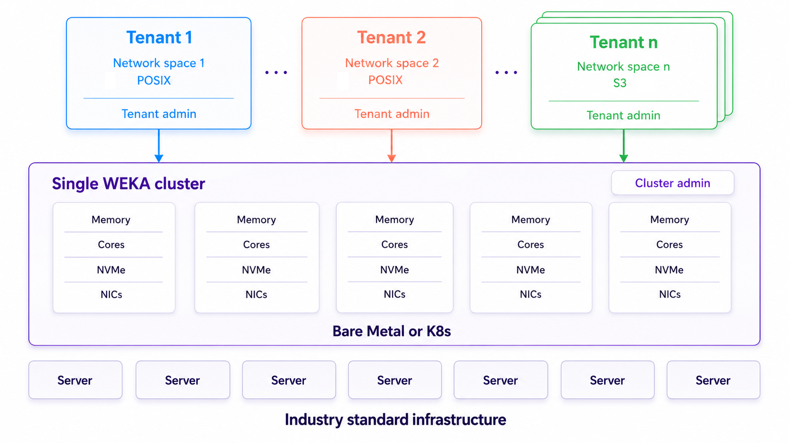
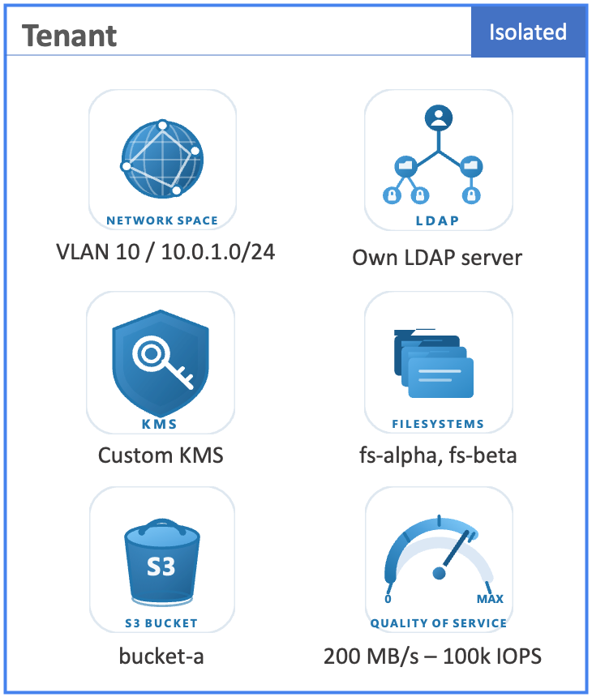
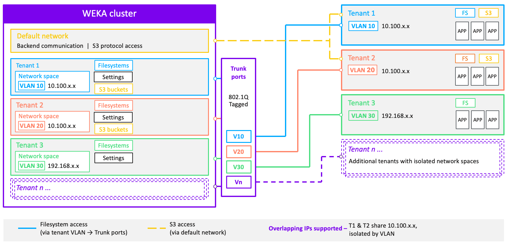

# Native multi-tenancy management

## Overview

Native multi-tenancy enables multiple independent tenants to share a single cluster while maintaining strict logical isolation for users, data, and policies. Tenants can have dedicated network spaces, per-tenant security controls, encryption per tenant, QoS, capacity quotas, and elastic resource sharing.

The architecture delivers VPC-like networking flexibility within a single cluster. Each tenant maps to its own network namespaces and VLANs, enabling overlapping IP address ranges and custom subnets within a single cluster.

The platform is designed to serve tenants of any scale, from small 1 TB workloads to very large multi-petabyte deployments, simultaneously on the same hardware footprint. Tenants share CPU, memory, and NVMe drives while receiving predictable, policy-enforced performance through per-tenant QoS caps and capacity quotas.

<figure><figcaption>
Native multi-tenancy architecture
</figcaption></figure>

## Native multi-tenancy: key concepts

Native multi-tenancy allows multiple isolated tenants to run on the same physical infrastructure. While tenants share CPU, memory, and drives, isolation is enforced in the datapath and the control plane.

Native multi-tenancy supports the following features:

* **Scale:** Tenants can scale from 1TB in size to multi-PB and they can coexist on the same cluster and scale seamlessly through resource elasticity in a cluster.
* **Network Isolation:** Tenants operate within dedicated network spaces (VLANs), each with its unique IP range. This setup allows overlapping IP addresses among different tenants. Additionally, a single tenant can utilize multiple network spaces.
* **Per-tenant identity:** Each tenant can integrate with its own LDAP or Active Directory server for independent directory services. This applies to tenant user accounts. NFS group resolution uses a separate LDAP configuration that is available only in the root organization. See [Manage NFS for tenants](manage-nfs-for-tenants.md).
* **Tenant-level security:** Each tenant can configure a custom Key Management System (KMS) for independent encryption.
* **Multi-tenant S3:** The system provides tenant-scoped S3 buckets with tenant-specific capacity accounting and security controls. S3 access is available through the cluster's default network and tenant-specific VLANs. S3 objects and buckets remain subject to each tenant's security policies and capacity limits.
* **Quality of Service (QoS):** Cluster Administrators can set performance limits on per tenant basis, such as maximum throughput (MB/s) and IOPS, to prevent "noisy neighbor" behavior and ensure predictable performance for each tenant.

<figure><figcaption>
Tenant-supported entities
</figcaption></figure>

### Network Isolation through network spaces

A network space serves as a cluster-level boundary defined by a Name, IP Range, and VLAN ID, linking the physical network to a logical tenant. WEKA uses these spaces to provide enhanced security and connectivity features, including:

* **Traffic segmentation and security:**
  * **VLAN mapping:** Each space is assigned a specific VLAN, and the system validates the source VLAN of incoming traffic to ensure it matches the tenant's designated network space.
  * **Routing isolation:** Each tenant operates under its own distinct routing domain, ensuring that traffic is contained and preventing cross-tenant leakage.
  * **Dedicated POSIX endpoints:** Network spaces provide isolated datapath endpoints for POSIX filesystem traffic within the tenant's private network boundary. These endpoints support DPDK and RoCE.
* **Global and protocol connectivity:**
  * **Default network access:** The cluster maintains a default network for backend communication and S3 protocol access. This network can run untagged, or on its own tagged VLAN. Its VLAN is a property of the backend containers' network interfaces, not of a network space, so you configure it with [Enable WEKA tagged VLAN support](../../planning-and-installation/bare-metal/manually-configure-the-weka-cluster-using-the-resource-generator/vlan-tagging-in-the-weka-system.md#enable-weka-tagged-vlan-support) rather than with `weka cluster network-space`. Assign a VLAN ID that no tenant network space uses. Tagging the default network affects backend traffic cluster-wide and requires restarting the containers on each server, so it is not a per-tenant setting.
  * **Protocol differentiation:** While filesystem access is routed through tenant-specific VLANs and trunk ports, S3 access can be provided both through the cluster's default network and tenant's specific VLAN. If the default network is tagged, S3 clients that reach the cluster through it must send their traffic on that VLAN.
* **IP and connectivity flexibility:**
  * **Overlapping IP support:** Tenants can share identical IP ranges without conflicts by using distinct network spaces isolated by VLANs (for example, Tenant 1 and Tenant 2 sharing the `10.100.x.x` range).
  * **Multi-network assignment:** A single tenant can connect to multiple network spaces to:
    * Isolate data traffic from management services like LDAP or KMS.
    * Support clients residing on different physical VLANs.
    * Provide redundant network paths for high availability.
  * **Reserved backend IP range:** Network space IPs are reserved exclusively for backend containers. Configure client IPs outside the reserved range. Do not assign any client IP from that range.

<figure><figcaption>
Multi-tenancy networking
</figcaption></figure>

### Policy enforcement

When a cluster administrator links one or more network spaces to a tenant, WEKA enforces the following security controls:

* **VLAN validation:** Mount operations succeed only when they originate from one of the tenant's assigned network spaces.
* **Access blocking:** WEKA blocks any connection attempt from outside the assigned VLANs, even if the user provides valid credentials.
* **Protocol endpoints:** The system provides S3 protocol endpoints that are available cluster-wide. Unlike datapath isolation for other protocols, these S3 endpoints do not reside within a specific network space.

## Cluster-level vs tenant-level responsibilities

Native multi-tenancy enforces a distinct separation between cluster-level and tenant-level operations. This separation ensures administrative isolation and prevents unintended access across tenants.

### **Cluster-level responsibilities (ClusterAdmin)**

The cluster administrator manages the system's physical fabric and the high-level logical boundaries between tenants. A user with the `ClusterAdmin` role performs the following tasks:

* **Manages infrastructure:** This includes overseeing physical hardware, nodes, drives, and system-wide upgrades.
* **Defines network primitives:** The administrator creates and maintains virtual routing and forwarding (VRF) pools and shared network endpoints.
* **Manages the tenant lifecycle:** This involves creating, renaming, and deleting tenant entities.
* **Maps network security:** The administrator attaches or detaches network spaces to tenants and enforces tenant-wide security flags such as `enforceMountToNetworkSpace`.
* **Sets resource boundaries:** This includes defining storage capacity quotas (SSD and total) and setting per-tenant quality-of-service (QoS) caps.

Cluster administrators do not have access to tenant data or filesystems, but they control the resources and boundaries within which tenants operate.

### **Tenant-level responsibilities (TenantAdmin)**

The tenant administrator manages the data and user lifecycle strictly within their assigned logical boundary. A user with the `TenantAdmin` role performs the following tasks:

* **Manages identity:** This involves overseeing tenant-scoped users, groups, and LDAP/AD configurations.
* **Provisioning data:** The administrator creates and manages filesystems and S3 buckets for the tenant.
* **Controls encryption:** This includes configuring tenant-specific key management system (KMS) settings and managing encryption keys for tenant filesystems.
* **Governs local security:** The administrator manages datapath access policies, including generating mount tokens and access control lists (ACLs) for tenant-owned resources.

Tenant administrators cannot create or modify cluster-level resources, such as network spaces or other tenants.

### **Interaction between the roles**

The multi-tenancy model relies on a provider-consumer relationship where certain one-time setup tasks occur through internal processes:

* **The network model:** The cluster administrator provides the infrastructure (network spaces), and the tenant administrator consumes those endpoints to provide datapath access to their clients.
* **Security overlap:** While the tenant administrator manages filesystem-level authentication, the cluster administrator can override this by enforcing tenant-wide mandatory authentication (`fsAuthRequired`).

## Choose an isolation model

Choose native multi-tenancy by default.

1. **Choose the isolation type**
   * Use **native multi-tenancy** for logical isolation on shared infrastructure.
   * Use **composable clusters** when each tenant needs dedicated hardware.
2. **Choose the native multi-tenancy platform**
   * Use **bare metal or VMs** when the WEKA cluster does not run on Kubernetes.
   * Use **Kubernetes** when the WEKA cluster runs on Kubernetes and tenants still share one cluster.

**Related topic**

[Composable clusters for multi-tenancy in Kubernetes](https://app.gitbook.com/s/ZW262oqYA8pNNfGvXjHa/kubernetes/composable-clusters-for-multi-tenancy-in-kubernetes)

## Upgrade: Transition to native multi-tenancy

As part of the upgrade to this version, the system transitions to a native multi-tenancy model. Existing organizations are upgraded and replaced by tenants, with no data copy required. All existing data remains fully accessible and continues to function as before.

**Role conversion:** Users with the `OrgAdmin` role are converted to `TenantAdmin`.

**API and CLI deprecation:** Commands and routes that use `org` terminology are deprecated and will transition to `tenant` syntax.

Example CLI mapping:

* Deprecated: `weka tenant add <name>`
* Replacement: `weka tenant add <name>`

The upgrade process is performed by the Customer Success Team.
