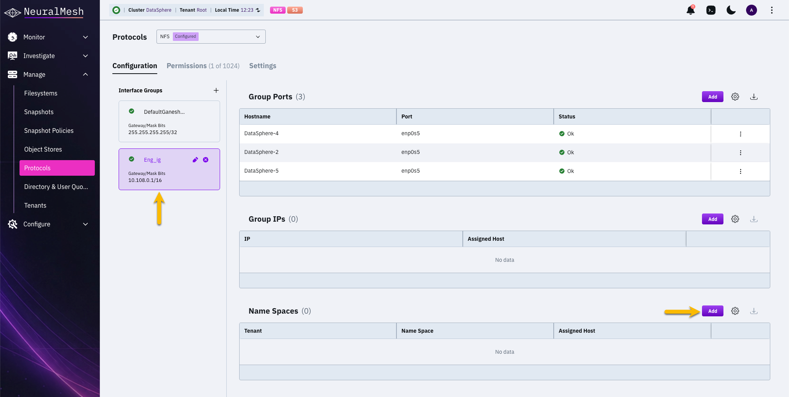
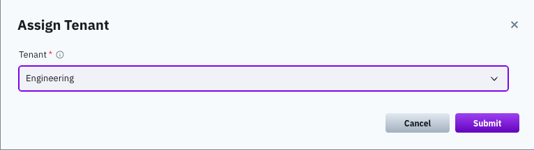

# Manage NFS for tenants

## Overview

NFS multi-tenancy gives each tenant its own NFS service: isolated client groups, isolated exports, and dedicated floating IP addresses reached through the tenant's network space. Tenants gain filesystem access without installing any client software.

Tenant NFS access works differently from tenant POSIX access, and the difference matters before you provision anything:

| Access path | How a tenant is isolated |
| --- | --- |
| **POSIX (wekafs)** | Authentication. Users obtain a mount token through `weka user login --tenant`, and mounting is limited to stateless clients. |
| **NFS** | Network topology. The tenant's floating IPs live in its network space and VLAN. Connections use `sec=sys` and carry no token. |

Both paths keep tenants separated from each other, but they rely on different mechanisms. An NFS export is reachable by anything that can route to the tenant's floating IPs, so the network space boundary is the security boundary. Size and segment the network space accordingly.

All tasks in this topic require the **ClusterAdmin** role unless stated otherwise.

**Related topics**

[multi-tenancy-cluster-level-administration.md](multi-tenancy-cluster-level-administration.md "mention")

[README.md](../../additional-protocols/nfs-support/README.md "mention")

## Enable NFS multi-tenancy

NFS multi-tenancy is disabled by default and applies to the whole cluster. Enabling it changes how every NFS object is scoped, so review the prerequisites before you switch it on.

#### Before you begin

Enabling fails if any of the following exist in the cluster:

* The Kubernetes NFS deployment mode is in use. Multi-tenancy and that deployment mode are mutually exclusive.
* An NFS export on a tenant filesystem uses `manage_gids`.
* A client group belonging to a tenant has a name-based (DNS) rule.

Resolve these first. The error lists every conflicting feature type at once, so a single attempt tells you everything you need to fix:

```
Cannot enable NFS multi-tenant; the following unsupported features are configured: <list>. Remove them first, then retry
```

In the GUI only, one further condition applies: the **Multi-Tenancy** toggle is disabled while LDAP or Kerberos authentication is configured, with the tooltip *"Multi-tenancy cannot be enabled while LDAP or Kerberos authentication is configured. Reset them first."* The CLI has no such restriction — with the CLI, Kerberos and LDAP simply become root-organization only once multi-tenancy is enabled.


Enabling or disabling NFS multi-tenancy requires an NFS container restart to take effect. Plan the change for a maintenance window.


#### **GUI procedure**

1. From the menu, select **Manage > Protocols**.
2. Select **NFS**, then open the **Settings** tab.
3. In the **Global settings** section, select **Update**.
4. Set **Multi-Tenancy** to on.
5. Select **Submit**, then select **Confirm** in the **Restart NFS Containers** dialog. The restart temporarily interrupts IO for connected NFS clients.

#### CLI alternative

```bash
weka nfs global-config set --enable-multi-tenant on
```

The CLI does not restart the containers. On success it prints `Restart of NFS-W containers needed to apply changes.` — restarting is a separate step.

To confirm the current state:

```bash
weka nfs global-config show
```


Mutating NFS commands wait for the configuration to propagate to every NFS server before returning — normally a few seconds, bounded by a 55-second timeout. If the timeout expires, the command fails with an error naming the servers that did not confirm.


## Assign a tenant to an interface group

A tenant's floating IP addresses are defined in the tenant's own network space, through `--fip-range`. Assigning the tenant to an interface group causes those floating IPs to be **served by that interface group's servers**, which is what makes the tenant's exports reachable.

#### Before you begin

* The tenant must already exist and have at least one network space assigned. See [Create a tenant environment](multi-tenancy-cluster-level-administration.md#create-a-tenant-environment).
* The tenant's network space must define a floating IP range through `--fip-range`, which is accepted on both `weka cluster network-space add` and `update`.
* A tenant network space supports a maximum of **8 floating IP addresses**.


The root organization is never assigned to an interface group. It uses the interface group's floating IPs directly. Only tenants require an explicit assignment.


#### **GUI procedure**

1. From the menu, select **Manage > Protocols**.
2. Select **NFS**, then open the **Configuration** tab.
3. Select the target interface group to open its detail view.
4.  Select **Add** in the **Name Spaces** section.

    <div data-with-frame="true"><figure><figcaption><p>Add a tenant to an interface group</p></figcaption></figure></div>
5.  Select the tenant, then select **Submit**.

    The **Tenant** list offers only tenants. The root organization appears but cannot be selected, because it uses the interface group's floating IPs directly.

    The same dialog also moves a tenant: a tenant already assigned to another interface group is moved to this one.

    <div data-with-frame="true"><figure><figcaption><p>Assign Tenant dialog</p></figcaption></figure></div>

To remove a tenant, open the **Name Spaces** table on the interface group's detail view and select **Remove** on the tenant's row.

The **Tenant** column on that table shows which tenant each namespace serves.

**INTERNAL, remove before publication. TBD (Docs):** one capture still missing: the **Name Spaces** table showing the **Tenant** column populated and the per-row **Remove** action. The Add control and the Assign Tenant dialog were captured on 2026-09-03 and are in place above.

**Do not attempt this capture on an OCI lab.** It was tried on 2026-09-03 and the result is not publishable. The assignment itself succeeds and the Name Spaces row appears correctly, but the interface group goes `Inactive` with every port at `Rule:FAILED`, and the row reads `Assigned Host 0 (total)` where a working cluster names a host. The floating IPs never reach the NIC: only the DHCP address is present on `enp0s5` afterwards. The likely cause is that OCI does not route secondary IPs that are not registered against the VNIC, which is an environment limit rather than a product defect, but that was not proven. This capture needs bare metal, or a cloud instance whose secondary IPs are registered.

**Two things learned that will otherwise be re-derived:**

* **Add the interface group's IPs before assigning a tenant.** With a tenant assigned and no IPs, `weka nfs interface-group ip-range add` refuses with *"IPs can't be added to the inactive `<name>` interface group"*, and unassigning the tenant does not clear the state. The group has to be deleted and recreated.
* **An interface group reporting `OK` with no IPs is not evidence that it works.** Nothing is programmed until something uses it. The status only becomes meaningful once the group has IPs or a tenant.

#### CLI alternative

List the tenants currently assigned to interface groups. This is the bare parent command — there is no `list` subcommand:

```bash
weka nfs interface-group tenant
```

Assign a tenant to an interface group:


```bash
weka nfs interface-group tenant add <interface-group> <tenant>
```


Move a tenant to a different interface group:


```bash
weka nfs interface-group tenant move <interface-group> <tenant>
```


Remove a tenant from an interface group:


```bash
weka nfs interface-group tenant delete <interface-group> <tenant>
```


All three verbs take the same two positional arguments, interface group first and tenant second.


This command uses `delete`. Six other NFS subcommands were renamed from `delete` to `remove` in this version, though all six keep `delete` as an alias. `weka nfs interface-group tenant delete` was not renamed at all — `delete` is its canonical name. See [breaking-changes.md](../upgrading-weka-versions/breaking-changes.md "mention").


## Inspect tenant network space assignment

Each tenant network space is hosted on a specific server. Use this command to see the current mapping, for example when diagnosing why a tenant's floating IP is unreachable:

```bash
weka nfs interface-group ns-assignment
```

For the failover behavior that moves a tenant's floating IPs between servers, see [Scalability, load balancing, and resiliency](../../additional-protocols/nfs-support/README.md#scalability-load-balancing-and-resiliency).

## Feature availability: root organization and tenants

Several NFS features remain available only in the root organization while NFS multi-tenancy is enabled. A tenant attempting to configure one receives an error naming the feature.

| Feature | Root organization | Tenant |
| --- | --- | --- |
| Kerberos authentication | Yes | No — connections using `RPCSEC_GSS` are rejected with `AUTH_TOOWEAK` |
| LDAP for NFS group resolution | Yes | No |
| Manage GIDs | Yes | No |
| Name-based (DNS) client rules | Yes | No — use IP-based rules |
| ACLs | Yes | No |
| NFSv3 file locking (NLM) | Yes | No — NFSv4.1 locking is available |


NFS multi-tenancy cannot be enabled on clusters running the Kubernetes NFS deployment mode; the two are mutually exclusive. This is a cluster-wide constraint rather than a tenant restriction — the deployment mode is not available to the root organization under multi-tenancy either. Kubernetes workloads that mount NFS exports as clients are unaffected.



**Two different LDAP configurations exist, and only one of them is available to a tenant.**

A tenant administrator can configure LDAP or Active Directory for tenant **user accounts**, as described in [multi-tenancy-tenant-level-administration.md](multi-tenancy-tenant-level-administration.md "mention").

The LDAP used for **NFS group resolution** — the configuration that supports more than 16 user groups — is available only in the root organization. As a result, NFS requests from a tenant always use numeric owner and group strings. Names are not resolved, and unknown names map to `anon`. On a tenant mount, `ls -l` shows numeric UIDs and GIDs unless the client performs its own mapping.

Configuring tenant LDAP successfully does not change NFS identity behavior.


Two further consequences for tenant exports:

* An explicitly requested ACL type or Kerberos flavor is rejected with an error. A **defaulted** ACL type is silently set to `NONE`, so an export created without naming an ACL type has weaker access control than the pre-multi-tenancy default.
* Kerberos flavors are removed from the tenant view of `weka nfs global-config`. A cluster administrator and a tenant administrator running the same command see different output.

## Per-tenant limits

Tenants have lower NFS object limits than the root organization.

| Object | Root organization | Tenant |
| --- | --- | --- |
| Client groups | 50 | 8 |
| Client group rules | 200 | 16 |
| Exports (permissions) | 1024 | 64 |
| Floating IPs per network space | — | 8 |

Each limit is enforced per organization at creation time. A cluster supports up to **255 network spaces**, and a single tenant can own more than one, so there is no per-tenant network space quota.

The root organization's 200 floating IP addresses come from the interface group's own address pool. Tenant floating IPs are allocated from their network spaces and do not count against it.


The rule limit is counted across the whole organization, not per client group. A tenant with 8 client groups has 16 rules to distribute among them.


## Remove NFS resources before deleting a tenant

Deleting a tenant is blocked while the tenant still holds NFS resources. Remove the tenant's exports and client groups, and remove the tenant from its interface group, before deleting it.

A network space cannot be edited or deleted while a tenant is attached to it.
