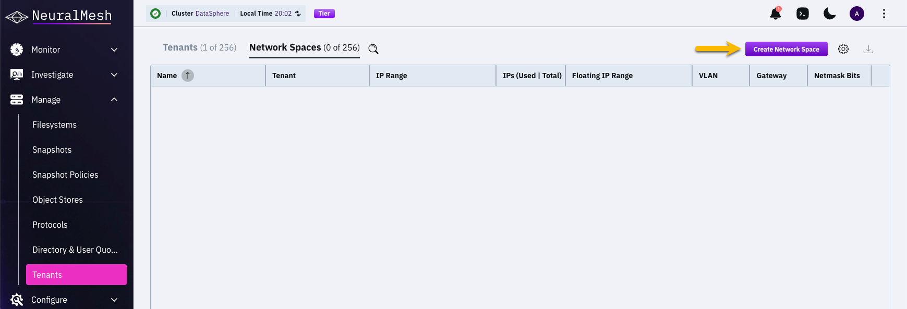
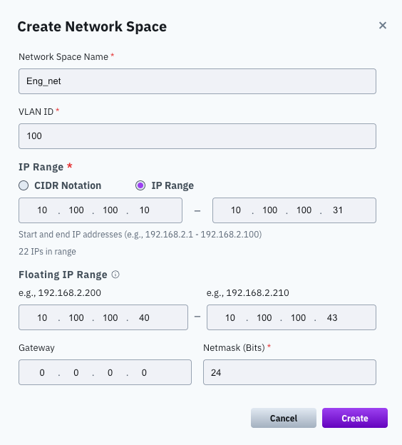
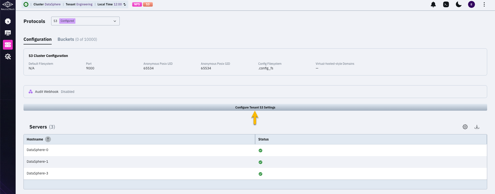
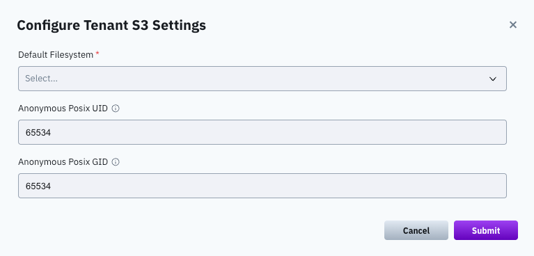

# Multi-tenancy cluster-level administration

## Overview

Multi-tenancy cluster-level administration enables cluster administrators to isolate a single cluster into independent environments, each with its own network boundaries, resource limits, and security policies. This is essential for tenants that need to share infrastructure across multiple teams or business units while maintaining strict separation between them.

At the foundation of this model is the **network space**, a cluster-level construct that defines a logical network boundary using a VLAN ID and an IP address range. Network spaces serve as the building blocks for tenant isolation by providing dedicated datapath endpoints.

Once network spaces are established, **tenant environments** can be created around them. Each tenant has its own administrator, storage quota, and assigned network spaces. A single tenant can span multiple network spaces to support use cases such as separating data traffic from management services, accommodating clients on different VLANs, and enabling redundant network paths.

Administrators control the full tenant lifecycle, creation, configuration, and removal, and can adjust resource limits, security policies, and quality-of-service (QoS) settings at any time. All tasks in this topic require the **ClusterAdmin** role.


Each network space operation produces **two** events: one when the change is committed, and one when it is verified on all backend servers. A pair of events for a single create, update, or remove is expected behavior, not a duplicate.


## Create a network space

A network space defines a cluster-level network boundary, including a VLAN ID and an IP range. After the administrator creates the network space, it can be assigned to a specific tenant to provide isolated datapath endpoints.


The system uses an internal proxy with a default NAT subnet of **198.18.0.0/16**. This range reduces the likelihood of IP address conflicts in customer environments. Each network namespace receives an IP address allocated from this range. To use a different internal IP range, contact the [Customer Success Team](../../support/getting-support-for-your-weka-system.md) to override the default.


#### **Before you begin**

* Ensure each server has an NVIDIA NIC.
* Ensure the switch ports connected to WEKA backend servers are configured as trunk ports that carry all VLANs intended for use in network spaces.
* Size the IP range using these guidelines:
  * IPs are assigned to NICs, not containers. When multiple backend containers share a NIC, they share the same IP.
  * Reserve one IP per NIC per server: 1 IP per server in an LACP configuration, 2 IPs per server in an HA dual-NIC configuration.
  * The range can exceed this minimum but must not be smaller.
  * IPs in this range are reserved for WEKA backend use only. Do not assign them to clients or any other resource.
  * Each VLAN is assigned to a single network space. Network spaces that use the same VLAN cannot share the same backends.
  * Use `weka cluster network-space show-usage` to inspect current IP allocation.

#### **GUI procedure**

1. From the menu, select **Manage > Tenants**.
2.  Select the **Network Spaces** tab and select **Create Network Space**.

    <div data-with-frame="true"><figure><figcaption></figcaption></figure></div>
3. Provide network space details:
   * **Network Space Name:** Enter a unique name for the network space (for example, `Eng_net`).
   * **VLAN ID:** Enter the VLAN ID assigned to this network boundary (for example, `100`).
4. In the **IP Range** section, provide the following:
   1. **IP Range:** Enter the starting and ending IP addresses for the network space. (Do not use the CIDR notation option.)
   2. **Floating IP Range:** Enter the starting and ending addresses reserved for tenant NFS services, up to 8 addresses. Provide this range if the network space serves NFS for a tenant. A tenant cannot be assigned to an NFS interface group until its network space has floating IPs.
   3. **Netmask (Bits):** Provide the subnet mask bits (for example, `24`). Default: 16.
   4. **Gateway:** Provide an optional default gateway IP address to specify the routing exit point for traffic leaving the local network space. The gateway must be visible from all IPs in range.

<div data-with-frame="true"><figure><figcaption><p>Create network space by IP range</p></figcaption></figure></div>

5. Select **Create**.

#### CLI alternative

Use the following command to add a network space:


```bash
weka cluster network-space add <name> [--vlan vlan]
                                      [--range range]
                                      [--fip-range fip-range]
                                      [--gateway gateway]
                                      [--netmask-bits netmask-bits]
                                      [--wait]
```


**Parameters**

| Parameter      | Description                                                                                                                                         |
| -------------- | --------------------------------------------------------------------------------------------------------------------------------------------------- |
| `name`\*       | Unique name for the network-space.                                                                                                                  |
| `vlan`         | VLAN ID (1..4094) for tagged traffic.                                                                                                               |
| `range`        | Specific IP range allocated for this space.                                                                                                         |
| `fip-range`    | Floating IP range allocated for tenant NFS services in this space. Maximum 8 addresses. Required only if the network space serves NFS for a tenant. |
| `gateway`      | Default gateway IP for the network-space.                                                                                                           |
| `netmask-bits` | Subnet mask bits (1..32). Default: 16.                                                                                                              |
| `wait`         | Block until every backend applies and verifies the network space, then report the cluster-wide result.                                               |


**Cluster-wide apply.** A network space must be applied on every backend before it can be used. With `--wait`, the command blocks until each backend reports its result, so a success means the space is in place cluster-wide. Creation is all-or-none: if any backend fails, the operation rolls back automatically and no partially applied network space is left behind. Without `--wait`, the command returns once the request is accepted and the backends apply it in the background.



A network space that serves NFS for a tenant supports a maximum of **8 floating IP addresses**, separate from the `range` used for backend containers. See [manage-nfs-for-tenants.md](manage-nfs-for-tenants.md "mention").


## Edit a network space

Cluster administrators can update the network boundaries of an existing network space, such as changing the VLAN ID or adjusting the IP address pool. While you can modify networking parameters, the network space name remains fixed.


While a tenant is attached to an interface group, the network space's **VLAN and netmask cannot be changed**. Renaming the space and updating its IP ranges are still allowed. To change the VLAN or netmask, first remove the tenant from the interface group. See [manage-nfs-for-tenants.md](manage-nfs-for-tenants.md "mention").


#### **GUI procedure**

1. From the menu, select **Manage > Tenants**.
2. Select the **Network Spaces** tab.
3. Locate the target network space, select the **Actions** menu (three vertical dots), and select **Edit**.

<div data-with-frame="true"><figure><figcaption></figcaption></figure></div>

3. Modify the network space properties as needed. For detailed information on these fields, refer to the network space creation procedure:&#x20;
   1. Update the VLAN ID if required.
   2. Modify the IP Range as described in the creation procedure.
   3. Update the Gateway or Netmask (Bits) if the subnet routing or size has changed.
4. Click **Save**.

#### CLI alternative

Use the following command to update a network space by its ID:


```bash
weka cluster network-space update <id> [--name name]
                                       [--vlan vlan]
                                       [--range range]
                                       [--fip-range fip-range]
                                       [--gateway gateway]
                                       [--netmask-bits netmask-bits]
                                       [--wait]
```


**Parameters**

| Parameter      | Description                                                         |
| -------------- | ------------------------------------------------------------------- |
| `id`\*         | Network space id.                                                   |
| `name`         | New name for the network-space.                                     |
| `vlan`         | New VLAN ID (1..4094) for tagged traffic.                           |
| `range`        | New IP range for the network-space.                                 |
| `fip-range`    | New floating IP range for tenant NFS services. Maximum 8 addresses. |
| `gateway`      | New default gateway IP for the network-space.                       |
| `netmask-bits` | New subnet mask bits (1..32). Default: 16.                          |
| `wait`         | Block until every backend applies the change, then report the cluster-wide result. |


Unlike creation, a failed update does not roll back. If the change cannot be applied on a backend, the cluster raises a **NetworkSpaceApplyStuck** alert that stays active until the backend recovers or an administrator resolves the operation. The alert names the commands to inspect and clear it.


## Remove a network space

Removing a network space permanently deletes its configuration from the cluster. Before proceeding, ensure that the network space is no longer assigned to any active tenants.


A network space cannot be removed while its floating IP range is in use through an interface group. Remove the tenant from the interface group first.


#### **GUI procedure**

1. From the menu, select **Manage > Tenants**.
2. Select the **Network Spaces** tab.
3. Locate the target network space, select the **Actions** menu (three vertical dots), and select **Remove**.
4. In the confirmation message, select **Confirm**.

#### CLI alternative

```bash
weka cluster network-space remove <name> [--wait]
```

**Parameters**

| Parameter | Description                                                                        |
| --------- | ---------------------------------------------------------------------------------- |
| `name`    | Network space name.                                                                |
| `wait`    | Block until every backend removes the network space, then report the cluster-wide result. |


As with an update, a failed removal does not roll back and raises a **NetworkSpaceApplyStuck** alert until it is resolved.


## Create a tenant environment

To establish a new tenant environment, the cluster administrator defines the tenant's identity, resource limits, and network boundaries. This procedure creates an isolated container where a designated tenant administrator manages their own filesystems, users, and security settings.

During creation, you can assign multiple network spaces to a single tenant. This capability allows you to:

* Separate data traffic from management services like LDAP or KMS.
* Support clients residing on different physical VLANs.
* Provide redundant network paths for high availability.

#### **GUI procedure**

1. From the menu, select **Manage > Tenants**.
2.  Select the **Tenants** tab and select **Create**.<br>

    <div data-with-frame="true"><figure><figcaption></figcaption></figure></div>
3. Configure the tenant properties:
   * **Tenant Name:** Enter a unique name for the tenant (for example, `Engineering`).
   * **Capacity Quota:** Toggle this to ON to limit the total storage capacity assigned to the tenant.
   * **Total Quota:** Enter the maximum capacity allowed and select the appropriate unit (for example, `1 TB`).
   * **Tenant Admin Username:** Enter the username for the tenant administrator (for example, `eng_tenant_admin`).
   * **Tenant Admin Password:** Enter and confirm a secure password for the tenant administrator.
   * **Network Spaces:** Select one or more predefined network spaces from the dropdown menu to assign them to the tenant.
   * **Enforce Filesystem Authentication:** Toggle this to ON to require user authentication for all filesystems created within this tenant.
   * **Enforce Network Space Access:** Toggle this to ON to restrict all mount operations to the assigned network space IP addresses.

<div data-with-frame="true"><figure><figcaption></figcaption></figure></div>

4. Select **Save**.

#### CLI alternative

```bash
weka tenant add <name> <username> [--ssd-quota ssd-quota]
                                  [--total-quota total-quota]
                                  [--enforce-fs-authentication enforce-fs-authentication]
                                  [--enforce-mount-netspace-access enforce-mount-netspace-access]
                                  [--network-spaces network-spaces]...
```


The CLI prompt requires the password after running the command.


**Parameters**

| Parameter                       | Description                                                                         |
| ------------------------------- | ----------------------------------------------------------------------------------- |
| `name`\*                        | Tenant name.                                                                        |
| `username`\*                    | Username of the tenant admin.                                                       |
| `password`\*                    | Password of the tenant admin.                                                       |
| `ssd-quota`                     | SSD quota. Supports decimal or binary units (for example, 1GB, 1GiB).               |
| `total-quota`                   | Total quota; supports decimal or binary units (for example, 1TB, 1TiB).             |
| `enforce-fs-authentication`     | Forces every filesystem under this tenant to require authentication.                |
| `enforce-mount-netspace-access` | Restricts mount requests to only those originating from the tenant's network space. |
| `network-spaces`...             | Network space names to assign (repeatable or comma-separated).                      |

## Edit a tenant environment

To modify an existing tenant's resource limits, security configuration, or S3 defaults, use the **Edit Tenant** dialog. While a cluster administrator can update quotas, network settings, and tenant-level S3 settings, the Tenant Name, Tenant Admin Username, and password fields are fixed and cannot be modified once the tenant is created.

#### Before you begin

To set the tenant-specific S3 defaults, an S3 cluster must be configure in the system.

#### **GUI procedure**

1. From the menu, select **Manage > Tenants**.
2. Select the **Tenants** tab.
3.  Locate the target tenant, select the **Actions** menu (three vertical dots), and select **Edit**.<br>

    <div data-with-frame="true"><figure><figcaption></figcaption></figure></div>
4.  Modify the tenant properties as needed. For detailed information on these fields, refer to the tenant creation procedure:

    * Tenant Name
    * Capacity Quota and Total Quota
    * Network Spaces
    * Enforce Filesystem Authentication
    * Enforce Network Space Access
    * **S3 settings:** Set the tenant-specific S3 defaults:
      * **Default filesystem:** Filesystem used when a bucket is created through the S3 API without an explicit filesystem.
      * **Anonymous UID/GID:** POSIX identity assigned to anonymous or public S3 access for this tenant.

    <div data-with-frame="true"><figure><figcaption><p>Edit tenant</p></figcaption></figure></div>
5. Click **Save**.


These settings extend the existing S3 defaults to the tenant scope. Use them when different tenants require different bucket placement or anonymous identity mapping.


#### CLI alternative

**Add or remove network spaces for a tenant**

A network space must be created in advance by a ClusterAdmin. You cannot assign a non-existent network space.


```bash
weka tenant network-space add [--tenant tenant]
                              [<network-spaces>]...
```


```bash
weka tenant network-space remove [--tenant tenant]
                                 [<network-spaces>]...
```

**Parameters**

| Parameter           | Description                                                                                 |
| ------------------- | ------------------------------------------------------------------------------------------- |
| `tenant`\*          | Tenant name (default: current user's tenant).                                               |
| `network-spaces`... | Network space names to add to or remove from a tenant (can be repeated or comma-separated). |

**Update tenant quotas**

```bash
weka tenant set-quota <tenant> [--ssd-quota <ssd-quota>]
                               [--total-quota <total-quota>]
```

**Parameters**

| Parameter     | Description                                                                              |
| ------------- | ---------------------------------------------------------------------------------------- |
| `tenant`\*    | Tenant name or ID.                                                                       |
| `ssd-quota`   | SSD quota: Capacity in decimal (for example, 1GB) or binary units (for example, 1GiB).   |
| `total-quota` | Total quota: Capacity in decimal (for example, 1TB) or binary units (for example, 1TiB). |

**Update tenant security options**


```bash
weka tenant update <tenant> [--enforce-fs-authentication enforce-fs-authentication]
                            [--enforce-mount-netspace-access enforce-mount-netspace-access]
```


**Parameters**

| Parameter                       | Description                                                                         |
| ------------------------------- | ----------------------------------------------------------------------------------- |
| `tenant`\*                      | Tenant name or ID.                                                                  |
| `enforce-fs-authentication`     | Forces every filesystem under this tenant to require authentication.                |
| `enforce-mount-netspace-access` | Restricts mount requests to only those originating from the tenant's network space. |

## Remove a tenant

Deleting a tenant is a permanent action that removes the tenant and its associated configuration.

**Before you begin**

Removal is blocked while the tenant still holds resources. Ensure the tenant no longer has:

* Active filesystems or S3 buckets.
* NFS exports or client groups, and an assignment to an interface group. See [manage-nfs-for-tenants.md](manage-nfs-for-tenants.md "mention").

#### **GUI procedure**

1. From the menu, select **Manage > Tenants**.
2. Select the **Tenants** tab.
3. Locate the target tenant, select the **Actions** menu (three vertical dots), and select **Remove**.
4. In the Remove Tenant confirmation message, select **Confirm**.

#### CLI alternative

```bash
weka tenant remove <tenant>
```


The CLI prompt requires the password after running the command.


## Manage tenant security policies

Tenant security operations are part of the broader security configuration and are documented in the _Security_ section.

At a high level, the CLI enables the following tenant-level security tasks:

* List security policies assigned to a tenant.
* Set (replace) security policies for a tenant.
* Reset (remove all) security policies.
* Attach additional security policies.
* Detach specific security policies.
* Revoke all API tokens for a tenant.

These operations are performed using the `weka tenant security` command group.

**Related topic**

[#manage-tenant-level-security-policies](../../security/manage-cidr-based-security-policies.md#manage-tenant-level-security-policies "mention")

## Manage tenant quality of service

Modify a tenant's performance limits to control resource consumption and ensure quality of service across the cluster.


```bash
weka tenant set-qos <tenant> [--max-throughput max-throughput]
                             [--max-iops max-iops]
```


**Parameters**

| Parameter        | Description                                                                                                                                          |
| ---------------- | ---------------------------------------------------------------------------------------------------------------------------------------------------- |
| `tenant`\*       | The name or ID of the tenant.                                                                                                                        |
| `max-throughput` | The maximum total throughput allowed for the tenant per second. Use a number with capacity units in Decimal or Binary: for example, 200GiB or 500GB. |
| `max-iops`       | The maximum total I/O operations allowed for the tenant per second. Use a number without units: for example, 500000.                                 |

## Configure tenant S3 settings

A cluster administrator configures a tenant's S3 settings during provisioning. A tenant administrator can adjust these settings for their own tenant afterwards.

You can configure dedicated S3 settings for a specific tenant. This includes defining a default filesystem for buckets created through the S3 API and assigning an anonymous POSIX User ID (UID) and Group ID (GID) for anonymous or public S3 access.

**Before you begin**

Ensure you are logged in with cluster administrator privileges to configure any tenant, or with tenant administrator privileges to configure your own tenant.

#### **GUI procedure**

1. Select **Manage > Protocols**, then select **S3** from the protocol selector.
2.  Select **Configure Tenant S3 Settings** on the **Configuration** tab.

    This control is a full-width bar below the Audit Webhook row, not a standard button.

    <div data-with-frame="true"><figure><figcaption><p>Configure Tenant S3 Settings control</p></figcaption></figure></div>
3.  Set the following fields:

    * **Default Filesystem:** Select the filesystem to use as a fallback when buckets are created through the S3 API.
    * **Anonymous Posix UID:** Enter the POSIX User ID to assign for identity mapping during anonymous or public S3 access. The default value is 65534.
    * **Anonymous Posix GID:** Enter the POSIX Group ID to assign for identity mapping during anonymous or public S3 access. The default value is 65534.

    <div data-with-frame="true"><figure><figcaption><p>Configure tenant S3 settings</p></figcaption></figure></div>
4. Select **Submit**.

#### CLI alternative

```bash
weka s3 cluster setup update [--default-fs-name default-fs-name]
                             [--anonymous-posix-uid anonymous-posix-uid]
                             [--anonymous-posix-gid anonymous-posix-gid]
```

## View alerts as a tenant

Cluster administrators can view the alert list as it appears to a specific tenant admin, without logging in as that user. This is useful when investigating alert visibility discrepancies in multi-tenant clusters.


Only users with the **ClusterAdmin** role can use this flag. Non-admin users receive a permission error. Passing the cluster admin name returns the same full alert list as running `weka alerts` without the flag.


Use the `--tenant` flag with the `weka alerts` command:

```bash
weka alerts --tenant <tenant_name>
```

**Parameters**

| Parameter     | Description                                                                                                        |
| ------------- | ------------------------------------------------------------------------------------------------------------------ |
| `tenant_name` | Name of the tenant whose alert view to display. Pass the cluster admin name to return the full cluster alert list. |

**Related topic**

[Alerts](../alerts/)
