# Multi-tenancy cluster-level administration

## Overview

Multi-tenancy cluster-level administration enables cluster administrators to isolate a single cluster into independent environments, each with its own network boundaries, resource limits, and security policies. This is essential for tenants that need to share infrastructure across multiple teams or business units while maintaining strict separation between them.

At the foundation of this model is the **network space**, a cluster-level construct that defines a logical network boundary using a VLAN ID and an IP address range. Network spaces serve as the building blocks for tenant isolation by providing dedicated datapath endpoints.

Once network spaces are established, **tenant environments** can be created around them. Each tenant has its own administrator, storage quota, and assigned network spaces. A single tenant can span multiple network spaces to support use cases such as separating data traffic from management services, accommodating clients on different VLANs, and enabling redundant network paths.

Administrators control the full tenant lifecycle, creation, configuration, and removal, and can adjust resource limits, security policies, and quality-of-service (QoS) settings at any time. All tasks in this topic require the **ClusterAdmin** role.

## Create a network space

A network space defines a cluster-level network boundary, including a VLAN ID and an IP range. After the administrator creates the network space, it can be assigned to a specific tenant to provide isolated datapath endpoints.


The system uses an internal proxy with a default NAT subnet of **198.18.0.0/16**. This range reduces the likelihood of IP address conflicts in customer environments. Each network namespace receives an IP address allocated from this range. To use a different internal IP range, contact the [Customer Success Team](../../support/getting-support-for-your-weka-system.md) to override the default.


#### **GUI procedure**

1. From the menu, select **Manage > Tenants**.
2.  Select the **Network Spaces** tab and select **Create**.

    <div data-with-frame="true"><figure>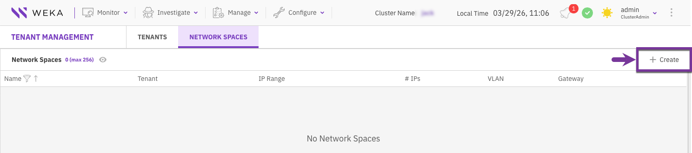<figcaption></figcaption></figure></div>
3. Provide network space details:
   * **Network Space Name:** Enter a unique name for the network space (for example, `Eng_net`).
   * **VLAN ID:** Enter the VLAN ID assigned to this network boundary (for example, `100`).
4. Choose one of the following methods to define the network range.



* Specify a network address followed by an integer (for example, `/24`) to specify the CIDR prefix length, which defines the subnet size for the given IP address range.
* Provide an optional default gateway IP address to specify the routing exit point for traffic leaving the local network space. The gateway must be visible from all IPs in range.

<div data-with-frame="true"><figure>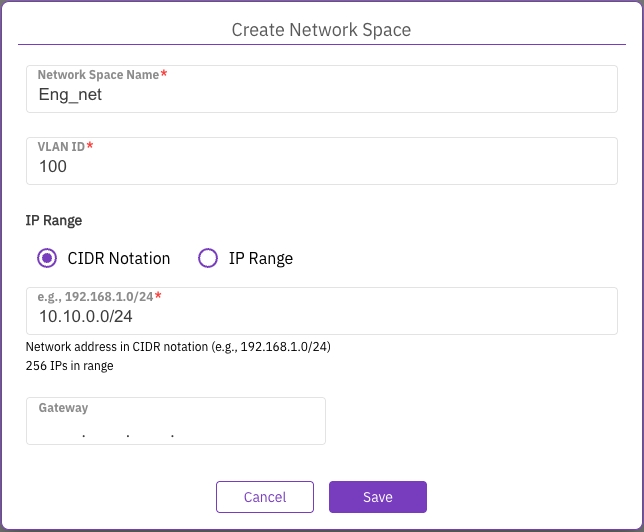<figcaption><p>Create network space by CIDR notation</p></figcaption></figure></div>



* Specify the starting and ending IP addresses to set the network boundaries.
* Provide the subnet mask by entering the number of bits (for example, `24`). This number represents the CIDR prefix length, defining the subnet size for the specified IP address range.
* Provide an optional default gateway IP address to specify the routing exit point for traffic leaving the local network space. The gateway must be visible from all IPs in range.

<div data-with-frame="true"><figure>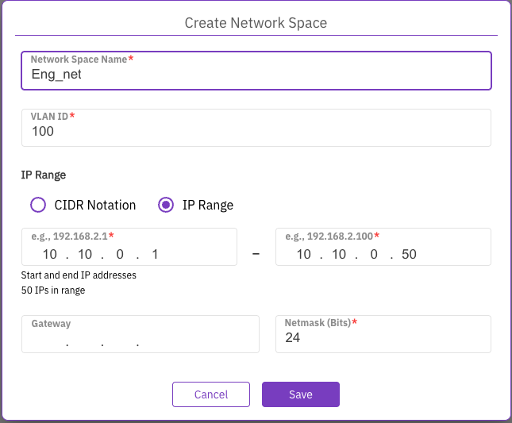<figcaption><p>Create network space by IP range</p></figcaption></figure></div>



5. Select **Save**.

#### CLI alternative

Use the following command to add a network space:


```bash
weka cluster network-space add <name> [--vlan vlan] [--range range] [--gateway gateway] [--netmask-bits netmask-bits]
```


**Parameters**

<table><thead><tr><th width="199">Parameter</th><th>Description</th></tr></thead><tbody><tr><td><code>name</code>*</td><td>Unique name for the network-space.</td></tr><tr><td><code>vlan</code></td><td>VLAN ID (1..4094) for tagged traffic.</td></tr><tr><td><code>range</code></td><td>Specific IP range allocated for this space.</td></tr><tr><td><code>gateway</code></td><td>Default gateway IP for the network-space.</td></tr><tr><td><code>netmask-bits</code></td><td>Subnet mask bits (1..32). Default: 16.</td></tr></tbody></table>

## Edit a network space

Cluster administrators can update the network boundaries of an existing network space, such as changing the VLAN ID or adjusting the IP address pool. While you can modify networking parameters, the network space name remains fixed.

#### **GUI procedure**

1. From the menu, select **Manage > Tenants**.
2. Select the **Network Spaces** tab.
3.  Locate the target network space, select the **Actions** menu (three vertical dots), and select **Edit**.<br>

    <div data-with-frame="true"><figure>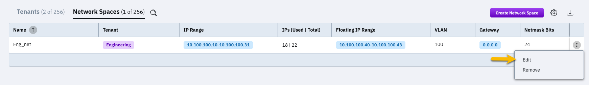<figcaption></figcaption></figure></div>
4.  Modify the network space properties as needed. For detailed information on these fields, refer to the network space creation procedure:

    * Update the VLAN ID if required.
    * Modify the IP Range using either CIDR Notation or IP Range as described in the creation procedure.
    * Update the Gateway or Netmask (Bits) if the subnet routing or size has changed.

    <div data-with-frame="true"><figure>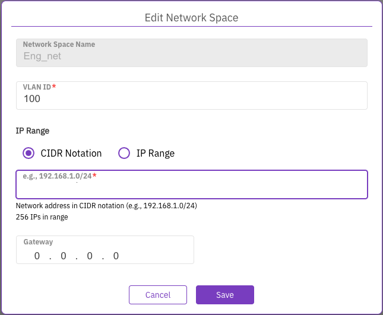<figcaption><p>Edit network</p></figcaption></figure></div>
5. Click **Save**.

#### CLI alternative

Use the following command to update a network space by its ID:


```bash
weka cluster network-space update <id> [--name name] [--vlan vlan] [--range range] [--gateway gateway] [--netmask-bits netmask-bits]
```


**Parameters**

<table><thead><tr><th width="199">Parameter</th><th>Description</th></tr></thead><tbody><tr><td><code>id</code>*</td><td>Network space id.</td></tr><tr><td><code>name</code></td><td>New name for the network-space.</td></tr><tr><td><code>vlan</code></td><td>New VLAN ID (1..4094) for tagged traffic.</td></tr><tr><td><code>range</code></td><td>New IP range for the network-space.</td></tr><tr><td><code>gateway</code></td><td>New default gateway IP for the network-space.</td></tr><tr><td><code>netmask-bits</code></td><td>New subnet mask bits (1..32). Default: 16.</td></tr></tbody></table>

## Remove a network space

Removing a network space permanently deletes its configuration from the cluster. Before proceeding, ensure that the network space is no longer assigned to any active tenants.

#### **GUI procedure**

1. From the menu, select **Manage > Tenants**.
2. Select the **Network Spaces** tab.
3. Locate the target Network Space, select the **Actions** menu (three vertical dots), and select **Edit**.
4.  In the Remove Network Space dialog, enter the exact Network Space Name to confirm the action.<br>

    <div data-with-frame="true"><figure>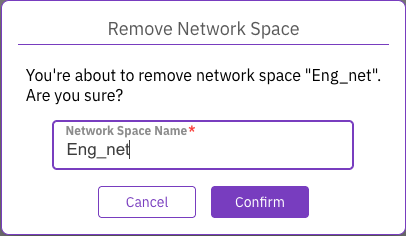<figcaption><p>Remove network space</p></figcaption></figure></div>
5. Select **Confirm**.

#### CLI alternative

```bash
weka cluster network-space remove <name>
```

**Parameters**

<table><thead><tr><th width="199">Parameter</th><th>Description</th></tr></thead><tbody><tr><td><code>name</code></td><td>Network space name.</td></tr></tbody></table>

## Create a tenant environment

To establish a new tenant environment, the cluster administrator defines the tenant's identity, resource limits, and network boundaries. This procedure creates an isolated container where a designated tenant administrator manages their own filesystems, users, and security settings.

During creation, you can assign multiple network spaces to a single tenant. This capability allows you to:

* Separate data traffic from management services like LDAP or KMS.
* Support clients residing on different physical VLANs.
* Provide redundant network paths for high availability.

#### **GUI procedure**

1. From the menu, select **Manage > Tenants**.
2.  Select the **Tenants** tab and select **Create**.<br>

    <div data-with-frame="true"><figure>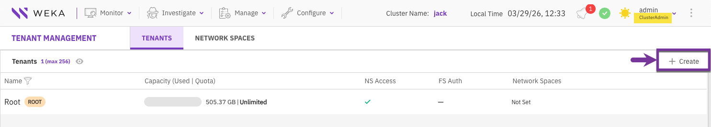<figcaption></figcaption></figure></div>
3. Configure the tenant properties:
   * **Tenant Name:** Enter a unique name for the tenant (for example, `Engineering`).
   * **Capacity Quota:** Toggle this to ON to limit the total storage capacity assigned to the tenant.
   * **Total Quota:** Enter the maximum capacity allowed and select the appropriate unit (for example, `300 GB`).
   * **Tenant Admin Username:** Enter the username for the tenant administrator (for example, `eng_tenant_admin`).
   * **Tenant Admin Password:** Enter and confirm a secure password for the tenant administrator.
   * **Network Spaces:** Select one or more predefined network spaces from the dropdown menu to assign them to the tenant.
   * **Enforce Filesystem Authentication:** Toggle this to ON to require user authentication for all filesystems created within this tenant.
   * **Enforce Network Space Access:** Toggle this to ON to restrict all mount operations to the assigned network space IP addresses.

<div data-with-frame="true"><figure>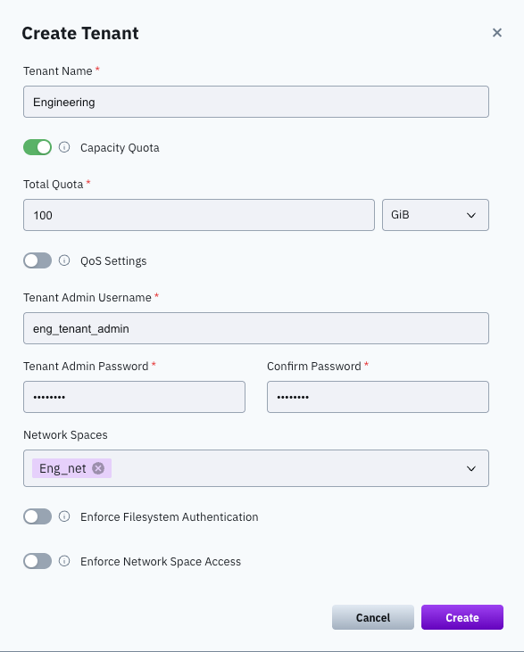<figcaption></figcaption></figure></div>

4. Select **Save**.

#### CLI alternative


```bash
weka tenant add <name> <username> [--ssd-quota ssd-quota] [--total-quota total-quota] [--enforce-fs-authentication enforce-fs-authentication] [--enforce-mount-netspace-access enforce-mount-netspace-access] [--network-spaces network-spaces]...
```



The CLI prompt requires the password after running the command.


**Parameters**

<table><thead><tr><th width="279">Parameter</th><th>Description</th></tr></thead><tbody><tr><td><code>name</code>*</td><td>Tenant name.</td></tr><tr><td><code>username</code>*</td><td>Username of the tenant admin.</td></tr><tr><td><code>password</code>*</td><td>Password of the tenant admin.</td></tr><tr><td><code>ssd-quota</code></td><td>SSD quota. Supports decimal or binary units (for example, 1GB, 1GiB).</td></tr><tr><td><code>total-quota</code></td><td>Total quota; supports decimal or binary units (for example, 1TB, 1TiB).</td></tr><tr><td><code>enforce-fs-authentication</code></td><td>Forces every filesystem under this tenant to require authentication.</td></tr><tr><td><code>enforce-mount-netspace-access</code></td><td>Restricts mount requests to only those originating from the tenant's network space.</td></tr><tr><td><code>network-spaces</code>...</td><td>Network space names to assign (repeatable or comma-separated).</td></tr></tbody></table>

## Edit a tenant environment

To modify an existing tenant's resource limits or security configurations, use the **Edit Tenant** dialog. While a cluster administrator can update quotas and network settings, the Tenant Name, Tenant Admin Username, and password fields are fixed and cannot be modified once the tenant is created.

#### **GUI procedure**

1. From the menu, select **Manage > Tenants**.
2. Select the **Tenants** tab.
3.  Locate the target tenant, select the **Actions** menu (three vertical dots), and select **Edit**.<br>

    <div data-with-frame="true"><figure>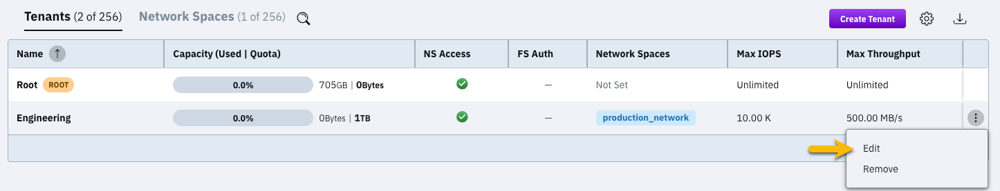<figcaption></figcaption></figure></div>
4.  Modify the tenant properties as needed. For detailed information on these fields, refer to the tenant creation procedure:

    * Tenant Name
    * Capacity Quota and Total Quota
    * Network Spaces
    * Enforce Filesystem Authentication
    * Enforce Network Space Access

    <div data-with-frame="true"><figure>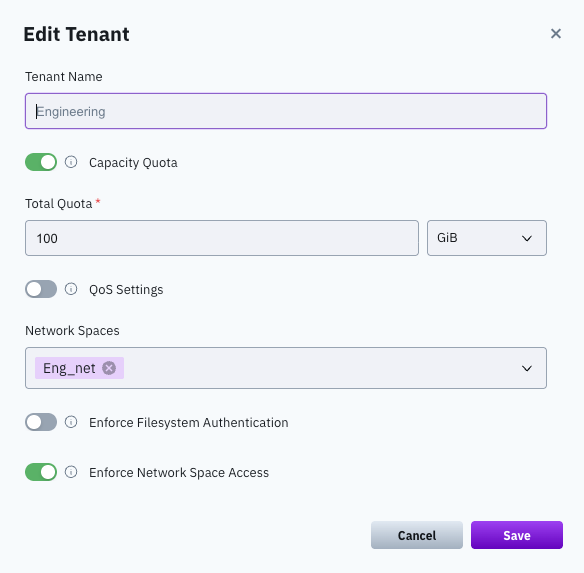<figcaption><p>Edit tenant</p></figcaption></figure></div>
5. Click **Save**.

#### CLI alternative

**Add or remove network spaces for a tenant**

A network space must be created in advance by a ClusterAdmin. You cannot assign a non-existent network space.


```bash
weka tenant network-space add [--tenant tenant] [<network-spaces>]...
```


```bash
weka tenant network-space remove [--tenant tenant] [<network-spaces>]...
```

**Parameters**

<table><thead><tr><th width="279">Parameter</th><th>Description</th></tr></thead><tbody><tr><td><code>tenant</code>*</td><td>Tenant name (default: current user's tenant).</td></tr><tr><td><code>network-spaces</code>...</td><td>Network space names to add to or remove from a tenant (can be repeated or comma-separated).</td></tr></tbody></table>

**Update tenant quotas**

```bash
weka tenant set-quota <tenant> [--ssd-quota <ssd-quota>] [--total-quota <total-quota>]
```

**Parameters**

<table><thead><tr><th width="198">Parameter</th><th>Description</th></tr></thead><tbody><tr><td><code>tenant</code>*</td><td>Tenant name or ID.</td></tr><tr><td><code>ssd-quota</code></td><td>SSD quota: Capacity in decimal (for example, 1GB) or binary units (for example, 1GiB).</td></tr><tr><td><code>total-quota</code></td><td>Total quota: Capacity in decimal (for example, 1TB) or binary units (for example, 1TiB).</td></tr></tbody></table>

**Update tenant security options**


```bash
weka tenant update <tenant> [--enforce-fs-authentication enforce-fs-authentication] [--enforce-mount-netspace-access enforce-mount-netspace-access]
```


**Parameters**

<table><thead><tr><th width="279">Parameter</th><th>Description</th></tr></thead><tbody><tr><td><code>tenant</code>*</td><td>Tenant name or ID.</td></tr><tr><td><code>enforce-fs-authentication</code></td><td>Forces every filesystem under this tenant to require authentication.</td></tr><tr><td><code>enforce-mount-netspace-access</code></td><td>Restricts mount requests to only those originating from the tenant's network space.</td></tr></tbody></table>

## Remove a tenant

Deleting a tenant is a permanent action that removes the tenant and its associated configuration. Before proceeding, ensure that the tenant no longer contains active filesystems or S3 buckets.

#### **GUI procedure**

1. From the menu, select **Manage > Tenants**.
2. Select the **Tenants** tab.
3. Locate the target tenant, select the **Actions** menu (three vertical dots), and select **Edit**.
4.  In the Remove Tenant dialog, enter the exact Tenant Name to confirm the action.<br>

    <div data-with-frame="true"><figure>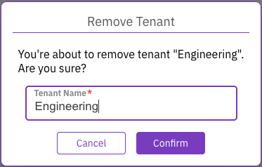<figcaption><p>Remove tenant</p></figcaption></figure></div>
5. Select **Confirm**.

#### CLI alternative

```bash
weka tenant remove <tenant>
```


The CLI prompt requires the password after running the command.


## Manage tenant security policies

Tenant security operations are part of the broader security configuration and are documented in the _Security_ section.

At a high level, the CLI enables the following tenant-level security tasks:

* List security policies assigned to a tenant.
* Set (replace) security policies for a tenant.
* Reset (remove all) security policies.
* Attach additional security policies.
* Detach specific security policies.
* Revoke all API tokens for a tenant.

These operations are performed using the `weka tenant security` command group.

**Related topic**

[#manage-tenant-level-security-policies](../../security/manage-cidr-based-security-policies.md#manage-tenant-level-security-policies "mention")

## Manage tenant quality of service

Modify a tenant's performance limits to control resource consumption and ensure quality of service across the cluster.


```bash
weka tenant set-qos <tenant> [--max-throughput max-throughput] [--max-iops max-iops]
```


**Parameters**

<table><thead><tr><th width="220">Parameter</th><th>Description</th></tr></thead><tbody><tr><td><code>tenant</code>*</td><td>The name or ID of the tenant.</td></tr><tr><td><code>max-throughput</code></td><td>The maximum total throughput allowed for the tenant per second. Use a number with capacity units in Decimal or Binary: for example, 200GiB or 500GB.</td></tr><tr><td><code>max-iops</code></td><td>The maximum total I/O operations allowed for the tenant per second. Use a number without units: for example, 500000.</td></tr></tbody></table>

**Related topic**

[Broken link](/broken/pages/-LBJvd2jB8hUJhPLHHmk#quality-of-service-qos "mention")
