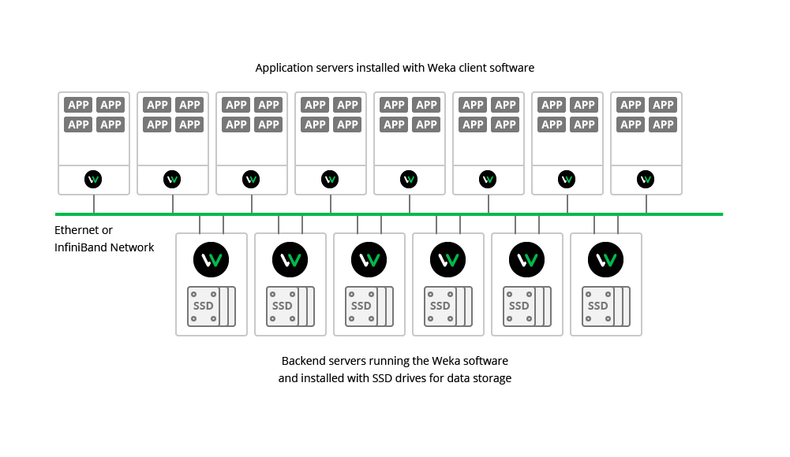

# About the Weka System

## Basic Weka System Deployment {#basic-deployment-model}

The basic Weka deployment model involves the creation of a sharable filesystem to be used by the application servers. This requires the installation of Weka client software which implements a POSIX filesystem driver on each application server intended to access data. This filesystem driver enables each of the application servers to access the Weka system as if it is a local drive, perceiving the Weka system as a local attached filesystem device while it is actually shared among multiple application servers.

The file services are implemented by a group of [backend hosts](https://docs.weka.io/glossary#backend-host-a-host-that-runs-the-weka-software-and-can-also-be-installed-with-ssd-drives-dedicated-to-the-weka-system-providing-services-to-client-hosts) running the Weka software and fully dedicated to the Weka system. SSD drives for storing the data are installed on these servers. The resultant storage system is scalable to hundreds of backends and thousands of clients.

The Weka backends are configured as a cluster which, together with the Weka clients installed on the application servers, forms one large shareable, distributed and scalable file storage system:

**Shareable:** All clients can share the same filesystems, so any file written by any of the clients is immediately available to any client reading the data. In technical terms, this means that Weka is a strongly-consistent, POSIX-compliant system.

**Distributed:** A Weka system is formed as a cluster of multiple backends, each of which provides services concurrently.

**Scalable:** The Weka system linear performance depends on the size of the cluster. Consequently, a certain amount of performance will be received for a cluster of size x, while doubling the size of the cluster to 2x will deliver double the performance. This applies to both data and metadata.

## Weka System Functionality Features {#weka-functionality-features}

### Protection

The Weka system is N+2 or N+4 fully protected, i.e., any 2 concurrent failures in drives or backends does not cause any loss of data and maintains the Weka system up and running to provide continuous services. This is achieved through a complex distributed protection scheme, which is determined when forming a cluster. The data part can range from 4 to 16, and the protection scheme can be either 2 or 4, i.e., clusters can be 4+2, 10+2 and even 16+4 for a large cluster of backend hosts.

### Distributed Network Scheme

The Weka system implements an any-to-any protection scheme, ensuring that if a backend fails, a rebuild process is performed using all other backends, taking the data that resided on the failed backend and recreating it using redundancy on other backends in the cluster. Consequently, redundancy is not redundancy across groups of backends, but is achieved through groups of data sets that protect each other in the whole cluster of backends. In this way, if one backend fails in a cluster of 100 backends, all the other 99 backends will participate in the rebuild process, simultaneously reading and writing. This means that the Weka system rebuild process is extremely fast, unlike traditional storage architectures where functioning backends are only a small part of the backends or drives participating in the rebuild process. Furthermore, the bigger the cluster, the faster the rebuild process.

### Failed Component Replacement as a Background Process

The hot spare is configured in the Weka system clusters by providing the extra capacity required to return to full redundancy after a rebuild, unlike traditional approaches which dedicate specific physical components as the hot spare. Consequently, a cluster of 100 backends will be configured with sufficient capacity to rebuild the data and return to full redundancy even following two failures, after which it is still possible to withstand another 2 failures.

This strategy for the replacement of a failed component does not affect the vulnerability of the system. Following a system failure, it is not necessary to replace a failed component with a valid component in order to recreate the data. In the Weka system, data is immediately recreated, leaving the replacement of the failed component with a functioning component as a background process.

### Failure Domains

Failure domains are groups of backends that may fail because of a single, root cause. For example, all servers in a rack can be considered a failure domain if all are powered through a single power circuit, or all are connected through a single TOR switch. Consider a setup of 10 such racks with a cluster of 50 Weka backends \(5 backends in each rack\). During formation of the Weka cluster, it is possible to configure with 6+2 protection and make the Weka system aware of these possible failure domains by forming a protection stripe across racks. In this way, the 6+2 stripe will be spread on different racks, ensuring that the system remains operational in a full rack failure and that data is not lost.

For failure domains, the stripe width must match the failure domain count - if there are 10 racks and one of them represents a single point of failure, 16+4 cluster protection is not possible. Consequently, protection and support of failure domains is dependent on the stripe width, the protection level, and the number of hot spares required.

### Prioritized Data Rebuild Process

When a failure occurs, the data rebuild process begins by reading all the stripes where the failure occurred, rebuilding the data and returning to full protection. If a second failure occurs, there will actually be three possible types of stripes:

1. Stripes not affected by either of the failed components – no action required.
2. Stripes affected by only one of the failed components.
3. Stripes affected by both the failed components.

Naturally, according to rules of multiplicity, the number of stripes affected by two failed components is much smaller than the number of stripes affected by a single failed component. However, in situations where stripes affected by both the failed components have yet to be rebuilt, a third component failure will expose the Weka system to data loss.

To reduce this risk, the Weka system prioritizes the rebuild process, starting first with stripes affected by two component failures. Since the number of such stripes is much smaller, this rebuild process is performed very quickly, within minutes or less. The Weka system then returns to the rebuild of stripes affected by only one failed component, and can still withstand another concurrent failure without any loss of data. This prioritized approach to the rebuild process ensures that data is almost never lost, and that service and data are always available.

### Seamless Distribution, Scale and Performance

Each Weka client installed on an application server directly accesses the relevant Weka backend host storing the data, i.e., each client does not access one backend, which then forwards the access request. Weka clients include a completely synchronized map of which backend stores which type of data, representing a joint configuration that all clients and backends are aware of.

When a Weka client tries to access a certain file or an offset in a file, a cryptographic hash function indicates which backend contains the required file or offset. When a cluster expansion is performed or a component failure occurs, the backend responsibilities and capabilities are instantly redistributed between the various components. This is the basic mechanism that allows the Weka system to linearly grow performance and is the key to linearly synchronizing scaling size to scaling performance. If, for example, backends are added to double the size of a cluster, different parts of the filesystems are redistributed to the new backends, thereby instantly delivering twice the performance.

Furthermore, if a cluster is just grown modestly e.g., from 100 to 110 backends, it is not necessary to redistribute all the data, and only 10% of the existing data will be copied to the new backends, in order to equally redistribute the data on all the backends. This balancing of the data – extending participation of all backends in all read operations - is important for scaled performance, ensuring that there are no idle or full backends, and that each backend in a cluster stores the same amount of data.

The duration of all these completely seamless operations depends on the capacity of the root backends and the network bandwidth. Ongoing operations are not affected, and performance is improved as the redistribution of data is executed. Completion of the redistribution process delivers optimal capacity and performance.

## Hyper-Converged Weka System Deployment {#hyper-cconverged-weka-deployment-model}

The Weka system can be deployed in a hyper-converged configuration. An alternative to the basic Weka system deployment, this enables the configuration of hundreds of application servers running user applications and installed with Weka clients in order to access the Weka cluster. Consequently, instead of provisioning servers fully dedicated to Weka backends, it enables the installation of a Weka client on each application server, and the installation of one or more SSDs as well as backend processes on the existing application servers. In such a configuration, the Weka system backend processes operate as one big cluster, takeover the local SSDs and form a sharable, distributed and scalable filesystem available to the application servers, in the same way as in the basic Weka system deployment. The only difference is that instead of installing SSDs on backends dedicated to the Weka system, in this configuration the Weka backends share the same physical infrastructure with the application servers.

This mixture of different storage and computation abilities delivers more effective performance and a better utilization of resources. However, unlike the basic Weka system deployment, where an application server failure has no effect on the other backends, here the cluster will be affected if an application server is rebooted or fails. The cluster is still protected by the N+2 scheme, and can withstand two such concurrent failures. Consequently, hyper-converged Weka deployments require more careful integration, as well as more detailed awareness between computation and storage management practices.

Otherwise, this is technically the same solution as the basic Weka system deployment, with all the same Weka system functionality features for protection, redundancy, failed component replacement, failure domains, prioritized data rebuilds and seamless distribution, scale and performance. Some of the servers may be installed with a Weka backend process and a local SSD, while others may have clients only. This means that there can be a cluster of application servers with Weka software installed on some and Weka clients installed on others.

## Selecting a Redundancy Scheme {#selecting-a-redundancy-scheme}

Redundancy schemes in Weka system deployments can range from 4+2 to 16+4. There are a number of considerations for selecting the most suitable, optimal configuration. It all depends on redundancy, the data stripe width, the hot spare capacity and the performance required during a rebuild from a failure.

**Redundancy** can be N+2 or N+4, and impacts both capacity and performance. A redundancy of 2 is sufficient for the majority of configurations. A redundancy of 4 is usually used for clusters of 100 or more backends, or for extremely critical data.

**Data Stripe Width** is the number of data components, which can be 4-16. The bigger the data stripe, the better the eventual net capacity. Consideration has to be given to both raw and net capacity. Raw capacity is the total capacity of SSDs in the deployment. Net capacity relates to how much is actually available for the storage of data. Consequently, bigger stripe widths provide more net capacity, but may impact performance under rebuild, as discussed in Performance Required During a Rebuild from a Failure. For extremely critical data, it is recommended to consult the Weka Support Team to determine whether the stripe width matches the resiliency requirements.

**Hot Spare Capacity** is an IT issue, relating to the time required to replace faulty components. The faster that IT succeeds in processing failures, or guarantees the replacement of faulty components, the lower the hot spare capacity required. The more relaxed, and hence cost-effective, the component replacement schedule is, the more the required hot spare capacity. For example, remotely-located systems visited once a quarter to replace any failed drives require more hot spares than systems with guaranteed 24/7 service.

**Performance Required During a Rebuild from a Failure** is impacted only by read rebuild operations. Unlike other storage systems, writing performance is unaffected by failures and rebuilds, since Weka systems continue writing to functioning backends in the cluster. However, read performance can be affected, because the reading of data from a failed component has to be performed from the whole stripe. This requires simultaneous operation and an instant priority rebuild for data read operations. If, for example, one failure occurs in a cluster of 100 backends, performance will be affected by 1%; however, in a cluster 100 backends with a stripe width of 16, performance will be reduced by up to 16% at the beginning of the rebuild. Naturally, the cluster size cannot exceed the stripe width or the number of failure domains. Consequently, for large clusters, it is recommended that the stripe width does not exceed 25% of the cluster size, e.g., for a cluster of 40 backends, 8+2 protection is recommended, so that if a failure occurs, the impact on performance will not exceed 25%.

**Write Performance** is generally better the larger the stripe width, since the system has to compute a smaller proportion of protected data to real data. This is particularly applicable to large writes in a system accumulating data for the first time.

