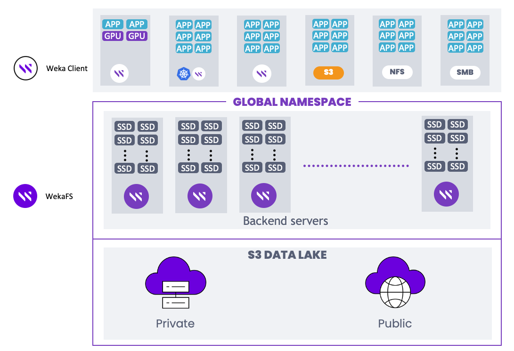

# Introduction

The WEKA filesystem (WekaFS™) redefines storage solutions with its software-only approach, compatible with standard AMD or Intel x86-based servers and NVMe SSDs. It eliminates the need for specialized hardware, allowing easy integration of technological advancements without disruptive upgrades. WekaFS addresses common storage challenges by removing performance bottlenecks, making it suitable for environments requiring low latency, high performance, and cloud scalability.

Use cases span various sectors, including AI/ML, Life Sciences, Financial Trading, Engineering DevOps, EDA, Media Rendering, HPC, and GPU pipeline acceleration. Combining existing technologies and engineering innovations, WekaFS delivers a powerful, unified solution that outperforms traditional storage systems, efficiently supporting various workloads.

WekaFS is a fully distributed parallel filesystem leveraging NVMe Flash for file services. Integrated tiering seamlessly expands the namespace to and from HDD object storage, simplifying data management. The intuitive GUI allows easy administration of exabytes of data without specialized storage training.

WekaFS stands out with its unique architecture, overcoming legacy systems’ scaling and file-sharing limitations. Supporting POSIX, NFS, SMB, S3, and GPUDirect Storage, it offers a rich enterprise feature set, including snapshots, clones, tiering, cloud-bursting, and more.

Benefits include high performance across all IO profiles, scalable capacity, robust security, hybrid cloud support, private/public cloud backup, and cost-effective flash-disk combination. WekaFS ensures a cloud-like experience, seamlessly transitioning between on-premises and cloud environments.

<figure><figcaption>
WekaFS combines NVMe flash with cloud object storage in a single global namespace
</figcaption></figure>

WekaFS functionality running in its RTOS within the Linux container (LXC) is comprised of the following software components:

* **File services (frontend):** Manages multi-protocol connectivity.
* **File system computing and clustering (backend):** Manages data distribution, data protection, and file system metadata services.
* **SSD drive agent:** Transforms the SSD into an efficient networked device.
* **Management process:** Manages events, CLI, statistics, and call-home capability.
* **Object connector:** Read and write to the object store.

By bypassing the kernel, WekaFS achieves faster, lower-latency performance, portable across bare-metal, VM, containerized, and cloud environments. Efficient resource consumption minimizes latency and optimizes CPU usage, offering flexibility in shared or dedicated environments.

<figure><figcaption>
WekaFS software-based storage architecture
</figcaption></figure>

WekaFS design departs from traditional NAS solutions, introducing multiple filesystems within a global namespace that share the same physical resources. Each filesystem has its unique identity, allowing customization of snapshot policies, tiering, role-based access control (RBAC), quota management, and more. Unlike other solutions, filesystem capacity adjustments are dynamic, enhancing scalability without disrupting I/O.

The WEKA system offers a robust, distributed, and highly scalable storage solution, allowing multiple application servers to access shared filesystems efficiently and with solid consistency and POSIX compliance.

**Related information**

[WEKA Architectural Whitepaper](https://www.weka.io/resources/white-paper/wekaio-architectural-whitepaper/#intro)
