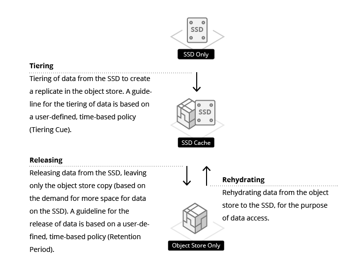
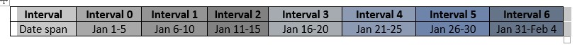
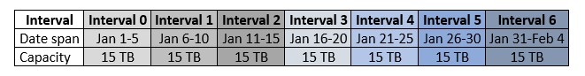
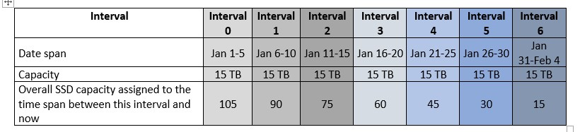
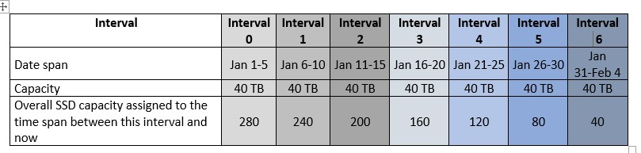
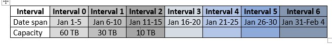
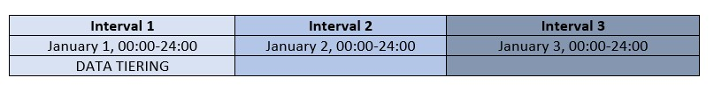

# Data Lifecycle Management

## Media Options for Data Storage in the Weka System

In the Weka system, data can be stored on two forms of media:

1. On locally-attached SSDs, which are an integral part of the Weka system configuration.
2. On object store systems external to the Weka system, which are either third party solutions, cloud services or part of the Weka system.

The Weka system can be configured either as an SSD-only system, or as a data management system consisting of both SSDs and object stores. By nature, SSDs provide high performance and low latency storage, while object stores compromise performance and latency but are the most cost-effective solution available for storage. Consequently, users focused on high performance only should consider using an SSD-only Weka system configuration, while users seeking to balance between performance and cost should consider a tiered data management system, with the assurance that the Weka system features will control the allocation of hot data on SSDs and warm data on object stores, thereby optimizing the overall user experience and budget.


**Note:** In SSD-only configurations, the Weka system will sometimes use an external object store for backup, as explained in the Snap To Object feature.


## Guidelines for Data Storage in Tiered Weka System Configurations

In tiered Weka system configurations, there are various locations for data storage as follows:

1. Metadata is stored only on the SSDs.
2. Writing of new files, adding data to existing files or modifying the content of files is always terminated on the SSD, irrespective of whether the file is currently stored on the SSD or tiered to an object store.
3. When reading the content of a file, data can be accessed from either the SSD \(if it is available on the SSD\) or rehydrated from the object store \(if it is not available on the SSD\).  


**Note:** In some cases, non-4 KB aligned write in the direct mode may be an exception to rule 2 above. 



**Note:** When using the Snap To Object feature to rehydrate data from an object store, some of the metadata will sometimes still be in the object store until it is accessed for the first time.


This data management approach to data storage on one of two possible media requires system planning to ensure that most commonly-used data \(hot data\) resides on the SSD to ensure high performance, while less-used data \(warm data\) is stored on the object store. In the Weka system, this determination of the data storage media is a completely seamless, automatic and transparent process, with users and applications unaware of the transfer of data from SSDs to object stores, or from object stores to SSDs. The data is accessible at all times through the same strongly-consistent POSIX filesystem API, irrespective of where it is stored. Only latency, throughput and IOPS are affected by the actual storage media.

Furthermore, the Weka system tiers data in chunks, rather than in complete files. This enables the smart tiering of subsets of a file \(and not only complete files\) between SSDs and object stores.

The network resources allocated to the object store connections can be controlled. This enables cost control when using cloud-based object storage services, since the cost of data stored in the cloud depends on the quantity stored and the number of requests for access made.

## States in the Weka System Data Management Storage Process

Data management represents the media being used for the storage of data. In tiered Weka system configurations, data can exist in one of three possible states:

1. **SSD-only:** When data is created, it exists only on the SSDs.
2. **SSD-cached:** A tiered copy of the data exists on both the SSD and the object store.
3. **Object Store only:** Data resides only on the object store.


**Note:** These states represent the lifecycle of data, and not the lifecycle of a file. When a file is modified, each modification creates a separate data lifecycle for the modified data.    


In order to read data residing only on an object store, the data must first be rehydrated back to the SSD.

In the Weka system, file modification is never implemented as in-place write, but rather as a write to a new area located on the SSD, and the relevant modification of the meta-data. Consequently, write operations are never associated with object store operations.

## The Role of SSDs in Tiered Weka Configurations

All writing in the Weka system is performed to SSDs. The data residing on SSDs is hot data, i.e., data that is currently in use. In tiered Weka configurations, SSDs have three primary roles in accelerating performance: metadata processing, a staging area for writing and as a cache for read performance.

### Metadata Processing

Since filesystem metadata is by nature a large number of update operations each with a small number of bytes, the embedding of metadata on SSDs serves to accelerate file operations in the Weka system.

### SSD as a Staging Area

Since writing directly to an object store demands high latency levels while waiting for approval that the data has been written, with the Weka system there is no writing directly to object stores. Much faster writing is performed directly to the SSDs, with very low latency and therefore much better performance. Consequently, in the Weka system, the SSDs serve as a staging area, providing a buffer that is big enough for writing until later tiering of data to the object store. On completion of writing, the Weka system is responsible for tiering the data to the object store and for releasing it from the SSD.

### SSD as a Cache

Recently accessed or modified data is stored on SSDs, and most read operations will be of such data and served from SSDs. This is based on a single, large LRU clearing policy for the cache that ensures optimal read performance.

## Time-based Policies for the Control of Data Storage Location

The Weka system includes user-defined policies which serve as guidelines to control the data storage management. They are derived from a number of factors:

1. The rate at which data is written to the system and the quantity of data.
2. The capacity of the SSDs configured to the Weka system.
3. The speed of the network between the Weka system and the object store, and the performance capabilities of the object store itself, e.g., how much the object store can actually contain.

For tiered filesystems, the following parameters must be defined:

1. The size of the filesystem.
2. The amount of filesystem data to be stored on the SSD.
3. The data Retention Period, a time-based policy which is the target time for data to be stored on an SSD after creation, modification or access, and before release from the SSD \(this is only a target; the actual release schedule depends on the amount of available space\). This is defined per filesystem group.
4. The Tiering Cue, a time-based policy which determines the minimum amount of time that data will remain on an SSD before it is considered for release. By default, this is a third of the Retention Period, and in most cases, this works well. The Tiering Cue is important because it is pointless to tier a file which is about to be modified or deleted to the object store. The Tiering Cue is defined per filesystem group.


**For Example**

_When writing log files which are processed every month but retained forever:_ It is recommended to define a Retention Period of 1 month, a Tiering Cue of 1 day, and ensure that there is sufficient SSD capacity to hold 1 month of log files.

_When storing genomic data which is frequently accessed during the first 3 months after creation, requires a scratch space for 6 hours of processing, and whose output needs to be retained forever:_ It is recommended to define a Retention Period of 3 months and to allocate an SSD capacity that will be sufficient for 3 months of output data and the scratch space. The Tiering Cue should be defined as 1 day, in order to avoid a situation where the scratch space data is tiered to an object store and released from the SSD immediately afterwards.



**Note:** Retention Period and Tiering Cue policies can be edited at any time, e.g., changing the data Retention Period from 3 to 5 days. However, such a policy change is only relevant for new data written after the update of the policy. Tiering of data written before a policy change can be unpredictable; contact the Weka Support Team for guidelines.


## Data Retention Period Policy

Consider a scenario of a 100 TB filesystem, 500 TB of object store space and 100 TB of SSD space. If the data Retention Period policy is defined as 1 month and only 10 TB of data are written per month, it will probably be possible to maintain data from the last 10 months on the SSDs. On the other hand, if 200 TB of data are written per month, it will only be possible to maintain data from half of the month on the SSDs. Additionally, there is no guarantee that the data on the SSDs is the data written in the last 2 weeks of the month, because the Weka system has no control over the resolution. This also depends on the Tiering Cue.

Consequently, the data Retention Period policy determines the resolution of the Weka system release decisions. If it is set to 1 month and the SSD capacity is sufficient for 10 months of writing, then the first month will be kept on the SSDs. However, it is never possible to know 1 month in advance which data resides on the SSDs and which data has been released to the object stores.


**Note:** If the Weka system cannot comply with the defined Retention Period, e.g., the SSD is full and data has not been released from the SSD to the object store, a Break In Policy will occur. In such a situation, an event is received in the Weka system event log, advising that the system has not succeeded in complying with the policy and that data has been automatically released from the SSD to the object store, before completion of the defined Retention Period. No data will be lost \(since the data has been transferred to the object store\), but slower performance may be experienced.



**Note:** If the data writing rate is always high and the Weka system fails to successfully release the data to the object store, an Object Store Bottleneck will occur. If the bottleneck continues, this will also result in a Policy Violation event.


## Tiering Cue Policy

This policy defines the period of time to wait before the release of data from the SSD to the object store. Automatically derived by the Weka system once the data Retention Period has been defined, it is typically used when it is expected that some of the data being written will be rewritten/modified/deleted in the short term.

The Weka system integrates a rolling progress control with three rotating periods of 0, 1 and 2.

1. Period 0: All data written is tagged as written in the current period.
2. Period 1: The switch from 0 to 1 is according to the Tiering Cue policy.
3. Period 2: Starts after the period of time defined in the Tiering Cue, triggering the transfer of data written in period 0 from the SSD to the object store.


**Note:** Not all data is transferred to the object store in the order that it was written. If, for example, the Tiering Cue is set to 1 month, there is no priority or order in which the data from the whole month is released to the object store; data written at the end of the month may be released to the object store before data written at the beginning of the month.



**Note:** The Tiering Cue cannot be more than 1/3 of the Retention Period. The Tiering Cue default is 10-30 seconds, i.e., tiering will be performed after 10-30 seconds.  


## Management of Data Retention Policies {#management-of-data-retention-policies}

Since the Weka system is a highly scalable data storage system, data storage policies in tiered Weka configurations cannot be based on cluster-wide FIFO methodology, because clusters can contain billions of files. Instead, data retention is managed by timestamping every piece of data, where the timestamp is based on a resolution of intervals which may extend from minutes to weeks. The Weka system maintains the interval in which each piece of data was created, accessed or last modified.

Users only specify the data Retention Period and based on this, each interval is one quarter of the data Retention Period. Data written, modified or accessed prior to the last interval is always released, even if SSD space is available.


**Note:** The timestamp is maintained per piece of data in chunks of up to 1 MB, and not per file. Consequently, different parts of big files may have different tiering states.



**For Example:** In a Weka system that is configured with a data Retention Period of 20 days, data is split into 7 interval groups, with each group spanning a total of 5 days \(5 being 25% of 20, the data Retention Period\). If the system starts operating on January 1, then data written, accessed or modified between January 1-5 is classified as belonging to interval 1, data written, accessed or modified between January 6-10 belongs to interval 2, and so on. In such a case, the 7 intervals will be timestamped and divided as follows:


## Data Release Process from SSD to Object Store {#data-release-process-from-ssd-to-object-store}

At any given moment, the Weka system releases the filesystem data of a single interval, transferring it from the SSD to the object store. This release process is based on the available SSD capacity. Consequently, if there is sufficient SSD capacity, only data which was modified or written before 7 intervals will be released.


**For Example:** If 3 TB of data is produced every day, i.e., 15 TB of data in each interval\), the division of data will be as follows:


Now consider a situation where the total capacity of the SSD is 100 TB. The situation in the example above will be as follows:

Since the resolution in the Weka system is the interval, in the example above the SSD capacity of 100 TB is insufficient for all data written over the defined 35-day Retention Period. Consequently, the oldest, most non-accessed or modified data, has to be released to the object store. In this example, this release operation will have to be performed in the middle of interval 6 and will involve the release of data from interval 0.

This counting of the age of the data in resolutions of 5 days is performed according to 8 different categories. A constantly rolling calculation, the following will occur in the example above:

* Data from days 1-30 \(January 1-30\) will all be on the SSD. Some of it may be tiered to the object store, depending on the defined Tiering Cue.
* Data from more than 35 days will be released to the object store.
* Data from days 31-35 \(January 31-February 4\) will be partially on the SSD and partially tiered to the object store. However, there is no control over the order in which data from days 31-35 is released to the object store.


**For Example:** If no data has been accessed or modified since creation, then the data from interval 0 will be released and the data from intervals 1-6 will remain on the SSDs. If, on the other hand, 8 TB of data is written every day, meaning that 40 TB of data is written in each interval \(as shown in the diagram below\), then the first two intervals i.e., data written, accessed or modified in a total of 10 days will be kept on SSD, while other data will be released to the object store.


Now consider the following filesystem view scenario, where the whole SSD storage capacity of 100 TB is utilized in the first 3 intervals:

When much more data is written and there is insufficient SSD capacity for storage, the data from interval 0 will be released when the 100 TB capacity is reached. This represents a violation of the Retention Period. In such a situation, it is also possible to either increase the SSD capacity or reduce the Retention Period.

## Tiering Cue {#tiering-cue}

The tiering process \(the tiering of data from the SSDs to the object stores\) is based on when data is created or modified. It is managed similar to the Retention Period, with the data timestamped in intervals. The length of each interval is the size of the user-defined Tiering Cue. The Weka system maintains 3 such intervals at any given time, and always tiers the data in the third interval.


**Note:** While the data release process is based on timestamps of access, creation or modification, the tiering process is based only on the timestamps of the creation or modification.



**Note:** These timestamps are per 1 MB chunk, and not the file timestamp.



**For Example:** If the Tiering Cue is 1 day, then the data will be classified according to the following timeline for a system that starts working on January 1:


Since the tiering process applies to data in the first interval in this example, the data written or modified on January 1 will be tiered to the object store on January 3. Consequently, data will never be tiered before it is at least 1 day old \(which is the user-defined Tiering Cue\), with the worst case being the tiering of data written at the end of January 1 at the beginning of January 3. The Tiering Cue default is 10 seconds and cannot exceed 1/3 of the Data Retention period.

## Transition Between Tiered and SSD-Only Filesystems {#transition-between-multiple-media-and-ssd-only-filesystems}

An SSD-only filesystem group can be reconfigured as a tiered one by adding an object store definition. In such a situation, the default is to maintain the filesystem size. In order to increase the filesystem size, the total capacity field can be modified, while the existing SSD capacity remains the same.


**Note:** Once an SSD-only filesystem group has been reconfigured as tiered one, all existing data will be considered to belong to interval 0 and will be managed according to the 7-interval process. This means that the release process of the data created before the reconfiguration of the filesystem group is performed in an arbitrary order and does not depend on the timestamps.



**Note:** Reconfiguration of a tiered filesystem group to an SSD filesystem group cannot be performed.


## Breaks in Retention Period or Tiering Cue Policies {#breaks-in-retention-period-or-tiering-cue-policies}

If it is not possible to maintain the defined Retention Period or Tiering Cue policies, a TieredFilesystemBreakingPolicy event will occur, and random pieces of data will be released in order to free space on the SSDs. Users are alerted to such a situation through an ObjectStoragePossibleBottleneck event, enabling them to consider either raising the bandwidth or upgrading the object store performance.

## Monitoring Object Store/SSD Access Statistics {#monitoring-object-store-ssd-access-statistics}

Object store and SSD access statistics can be viewed in the Weka system UI or using CLI commands `OBS_READ`, `OBS_WRITE` and `OBS_TRUNCATE`.

## Cancelling a Data Management Policy {#cancelling-a-data-management-policy}

A data management policy cannot be deleted once it is defined.

