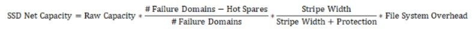
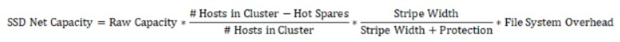
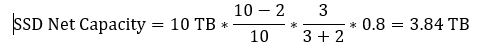
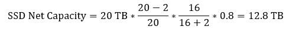

# SSD Capacity Management

## Raw Capacity

Raw capacity is the total capacity on all the SSDs assigned to a Weka system cluster, e.g., 10 SSDs of 1  terabyte each have a total raw capacity of 10 terabytes. This is the total capacity available for the Weka system. This will change automatically if more hosts or SSDs are added to the system.

## Net Capacity

Net capacity is the amount of space available for user data on the SSDs in a configured Weka system. It is based on the raw capacity minus the WekaIO filesystem overheads for redundancy protection and other needs. This will change automatically if more hosts or SSDs are added to the system.

## Stripe Width

The stripe width is the number of blocks that share a common protection set, which can range from 3 to 16 \(the smallest possible stripe width is 3+2\). The Weka system has a distributed, any-to-any protection. Consequently, in a system with a stripe width of 8, many groups of 8 data units spread on various hosts protect each either \(rather than a group of 8 hosts forming a protection group\). The stripe width is set during the cluster formation and cannot be changed. Stripe width choice impacts performance and space.

## Protection Level

The protection level is the number of additional protection blocks added to each stripe, which can be either 2 or 4. A system with a protection level of 2 can survive 2 concurrent failures, while system data with a protection level of N+4 is protected against any concurrent 4 host/disk failures, and its availability is protected against any 4 concurrent disk failures or 2 concurrent host failures. A large protection level has space and performance implications. The protection level is set during the cluster formation and cannot be changed.

## Failure Domains \(Optional\)

A failure domain is a group of WekaIO hosts, all of which can fail concurrently due to a single root cause, such as a power circuit or network switch failure. A system can be configured with or without failure domains. For a system with failure domains, each group of blocks that protect each other are spread on different failure domains. For a system without failure domains, the group of blocks is spread on different hosts. A system is defined with or without failure domains during the cluster formation, and this definition cannot be changed. For a system with failure domains, additional failure domains can be added, and new hosts can be added to any existing or new failure domain.


Note: This documentation relates to a homogeneous Weka system deployment, i.e., the same number of hosts per failure domain \(if any\), and the same SSD capacity per host. For information about heterogeneous Weka system configurations, contact the WekaIO Support Team.


## Hot Spare

Hot spare is the number of failure domains \(for a system configured with failure domains\) or hosts \(for a system configured without failure domains\) that the system can lose, undergo a complete rebuild of data, and still maintain the same net capacity. Consequently, the higher the hot spare count, the more hardware required to obtain the same net capacity. On the other hand, the higher the hot spare count, the more relaxed the IT maintenance schedule for replacements. The hot spare is defined during cluster formation and can be reconfigured at any time.


Note: The sum of the stripe width, protection level and hot spare must be less than or equal to the total number of failure domains or the number of hosts \(if no failure domains are defined\).


## WekaIO Filesystem Overhead

After deducting the capacity for the protection and hot spares, only 80% of the remaining capacity can be used as net user capacity, with the other 20% of capacity reserved for the WekaIO filesystems. This is a fixed formula that cannot be configured.

## Provisioned Capacity

Provisioned capacity is the total capacity assigned to filesystems. This includes both SSD and object store capacity.

## Available Capacity

Available capacity is the total capacity which can be used for the allocation of new filesystems, which is net capacity minus provisioned capacity.

## Deductions from Raw Capacity to Obtain Net Storage Capacity

The net capacity of the Weka system is obtained after the following three deductions performed during configuration:

1. Level of protection required, i.e., the amount of storage capacity to be dedicated for system protection.
2. Hot spare\(s\), i.e., the amount of storage capacity to be set aside for redundancy and to allow for rebuilding following a component failure.
3. WekaIO filesystem overhead, in order to improve overall performance.      

## Formula for Calculating SSD Net Storage Capacity

**Formula for Weka System Configured with Failure Domains** 

 **Formula for Weka System Configured without Failure Domains**

**For Example:**


**Scenario 1:** A homogeneous system of 10 hosts, each with 1 terabyte of Raw SSD Capacity, 2 hot spare failure domains of capacity and a protection scheme of 3+2.



**Scenario 2:** A homogeneous system of 20 hosts, each with 1 terabyte of Raw SSD Capacity, 2 hot spare failure domains of capacity and a protection scheme of 16+2.


