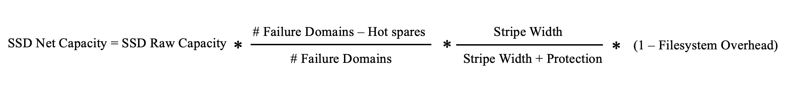

# SSD capacity management

## Raw capacity

Raw capacity is the total capacity on all the SSDs assigned to a WEKA system cluster. For example, 10 SSDs of one terabyte each have a total raw capacity of 10 terabytes. This is the total capacity available for the WEKA system. This will change automatically if more servers or SSDs are added.

## Net capacity

Net capacity is the space for user data on the SSDs in a configured WEKA system. It is based on the raw capacity minus the WEKA filesystem overheads for redundancy protection and other needs. This will change automatically if more servers or SSDs are added.

## Stripe width

The stripe width is the number of blocks with a common protection set, ranging from 3 to 16. The WEKA system has distributed any-to-any protection. Consequently, in a system with a stripe width of 8, many groups of 8 data units spread on various servers protect each other (rather than a group of 8 servers forming a protection group). The stripe width is set during the cluster formation and cannot be changed. Stripe width choice impacts performance and space.


If not configured, the stripe width is set automatically to #Failure Domains - Protection Level


## Protection level

The protection level is the number of additional protection blocks added to each stripe, which can be either 2 or 4. A system with a protection level of 2 can survive 2 concurrent failures. In comparison, system data with a protection level of 4 is protected against any concurrent 4 server/disk failures, and its availability is protected against any 4 concurrent disk failures or 2 concurrent server failures. A high protection level has space and performance implications. The protection level is set during the cluster formation and cannot be changed.


If not configured, the data protection drives in the cluster stripes are automatically set to 2.


## Failure domains (optional)

A failure domain is a group of WEKA servers that can fail concurrently due to a single root cause, such as a power circuit or network switch failure.

A cluster can be configured with explicit or implicit failure domains:

* In a cluster with explicit failure domains, each group of blocks that protect each other is spread on different failure domains.
* In a cluster with implicit failure domains, the group of blocks is spread on different servers, and each server is a failure domain. Additional failure domains can be added, and new servers can be added to any existing or new failure domain.


This documentation relates to a homogeneous WEKA system deployment. That is, the same number of servers per failure domain (if any) and the same SSD capacity per server. For information about heterogeneous WEKA system configurations, contact the [Customer Success Team](../support/getting-support-for-your-weka-system.md#contact-customer-success-team).


## Hot spare

A hot spare is the number of failure domains that the system can lose, undergo a complete rebuild of data, and still maintain the same net capacity. All failure domains are constantly participating in storing the data, and the hot spare capacity is evenly spread within all failure domains.

The higher the hot spare count, the more hardware is required to obtain the same net capacity. On the other hand, the higher the hot spare count, the more relaxed the IT maintenance schedule for replacements. The hot spare is defined during cluster formation and can be reconfigured anytime.


**Note:** If not configured, the hot spare is automatically set to 1.


## Weka filesystem overhead

After deducting the protection and hot spare capacity, only 90% of the remaining capacity can be used as net user capacity, with the other 10% of capacity reserved for the Weka filesystems. This is a fixed formula that cannot be configured.

## Provisioned capacity

The provisioned capacity is the total capacity assigned to filesystems. This includes both SSD and object store capacity.

## Available capacity

The available capacity is the total capacity used to allocate new filesystems, net capacity minus provisioned capacity.

## Deductions from raw capacity to obtain net storage capacity

The net capacity of the Weka system is obtained after the following three deductions performed during configuration:

1. The level of protection required is the storage capacity dedicated to system protection.
2. The hot spare(s) is the storage capacity set aside for redundancy and to allow for rebuilding following a component failure.
3. Weka filesystem overhead to improve overall performance.     &#x20;

## SSD net storage capacity calculation

<figure><figcaption></figcaption></figure>

**Examples:**


**Scenario 1:** A homogeneous system of 10 servers, each with one terabyte of Raw SSD Capacity, one hot spare, and a protection scheme of 6+2.


$$
SSD Net Capacity = 10 TB * (10-1) / 10 * 6/(6+2) * 0.9 = 6.075 TB
$$


**Scenario 2:** A homogeneous system of 20 servers, each with one terabyte of Raw SSD Capacity, two hot spares, and a protection scheme of 16+2.


$$
SSD Net Capacity = 20 TB * (20-2) / 20 * 16/(16+2) * 0.9 = 14.4 TB
$$
