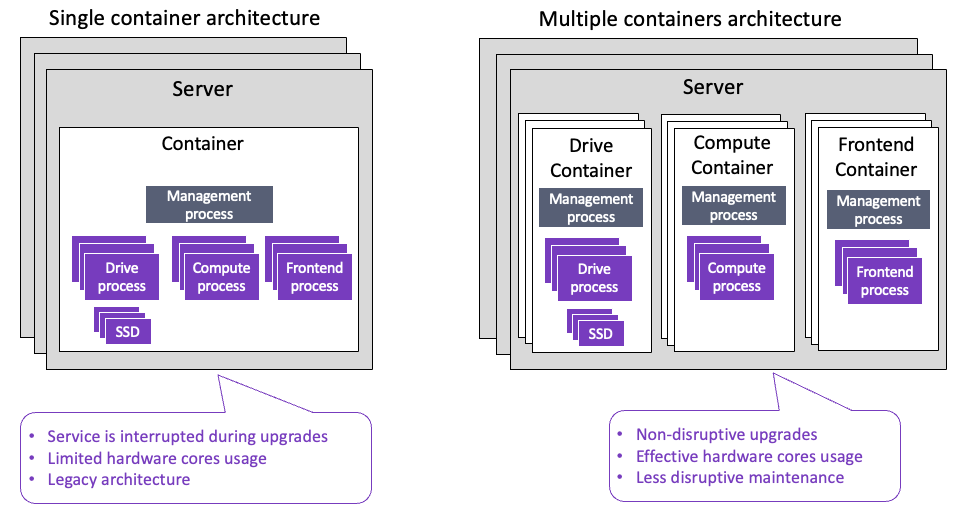

# Weka containers architecture overview

The servers in a Weka system are members of a cluster. A server includes containers running software instances called processes that communicate with each other to provide storage services in the cluster.

Processes are dedicated to managing different functions as follows:

* Drive processes for SSD drives and IO to drives. Each drive process requires a dedicated core.
* Compute processes for filesystems, cluster-level functions, and IO from clients. Each compute process requires a dedicated core.
* Frontend processes for POSIX client access and sending IO to the compute and drive processes. Each frontend process requires a dedicated core.
* A management process for managing the overall cluster. The management process does not require a dedicated core.

Two container architectures are available:

* **Multiple containers architecture:** This is the new architecture, where each server in the cluster includes multiple containers. Adhere to the following:
  * Each container runs processes of a specific type: drive, compute, or frontend.
  * A server can have multiple containers per process type.
  * The containers are not limited to running the same software version and enable non-disruptive upgrades.
  * The server can use the maximum available cores, allowing flexibility in the hardware cores' usage.&#x20;
* **Single container architecture:** This is the legacy architecture, where each server in the cluster includes a single container with all the processes running on it. Adhere to the following:
  * All the processes must be in the same software version. As a result, during an upgrade, the container is not available, and the service is interrupted.
  * The container is limited to using up to 19 cores. This limitation reduces the flexibility of the hardware cores' usage (a server can include more than 19 cores).

<figure><figcaption>
Multiple containers architecture vs.  single containers architecture
</figcaption></figure>

## Multiple containers architecture benefits

The benefits of using the multiple containers architecture are:

* **Support non-disruptive upgrades:**
  * Each container can have a different version and be installed separately from the other containers.
  * You can roll back each upgraded container separately.
  * Can access the network control plane seamlessly during the upgrade.
* **Effective use of the hardware:**
  * The number of cores that can be used in the server is no longer limited to 19. A server can include more than one container, each for a dedicated process type with up to 19 processes.
* **Less disruptive maintenance:**
  * Ability to stop the compute and frontend processes while running the drive processes.

To support non-disruptive upgrades, multiple-containers architecture deployment is mandatory. The deployment requires using the resource generator tool. The tool provides configuration files in a JSON format with the resource allocations for each container type: `drives0.json`, `compute0.json`, and `frontend0.json`, to use during the deployment.


Multiple containers architecture is not supported yet on AWS using the CloudFormation, as well as in a system with Intel E810 NIC.


**Related topics**

[quick-install-guide.md](../getting-started-with-weka/quick-install-guide.md "mention")

[weka-system-installation-with-multiple-containers-using-the-cli.md](../install/bare-metal/weka-system-installation-with-multiple-containers-using-the-cli.md "mention")
