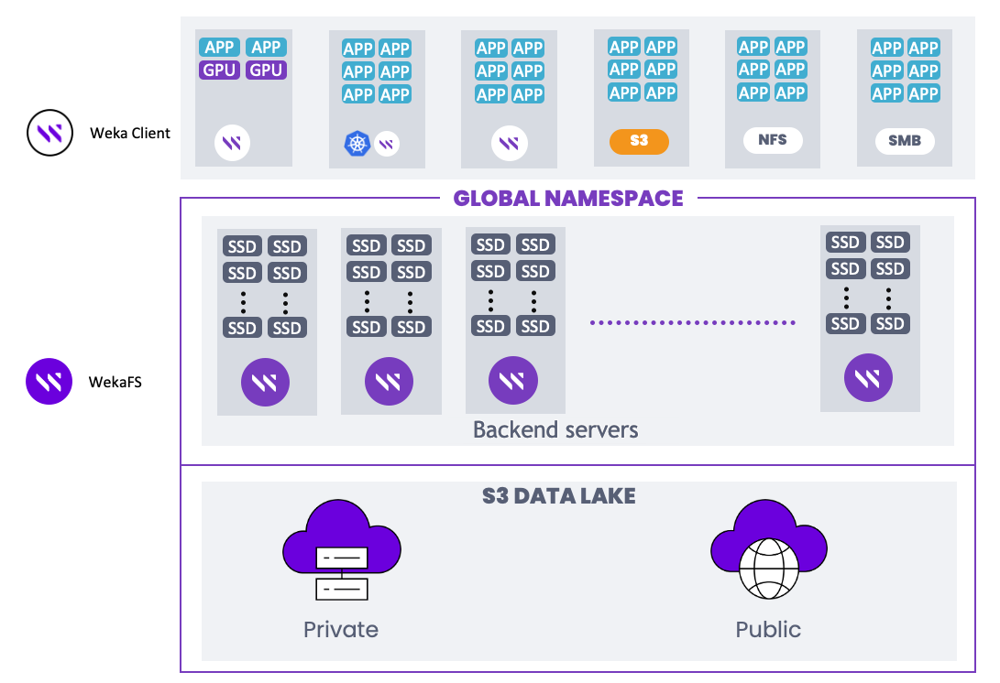

# Weka containers architecture overview

The servers in a Weka system are members of a cluster. A server includes several containers containing software instances called processes that communicate with each other to provide storage services in the cluster.

Processes are dedicated to managing different functions such as:

* Drive processes for NVMe drives and IO to drives.
* Compute processes for filesystems, cluster-level functions, and IO from clients.
* Frontend processes for POSIX client access and sending IO to the compute and drive processes.
* A management process for managing the overall cluster. (A management process does not require a dedicated core to run.)

Each drive, compute, and frontend process requires a dedicated core. In a single container architecture, a container can include a maximum of 19 cores, and all processes in the container must be of the same version. As a result, during an upgrade, the container is not available, and the service is interrupted.

In the Weka legacy system, the server has a single container and it is limited to using up to 19 cores. This limitation reduces the flexibility of the hardware cores usage (a server can have more than 19 cores).

To enable non-disruptive upgrades and flexible deployment of the cores across the cluster, use the multiple containers architecture.

<figure><figcaption>
Single container architecture vs. multiple containers architecture
</figcaption></figure>


Multiple containers architecture is not supported yet on AWS using the CloudFormation, as well as in a system with Intel E810 NIC.


In a multiple containers architecture, each container has a management process. The container can have several processes of one type for the drive, compute, or frontend functions.

The benefits of using the multiple containers architecture are:

* **Support non-disruptive upgrades:**
  * Each container can have a different version and be installed separately from the other containers.
  * Can roll back each upgraded container separately.
  * Can access the network control plane seamlessly during the upgrade.
* **Effective use of the hardware:**
  * The number of cores that can be used in the server is no longer limited to 19. A server can include more than one container, each for a dedicated function with up to 19 processes.
* **Less disruptive maintenance:**
  * Ability to stop the compute and frontend processes while keeping the drive processes running.

Single-container architecture is still supported. However, to support non-disruptive upgrades, multiple-containers architecture deployment is mandatory.

In a single-container architecture, the resource allocation is done automatically. However, to deploy the multiple-containers architecture, it is required to use the resource generator tool that provides configuration files in a JSON format with the resource allocations for each container type (`drives0.json`, `compute0.json`, and `frontend0.json`). You use these configuration files during the configuration stage.

**Related topics**

[quick-install-guide.md](../getting-started-with-weka/quick-install-guide.md "mention")

[weka-system-installation-with-multiple-containers-using-the-cli.md](../install/bare-metal/weka-system-installation-with-multiple-containers-using-the-cli.md "mention")
