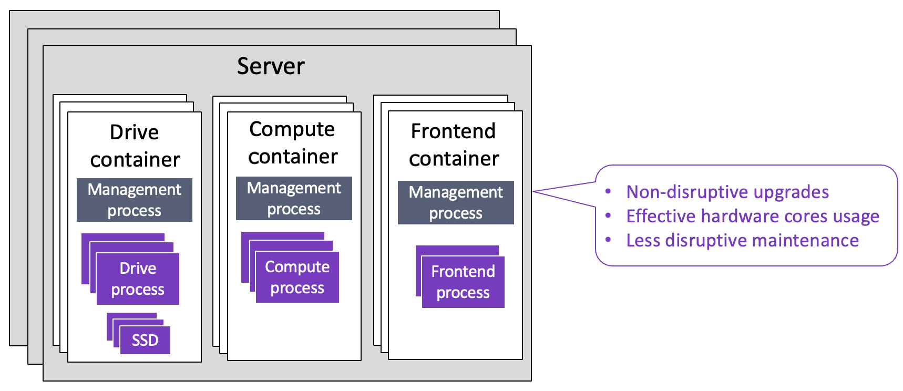

# WEKA containers architecture overview

## Cluster architecture basics

The servers in a WEKA system are members of a cluster. A server includes multiple containers running software instances called processes that communicate with each other to provide storage services in the cluster.

### Process types and core requirements

The WEKA system uses different types of processes, each dedicated to specific functions:

* **Drive processes**: Manage SSD drives and handle IO operations to drives. These processes are fundamental to storage operations and each requires a dedicated core to ensure optimal performance.
* **Compute processes:** Handle filesystems, cluster-level functions, and IO from clients. The dedicated core requirement for each compute process ensures consistent processing power for these critical operations.
* **Frontend processes**: Manage POSIX client access and coordinate IO operations with compute and drive processes. Each frontend process needs a dedicated core to maintain responsive client interactions.
* **Management processes**: Oversee the overall cluster operations. Unlike other process types, management processes can share cores as they have lower resource demands.

## Multi-Container Backend architecture (MCB)

In the WEKA cluster, each server implements a multi-container backend architecture where containers are specialized by process type (drive, compute, or frontend).

<figure><figcaption>
Multi-container backend architecture (MCB)
</figcaption></figure>

## Benefits of MCB architecture

* **Non-Disruptive Upgrade (NDU) capabilities:**
  * Enables true non-disruptive upgrades where containers can run different software versions independently without system interruption
  * Supports individual container rollback without impacting cluster operations
  * Maintains continuous network control plane access throughout the upgrade process, ensuring uninterrupted client service
* **Optimized hardware utilization:**
  * Supports up to 64 WEKA cores per server
  * Multiple containers per process type
  * Flexible core allocation across containers
  * Up to 19 processes per container
* **Improved maintenance operations:**
  * Selective process management
  * Ability to maintain drive processes while stopping compute and frontend processes

## System limitations and specifications

* Maximum backend processes per cluster: 25,000 (excluding client processes)
* Maximum WEKA cores per server: 64
* Maximum processes per container: 19
