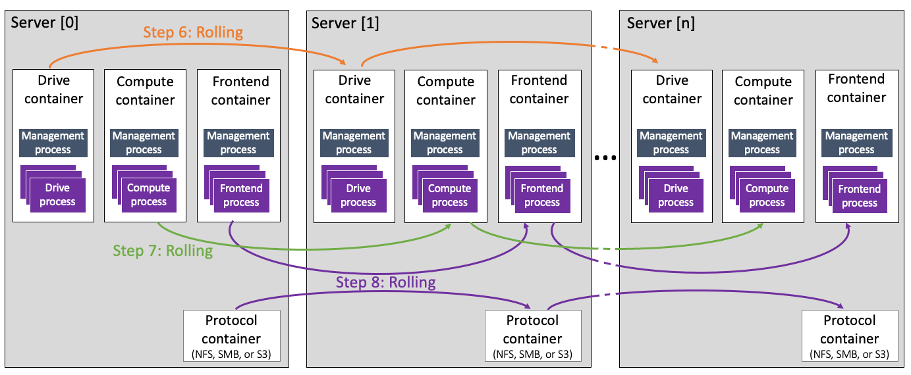

# WEKA containers architecture overview

The servers in a WEKA system are members of a cluster. A server includes multiple containers running software instances called processes that communicate with each other to provide storage services in the cluster.

The processes are dedicated to managing different functions as follows:

* Drive processes for SSD drives and IO to drives. Each drive process requires a dedicated core.
* Compute processes for filesystems, cluster-level functions, and IO from clients. Each compute process requires a dedicated core.
* Frontend processes for POSIX client access and sending IO to the compute and drive processes. Each frontend process requires a dedicated core.
* A management process for managing the overall cluster. The management process does not require a dedicated core.

In the WEKA cluster, each server includes multiple containers in which each container runs processes of a specific type: drive, compute, or frontend. This deployment is known as **multi-container backend** architecture (MCB).

<figure><figcaption>
Multi-container backend architecture (MCB)
</figcaption></figure>

With MCB, a server can have multiple containers per process type. The containers are not limited to running the same software version and enable non-disruptive upgrades. The server can use the maximum available cores, allowing flexibility in the hardware cores' usage.

The benefits of using the MCB architecture include:

* **Support non-disruptive upgrades:**
  * Each container can have a different version and be installed separately from the other containers.
  * You can roll back each upgraded container separately.
  * Can access the network control plane seamlessly during the upgrade.
* **Effective use of the hardware:**
  * The number of cores that can be used in the server is no longer limited to 19. A server can include more than one container, each for a dedicated process type with up to 19 processes.
* **Less disruptive maintenance:**
  * Ability to stop the compute and frontend processes while running the drive processes.


Multi-container backend architecture is not supported yet on AWS using the CloudFormation, as well as in a system with Intel E810 NIC.


**Related topics**

[quick-install-guide.md](../getting-started-with-weka/quick-install-guide.md "mention")

[weka-system-installation-with-multiple-containers-using-the-cli.md](../install/bare-metal/weka-system-installation-with-multiple-containers-using-the-cli.md "mention")
