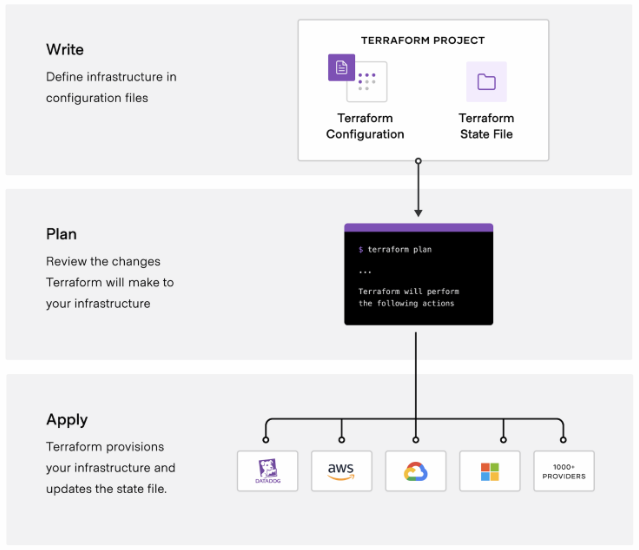

# WEKA installation on AWS

The WEKA® Data Platform on AWS provides a fast and scalable platform for running performance-intensive applications and hybrid cloud workflows.

WEKA provides a ready-to-deploy Terraform package that you can customize for installing the WEKA cluster on AWS. Optionally, you can install the WEKA cluster using the AWS CloudFormation.

Ensure you are familiar with the following concepts and services that are used for the WEKA installation on AWS:

AWS IAM - Identity and access management

AWS Identity and Access Management (IAM) is a web service that helps you securely control access to AWS resources. With IAM, you can centrally manage permissions that control which AWS resources users can access. You use IAM to control who is authenticated (signed in) and authorized (has permissions) to use resources.

**Related information**

[What is IAM?](https://docs.aws.amazon.com/IAM/latest/UserGuide/introduction.html)

Amazon VPCs, subnets, and security groups

A _virtual private cloud_ (VPC) is a virtual network dedicated to your AWS account. It is logically isolated from other virtual networks in the AWS Cloud. You can specify an IP address range for the VPC, add subnets and gateways, and associate security groups.

A _subnet_ is a range of IP addresses in your VPC. You launch AWS resources, such as Amazon EC2 instances, into your subnets. Using route tables, you can connect a subnet to the internet, other VPCs, and your data centers and route traffic to and from your subnets.

A _security group_ controls the traffic that is allowed to reach and leave the resources that it is associated with. For example, after you associate a security group with an EC2 instance, it controls the inbound and outbound traffic for the instance. You can associate a security group only with resources in the VPC for which it is created.

**Related information**

[What is Amazon VPC?](https://docs.aws.amazon.com/vpc/latest/userguide/what-is-amazon-vpc.html)

[How Amazon VPC works](https://docs.aws.amazon.com/vpc/latest/userguide/how-it-works.html)

[Control traffic to your AWS resources using security groups](https://docs.aws.amazon.com/vpc/latest/userguide/vpc-security-groups.html)

Amazon EC2 instances

Amazon Elastic Compute Cloud (Amazon EC2) is a web service that provides resizable computing capacity—literally, servers in Amazon's data centers—that you use to build and host your software systems.&#x20;

Amazon EC2 provides different instance types to choose the CPU, memory, storage, and networking capacity you need to run your applications.

**Related information**

[What is Amazon EC2?](https://docs.aws.amazon.com/AWSEC2/latest/UserGuide/concepts.html)

Amazon EC2 key pairs for SSH

A key pair, consisting of a public key and a private key, is a set of security credentials you use to prove your identity when connecting to an Amazon EC2 instance. Amazon EC2 stores the public key on your instance, and you store the private key. The private key allows you to SSH into your instance securely for Linux instances.

**Related information**

[Amazon EC2 key pairs and Linux instances](https://docs.aws.amazon.com/AWSEC2/latest/UserGuide/ec2-key-pairs.html)

Amazon S3 protocol and object store

Amazon Simple Storage Service (Amazon S3) is an object storage service that offers industry-leading scalability, data availability, security, and performance. It is used for tiering data from the WEKA cluster to Amazon object store buckets.

**Related information**

[What is Amazon S3?](https://docs.aws.amazon.com/AmazonS3/latest/userguide/Welcome.html)

Terraform

Terraform is an open-source project from Hashicorp. It creates and manages resources on cloud platforms and on-premises clouds. Unlike AWS CloudFormation, it works with many APIs from multiple platforms and services.

### How does Terraform work?

A deployment with Terraform involves three phases:

* **Write:** Define the infrastructure in configuration files and customize the project variables provided in the Terraform package.
* **Plan:** Review the changes Terraform will make to your infrastructure.
* **Apply:** Terraform provisions the infrastructure, including the EC2 instances, installs the WEKA software, and creates the cluster. Once completed, the WEKA cluster runs on AWS.

**Related information**

[Get Started with Terraform on AWS](https://developer.hashicorp.com/terraform/tutorials/aws-get-started)

AWS Cloud Formation

AWS CloudFormation enables you to create and provision AWS infrastructure deployments predictably and repeatedly.

**Related information**

[AWS CloudFormation Documentation](https://docs.aws.amazon.com/cloudformation/)

To install WEKA on AWS, an AWS account is required. Visit the AWS site to create an [AWS account](https://aws.amazon.com/account/).

**Related topics**

[weka-installation-on-aws-using-terraform](weka-installation-on-aws-using-terraform/ "mention")

[weka-installation-on-aws-using-the-cloud-formation](weka-installation-on-aws-using-the-cloud-formation/ "mention")
