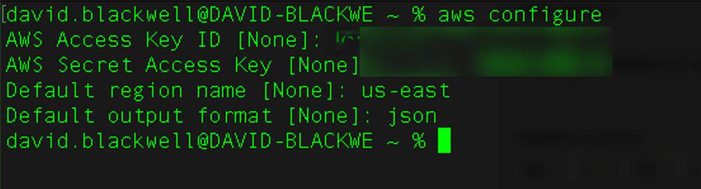

# Detailed deployment tutorial: WEKA on AWS using Terraform

## Introduction

Deploying WEKA in AWS requires knowledge of several technologies, including AWS, Terraform[^1], basic Linux operations, and the WEKA software. Recognizing that not all individuals responsible for this deployment are experts in each of these areas, this document aims to provide comprehensive, end-to-end instructions. This ensures that readers with minimal prior knowledge can successfully deploy a functional WEKA cluster on AWS.

#### Document scope

This document provides a guide for deploying WEKA in an AWS environment using Terraform. It is applicable for both POC and production setups. While no pre-existing AWS elements are required beyond an appropriate user account, the guide includes examples with some pre-created resources.

This document guides you through:

* General AWS requirements.
* Networking requirements to support WEKA.
* Deployment of WEKA using Terraform.
* Verification of a successful WEKA deployment.


Images embedded in this document can be enlarged with a single click for ease of viewing and a clearer and more detailed examination.


## Terraform preparation and installation

HashiCorp Terraform is a tool that enables you to define, provision, and manage infrastructure as code. It simplifies infrastructure setup by using a configuration file instead of manual processes.

You describe your desired infrastructure in a configuration file using HashiCorp Configuration Language (HCL) or optionally JSON. Terraform then automates the creation, modification, or deletion of resources.

This automation ensures that your infrastructure is consistently and predictably deployed, aligning with the specifications in your configuration file. Terraform helps maintain a reliable and repeatable infrastructure environment.

Organizations worldwide use Terraform to deploy stateful infrastructure both on-premises and across public clouds like AWS, Azure, and Google Cloud Platform.


You can deploy WEKA in AWS using [AWS CloudFormation](https://start.weka.io/), allowing them to choose their preferred deployment method.


To install Terraform, we recommend following the [official installation guides](https://developer.hashicorp.com/terraform/install) provided by HashiCorp.

### Locate the AWS Account

1. Access the AWS Management Console**.**
2. In the top-right corner, search for **Account ID**.

<figure><figcaption></figcaption></figure>


* If deploying into a WEKA customer environment, ensure the customer understands their subscription structure.
* If deploying internally at WEKA and you don't see the Account ID or haven't been added to the correct account, contact the appropriate cloud team for assistance.


### Confirm user account permissions

To ensure a successful WEKA deployment in AWS using Terraform, verify that the [AWS IAM user](https://docs.aws.amazon.com/IAM/latest/UserGuide/id\_users.html) has the required permissions listed in [#appendix-b-terraforms-required-permissions](detailed-deployment-tutorial-weka-on-aws-using-terraform.md#appendix-b-terraforms-required-permissions "mention"). The user must have permissions to create, modify, and delete AWS resources as specified by the Terraform configuration files.

If the IAM user lacks these permissions, update their permissions or create a new IAM user with the necessary permissions.

**Procedure**

1. **Access the AWS Management Console:** Log in using the account intended for the WEKA deployment.
2. **Navigate to the IAM dashboard:** From the Services menu, select **IAM** to open the Identity and Access Management dashboard.

<figure><figcaption></figcaption></figure>

3. **Locate the IAM user:** Search for the IAM user or go to the **Users** section.

<figure><figcaption></figcaption></figure>

4. **Verify permissions.** Click on the user’s name to review their permissions. Ensure they have policies that grant the necessary permissions for managing AWS resources through Terraform.

<figure><figcaption></figcaption></figure>


The user shown in the screenshot above has full administrative access to allow Terraform to deploy WEKA. However, it is recommended to follow the [principle of least privilege](https://docs.aws.amazon.com/IAM/latest/UserGuide/best-practices.html#grant-least-privilege) by granting only the necessary permissions listed in [#appendix-b-terraforms-required-permissions](detailed-deployment-tutorial-weka-on-aws-using-terraform.md#appendix-b-terraforms-required-permissions "mention").


### Set AWS Service Quotas

Before deploying WEKA on AWS using Terraform, ensure your AWS account has sufficient quotas for the necessary resources. Specifically, when deploying EC2 instances like the i3en for the WEKA backend cluster, manage quotas based on the vCPU count for each instance type or family.

**Requirements:**

* **EC2 Instance vCPU quotas:** Verify that your vCPU requirements are within your current quota limits. If not, adjust the quotas before running the Terraform commands (details are provided later in this document).
* **Cumulative vCPU count:** Ensure your quotas cover the total vCPU count needed for all instances. For example, deploying 10 i3en.6xlarge instances (each with 24 vCPUs) requires 240 vCPUs in total. Meeting these quotas is essential to avoid execution failures during the Terraform process, as detailed in the following sections.

**Procedure**

1. **Access Service Quotas:** Open the AWS Management Console at [AWS Service Quotas](https://us-east-1.console.aws.amazon.com/servicequotas/home/dashboard). Use the search bar to locate the **Service Quotas** service.

<figure><figcaption></figcaption></figure>

2. **Select Amazon EC2:** On the Service Quotas page, select **Amazon EC2**.

<figure><figcaption></figcaption></figure>

3. **Identify instance type:** WEKA supports only i3en instance types for backend cluster nodes. Ensure you adjust the quota for the appropriate instance type (Spot, On-Demand, or Dedicated).

<figure><figcaption></figcaption></figure>

4. **Request quota increase:** Choose the relevant instance type from the Standard categories (A, C, D, H, I, M, R, T, Z), then click **Request increase at account-level**.

<figure><figcaption></figcaption></figure>

5. **Specify  number of vCPUs:** In the Request quota increase form, specify the number of vCPUs you need. For example, if 150 vCPUs are required for the i3en instance family, enter this number and submit your request.


Quota increase requests are typically processed immediately. However, requests for a large number of vCPUs or specialized instance types may require manual review by AWS support. \
Confirm that you have requested and obtained the necessary quotas for all instance types used for WEKA backend servers and any associated application servers running WEKA client software. WEKA supports i3en series instances for backend servers.


**Related topic**

[supported-ec2-instance-types.md](supported-ec2-instance-types.md "mention")

## AWS resource prerequisites

The WEKA deployment requires several AWS components, including VPCs, Subnets, Security Groups, and Endpoints. These components can either be created during the Terraform process or be pre-existing if manually configured.

Minimum requirements:

* A Virtual Private Cloud (VPC)
* Two Subnets in different Availability Zones (AZs)
* A Security Group

### Networking requirements

If you choose not to have Terraform auto-create networking components, ensure your VPC configuration includes:

* Two subnets (either private or public) in separate AZs.
* A subnet that allows WEKA to access the internet, either through an Internet Gateway (IGW) with an Elastic IP (EIP), NAT gateway, proxy, or egress VPC.

Although the WEKA deployment is not multi-AZ, a minimum of two subnets in different AZs is required for the Application Load Balancer (ALB).

### **View AWS Network Access Control Lists (ACLs)**

AWS Network Access Control Lists (ACLs) enable basic firewalls that control inbound and outbound network traffic based on security rules. They apply to network interfaces (NICs), EC2 instances, and subnets.

By default, ACLs include rules that ensure basic connectivity, such as allowing outbound communication from all AWS resources and denying all inbound traffic from the internet. These default rules have high priority numbers, so custom rules can override them. The security groups created by `main.tf` handle most traffic restrictions and allowances.

**Procedure**

1. Go to the VPC details page and select **Main network AC**L.

<figure><figcaption></figcaption></figure>

2. From the Network ACLs page, select the **Inbound rules** and **Outbound rules**.



<figure><figcaption></figcaption></figure>



<figure><figcaption></figcaption></figure>



**Related topic**

[#appendix-a-security-groups-network-acl-ports](detailed-deployment-tutorial-weka-on-aws-using-terraform.md#appendix-a-security-groups-network-acl-ports "mention") (ensure you have defined all the relevant ports before manually creating ACLs ).&#x20;

## Deploy WEKA on AWS using Terraform

If using existing resources, collect their AWS IDs as shown in the following examples:



<figure><figcaption><p>VPC</p></figcaption></figure>



<figure><figcaption><p>Subnet in VPC</p></figcaption></figure>



<figure><figcaption><p>Security Group in EC2</p></figcaption></figure>



### Modules overview

This section covers modules for creating IAM roles, networks, and security groups necessary for WEKA deployment. If you do not provide specific IDs for security groups or subnets, the modules automatically create them.

#### **Network configuration**

* **Availability zones:** The `availability_zones` variable is required when creating a network and is currently limited to a single subnet. If no specific subnet is provided, it is automatically created.
* **Private network deployment:** To deploy a private network with NAT, set the `subnet_autocreate_as_private` variable to `true` and provide a private CIDR range. To prevent instances from receiving public IPs, set `assign_public_ip` to `false`.

#### **SSH access**

For SSH access, use the username `ec2-user`. You can either:

* Provide an existing key pair name, or
* Provide a public SSH key.

If neither is provided, the system creates a key pair and store the private key locally.

#### **Application Load Balancer (ALB)**

To create an ALB for backend UI and WEKA client connections:

* Set `create_alb` to `true`.
* Provide additional required variables.
* To integrate ALB DNS with your DNS zone, provide variables for the Route 53 zone ID and alias name.

#### **Object Storage (OBS)**

For S3 integration for tiered storage:

* Set `tiering_enable_obs_integration` to `true`.
* Provide the name of the S3 bucket.
* Optionally, specify the SSD cache percentage.

#### **Optional configurations**

* **Clients:** For automatically mounting clients to the WEKA cluster, specify the number of clients to create. Optional variables include instance type, number of network interfaces (NICs), and AMI ID.
* **NFS protocol gateways:** Specify the number of NFS protocol gateways required. Additional configurations include instance type and disk size.
* **SMB protocol gateways:** Create at least three SMB protocol gateways. Configuration options are similar to NFS gateways.

#### **Secret Manager**

Use the Secret Manager to store sensitive information, such as usernames and passwords. If you do not provide a secret manager endpoint, disable it by setting `secretmanager_use_vpc_endpoint` to `false`.

#### **VPC Endpoints**

Enable VPC endpoints for services like EC2, S3, or a proxy by setting the respective variables to `true`.

#### **Terraform output**

The Terraform module output includes:

* SSH username.
* WEKA password secret ID.
* Helper commands for learning about the clusterization process.

### Locate the user’s token on get.weka.io

The WEKA user token grants access to WEKA binaries and is required for accessing [https://get.weka.io](https://get.weka.io) during installation.

**Procedure**

1. Open a web browser and navigate to [get.weka.io](https://get.weka.io).
2. In the upper right-hand corner, click the user’s name.

<figure><figcaption></figcaption></figure>

3. From the left-hand menu, select **API Tokens**.&#x20;
4. The user’s API token displays on the screen. Use this token later in the installation process.

<figure><figcaption></figcaption></figure>

### Deploy WEKA in AWS with Terraform

The Terraform module facilitates the deployment of various AWS resources, including EC2 instances, DynamoDB tables, Lambda functions, and State Machines, to support WEKA deployment.

#### Procedure

1. Create a directory for the Terraform configuration files.

```bash
mkdir deploy
```


All Terraform deployments must be separated into their own directories to manage state information effectively. By creating a specific directory for this deployment, you can duplicate these instructions for future deployments by naming the directory uniquely, such as `deploy1`.


2. Navigate to the directory.

```bash
cd deploy
```

3. Create the `main.tf` file.\
   The `main.tf` file defines the Terraform options. Create this file using the WEKA Cloud Deployment Manager (CDM). See [weka-cdm-web-user-guide.md](../../weka-cdm-web-user-guide.md "mention") for assistance.
4. Authenticate the AWS CLI.

```bash
aws configure
```

* Fill in the required information and press **Enter**.

<figure><figcaption></figcaption></figure>

5. After creating and saving the `main.tf` file, initialize the Terraform directory to ensure the proper AWS resource files are available.

```json
terraform init
```

7. As a best practice, run the terraform plan to preview the changes.

```json
terraform plan
```

8. Execute the creation of AWS resources necessary to run WEKA.

```json
terraform apply
```

9. When prompt, type `yes` to confirm the deployment.

**Deployment output**

Upon successful completion, Terraform displays output similar to the following. If the deployment fails, an error message appears.

```json
Outputs:

weka_deployment = {
  "alb_alias_record" = null
  "alb_dns_name" = "internal-WEKA-Prod-lb-697001983.us-east-1.elb.amazonaws.com"
  "asg_name" = "WEKA-Prod-autoscaling-group"
  "client_ips" = null
  "cluster_helper_commands" = <<-EOT
  aws ec2 describe-instances --instance-ids $(aws autoscaling describe-auto-scaling-groups --auto-scaling-group-name WEKA-Prod-autoscaling-group --query "AutoScalingGroups[].Instances[].InstanceId" --output text) --query 'Reservations[].Instances[].PublicIpAddress' --output json
  aws lambda invoke --function-name WEKA-Prod-status-lambda --payload '{"type": "progress"}' --cli-binary-format raw-in-base64-out /dev/stdout
  aws secretsmanager get-secret-value --secret-id arn:aws:secretsmanager:us-east-1:459693375476:secret:weka/WEKA-Prod/weka-password-g9bH-T2og7D --query SecretString --output text
  
  EOT
  "cluster_name" = "Prod"
  "ips_type" = "PublicIpAddress"
  "lambda_status_name" = "WEKA-Prod-status-lambda"
  "local_ssh_private_key" = "/tmp/WEKA-Prod-private-key.pem"
  "nfs_protocol_gateways_ips" = tostring(null)
  "smb_protocol_gateways_ips" = tostring(null)
  "ssh_user" = "ec2-user"
  "weka_cluster_password_secret_id" = "arn:aws:secretsmanager:us-east-1:459693375476:secret:weka/WEKA-Prod/weka-password-g9bH-T2og7D"
}
weka_deployment_output = {
  "alb_alias_record" = null
  **"alb_dns_name" = "internal-WEKA-Prod-lb-697001983.us-east-1.elb.amazonaws.com"**
  "asg_name" = "WEKA-Prod-autoscaling-group"
  "client_ips" = null
  "cluster_helper_commands" = <<-EOT
  **aws ec2 describe-instances --instance-ids $(aws autoscaling describe-auto-scaling-groups --auto-scaling-group-name WEKA-Prod-autoscaling-group --query "AutoScalingGroups[].Instances[].InstanceId" --output text) --query 'Reservations[].Instances[].PublicIpAddress' --output json
  aws lambda invoke --function-name WEKA-Prod-status-lambda --payload '{"type": "progress"}' --cli-binary-format raw-in-base64-out /dev/stdout
  aws secretsmanager get-secret-value --secret-id arn:aws:secretsmanager:us-east-1:459693375476:secret:weka/WEKA-Prod/weka-password-g9bH-T2og7D --query SecretString --output text**
  
  EOT
  "cluster_name" = "Prod"
  "ips_type" = "PublicIpAddress"
  "lambda_status_name" = "WEKA-Prod-status-lambda"
  **"local_ssh_private_key" = "/tmp/WEKA-Prod-private-key.pem"**
  "nfs_protocol_gateways_ips" = tostring(null)
  "smb_protocol_gateways_ips" = tostring(null)
  **"ssh_user" = "ec2-user"**
  "weka_cluster_password_secret_id" = "arn:aws:secretsmanager:us-east-1:459693375476:secret:weka/WEKA-Prod/weka-password-g9bH-T2og7D"
}
```

9. Take note of the `alb_dns_name`, `local_ssh_private_key`, and `ssh_user` values. You need these details for SSH access to the deployed instances.\
   The output includes a `cluster_helper_commands` section, offering three AWS CLI commands to retrieve essential information.

**Core resources created:**

* **Database (DynamoDB):** Stores the state of the WEKA cluster.
* **EC2:** Launch templates for auto-scaling groups and individual instances.
* **Networking:** Includes a Placement Group, Auto Scaling Group, and an optional ALB for the UI and backends.
* **CloudWatch:** Triggers the state machine every minute.
* **IAM:** Roles and policies for various WEKA components.
* **Secret Manager:** Securely stores WEKA credentials and tokens.

**Lambda functions created:**

* **deploy:** Provides installation scripts for new machines.
* **clusterize:** Executes the script for cluster formation.
* **clusterize-finalization:** Updates the cluster state after cluster formation is completed.
* **report:** Reports the progress of cluster formation and machine installation.
* **status:** Displays the current status of cluster formation.

**State machine functions:**

* **fetch:** Retrieves cluster or autoscaling group details and passes them to the next stage.
* **scale-down:** Uses the retrieved information to manage the WEKA cluster, including deactivating drives or hosts. An error is triggered if an unsupported target, like scaling down to two backend instances, is provided.
* **terminate:** Shuts down deactivated hosts.
* **transient:** Handles and reports transient errors, such as if some hosts couldn't be deactivated, while others were, allowing the operation to continue.

### Deploy protocol servers

The Terraform deployment process allows for the easy addition of instances to serve as protocol servers for NFS or SMB. These protocol servers are separate from the instances specified for the WEKA backend cluster.

**Procedure**

1. Open the `main.tf` file for editing.
2.  Add the required configurations to define the number of protocol servers for each type (NFS or SMB). Use the default settings for all other parameters.\
    Insert the configuration lines before the last closing brace (`}`) in the `main.tf` file.

    Example configurations:

    ```bash
    ## Deploying NFS Protocol Servers ##
    nfs_protocol_gateways_number = 2  # Minimum of two required

    ## Deploying SMB Protocol Servers ##
    smb_protocol_gateways_number = 3  # Minimum of three required
    ```
3. Save and close the file.

## Obtain access information about WEKA cluster

### **Determine the WEKA cluster IP address(es)**

1. Navigate to the EC2 Dashboard page in AWS and select **Instances (running)**.

<figure><figcaption></figcaption></figure>

2. Locate the instances for the WEKA backend servers, named `<prefix>-<cluster_name>-instance-backend`.

<figure><figcaption></figcaption></figure>


The `prefix` and `cluster_name` correspond to the values specified in the `main.tf` file.


3. To access and manage the WEKA cluster, select any of the WEKA backend instances and note the IP address.

<figure><figcaption></figcaption></figure>

4. If your subnet provides a public IP address (configured in EC2), it is listed. WEKA primarily uses private IPv4 addresses for communication. To find the primary private address, check the **Hostname type** and note the **IP address** listed.

### **Obtain WEKA cluster access password**

The password for your WEKA cluster is securely stored in AWS Secrets Manager. This password is crucial for managing your WEKA cluster.

You can retrieve the password using one of the following options:

* Run the `aws secretsmanager get-secret-value` command and include the arguments provided in the Terraform output. See the deployment output above.
* Use the AWS Management Console. See the following procedure.

**Procedure**

1. Navigate to the AWS Management Console.
2. In the search bar, type **Secrets Manager** and select it from the search results.
3. In the Secrets Manager, select **Secrets** from the left-hand menu.
4. Find the secret corresponding to your deployment by looking for a name that includes your deployment’s `prefix` and `cluster_name`, along with the word **password**.
5. Retrieve the password: Click the identified secret to open its details, and select the **Retrieve secret value** button. \
   The console displays the randomly generated password assigned to the WEKA user `admin`.\
   Store it securely and use it according to your organization's security policies.

### Access the WEKA cluster backend servers

To manage your WEKA cluster, you need to access the backend servers. This is typically done using SSH from a system that can communicate with the AWS subnet where the instances are located. If the backend instances lack public IP addresses, ensure that you connect from a system within the same network or use a [Jump Host](#user-content-fn-2)[^2] or [Bastion Host](#user-content-fn-3)[^3].

**Procedure**

1. **Prepare for SSH access**:
   * Identify the IP address of the WEKA backend server (obtained during the Terraform deployment).
   * Locate the SSH private key file used during the deployment. The key path is provided in the Terraform output.
2. **Connect to the backend server**:
   * If your system is within the AWS network or has direct access to the relevant subnet, proceed with the SSH connection.
   * If your system is outside the AWS network, set up a Jump Host or Bastion Host that can access the subnet.
3.  **Execute the SSH command**:

    * Use the following SSH command to access the backend server:

    ```bash
    ssh -l ec2-user -i /path/to/private-key.pem <server-ip-address>
    ```

    * Replace `/path/to/private-key.pem` with the actual path to your SSH private key file.
    * Replace `<server-ip-address>` with the IP address of the WEKA backend server.

## **WEKA GUI Login and Review**

To manage your WEKA cluster through the GUI) you'll need access to a jump box (a system with a GUI) that is deployed in the same VPC and subnet as your WEKA cluster. This allows you to securely access the WEKA GUI through a web browser.

The following procedure provides an example of using a Windows 10 instance.

**Procedure**

1. **Set up the jump box**:
   * Deploy a Windows 10 instance in the same VPC, subnet, and security group as your WEKA cluster.
   * Assign a public IP address to the Windows 10 instance.
   * Modify the network security group rules to allow Remote Desktop Protocol (RDP) access to the Windows 10 system.
2. **Access the WEKA GUI**:
   * Open a web browser on the Windows 10 jump box.
   *   Navigate to the WEKA GUI by entering the following URL:

       ```arduino
       https://<IP>:14000
       ```

       * Replace `<IP>` with the IP address of your WEKA cluster. For example: `https://10.5.0.11`.
   * The WEKA GUI login screen appears.
3. **Log In to the WEKA GUI**:
   * Log in using the username `admin` and the password obtained from AWS Secrets Manager (as described in the earlier steps).

<figure><figcaption></figcaption></figure>

4. **Review the WEKA Cluster**:

* **Cluster home screen**: View the cluster home screen for an overview of the system status.

<figure><figcaption></figcaption></figure>

* **Cluster Backends**: Review the status and details of the backend servers within the cluster (the server names may differ from those shown in examples).

<figure><figcaption></figcaption></figure>

* **Clients**: If there are any clients attached to the cluster, review their details and status.

<figure><figcaption></figcaption></figure>

* **Filesystems**: Review the filesystems associated with the cluster for their status and configuration.

<figure><figcaption></figcaption></figure>

## Scaling WEKA clusters with automated workflows

Scaling your WEKA cluster, whether scale-out (expanding) or scale-in (contracting), is streamlined using the AWS AutoScaling Group Policy set up by Terraform. This process leverages Terraform-created Lambda functions to manage automation tasks, ensuring that additional computing resources (new backend instances) are efficiently integrated or removed from the cluster as needed.

**Advantages of auto-scaling**

* **Integration with ALB:**
  * **Traffic distribution:** Auto Scaling Groups work seamlessly with an Application Load Balancer (ALB) to distribute traffic efficiently among instances.
  * **Health checks:** The ALB directs traffic only to healthy instances, based on results from the associated Auto Scaling Group's health checks.
* **Auto-healing:**
  * **Instance replacement:** If an instance fails a health check, auto-scaling automatically replaces it by launching a new instance.
  * **Health verification:** The new instance is only added to the ALB’s target group after passing health checks, ensuring continuous availability and responsiveness.
* **Graceful scaling:**
  * **Controlled adjustments:** Auto-scaling configurations can be customized to execute scaling actions gradually.
  * **Demand adaptation:** This approach prevents sudden traffic spikes and maintains stability while adapting to changing demand.

**Procedure**

1. Navigate to the AutoScaling Group page in the AWS Management Console.
2. Select **Edit** to adjust the desired capacity.

<figure><figcaption></figcaption></figure>

3. Set the capacity to your preferred cluster size (for example, increase from 6 to 10 servers).

<figure><figcaption></figcaption></figure>

4. Select **Update** to save the updated settings to initiate scaling operations.

## Test WEKA cluster self-healing functionality

Testing the self-healing functionality of a WEKA cluster involves decommissioning an existing instance and observing whether the Auto Scaling Group (ASG) automatically replaces it with a new instance. This process verifies the cluster’s ability to maintain capacity and performance despite instance failures or terminations.

**Procedure**

1. **Identify the old instance:** Determine the EC2 instance you want to decommission. Selection criteria may include age, outdated configurations, or specific maintenance requirements.
2. **Verify auto-scaling configuration:** Ensure your Auto Scaling Group is configured with a minimum of 7 instances (or more) and that the desired capacity is set to maintain the appropriate number of instances in the cluster.
3. **Terminate the old instance:** Use the AWS Management Console, AWS CLI, or SDKs to manually terminate the selected EC2 instance. This action prompts the ASG to initiate the replacement process.
4. **Monitor auto-scaling activities:** Track the ASG’s activities through the AWS Console or AWS CloudWatch. Confirm that the ASG recognizes the terminated instance and begins launching a new instance.
5. **Verify the new instance:** After it is launched, ensure it passes all health checks and integrates successfully into the cluster, maintaining overall cluster capacity.
6. **Check load balancer:**
   * If a load balancer is part of your setup, verify that it detects and registers the new instance to ensure proper load distribution across the cluster.
7. **Review auto-scaling logs:** Examine CloudWatch logs or auto-scaling events for any issues or errors related to terminating the old instance and introducing the new one.
8. **Document and monitor:** Record the decommissioning process and continuously monitor the cluster to confirm that it operates smoothly with the new instance.

## APPENDICES

### Appendix A: Security Groups / network ACL ports

See [#required-ports](../../prerequisites-and-compatibility.md#required-ports "mention")

### Appendix B: **Terraform’s r**equired permissions examples <a href="#appendix-b-terraforms-required-permissions" id="appendix-b-terraforms-required-permissions"></a>

The minimum IAM Policies needed are based on the assumption that the network, including VPC, subnets, VPC Endpoints, and Security Groups, is created by the end user. If IAM roles or policies are pre-established, some permissions may be omitted.


The policy exceeds the 6144 character limit for IAM Policies, necessitating its division into two separate policies.


In each policy, replace the placeholders, such as `account-number`, `prefix`, and `cluster-name`, with the corresponding actual values.

<details>

<summary>IAM policy 1</summary>

```
{
    "Version": "2012-10-17",
    "Statement": [
        {
            "Effect": "Allow",
            "Action": [
                "s3:GetObject"
            ],
            "Resource": [
                "arn:aws:s3:::weka-tf-aws-releases*"
            ]
        },
        {
            "Effect": "Allow",
            "Action": [
                "ec2:DeletePlacementGroup"
            ],
            "Resource": "arn:aws:ec2:us-east-1:account-number:placement-group/prefix-cluster-name*"
        },
        {
            "Effect": "Allow",
            "Action": [
                "ec2:DescribePlacementGroups"
            ],
            "Resource": "*"
        },
        {
            "Effect": "Allow",
            "Action": [
                "ec2:DescribeInstanceTypes"
            ],
            "Resource": "*"
        },
        {
            "Effect": "Allow",
            "Action": [
                "ec2:CreateLaunchTemplate",
                "ec2:CreateLaunchTemplateVersion",
                "ec2:DeleteLaunchTemplate",
                "ec2:DeleteLaunchTemplateVersions",
                "ec2:ModifyLaunchTemplate",
                "ec2:GetLaunchTemplateData"
            ],
            "Resource": [
                "*"
            ]
        },
        {
            "Effect": "Allow",
            "Action": [
                "autoscaling:DescribeAutoScalingGroups",
                "autoscaling:DescribeScalingActivities"
            ],
            "Resource": "*"
        },
        {
            "Effect": "Allow",
            "Action": [
                "autoscaling:CreateAutoScalingGroup",
                "autoscaling:DeleteAutoScalingGroup",
                "autoscaling:UpdateAutoScalingGroup",
                "autoscaling:SetInstanceProtection",
                "autoscaling:SuspendProcesses",
                "autoscaling:AttachLoadBalancerTargetGroups",
                "autoscaling:DetachLoadBalancerTargetGroups"
            ],
            "Resource": [
                "arn:aws:autoscaling:*:account-number:autoScalingGroup:*:autoScalingGroupName/prefix-cluster-name-autoscaling-group"
            ]
        },
        {
            "Effect": "Allow",
            "Action": [
                "lambda:CreateFunction",
                "lambda:DeleteFunction",
                "lambda:GetFunction",
                "lambda:ListFunctions",
                "lambda:UpdateFunctionCode",
                "lambda:UpdateFunctionConfiguration",
                "lambda:ListVersionsByFunction",
                "lambda:GetFunctionCodeSigningConfig",
                "lambda:GetFunctionUrlConfig",
                "lambda:CreateFunctionUrlConfig",
                "lambda:DeleteFunctionUrlConfig",
                "lambda:AddPermission",
                "lambda:GetPolicy",
                "lambda:RemovePermission"
            ],
            "Resource": "arn:aws:lambda:*:account-number:function:prefix-cluster-name-*"
        },
        {
            "Effect": "Allow",
            "Action": [
                "lambda:CreateEventSourceMapping",
                "lambda:DeleteEventSourceMapping",
                "lambda:GetEventSourceMapping",
                "lambda:ListEventSourceMappings"
            ],
            "Resource": "arn:aws:lambda:*:account-number:event-source-mapping:prefix-cluster-name-*"
        },
        {
            "Sid": "ReadAMIData",
            "Effect": "Allow",
            "Action": [
                "ec2:DescribeImages",
                "ec2:DescribeImageAttribute",
                "ec2:CopyImage"
            ],
            "Resource": "*"
        },
        {
            "Effect": "Allow",
            "Action": [
                "ec2:ImportKeyPair",
                "ec2:CreateKeyPair",
                "ec2:DeleteKeyPair",
                "ec2:DescribeKeyPairs"
            ],
            "Resource": "*"
        },
        {
            "Action": [
                "ec2:MonitorInstances",
                "ec2:UnmonitorInstances",
                "ec2:ModifyInstanceAttribute",
                "ec2:RunInstances",
                "ec2:CreateTags"
            ],
            "Effect": "Allow",
            "Resource": "*"
        },
        {
            "Sid": "DescribeSubnets",
            "Effect": "Allow",
            "Action": [
                "ec2:DescribeSubnets"
            ],
            "Resource": [
                "*"
            ]
        },
        {
            "Sid": "DescribeALB",
            "Effect": "Allow",
            "Action": [
                "elasticloadbalancing:DescribeLoadBalancers",
                "elasticloadbalancing:DescribeTargetGroups",
                "elasticloadbalancing:DescribeListeners"
            ],
            "Resource": [
                "*"
            ]
        },
        {
            "Effect": "Allow",
            "Action": [
                "ec2:CreatePlacementGroup"
            ],
            "Resource": [
                "*"
            ]
        },
        {
            "Effect": "Allow",
            "Action": [
                "elasticloadbalancing:CreateLoadBalancer",
                "elasticloadbalancing:AddTags",
                "elasticloadbalancing:CreateTargetGroup",
                "elasticloadbalancing:ModifyLoadBalancerAttributes",
                "elasticloadbalancing:ModifyTargetGroupAttributes",
                "elasticloadbalancing:DeleteLoadBalancer",
                "elasticloadbalancing:DeleteTargetGroup",
                "elasticloadbalancing:CreateListener",
                "elasticloadbalancing:DeleteListener"
            ],
            "Resource": [
                "arn:aws:elasticloadbalancing:us-east-1:account-number:loadbalancer/app/prefix-cluster-name*",
                "arn:aws:elasticloadbalancing:us-east-1:account-number:targetgroup/prefix-cluster-name*",
                "arn:aws:elasticloadbalancing:us-east-1:account-number:listener/app/prefix-cluster-name*"
            ]
        },
        {
            "Effect": "Allow",
            "Action": [
                "elasticloadbalancing:DescribeLoadBalancerAttributes",
                "elasticloadbalancing:DescribeTargetGroupAttributes",
                "elasticloadbalancing:DescribeTags"
            ],
            "Resource": [
                "*"
            ]
        },
        {
            "Effect": "Allow",
            "Action": [
                "ec2:DescribeSecurityGroups",
                "ec2:DescribeVpcs",
                "ec2:DescribeLaunchTemplates",
                "ec2:DescribeLaunchTemplateVersions",
                "ec2:DescribeInstances",
                "ec2:DescribeTags",
                "ec2:DescribeInstanceAttribute",
                "ec2:DescribeVolumes"
            ],
            "Resource": [
                "*"
            ]
        },
        {
            "Sid": "Statement1",
            "Effect": "Allow",
            "Action": [
                "states:Createcluster-nameMachine",
                "states:Deletecluster-nameMachine",
                "states:TagResource",
                "states:DescribeStateMachine",
                "states:ListStateMachineVersions",
                "states:ListStateMachines",
                "states:ListTagsForResource"
            ],
            "Resource": [
                "arn:aws:states:us-east-1:account-number:stateMachine:prefix-cluster-name*"
            ]
        },
        {
            "Sid": "Statement2",
            "Effect": "Allow",
            "Action": [
                "ec2:TerminateInstances"
            ],
            "Resource": [
                "*"
            ]
        }
    ]
}
```

</details>

<details>

<summary>IAM policy 2</summary>

```json
{
    "Version": "2012-10-17",
    "Statement": [
        {
            "Effect": "Allow",
            "Action": [
                "secretsmanager:CreateSecret",
                "secretsmanager:DeleteSecret",
                "secretsmanager:DescribeSecret",
                "secretsmanager:GetSecretValue",
                "secretsmanager:ListSecrets",
                "secretsmanager:UpdateSecret",
                "secretsmanager:GetResourcePolicy",
                "secretsmanager:ListSecretVersionIds",
                "secretsmanager:PutSecretValue"
            ],
            "Resource": [
                "arn:aws:secretsmanager:*:account-number:secret:weka/prefix-cluster-name/*"
            ]
        },
        {
            "Effect": "Allow",
            "Action": [
                "dynamodb:PutItem",
                "dynamodb:DeleteItem",
                "dynamodb:GetItem",
                "dynamodb:UpdateItem"
            ],
            "Resource": "arn:aws:dynamodb:*:account-number:table/prefix-cluster-name*"
        },
        {
            "Effect": "Allow",
            "Action": [
                "iam:CreatePolicy",
                "iam:CreateRole",
                "iam:DeleteRole",
                "iam:DeletePolicy",
                "iam:GetPolicy",
                "iam:GetRole",
                "iam:GetPolicyVersion",
                "iam:ListRolePolicies",
                "iam:ListInstanceProfilesForRole",
                "iam:PassRole",
                "iam:ListPolicyVersions",
                "iam:ListAttachedRolePolicies",
                "iam:ListAttachedGroupPolicies",
                "iam:ListAttachedUserPolicies"
            ],
            "Resource": [
                "arn:aws:iam::account-number:policy/prefix-cluster-name-*",
                "arn:aws:iam::account-number:role/prefix-cluster-name-*"
            ]
        },
        {
            "Effect": "Allow",
            "Action": [
                "iam:AttachRolePolicy",
                "iam:AttachGroupPolicy",
                "iam:AttachUserPolicy",
                "iam:DetachRolePolicy",
                "iam:DetachGroupPolicy",
                "iam:DetachUserPolicy"
            ],
            "Resource": [
                "arn:aws:iam::account-number:policy/prefix-cluster-name-*",
                "arn:aws:iam::account-number:role/prefix-cluster-name-*",
                "arn:aws:iam::account-number:role/ck-cluster-name-weka-iam-role"
            ]
        },
        {
            "Effect": "Allow",
            "Action": [
                "iam:GetPolicy",
                "iam:ListEntitiesForPolicy"
            ],
            "Resource": "*"
        },
        {
            "Effect": "Allow",
            "Action": [
                "iam:GetInstanceProfile",
                "iam:CreateInstanceProfile",
                "iam:DeleteInstanceProfile",
                "iam:AddRoleToInstanceProfile",
                "iam:RemoveRoleFromInstanceProfile"
            ],
            "Resource": "arn:aws:iam::*:instance-profile/prefix-cluster-name-*"
        },
        {
            "Effect": "Allow",
            "Action": [
                "logs:CreateLogGroup",
                "logs:PutRetentionPolicy",
                "logs:DeleteLogGroup"
            ],
            "Resource": [
                "arn:aws:logs:us-east-1:account-number:log-group:/aws/lambda/prefix-cluster-name*",
                "arn:aws:logs:us-east-1:account-number:log-group:/aws/vendedlogs/states/prefix-cluster-name*"
            ]
        },
        {
            "Effect": "Allow",
            "Action": [
                "events:TagResource",
                "events:PutRule",
                "events:DescribeRule",
                "events:ListTagsForResource",
                "events:DeleteRule",
                "events:PutTargets",
                "events:ListTargetsByRule",
                "events:RemoveTargets"
            ],
            "Resource": [
                "arn:aws:events:us-east-1:account-number:rule/prefix-cluster-name*"
            ]
        },
        {
            "Effect": "Allow",
            "Action": [
                "dynamodb:CreateTable",
                "dynamodb:DescribeTable",
                "dynamodb:DescribeContinuousBackups",
                "dynamodb:DescribeTimeToLive",
                "dynamodb:ListTagsOfResource",
                "dynamodb:DeleteTable"
            ],
            "Resource": [
                "arn:aws:dynamodb:us-east-1:account-number:table/prefix-cluster-name*"
            ]
        },
        {
            "Effect": "Allow",
            "Action": [
                "logs:DescribeLogGroups",
                "logs:ListTagsLogGroup"
            ],
            "Resource": [
                "*"
            ]
        }
        {
            "Effect": "Allow",
            "Action": "iam:CreateServiceLinkedRole",
            "Resource": "arn:aws:iam::*:role/aws-service-role/autoscaling.amazonaws.com/AWSServiceRoleForAutoscaling*",
            "Condition": {
                "StringLike": {
                    "iam:AWSServiceName": "autoscaling.amazonaws.com"
                }
            }
        },
        {
            "Effect": "Allow",
            "Action": [
                "iam:AttachRolePolicy",
                "iam:PutRolePolicy"
            ],
            "Resource": "arn:aws:iam::*:role/aws-service-role/autoscaling.amazonaws.com/AWSServiceRoleForAutoscaling*"
        }
    ]
}
```

</details>

**Parameters:**

* **DynamoDB**: Full access is granted as your setup requires creating and managing DynamoDB tables.
* **Lambda**: Full access is needed for managing various Lambda functions mentioned.
* **State Machine (AWS Step Functions)**: Full access is given for managing state machines.
* **Auto Scaling Group & EC2 Instances**: Permissions for managing Auto Scaling groups and EC2 instances.
* **Application Load Balancer (ALB)**: Required for operations related to load balancing.
* **CloudWatch**: Necessary for monitoring and managing CloudWatch rules and metrics.
* **Secrets Manager**: Access for managing secrets in AWS Secrets Manager.
* **IAM**: **`PassRole`** and **`GetRole`** are essential for allowing resources to assume specific roles.
* **KMS**: Permissions for Key Management Service, assuming you use KMS for encryption.

**Customization:**

1. **Resource Names and ARNs**: Replace **`"Resource": "*"`** with specific ARNs for your resources to tighten security. Use specific ARNs for KMS keys as well.
2. **Region and Account ID**: Replace **`region`** and **`account-id`** with your AWS region and account ID.
3. **Key ID**: Replace **`key-id`** with the ID of the KMS key used in your setup.


**Important notes:**

* This is a broad policy for demonstration. It's recommended to refine it based on your actual resource usage and access patterns.
* You may need to add or remove permissions based on specific requirements of your Terraform module and AWS environment.
* Testing the policy in a controlled environment before applying it to production is advisable to ensure it meets your needs without overly restricting or exposing your resources.


### Appendix C: IAM Policies required by WEKA

The following policies are essential for all components to function on AWS. Terraform automatically creates these policies as part of the automation process. However, you also have the option to create and define them manually within your Terraform modules.

<details>

<summary><strong>EC2 policies (Required for the backends that are part of the WEKA cluster)</strong></summary>

```json
{
"Statement": [
{
"Action": [
"ec2:DescribeNetworkInterfaces",
"ec2:AttachNetworkInterface",
"ec2:CreateNetworkInterface",
"ec2:ModifyNetworkInterfaceAttribute",
"ec2:DeleteNetworkInterface"
],
"Effect": "Allow",
"Resource": "*"
},
{
"Action": [
"lambda:InvokeFunction"
],
"Effect": "Allow",
"Resource": [
"arn:aws:lambda:*:*:function:prefix-cluster_name*"
]
},
{
"Action": [
"s3:DeleteObject",
"s3:GetObject",
"s3:ListBucket",
"s3:PutObject"
],
"Effect": "Allow",
"Resource": [
"arn:aws:s3:::prefix-cluster_name-obs/*"
]
},
{
"Action": [
"logs:CreateLogGroup",
"logs:CreateLogStream",
"logs:PutLogEvents",
"logs:DescribeLogStreams",
"logs:PutRetentionPolicy"
],
"Effect": "Allow",
"Resource": [
"arn:aws:logs:*:*:log-group:/wekaio/prefix-cluster_name*"
]
}
],
"Version": "2012-10-17"
}
```

</details>

<details>

<summary><strong>Lambda IAM policy</strong></summary>

```json
{
"Statement": [
{
"Action": [
"s3:CreateBucket"
],
"Effect": "Allow",
"Resource": [
"arn:aws:s3:::prefix-cluster_name-obs"
]
},
{
"Action": [
"logs:CreateLogGroup",
"logs:CreateLogStream",
"logs:PutLogEvents"
],
"Effect": "Allow",
"Resource": [
"arn:aws:logs:*:*:log-group:/aws/lambda/prefix-cluster_name*:*"
]
},
{
"Action": [
"ec2:CreateNetworkInterface",
"ec2:DescribeNetworkInterfaces",
"ec2:DeleteNetworkInterface",
"ec2:ModifyInstanceAttribute",
"ec2:TerminateInstances",
"ec2:DescribeInstances"
],
"Effect": "Allow",
"Resource": [
"*"
]
},
{
"Action": [
"dynamodb:GetItem",
"dynamodb:UpdateItem"
],
"Effect": "Allow",
"Resource": [
"arn:aws:dynamodb:*:*:table/prefix-cluster_name-weka-deployment"
]
},
{
"Action": [
"secretsmanager:GetSecretValue"
],
"Effect": "Allow",
"Resource": [
"arn:aws:secretsmanager:*:*:secret:weka/prefix-cluster_name/*"
]
},
{
"Action": [
"autoscaling:DetachInstances",
"autoscaling:DescribeAutoScalingGroups",
"autoscaling:SetInstanceProtection"
],
"Effect": "Allow",
"Resource": [
"*"
]
}
],
"Version": "2012-10-17"
}
```

</details>

<details>

<summary><strong>State machine IAM policy</strong></summary>

```json
{
"Statement": [
{
"Action": [
"lambda:InvokeFunction"
],
"Effect": "Allow",
"Resource": [
"arn:aws:lambda:*:*:function:prefix-cluster_name-*-lambda"
]
},
{
"Action": [
"logs:CreateLogDelivery",
"logs:GetLogDelivery",
"logs:UpdateLogDelivery",
"logs:DeleteLogDelivery",
"logs:ListLogDeliveries",
"logs:PutLogEvents",
"logs:PutResourcePolicy",
"logs:DescribeResourcePolicies",
"logs:DescribeLogGroups"
],
"Effect": "Allow",
"Resource": [
"*"
]
}
],
"Version": "2012-10-17"
}
```

</details>

<details>

<summary><strong>CloudWatch IAM policy</strong></summary>

```
{
"Statement": [
{
"Action": [
"states:StartExecution"
],
"Effect": "Allow",
"Resource": [
"arn:aws:states:*:*:stateMachine:prefix-cluster_name-scale-down-state-machine"
]
}
],
"Version": "2012-10-17"
}
```

</details>

<details>

<summary><strong>Client instances IAM policy</strong></summary>

```
{
    "Statement": [
        {
            "Action": [
                "autoscaling:DescribeAutoScalingGroups"
            ],
            "Effect": "Allow",
            "Resource": [
                "*"
            ]
        },
      {
        "Action": [
          "ec2:DescribeNetworkInterfaces",
          "ec2:AttachNetworkInterface",
          "ec2:CreateNetworkInterface",
          "ec2:ModifyNetworkInterfaceAttribute",
          "ec2:DeleteNetworkInterface",
          "ec2:DescribeInstances"
        ],
        "Effect": "Allow",
        "Resource": "*"
      },
      {
        "Action": [
          "logs:CreateLogGroup",
          "logs:CreateLogStream",
          "logs:PutLogEvents",
          "logs:DescribeLogStreams",
          "logs:PutRetentionPolicy"
        ],
        "Effect": "Allow",
        "Resource": [
          "arn:aws:logs:*:*:log-group:/wekaio/clients/prefix-cluster_name-client*"
        ]
      }
    ],
    "Version": "2012-10-17"
}
```

</details>

[^1]: Terraform is an infrastructure-as-code tool for provisioning manager.

[^2]: **Jump Host:** A secure intermediary server used to manage access to devices within a protected network zone, ensuring controlled and authenticated connections.

[^3]: **Bastion Host:** A hardened server positioned to manage external access to an internal network, offering secure gateway services with enhanced security measures.
